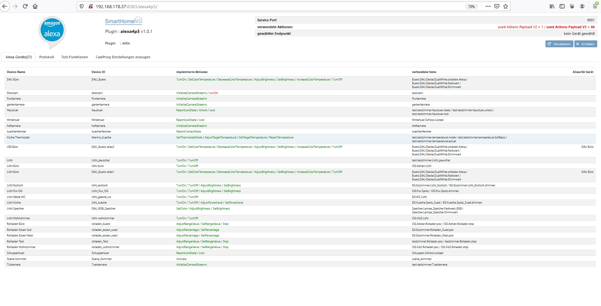
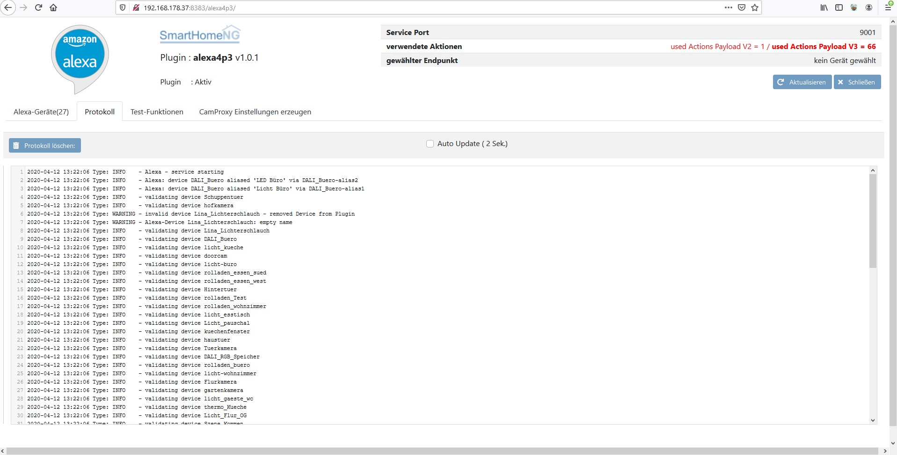
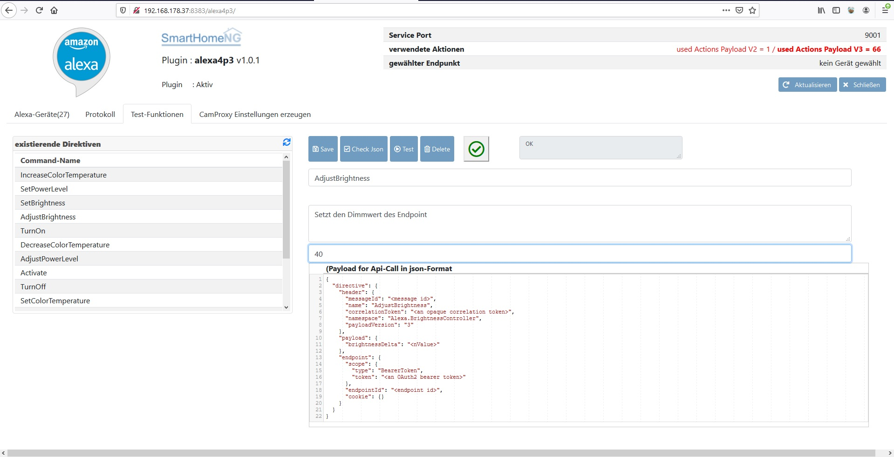
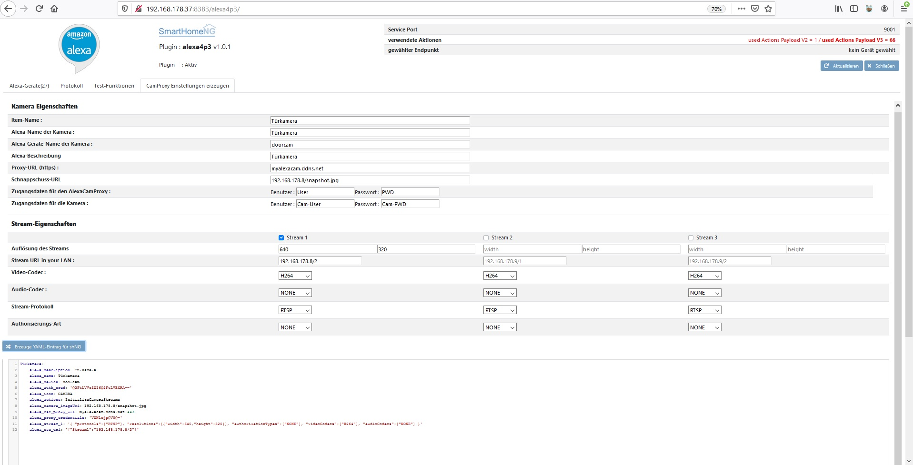

.. index:: Plugins; alexa4p3 (Amazon Echo/Alexa Unterstützung)
.. index:: Alexa; alexa4p3 Plugin

========
alexa4p3
========

Plugin zur Ansteuerung von SmartHomeNG via Amazon Echo bzw. Alexa

Konfiguration
=============

Die Informationen zur Konfiguration des Plugins sind unter :doc:`/plugins_doc/config/alexa4p3` beschrieben.

Es muss ein funktionierender Skill in der Amazon Developer Konsole / AWS Lambda erstellt werden.

Hier ist eine ausführliche Dokumentation als PDF :download:`Alexa_V3_plugin </plugins/alexa4p3/assets/Alexa_V3_plugin.pdf>`

.. important::

   Das Alexa-Plugin kann nicht mit **SmartHomeNG-Versionen vor v1.5.2** genutzt werden.
   Es wird dann nicht geladen.

Webinterface
------------

Das Alexa4P3-Plugin verfügt über ein Webinterface, mit dessen Hilfe die Items die das Plugin nutzt übersichtlich dargestellt werden.
Das Web-Interface enthält ein selbst rotierendes Protokoll für die Kommunikation mit dem Amazon-Servern.
Mehr Funktionen des Web-Interfaces siehe unten.

Beispielfunktionen
-------------------

Beleuchtung einschalten :

- **Alexa, schalte das Küchenlicht ein**
- **Alexa, dimme das Küchenlicht um 10 Prozent**
- **Alexa, stelle das Küchenlicht auf 40 Prozent**

Temperatur einstellen:

- **Alexa, stelle die Temperatur in der Küche auf 25 Grad**
- **Alexa, erhöhe die Temperatur in der Küche um 2 Grad**

Temperatur abfragen :

- **Alexa, wie ist die Temperatur in der Küche**

Farben an RGB und HSV-Leuchten einstellen:

- **Alexa, stelle das Licht im Wohnzimmer auf rosa**

Kameras zeigen (nur Show / Spot / FireTV-Geräte)

- **Alexa, zeige die Türkamera**

Webinterface-Funktionen
------------------------

Auf der ersten Seite werden alle Alexa-Geräte, die definierten Actions sowie die jeweiligen Aliase angezeigt. Actions in Payload-Version 3 werden grün angezeigt. Actions in Payload-Version 2 werden in rot angezeigt.
Eine Zusammenfassung wird oben rechts dargestellt. Durch anklicken eine Zeile kann ein Alexa-Geräte für die Testfunktionen auf Seite 3 des Web-Interfaces auswewählt werden

Auf der Zweiten Seite wird ein Kommunikationsprotokoll zur Alexa-Cloud angezeigt.

Auf Seite drei können “Directiven” ähnlich wie in der Lambda-Test-Funktion der Amazon-Cloud ausgeführt werden. Der jeweilige Endpunkt ist auf Seite 1 duch anklicken zu wählen. Die Kommunikation wird auf Seite 2 protokolliert.
So könnne einzelne Geräte und “Actions” getestet werden.

Auf Seite 4 kann interaktiv ein YAML-Eintrag für einen Alexa-Kamera erzeugt werden. Der fertige YAML-Eintrag wird unten erzeugt und kann via Cut & Paste in die Item-Definition von shNG übernommen werden.

