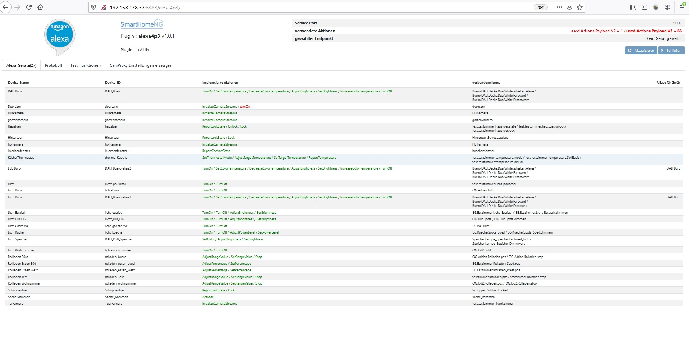
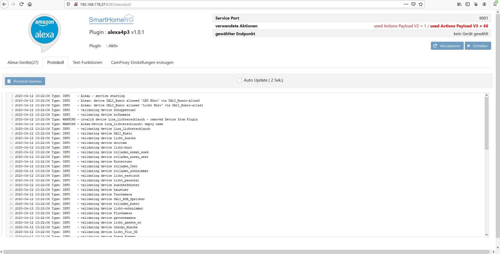
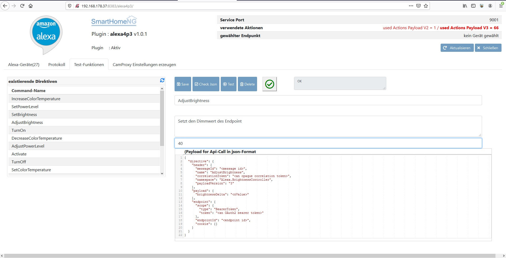
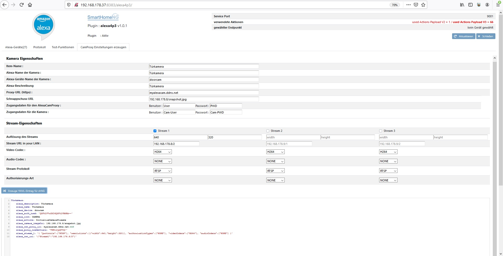

.. index:: Plugins; alexa4p3 (Amazon Echo/Alexa Unterstützung)
.. index:: Alexa; alexa4p3 Plugin

========
alexa4p3
========

Plugin zur Ansteuerung von SmartHomeNG via Amazon Echo bzw. Alexa

Konfiguration
=============

Die Informationen zur Konfiguration des Plugins sind unter :doc:`/plugins_doc/config/alexa4p3` beschrieben.

Es muss ein funktionierender Skill in der Amazon Developer Konsole / AWS Lambda erstellt werden.

Hier ist eine ausführliche Dokumentation als PDF :download:`Alexa_V3_plugin </plugins/alexa4p3/assets/Alexa_V3_plugin.pdf>`

.. important::

   Das Alexa-Plugin kann nicht mit **SmartHomeNG-Versionen vor v1.5.2** genutzt werden.
   Es wird dann nicht geladen.

Alexa-Interfaces
================

Neben den einfachen Schalt- und Dimmfunktionen unterstützt das Plugin eine Reihe weiterer
Alexa-Interfaces. Die zugehörigen Item-Attribute sind unter :doc:`/plugins_doc/config/alexa4p3`
beschrieben; im Folgenden wird beschrieben, wie die Interfaces zusammenspielen.

ThermostatController
---------------------

Mit ``alexa_thermo_config`` wird angegeben, welcher Zahlenwert welchem Alexa-Thermostatmodus
(AUTO/HEAT/COOL/ECO/OFF) entspricht, z.B. passend zu den Werten von KNX DPT 20
(0 = Auto, 1 = Comfort, 2 = Standby, 3 = Economy, 4 = Building Protection). Das Thermostat-Item
selbst erhält ``alexa_icon: THERMOSTAT``. Für die Ist-Temperatur wird ein separates Item mit
``alexa_icon: TEMPERATURE_SENSOR`` und ``alexa_actions: ReportTemperature`` angelegt - der
Temperatursensor liefert nur den Wert, der Thermostat-Controller regelt Soll-Temperatur und Modus.

ColorController
-----------------

``alexa_color_value_type`` legt fest, ob Alexa Farben als RGB-Liste (``[120, 40, 65]``) oder als
HSB-Liste (``[350.5, 0.7138, 0.6524]``) an das Item übergibt. Die Helligkeit bleibt bei einem
Farbwechsel unverändert - bei HSB-Werten wird der bisherige Helligkeitswert dazu intern gepuffert.
Für eine per Sprachbefehl änderbare Helligkeit zusätzlich einen BrightnessController einrichten.

RangeController und PercentageController
-------------------------------------------

Beide eignen sich für stufenlose Aktoren wie Rollläden. Wird beim RangeController zusätzlich
``alexa_icon: EXTERIOR_BLIND`` oder ``alexa_icon: INTERIOR_BLIND`` gesetzt, aktiviert das Plugin
automatisch erweiterte Sprachausdrücke wie "öffnen/schließen" bzw. "hoch/runter". Der Wert von
``alexa_range_delta`` bestimmt dabei, um wie viel Prozent sich die Position pro "hoch"/"runter"-Befehl
ändert (bei 100 fährt der Rollladen bei diesen Befehlen komplett auf/zu). RangeController und
PercentageController können am selben Item kombiniert werden.

PlaybackController für "Stopp"
---------------------------------

Der PlaybackController wird zweckentfremdet, um fahrende Rollläden per "Alexa, stoppe den Rollladen
Büro" anzuhalten (Action ``Stop``). Das funktioniert nur, wenn beim Rollladen **kein** TurnOn/TurnOff
definiert ist, sondern ausschließlich ``AdjustPercentage``/``SetPercentage``. Das Stop-Item sollte
``enforce_updates: true`` gesetzt haben und sich idealerweise per ``autotimer`` selbst zurücksetzen.

LockController
---------------

Bei "Unlock" wird ein "ON" (1) auf das Item geschrieben, bei "Lock" ebenfalls ein "ON" (1) - jeweils
auf unterschiedliche Items/Gruppenadressen. Ohne konfiguriertes ``ReportLockState`` meldet das Plugin
standardmäßig den Zustand "Locked" zurück; nach einem Befehl wird immer der ausgeführte Befehl
gemeldet (Locked/Unlocked). Amazon verlangt für die Sprachsteuerung von Schlössern zusätzlich einen
in der Alexa-App hinterlegten 4-stelligen PIN, der bei jedem Öffnen abgefragt wird - das lässt sich
nicht umgehen.

CameraStreamController
------------------------

Kameras müssen den Anforderungen von Amazon entsprechen (TLSv1.2, erreichbar über Port 443). Für
Kameras im lokalen Netzwerk, die diese Anforderungen nicht direkt erfüllen, wird ein separater
Proxy benötigt (``AlexaCamProxy4P3``); die zugehörigen Zugangsdaten werden über ``alexa_proxy_credentials``
konfiguriert. Auf Seite 4 des Web-Interfaces lässt sich der passende YAML-Eintrag für eine Kamera
interaktiv erzeugen, siehe unten.

Beispiel-Konfigurationen
==========================

Ein (fast) perfekter Rollladen
--------------------------------

Mit RangeController (inkl. der automatischen erweiterten Ausdrücke für Rollläden) und dem
zweckentfremdeten PlaybackController für "Stopp" lässt sich ein Rollladen wie folgt per Sprache
steuern: hoch/runter, öffnen/schließen, auf einen Prozentwert fahren, sowie stoppen.

.. code:: yaml

    Rolladen:
        alexa_name: Rollladen Büro
        alexa_device: rolladen_buero
        alexa_description: Rollladen Büro
        alexa_icon: EXTERIOR_BLIND
        alexa_proactivelyReported: 'False'
        alexa_retrievable: 'True'

        move:
            type: num
            visu_acl: rw
            knx_dpt: 1
            knx_send: 3/2/23
            enforce_updates: 'true'

        stop:
            type: num
            visu_acl: rw
            enforce_updates: 'true'
            knx_dpt: 1
            knx_send: 3/1/23
            alexa_device: rolladen_buero
            alexa_actions: Stop
            alexa_retrievable: 'False'
            alexa_proactivelyReported: 'False'
            autotimer: 1 = 0

        pos:
            type: num
            visu_acl: rw
            knx_dpt: 5
            knx_listen: 3/3/23
            knx_send: 3/4/23
            knx_init: 3/3/23
            enforce_updates: 'true'
            alexa_actions: SetRangeValue AdjustRangeValue
            alexa_retrievable: 'True'
            alexa_range_delta: 20
            alexa_item_range: 0-255

Items abhängig vom zuletzt genutzten Echo-Gerät schalten
------------------------------------------------------------

Ist zusätzlich das Plugin ``alexarc4shng`` aktiv, lässt sich per Logik ermitteln, welches Echo-Gerät
zuletzt einen Sprachbefehl entgegengenommen hat. Damit können z.B. raumabhängige Schaltungen für
Licht oder Rollladen realisiert werden. Zunächst ein generisches Item anlegen:

.. code:: yaml

    Licht_pauschal:
        alexa_name: Licht
        alexa_device: Licht_pauschal
        alexa_description: Licht Pauschal
        alexa_icon: OTHER
        alexa_actions: TurnOn TurnOff
        alexa_proactivelyReported: 'False'
        type: num
        visu_acl: rw
        enforce_updates: 'true'

Eine Logik, die durch dieses Item getriggert wird, schaltet dann abhängig vom zuletzt genutzten
Echo-Gerät das passende Item:

.. code:: python

    #!/usr/bin/env python3
    # last_alexa.py

    myAlexa = sh.alexarc4shng.get_last_alexa()
    if myAlexa is not None:
        triggeredItem = trigger['source']
        triggerValue = trigger['value']
        if triggeredItem == "test.testzimmer.Licht_pauschal":
            if myAlexa == "ShowKueche":
                sh.EG.Kueche.Spots_Sued(triggerValue)
            if myAlexa == "Wohnzimmer":
                sh.OG.Wohnzimmer.Spots_Nord(triggerValue)
                sh.OG.Wohnzimmer.Spots_Sued(triggerValue)

Webinterface
------------

Das Alexa4P3-Plugin verfügt über ein Webinterface, mit dessen Hilfe die Items die das Plugin nutzt übersichtlich dargestellt werden.
Das Web-Interface enthält ein selbst rotierendes Protokoll für die Kommunikation mit dem Amazon-Servern.
Mehr Funktionen des Web-Interfaces siehe unten.

Beispielfunktionen
-------------------

Beleuchtung einschalten :

- **Alexa, schalte das Küchenlicht ein**
- **Alexa, dimme das Küchenlicht um 10 Prozent**
- **Alexa, stelle das Küchenlicht auf 40 Prozent**

Temperatur einstellen:

- **Alexa, stelle die Temperatur in der Küche auf 25 Grad**
- **Alexa, erhöhe die Temperatur in der Küche um 2 Grad**

Temperatur abfragen :

- **Alexa, wie ist die Temperatur in der Küche**

Farben an RGB und HSV-Leuchten einstellen:

- **Alexa, stelle das Licht im Wohnzimmer auf rosa**

Kameras zeigen (nur Show / Spot / FireTV-Geräte)

- **Alexa, zeige die Türkamera**

Webinterface-Funktionen
------------------------

Auf der ersten Seite werden alle Alexa-Geräte, die definierten Actions sowie die jeweiligen Aliase angezeigt. Actions in Payload-Version 3 werden grün angezeigt. Actions in Payload-Version 2 werden in rot angezeigt.
Eine Zusammenfassung wird oben rechts dargestellt. Durch anklicken eine Zeile kann ein Alexa-Geräte für die Testfunktionen auf Seite 3 des Web-Interfaces auswewählt werden

Auf der Zweiten Seite wird ein Kommunikationsprotokoll zur Alexa-Cloud angezeigt.

Auf Seite drei können “Directiven” ähnlich wie in der Lambda-Test-Funktion der Amazon-Cloud ausgeführt werden. Der jeweilige Endpunkt ist auf Seite 1 duch anklicken zu wählen. Die Kommunikation wird auf Seite 2 protokolliert.
So könnne einzelne Geräte und “Actions” getestet werden.

Auf Seite 4 kann interaktiv ein YAML-Eintrag für einen Alexa-Kamera erzeugt werden. Der fertige YAML-Eintrag wird unten erzeugt und kann via Cut & Paste in die Item-Definition von shNG übernommen werden.

