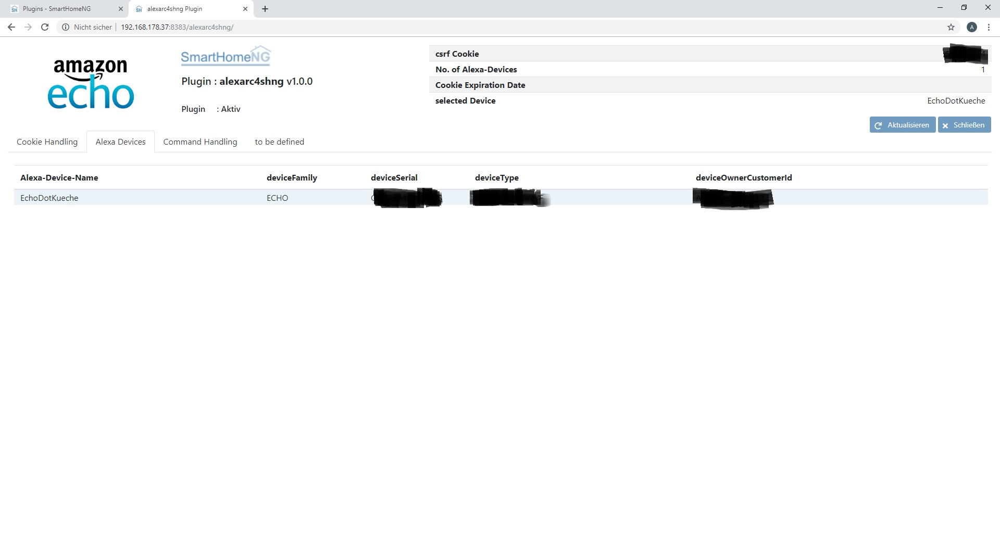
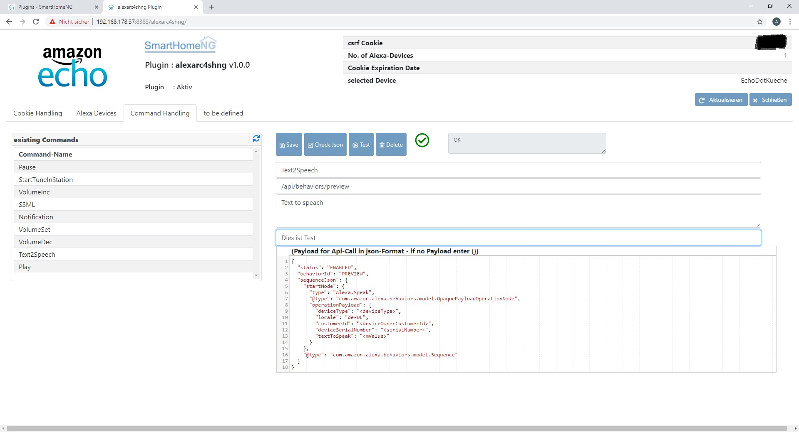
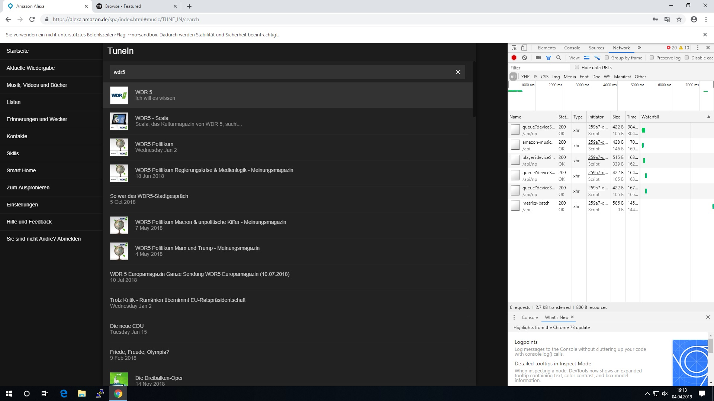
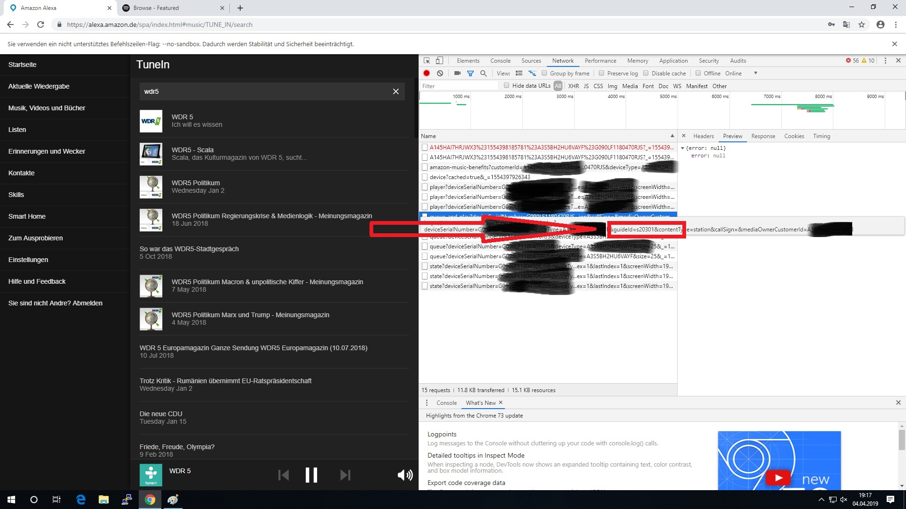
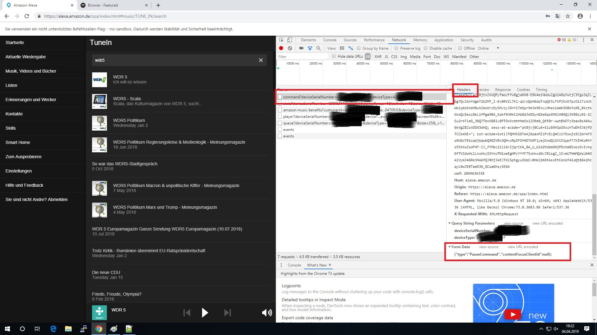

# AlexaRc4shNG

#### Version 1.0.2

The plugin gives the possibilty to control an Alexa-Echo-Device remote by smartHomeNG. So its possible to switch on an TuneIn-Radio Channel, send some messages via Text2Speech when an event happens on the knx-bus or on the Visu. On the Web-Interface you can define your own commandlets (functions). The follwing functions are available on the Web-Interface :

- Store a cookie-file to get access to the Alexa-WebInterface
- manually Login with your credentials (stored in the /etc/plugin.yaml)
- See all available devices, select one to send Test-Functions
- define Commandlets - you can load,store,delete, check and test Commandlets
- the Commandlets can be loaded to the webinterface by clicking on the list
- the Json-Structure can be checked on the WebInterface

In the API-URL and in the json-payload you have to replace the real values from the Alexa-Webinterface with the following placeholders. For testing functions its not really neccessary to use the placeholders.

This plugin for smarthomeNG is mainly based on the informations of
[Lötzimmer](https://blog.loetzimmer.de/2017/10/amazon-alexa-hort-auf-die-shell-echo.html) ,[Apollon77](https://github.com/Apollon77/alexa-remote) and the  [openhab2](https://community.openhab.org/t/released-openhab2-amazon-echo-control-binding-controlling-alexa-from-openhab2/37844)

Special thanks to Jonofe from the [Edomi-Forum](https://knx-user-forum.de/forum/projektforen/edomi/1240964-alexa-smarthome-skill-payload-version-3) who spent a nigth and half an evenning to support me with SSML.
#### !! So many thanks for the very good research and development in the past !!

## table of content

1. [PlaceHolders](#placeholders)
2. [Change Log](#changelog)
3. [Requirements](#requirements)
4. [Cookie](#cookie)
5. [Configuration](#config)
6. [functions](#functions)
7. [Web-Interface](#webinterface)
8. [How to implement new Commands](#newCommand)
9. [Tips for existing Command-Lets](#tipps)

### Existing Command-Lets


- Play (Plays the last paused Media)
- Pause (pauses the actual media)
- Text2Speech (sends a Text to the echo, echo will speak it)
- StartTuneInStation (starts a TuneInRadiostation with the guideID you send)
- SSML (Speak to Text with[Speech Synthesis Markup Language](https://developer.amazon.com/docs/custom-skills/speech-synthesis-markup-language-ssml-reference.html))
- VolumeAdj (adjusts the volume during playing some media not working from webinterface test functions)
- VolumeSet (sets the volume to value from 0-100 percent)

<a name="placeholders"/></a>
### Placeholders :
```yaml
<mValue>                = Value to send as alpha
<nValue>                = Value to send as numeric
#item.path/#            = item-path of the value that should be inserted into text or ssml
<serialNumber>          = SerialNo. of the device where the command should go to
<familiy>               = device family
<deviceType>            = deviceType
<deviceOwnerCustomerId> = OwnerID of the device
```
#### <strong>!! Please keep in mind to use the "<", ">", "#" and "/#" to qualify the placeholders !!</strong>

## ChangeLog<a name="changelog"/>

#### 2020.03.20 Version 1.0.2

- <strong>changed public function "send_cmd_by_curl" to "send_cmd"</strong>
- removed pycurl
- changed Communication to Python Requests
- added translation for the Web-Interface
- added public function "get_last_alexa"

#### 2018.07.26  Version 1.0.1
- Encoding credentials now possible on the Web-Interface (for security reason use this function to encode you credentials)

#### 2018.05.20  Version 1.0.1
- replaced lib.scheduler with self.scheduler_add

#### 2018.05.19 - Version 1.0.1
- changed version to 1.0.1
- changed to lib.item and lib.scheduler
- the credentials have to be stored in base64 encoded
- added Login / LogOff Button to the Web-Interface
- added Auto-Login function - when there is no cookie-file with correct values and credentials are specicified, the plugin automaticaly logs in
- the log-in (the cookie) will be refreshed after the login_update_cycle
- changed methods-names and parameters to lower case and underscore separated names


#### 2018.04.30 - Version 1.0.0
- added CommandLet for SSML-Support
- added CommandLet for Play (Plays the paused media)
- added CommandLet for Pause (pauses media)
- added CommandLet for VolumeAdj (only working while media is playing, not working from test functions on the webinterface)
- added CommandLet for VolumeSet (working all the time)
- added CommandLet for LoadPlayerInfo (right now loaded but nowhere stored)
- added Item to enable AlexaRemoteControl by UZSU

### Changes Since version 1.x.x

- no Changes, first Version


## Requirements<a name="requirements"/>


### Needed software

* smarthomeNg 1.5.2 and above for the web-interface
* needs Python requests
* a valid [Cookie](#cookie) from an alexa.amazon-Web-Site Session
* if you work with Autologin the credentials have to be entered "base64"-encoded. You can encode you credentials on the web-interface of the plugin <strong>"user.test@gmail.com:your_pwd"</strong> you will get <strong>```dXNlci50ZXN0QGdtYWlsLmNvbTp5b3VyX3B3ZA==``` </strong>.
So please enter <strong>```dXNlci50ZXN0QGdtYWlsLmNvbTp5b3VyX3B3ZA==```</strong> in the /etc/plugin.yaml

If you don trust the website for encoding you credential, you can do it in the python-console.
Open a terminal and try the following code.

```
python3
import base64
base64.b64encode('user.test@gmail.com:your_pwd'.encode('utf-8'))

you will get 

b'dXNlci50ZXN0QGdtYWlsLmNvbTp5b3VyX3B3ZA=='

use

dXNlci50ZXN0QGdtYWlsLmNvbTp5b3VyX3B3ZA==
 
for your credentials
```


### Supported Hardware

* all Amazon Echo-Devices

## Cookie <a name="cookie"></a>

<strong>First possibility - without Credentials : </strong>

Plugins are available for most of the common browsers.
After installing the plugin you have to login to your alexa.amazon-Web console. Now Export the cookie by using the plugin.
Open the cookie-file with a Texteditor select all and copy it to the clipboard.
Go to the Webinterface of the plugin and paste the content of the cookie-file to the textarea on Tab "Cookie-Handling". Store the cookie.
When the cookie was successfull stored you can find you Echo-Devices on the Tab with the Alexa-devices.

<strong>Second possibility - with Credentials : </strong>

When the plugin will be started and credentials are found in plugin.yaml, the plugin tests if the informations in the cookie-file are still guilty. If not the plugin tries to login with the credentials himself and stores the informations in the cookie-file. The cookie will updated in the cycle specified in "login_update_cycle" in the plugin.yaml

## Configuration <a name="config"></a>

### plugin.yaml

The plugin needs to be defined in the /etc/plugin.yaml in this way.<br><br>
The attributes are : <br>
plugin_name -> fix AlexaRc4shNG <br>

cookiefile -> the path to the cookie-file. Here it will stored from the Web-Interfache. Take care that you have write-permissions<br>
host -> the adress of you Alexa-WebInterface<br>
Item2EnableAlexaRC->Item controlled by UZSU or something else which enables the communication to Alexa-Amazon-devices. if you leave it blank the communication is enabled all the time 24/7.<strong> This item is only checked during update_item in smarthomeNG. If you use the API directly from a logic or from the Webinterface the item will not be checked. In logics you have to check it yourself.</strong><br><br>AlexaCredentials->User and Password for the Amazon-Alex-WebSite for automtic login<br>
alexa_credentials-> user:pwd (base64 encoded)<br>
item_2_enable_alexa_rc -> Item to allow smarthomeNG to send Commands to Echo's<br>
login_update_cycle->seconds to wait for automatic Login in to refresh the cookie 


```yaml
AlexaRc4shNG:
    plugin_name: alexarc4shng
    cookiefile: /usr/local/smarthome/plugins/alexarc4shng/cookies.txt
    host: alexa.amazon.de
    item_2_enable_alexa_rc: Item_to_enable_Alexaremote
    alexa_credentials: <USER>:<PWD>
    login_update_cycle: 432000
```


### items.yaml

The configuration of the item are done in the following way :
<strong><br><br>
alexa_cmd_01: comparison:EchoDevice:Commandlet:Value_to_Send
</strong>

### supported comparisons are :

"True", "False" and for numeric values "<=",">=","=","<",">"

#### Sample to switch on a Radiostation by using TuneIN<br><br>
```yaml
Value = True means the item() becomes "ON"
EchodotKueche = Devicename where the Command should be send to StartTuneInStaion = Name of the Commandlet
s96141 = Value of the Radiostation (here S96141 = baden.fm)
```

example:
`
alexa_cmd_01: True:EchoDotKueche:StartTuneInStation:s96141
`
#### Sample to send Text with item-value included based on value lower then 20 degrees<br><br>

```yaml
Value           = <20.0 - send command when value of the item becomes less then 20.0
EchodotKueche   = Devicename where the Command should be send to
Text2Speech     = Name of the Commandlet
Value_to_Send   = Die Temperatur in der Kueche ist niedriger als 20 Grad Die Temperatur ist jetzt #test.testzimmer.temperature.actual/# Grad #test.testzimmer.temperature.actual/# = item-path of the value that should be inserted
```

<strong>example:<br></strong>
`
alexa_cmd_01: <20.0:EchoDotKueche:Text2Speech:Die Temperatur in der Kueche ist niedriger als 20 Grad Die Temperatur ist jetzt \#test.testzimmer.temperature.actual/\# Grad
`

You can find the paths of the items on the backend-WebInterface - section items.

#### alexa_cmd_XX

You can specify up to 99 Commands per shng-item. The plugin scanns the item.conf/item.yaml during initialization for commands starting with 01 up to 99.

<strong>Please start all the time with 01 per item, the command-numbers must be serial, dont forget one. The scan of commands stops when there is no command found with the next number</strong>

#### Example

Example for settings in an item.yaml file :

```yaml
# items/my.yaml
%YAML 1.1
---

OG:

    Buero:
        name: Buero
        Licht:
            type: bool
            alexa_name: Licht Büro
            alexa_description: Licht Büro
            alexa_actions: TurnOn TurnOff
            alexa_icon: LIGHT
            alexa_cmd_01: True:EchoDotKueche:StartTuneInStation:s96141
            alexa_cmd_02: True:EchoDotKueche:Text2Speech:Hallo das Licht im Buero ist eingeschalten
            alexa_cmd_03: False:EchoDotKueche:Text2Speech:Hallo das Licht im Buero ist aus
            alexa_cmd_04: 'False:EchoDotKueche:Pause: '
            visu_acl: rw
            knx_dpt: 1
            knx_listen: 1/1/105
            knx_send: 1/1/105
            enforce_updates: 'true'

```
Example for settings in an item.conf file :

```yaml
# items/my.conf

[OG]
    [[Buero]]
        name = Buero
        [[[Licht]]]
        type = bool
        alexa_name = "Licht Büro"
        alexa_description = "Licht Büro"
        alexa_actions = "TurnOn TurnOff"
        alexa_icon = "LIGHT"
        alexa_cmd_01 = '"True:EchoDotKueche:StartTuneInStation:s96141"
        alexa_cmd_02 ="True:EchoDotKueche:Text2Speech:Hallo das Licht im Buero ist eingeschalten"
        alexa_cmd_03 = "False:EchoDotKueche:Text2Speech:Hallo das Licht im Buero ist aus"
        alexa_cmd_04 = "False:EchoDotKueche:Pause: "
        visu_acl = rw
        knx_dpt = 1
        knx_listen = 1/1/105
        knx_send = 1/1/105
        enforce_updates = truey_attr: setting
```

### logic.yaml
Right now no logics are implemented. But you can trigger the functions by your own logic


## Plugin-functions <a name="functions"/></a>

The plugin provides the following publich functions. You can use it for example in logics.

### send_cmd(dvName, cmdName, mValue)

example how to use in logics:

```yaml
sh.AlexaRc4shNG.send_cmd("yourDevice", "Text2Speech", "yourValue")
---
sh.AlexaRc4shNG.send_cmd('Kueche','Text2Speech','Der Sensor der Hebenlage signalisiert ein Problem.')
```
Sends a command to the device. "dvName" is the name of the device,  "cmdName" is the name of the CommandLet, mValue is the value you would send.
You can find all this informations on the Web-Interface.
You can also user the [placeholders](#placeholders)

- the result will be the HTTP-Status of the request as string (str)

### get_last_alexa()

This function returns the Device-Name of the last Echo Device which got a voice command. You can use it in logics to trigger events based on the last used Echo device.

```yaml
myLastDevice = sh.AlexaRc4shNG.get_last_alexa()

```
# Web-Interface <a name="webinterface"/></a>

The Webinterface is reachable on you smarthomeNG server here :<br>

<strong>yourserver:8383/alexarc4shng/</strong>

## Cookie-Handling

On the Webinterface you can store you cookie-file to the shng-Server.
Export it with a cookie.txt AddOn from the browser. Copy it to the clipboard.
Paste it to the textarea in the Web-Interface and Store it.

Now the available devices from your alexa-account will be discoverd an shown on the second tab.

You can also login / logoff when credentials are available. Please see results in the textarea on the right. Please refresh page manually after successfull login via the Web-Interface.


## Alexa devices

By click on one device the device will be selected as acutal device for tests.


## Command-Handling

The Web-Interface gives help to define new Command-Lets. How you get the informations for new Commands see [section New Commands](#newCommand)

Here you can define new Command-Lets, test them, save and delete them.
You can check the JSON-Structure of you payload.

When you click on an existing Command-Let it will be load to the Web-Interface.

You can enter test values in the field for the values. Press Test and the command will be send to the device. You get back the HTTP-Status of the Request.

<strong>For test dont modify the payload, just use the test-value-field </strong>


<br>

## How to create new Command-Lets (spy out the Amazon-Web-Interface)<a name="newCommand"/></a>

#### This documentation is based on Google-Chrome, but it's also possible to do this with other browsers.

Open the Web-Interface for Alexa on Amazon. Select the page you want to spy out. Before click the command open the Debugger of the browser (F12). Select the network tab.
When you click the command that you want to spy out the network traffic will be displayed in the debugger. Here you can get all the informations you need.
Normally information will be send to amazon. So you have to concentrate on Post - Methods.



<br>
<br>
As example to spy out the station-id of a TuneIn Radio Station-ID you will it see it directly on context when you move your mouse to the post-command.
You can copy the URL to the Clipboard an use is it in the AlexaRc4shNG.

You can also copy it as cUrl Paste it into an editor and can find the payload in the --data section of the curl

<br>
<br>



For some commands you need to now the payload. You can get this by spying out the data. You have to select the network command. Then select the tab with Headers. In the bottom you will find the form-data. You can copy the payload to the clipboard an paste it into the AlexaRcshNG-WebInterface.




#### !! Dont forget to replace the values for deviceOwnerCustomerIdcustomerID serialNumber, serialNumber, family  with the placeholders !!
```
<deviceOwnerCustomerIdcustomerID>
<serialNumber>
<serialNumber>
<family>

!!  for the Values !!

<mValue> (for alpha Values)
<nValue> (for numeric Values )

```

## Tips for existing Command-Lets :<a name="tipps"/></a>

#### TuneIn
You have to specify the guideID from Amazom as stationID "mValue". Station-Names are not supported right now.
for example try the following:

To locate your station ID, search for your station on TuneIn.com. Access your page and use the last set of digits of the resulting URL for your ID. For example:
If your TuneIn.com URL is 'http://tunein.com/radio/tuneinstation-s######/', then your station ID would be 's######'
(https://help.tunein.com/what-is-my-station-or-program-id-SJbg90quwz)

#### SSML
You have to put the SSML-Values into
```
<speak> </speak>
```

Find complete documentation to SSML [here](https://developer.amazon.com/docs/custom-skills/speech-synthesis-markup-language-ssml-reference.html)

example :
```
<speak>
I want to tell you a secret.<amazon:effect name="whispered">I am not a real human.</amazon:effect>.
    Can you believe it?
</speak>
```

You can also use [SpeechCons](https://developer.amazon.com/docs/custom-skills/speechcon-reference-interjections-german.html#including-a-speechcon-in-the-text-to-speech-response)

example
```
<speak>
    Here is an example of a speechcon. 
    <say-as interpret-as="interjection">ach du liebe zeit.</say-as>.
</speak>
```
## Credits

The idea for writing this plugin came from henfri. Got most of the informations from : http://blog.loetzimmer.de/2017/10/amazon-alexa-hort-auf-die-shell-echo.html (German). Thank you Alex! A lot of code came from Ingo. He has done the alexa iobrokern implementation https://github.com/Apollon77 Thank you Ingo ! Also a lot of informations come from for the open-hab2 implemenation! Thank you [Michael](https://community.openhab.org/t/released-openhab2-amazon-echo-control-binding-controlling-alexa-from-openhab2/37844)

Special thanks to Jonofe from the Edomi-Forum who spent a nigth and half an evenning to support my with SSML. Thank you Andre.
#### !! So many thanks for the very good research and development)
## Trademark Disclaimer

TuneIn, Amazon Echo, Amazon Echo Spot, Amazon Echo Show, Amazon Music, Amazon Prime, Alexa and all other products and Amazon, TuneIn and other companies are trademarks™ or registered® trademarks of their respective holders. Use of them does not imply any affiliation with or endorsement by them.
