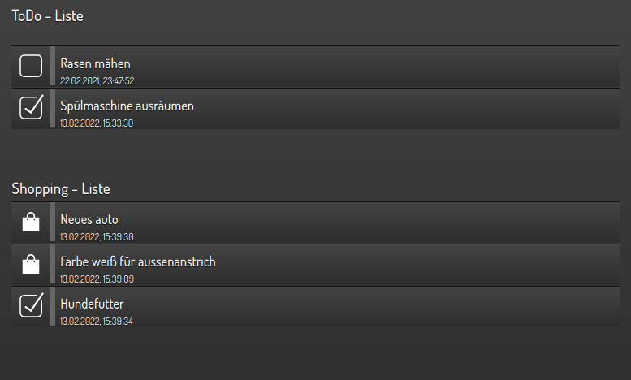

.. index:: Plugins; alexarc4shng (Remote Control for Alexa devices)
.. index:: Alexa; alexarc4shng Plugin

============
alexarc4shng
============

.. image:: webif/static/img/plugin_logo.png
   :alt: plugin logo
   :width: 650px
   :height: 350px
   :scale: 50 %
   :align: left

Das Plugin bietet die Möglichkeit, ein Alexa-Echo-Gerät über smartHomeNG fernzusteuern.
So ist es möglich, einen TuneIn-Radio-Kanal einzuschalten, Nachrichten über Text2Speech zu senden,
wenn ein Ereignis auf dem knx-Bus oder auf der Visu eintritt, etc.

Voraussetzungen
===============

* Python requests
* ein gültiges Cookie aus einer Sitzung auf einer alexa.amazon-Webseite
* "base64"-codierte Anmeldedaten in der etc/plugin.yaml Datei

Cookie
------

Erste Möglichkeit - ohne Anmeldedaten:

Es gibt Plugins für die meisten gängigen Browser. Nach der Installation des Plugins müssen Sie sich in Ihrer alexa.amazon-Webkonsole anmelden.
Exportieren Sie nun das Cookie mithilfe des Plugins. Öffnen Sie die Cookie-Datei mit einem Texteditor,
markieren Sie alles und kopieren Sie es in die Zwischenablage. Gehen Sie zur Web-Benutzeroberfläche des Plugins
und fügen Sie den Inhalt der Cookie-Datei in das Textfeld auf dem Tab "Cookie-Handling" ein. Speichern Sie das Cookie.
Wenn das Cookie erfolgreich gespeichert wurde, finden Sie Ihre Echo-Geräte im Tab mit den Alexa-Geräten.

Zweite Möglichkeit - mit Anmeldedaten:

Wenn das Plugin gestartet wird und Anmeldedaten in der plugin.yaml gefunden werden, überprüft das Plugin,
ob die Informationen in der Cookie-Datei noch gültig sind. Falls nicht, versucht das Plugin, sich selbst mit den
Anmeldedaten anzumelden und speichert die Informationen in der Cookie-Datei. Das Cookie wird im unter "login_update_cycle"
in der plugin.yaml angegebenen Zyklus aktualisiert.

Anmeldedaten
------------

Nutzername und Passwort können im Web Interface oder via Python entsprechend kodiert werden

.. code-block:: python

    import base64
    base64.b64encode("user.test@gmail.com:your_pwd".encode("utf-8"))

Konfiguration
=============

Die Informationen zur Konfiguration des Plugins sind unter :doc:`/plugins_doc/config/alexarc4shng` beschrieben.

plugin.yaml
-----------

.. code-block:: yaml

  AlexaRc4shNG:
      plugin_name: alexarc4shng
      cookiefile: /usr/local/smarthome/plugins/alexarc4shng/cookies.txt
      host: alexa.amazon.de
      item_2_enable_alexa_rc: <Item zum Aktivieren>
      alexa_credentials: <USER>:<PWD> (kodiert!)
      login_update_cycle: 432000
      mfa_secret: <MFA-Secret>

items.yaml
----------

Sie können bis zu 99 Befehle pro shng-Element angeben.
Das Plugin scannt die item.yaml während der Initialisierung nach Befehlen von 01 bis 99.

.. important::
  Bitte starten Sie jedes Mal mit 01 pro Item, also alexa_cmd_01. Die Befehlsnummern müssen fortlaufend sein, vergessen Sie keine.
  Der Scan der Befehle endet, wenn kein Befehl mit der nächsten Nummer gefunden wird.**

Ein Command ist wie folgt aufgebaut:

.. code-block:: yaml

   alexa_cmd_01: comparison:EchoDevice:Commandlet:Value_to_Send

Unterstützte Vergleiche (comparison):

- "True" oder "False" für boolsche Werte
- für numerische Werte "<=", ">=", "=", "<", ">"

Beispiele
=========

Radiostation
------------

.. code-block:: yaml

  alexa_cmd_01: True:EchoDotKueche:StartTuneInStation:s96141

- Value = True bedeutet, dass das item() "ON" wird
- EchodotKueche = Gerätename, an das der Befehl gesendet werden soll
- StartTuneInStation = Name des Befehls
- s96141 = Wert der Radiostation als guideID, Stationsnamen werden nicht unterstützt (hier S96141 = baden.fm)

Um die Stations-ID zu finden, suchen Sie nach Ihrer Station auf TuneIn.com. Greifen Sie auf Ihre Seite zu und
verwenden Sie die letzten Ziffern der resultierenden URL für die ID. Zum Beispiel:
Wenn Ihre TuneIn.com-URL `http://tunein.com/radio/tuneinstation-s######/` ist, dann wäre Ihre Stations-ID `"s######"`.

Text senden
-----------

Beispiel zum Senden von Text mit dem im Wert enthaltenen Element basierend auf einem Wert unter 20 Grad:

.. code-block:: yaml

  alexa_cmd_01: <20.0:EchoDotKueche:Text2Speech:Die Temperatur in der Küche ist niedriger als 20 Grad. Die Temperatur ist jetzt #test.testzimmer.temperature.actual/#

- Value           = <20.0 - Befehl senden, wenn der Wert des Elements kleiner als 20.0 wird
- EchodotKueche   = Gerätename, an das der Befehl gesendet werden soll
- Text2Speech     = Name des Befehls
- Value_to_Send   = Die Temperatur in der Küche ist niedriger als 20 Grad. Die Temperatur ist jetzt #test.testzimmer.temperature.actual/#
- #test.testzimmer.temperature.actual/# = Elementpfad des einzufügenden Werts

Beispiel Itemdefinition
-----------------------

.. code-block:: yaml

   OG:
       Buero:
           name: Buero
           Licht:
               type: bool
               alexa_name: Licht Büro
               alexa_description: Licht Büro
               alexa_actions: Einschalten Ausschalten
               alexa_icon: LICHT
               alexa_cmd_01: True:EchoDotKueche:StartTuneInStation:s96141
               alexa_cmd_02: True:EchoDotKueche:Text2Speech:Hallo das Licht im Büro ist eingeschaltet
               alexa_cmd_03: False:EchoDotKueche:Text2Speech:Hallo das Licht im Büro ist aus
               alexa_cmd_04: 'False:EchoDotKueche:Pause: '
               visu_acl: rw
               knx_dpt: 1
               knx_listen: 1/1/105
               knx_send: 1/1/105
               enforce_updates: 'true'

Logiken
=======

Beispiellogik, um Items mit Listeninformationen (Todo, Shopping) zu füllen

.. code-block:: Python

    from datetime import datetime

    # get the Todo-List
    myList=sh.AlexaRc4shNG.get_list('TO_DO')
    for entry in myList:
      if entry['completed'] == True:
        entry['icon'] = 'control_clear'
      else:
        entry['icon'] = 'control_home'
      entry['date'] = datetime.fromtimestamp((entry['updatedDateTime']/1000)).strftime("%d.%m.%Y, %H:%M:%S")

    # Write list to Item - type should be list
    sh.Alexa_Lists.list.todo(myList)

    # get the shopping-List
    myList=sh.AlexaRc4shNG.get_list('SHOPPING_LIST')
    for entry in myList:
      if entry['completed'] == True:
        entry['icon'] = 'control_clear'
      else:
        entry['icon'] = 'jquery_shop'
      entry['date'] = datetime.fromtimestamp((entry['updatedDateTime']/1000)).strftime("%d.%m.%Y, %H:%M:%S")

    # Write list to Item - type should be list
    sh.Alexa_Lists.list.shopping(myList)

Einbinden in der smartVISU

.. code-block:: HTML

    status.activelist('','Alexa_Lists.list.todo','value','date','value','info')
    status.activelist('','Alexa_Lists.list.shopping','value','date','value','info')

Platzhalter
===========

- <mValue>                = Value to send as alpha
- <nValue>                = Value to send as numeric
- "#item.path/#"          = item-path of the value that should be inserted into text or ssml
- <serialNumber>          = SerialNo. of the device where the command should go to
- <familiy>               = device family
- <deviceType>            = deviceType
- <deviceOwnerCustomerId> = OwnerID of the device

.. important::

  Platzhalter sind mit "<", ">", "#" und "/#" kennzuzeichnen!

Kommandos erstellen
===================

Öffnen Sie das Web-Interface für Alexa auf Amazon. Wählen Sie die Seite aus, die Sie überwachen möchten.
Bevor Sie auf den Befehl klicken, öffnen Sie den Debugger des Browsers (F12). Wählen Sie den Netzwerk-Tab aus.
Wenn Sie auf den Befehl klicken, den Sie überwachen möchten, wird der Netzwerkverkehr im Debugger angezeigt.
Hier erhalten Sie alle Informationen, die Sie benötigen.
Normalerweise werden Informationen an Amazon gesendet. Konzentrieren Sie sich also auf die Post-Methoden.

.. image:: assets/pic1.jpg
   :alt: Browser Debugger
   :class: screenshot

Als Beispiel zum Überwachen der Station-ID einer TuneIn Radio-Station sehen Sie dies direkt im Kontext, wenn Sie Ihre Maus auf den Post-Befehl bewegen.
Sie können die URL in die Zwischenablage kopieren und sie im Plugin verwenden.

Sie können sie auch als cUrl kopieren, in einen Editor einfügen und die Payload im --data-Abschnitt des cUrl finden.

.. image:: assets/pic2.jpg
   :alt: Post Befehl
   :class: screenshot

Für einige Befehle müssen Sie die Payload kennen. Dies können Sie durch Überwachung der Daten herausfinden.
Wählen Sie den Netzwerkbefehl aus. Wählen Sie dann den Tab mit den Headern aus. Unten finden Sie die Formulardaten.
Sie können die Payload in die Zwischenablage kopieren und sie im Web Interface einfügen.

.. image:: assets/pic3.jpg
   :alt: Header
   :class: screenshot

Vergessen Sie nicht, die Werte für deviceOwnerCustomerId, customerID, serialNumber, family und Werte durch die Platzhalter zu ersetzen

.. code-block:: text

   <deviceOwnerCustomerIdcustomerID>
   <serialNumber>
   <serialNumber>
   <family>
   <mValue> (für Alpha-Werte)
   <nValue> (für numerische Werte)

Web Interface
=============

Funktionen
----------

Auf dem Web-Interface können eigene Commandlets (Funktionen) definiert werden. Die folgenden Funktionen sind auf dem Web-Interface verfügbar:

- Speichern einer Cookie-Datei, um Zugang zum Alexa-Web-Interface zu erhalten
- Manuelles Login mit Ihren Zugangsdaten (gespeichert in der /etc/plugin.yaml)
- Sehen Sie alle verfügbaren Geräte, wählen Sie eines aus um Test-Funktionen zu senden
- Commandlets definieren - Sie können Commandlets laden, speichern, löschen, prüfen und testen
- die Commandlets können mit einem Klick auf die Liste in das Webinterface geladen werden
- die Json-Struktur kann auf dem WebInterface geprüft werden

In der API-URL und im JSON-Payload müssen die echten Werte aus dem Alexa-Webinterface durch Platzhalter ersetzt werden, siehe oben.
Für Testfunktionen ist die Verwendung der Platzhalter nicht unbedingt notwendig.

Cookies
-------

Im ersten Tab kann das Cookie File gespeichert werden.

.. image:: assets/webif1.jpg
   :class: screenshot

Exportieren Sie es mit einem Cookie.txt-Add-On Ihres Browsers. Kopieren Sie es in die Zwischenablage.
Fügen Sie es in das Textfeld in der Web-Benutzeroberfläche ein und speichern Sie es ab.
Nun werden die verfügbaren Geräte aus Ihrem Alexa-Konto erkannt und auf dem zweiten Tab angezeigt.

Geräte
------

Im zweiten Tab werden die verfügbaren Geräte angezeigt - Durch click auf ein Gerät wird dieses selektiert und steht für Tests zur Verfügung:

.. image:: assets/webif2.jpg
   :class: screenshot

Kommandos verwalten
-------------------

Im dritten Tab werden die Commandlets verwaltet - mit Klick auf die Liste der Commandlets wird dieses ins WebIF geladen:

.. image:: assets/webif3.jpg
   :class: screenshot

Bestehende Commandlets
^^^^^^^^^^^^^^^^^^^^^^

- Play (Spielt das zuletzt pausierte Medium ab)
- Pause (Pausiert das aktuelle Medium)
- Text2Speech (Sendet einen Text an das Echo, das Echo spricht ihn)
- StartTuneInStation (Startet eine TuneIn-Radiostation mit der angegebenen GuideID, siehe auch Beispiele weiter oben)
- SSML (Sprachausgabe von Text mit Speech Synthesis Markup Language)
- VolumeAdj (Regelt die Lautstärke während der Wiedergabe einiger Medien; funktioniert nicht über die Testfunktionen der Web-Benutzeroberfläche)
- VolumeSet (Setzt die Lautstärke auf einen Wert zwischen 0 und 100 Prozent)

Sie können Testwerte im Feld für die Werte eingeben. Drücken Sie "Test", und der Befehl wird an das Gerät gesendet.
Sie erhalten den HTTP-Status der Anfrage zurück.

.. important::

  Für Tests sollten Sie die Payload nicht ändern, sondern einfach das Testwert-Feld verwenden.

SSML Hinweise
^^^^^^^^^^^^^

Auszugebender Text ist in <speak></speak> Tags einzubetten.

Beispiel

.. code-block::

    <speak>
    I want to tell you a secret.<amazon:effect name="whispered">I am not a real human.</amazon:effect>.
        Can you believe it?
    </speak>

Außerdem können SpeechCons wie folgt genutzt werden.

.. code-block::

    <speak>
        Here is an example of a speechcon.
        <say-as interpret-as="interjection">ach du liebe zeit.</say-as>.
    </speak>

Weitere Infos: `SSML <https://developer.amazon.com/docs/custom-skills/speech-synthesis-markup-language-ssml-reference.html>`_ und `SpeechCons <https://developer.amazon.com/docs/custom-skills/speechcon-reference-interjections-german.html#including-a-speechcon-in-the-text-to-speech-response>`_

Danksagung
==========

- `Alex von Loetzimmer <https://blog.loetzimmer.de/2017/10/amazon-alexa-hort-auf-die-shell-echo.html>`_
- `Ingo <https://github.com/Apollon77>`_
- `Michael, OpenHAB2 <https://community.openhab.org/t/released-openhab2-amazon-echo-control-binding-controlling-alexa-from-openhab2/37844>`_
- Jonofe vom Edomi-Forum

Disclaimer
==========

TuneIn, Amazon Echo, Amazon Echo Spot, Amazon Echo Show, Amazon Music, Amazon Prime, Alexa und alle anderen Produkte und Unternehmen von Amazon,
TuneIn und anderen sind Marken™ oder eingetragene® Marken ihrer jeweiligen Inhaber.
Die Verwendung bedeutet nicht, dass eine Verbindung zu ihnen besteht oder dass sie sie unterstützen.
