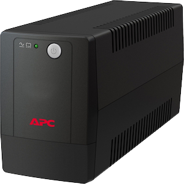

.. index:: Plugins; apcups
.. index:: apcups

======
apcups
======

Anforderungen
=============

Ein laufender ``apcupsd`` mit einem konfigurierten Netserver (NIS) ist notwendig. Dieser kann lokal oder remote laufen.
Das Plugin fragt Laufzeitdaten vom apcupsd über das Hilfsprogramm ``apcaccess`` ab. Aus diesem Grund muss das ``apcups`` Package auch lokal installiert sein.
Wenn der Daemon lokal installiert ist, sollte die Datei ``/etc/apcupsd/apcupsd.conf`` noch folgende Informationen beinhalten:

::

   NETSERVER on
   NISPORT 3551
   NISIP 127.0.0.1

Unterstützte Geräte
===================

Sollte mit allen APC UPS Geräten funktionieren, die den apcupsd unterstützen. Getestet wurde nur mit einer **smartUPS**.

Konfiguration
=============

Die Plugin Parameter und die Informationen zur Item-spezifischen Konfiguration des Plugins sind
unter :doc:`/plugins_doc/config/apcups` beschrieben.

items.yaml
----------

Es gibt nur ein einziges Attribut ``apcups``. Die Namen für den Statusabruf können über den Befehl ``apcaccess`` auf der Kommandozeile
abgerufen werden. Damit wird eine Liste der Art ``Statusname : Wert`` angezeigt.

Der Wert der dem ``apcups`` Item Attribut als Parameter übergeben wird ist dieser Statusname. Dem Item wird dann dieser Wert zugewiesen.

::

   APC      : 001,050,1127
   DATE     : 2017-11-02 07:59:15 +0100
   HOSTNAME : sh11
   VERSION  : 3.14.12 (29 March 2014) debian
   UPSNAME  : UPS_IDEN
   CABLE    : Ethernet Link
   DRIVER   : PCNET UPS Driver
   UPSMODE  : Stand Alone
   STARTTIME: 2017-11-02 07:59:11 +0100
   MODEL    : Smart-UPS 1400 RM
   STATUS   : ONLINE
   LINEV    : 227.5 Volts
   LOADPCT  : 31.2 Percent
   BCHARGE  : 100.0 Percent
   TIMELEFT : 30.0 Minutes
   MBATTCHG : 10 Percent
   MINTIMEL : 5 Minutes
   MAXTIME  : 0 Seconds
   MAXLINEV : 227.5 Volts
   MINLINEV : 226.0 Volts
   OUTPUTV  : 227.5 Volts
   SENSE    : High
   DWAKE    : 0 Seconds
   DSHUTD   : 120 Seconds
   DLOWBATT : 2 Minutes
   LOTRANS  : 208.0 Volts
   HITRANS  : 253.0 Volts
   RETPCT   : 0.0 Percent
   ITEMP    : 25.6 C
   ALARMDEL : Low Battery
   BATTV    : 27.7 Volts
   LINEFREQ : 49.8 Hz
   LASTXFER : Line voltage notch or spike
   NUMXFERS : 0
   TONBATT  : 0 Seconds
   CUMONBATT: 0 Seconds
   XOFFBATT : N/A
   SELFTEST : NO
   STESTI   : 336
   STATFLAG : 0x05000008
   REG1     : 0x00
   REG2     : 0x00
   REG3     : 0x00
   MANDATE  : 08/16/00
   SERIALNO : GS0034003173
   BATTDATE : 06/20/15
   NOMOUTV  : 230 Volts
   NOMBATTV : 24.0 Volts
   EXTBATTS : 0
   FIRMWARE : 162.3.I
   END APC  : 2017-11-02 08:00:39 +0100

Das Plugin führt eine automatische Typumwandlung durch entsprechend dem verwendeten Item Typ.
Bei der Umwandlung in einen numerischen Wert wird nach dem ersten Leerzeichen abgeschnitten und dann konvertiert. Aus ``235 Volt`` wird also ``235``.

Beispiele
=========

Schlüssel auslesen
------------------

Das folgende Beispiel liest die Schlüssel **LINEV**, **STATUS** und
**TIMELEFT** und gibt deren Werte zurück.

.. code-block:: yaml

   # items/apcups.yaml
   serverroom:

       apcups:

           linev:
               visu_acl: ro
               type: num
               apcups: linev

           status:
               # will be 'ONLINE', 'ONBATT', or in case of a problem simply empty
               visu_acl: ro
               type: str
               apcups: status

           timeleft:
               visu_acl: ro
               type: num
               apcups: timeleft

**type** hängt von den Werten ab.

Status Report Fields
--------------------

Laut `APC <http://apcupsd.org/manual/manual.html#configuration-examples>`_)
ist die Bedeutung der Variablen wie folgt:

::

    APC
        Header-Datensatz, der den Revisionsstand des STATUS-Formats, die Anzahl der Datensätze, die auf die APC-Anweisung folgen, und die Anzahl der Bytes, die auf den Datensatz folgen, angibt.
    DATE
        Das Datum und die Uhrzeit, zu der die Informationen zuletzt von der USV abgerufen wurden.
    HOSTNAME
        Der Name des Rechners, der die USV-Daten erfasst hat.
    UPSNAME
        Der Name der USV, wie er im EEPROM oder in der Direktive UPSNAME in der Konfigurationsdatei gespeichert ist.
    VERSION
        Die apcupsd-Versionsnummer, das Erstellungsdatum und die Plattform.
    KABEL
        Das Kabel, wie in der Konfigurationsdatei angegeben (UPSCABLE).
    MODELL
        Das USV-Modell, das aus den Informationen der USV abgeleitet wurde.
    UPSMODE
        Der Modus, in dem apcupsd arbeitet, wie in der Konfigurationsdatei angegeben (UPSMODE)
    STARTTIME
        Die Uhrzeit/das Datum, zu der/dem apcupsd gestartet wurde.
    STATUS
        Der aktuelle Status der USV (ONLINE, ONBATT, etc.)
    LINEV
        Die aktuelle Netzspannung, wie sie von der USV zurückgegeben wird.
    LOADPCT
        Der von der USV geschätzte Prozentsatz der Lastkapazität.
    BCHARGE
        Die prozentuale Ladung der Batterien.
    TIMELEFT
        Die von der USV geschätzte Restlaufzeit der Batterien.
    MBATTCHG
        Wenn der Prozentsatz der Batterieladung (BCHARGE) unter diesen Wert fällt, schaltet apcupsd Ihr System ab. Der Wert wird in der Konfigurationsdatei (BATTERYLEVEL) festgelegt.
    MINTIMEL
        apcupsd fährt Ihr System herunter, wenn die verbleibende Laufzeit diesen Wert erreicht oder unterschreitet. Der Wert wird in der Konfigurationsdatei festgelegt (MINUTES)
    MAXTIME
        apcupsd schaltet Ihr System ab, wenn die Akkulaufzeit diesen Wert überschreitet. Ein Wert von Null deaktiviert die Funktion. Der Wert wird in der Konfigurationsdatei festgelegt (TIMEOUT)
    MAXLINEV
        Die maximale Netzspannung seit dem Start der USV, wie von der USV gemeldet
    MINLINEV
        Die minimale Netzspannung seit dem Start der USV, wie von der USV zurückgemeldet
    OUTPUTV
        Die Spannung, die die USV an Ihre Geräte liefert
    SENSE
        Der Empfindlichkeitsgrad der USV gegenüber Schwankungen der Netzspannung.
    DWAKE
        Die Zeit, die die USV wartet, bevor sie die Stromversorgung Ihrer Geräte nach einem Stromausfall wiederherstellt, wenn die Stromversorgung wiederhergestellt ist.
    DSHUTD
        Die Wartezeit, die die USV nach Erhalt eines Ausschaltbefehls von apcupsd einhält, bevor sie Ihre Geräte ausschaltet.
    DLOWBATT
        Die verbleibende Laufzeit, bei deren Unterschreitung die USV das Signal für eine schwache Batterie sendet. An diesem Punkt erzwingt apcupsd eine sofortige Notabschaltung.
    LOTRANS
        Die Netzspannung, unterhalb derer die USV auf Batterien umschaltet.
    HITRANS
        Die Netzspannung, oberhalb derer die USV auf Batterien umschaltet.
    RETPCT
        Die prozentuale Ladung, die die Batterien nach einem Stromausfall haben müssen, bevor die USV die Stromversorgung Ihrer Geräte wiederherstellt.
    ITEMP
        Interne USV-Temperatur, wie von der USV geliefert.
    ALARMDEL
        Die Verzögerungszeit für den USV-Alarm.
    BATTV
        Batteriespannung, wie sie von der USV geliefert wird.
    LINEFREQ
        Netzfrequenz in Hertz, wie von der USV angegeben.
    LASTXFER
        Der Grund für die letzte Übertragung an die Batterien.
    NUMXFERS
        Die Anzahl der Übertragungen an die Batterien seit dem Start von apcupsd.
    XONBATT
        Uhrzeit und Datum der letzten Übertragung in die Batterien oder N/A.
    TONBATT
        Zeit in Sekunden, die derzeit auf Batterien übertragen wird, oder 0.
    CUMONBATT
        Gesamte (kumulative) Zeit auf den Batterien in Sekunden seit dem Start von apcupsd.
    XOFFBATT
        Zeit und Datum der letzten Übertragung von den Batterien oder N/A.
    SELFTEST
        Die Ergebnisse des letzten Selbsttests und können die folgenden Werte haben:

            OK: Selbsttest zeigt gute Batterie an
            BT: Selbsttest wegen unzureichender Batteriekapazität fehlgeschlagen
            NG: Selbsttest aufgrund von Überlastung fehlgeschlagen
            NO: Keine Ergebnisse (d.h. in den letzten 5 Minuten wurde kein Selbsttest durchgeführt)

    STESTI
        Das Intervall in Stunden zwischen den automatischen Selbsttests.
    STATFLAG
        Statusflagge. Die englische Version wird durch STATUS angegeben.
    DIPSW
        Die aktuellen Dip-Schalter-Einstellungen bei USVs, die über solche verfügen.
    REG1
        Der Wert aus dem USV-Fehlerregister 1.
    REG2
        Der Wert aus dem USV-Fehlerregister 2.
    REG3
        Der Wert aus dem USV-Fehlerregister 3.
    MANDATE
        Das Datum, an dem die USV hergestellt wurde.
    SERIENNUMMER
        Die Seriennummer der USV.
    BATTDATUM
        Das Datum, an dem die Batterien zuletzt ausgetauscht wurden.
    NOMOUTV
        Die Ausgangsspannung, die die USV versucht zu liefern, wenn sie mit Batterien betrieben wird.
    NOMINV
        Die Eingangsspannung, für die die USV konfiguriert ist.
    NOMBATTV
        Die Nennspannung der Batterie.
    NOMPOWER
        Die maximale Leistung in Watt, für die die USV ausgelegt ist.
    FEUCHTIGKEIT
        Die von der USV gemessene Luftfeuchtigkeit.
    AMBTEMP
        Die von der USV gemessene Umgebungstemperatur.
    EXTBATTEN
        Die Anzahl der externen Batterien, wie vom Benutzer definiert. Eine korrekte Zahl hier hilft der USV, die verbleibende Laufzeit genauer zu berechnen.
    BADBATTS
        Die Anzahl der defekten Akkus.
    FIRMWARE
        Die Firmware-Revisionsnummer, wie von der USV gemeldet.
    APCMODEL
        Der alte APC-Modellidentifikationscode.
    END APC
        Die Uhrzeit und das Datum, an dem der STATUS-Datensatz geschrieben wurde.

|

Web Interface
=============

Aktuell hat das Plugin kein Webinterface.
