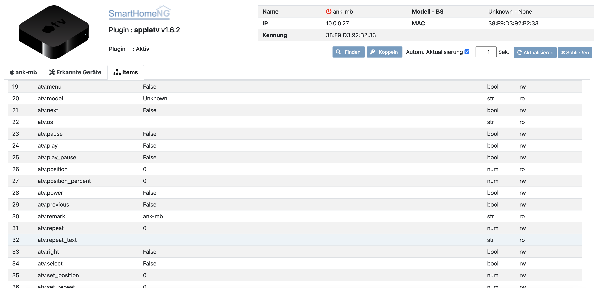

.. index:: Plugins; appletv
.. index:: appletv

=======
appletv
=======

Mit diesem Plugin können Sie ein oder mehrere `Apple TVs <https://www.apple.com/tv/>`_ aller Generationen steuern. Jedes Apple TV benötigt eine eigene Plugin-Instanz. Es benutzt die `pyatv library <github.com/postlund/pyatv/tree/v0.3.9>`_ von Pierre Ståhl. Es bietet auch eine Web-Schnittstelle, die mit dem `http`-Modul verwendet werden kann.

Konfiguration
=============

Diese Plugin Parameter und die Informationen zur Item-spezifischen Konfiguration des Plugins sind
unter :doc:`/plugins_doc/config/appletv` beschrieben.

plugin.yaml
-----------

.. code-block:: yaml

    # etc/plugin.yaml
    appletv:
        plugin_name: appletv
        #instance: wohnzimmer
        #ip: 192.168.2.103
        #login_id: 00000000-0580-3568-6c73-86bd9b834320

Items
=====

.. important::

      Detaillierte Informationen zur Konfiguration des Plugins sind unter :doc:`/plugins_doc/config/appletv` zu finden.

.. code-block:: yaml

    # etc/plugin.yaml
    appletv:
        plugin_name: appletv
        #ip: 0.0.0.0
        #scan_timeout: 5

Struct Vorlagen
===============

Ab smarthomeNG 1.6 können Vorlagen aus dem Plugin einfach eingebunden werden. Dabei stehen folgende Vorlagen zur Verfügung:

- device: Informationen zur IP, MAC-Adresse, Einschaltzustand, etc.
- playing: Informationen zum aktuell gespielten Titel wie Artist, Album, etc. sowie Ansteuern des Abspielmodus und mehr
- control: verschiedene Fernbedienungsfunktionen wie Menü, Play/Pause, etc.

SmartVISU
=========
Wenn SmartVISU als Visualisierung verwendet wird, kann folgender HTML-Code in einer der Seiten verwendet werden:

.. code-block:: HTML

    

        

            

                <h3>Apple TV {{ basic.print('', 'atv.wohnzimmer.name') }} ({{ basic.print('', 'atv.wohnzimmer.media_type_text') }} {{ basic.print('', 'atv.wohnzimmer.play_state_text') }})</h3>
                <table width="100%">
                    <tr>
                        <td>
                            {{ basic.stateswitch('', 'atv.wohnzimmer.rc_top_menu', '', '1', 'jquery_home.svg', '') }}
                            {{ basic.stateswitch('', 'atv.wohnzimmer.rc_menu', '', '1', 'control_return.svg', '') }}
                        </td>
                        <td>
                            {{ basic.stateswitch('', 'atv.wohnzimmer.rc_up', '', '1', 'control_arrow_up.svg', '') }}
                        </td>
                    </tr>
                    <tr>
                        <td>
                            {{ basic.stateswitch('', 'atv.wohnzimmer.shuffle', '', '', 'audio_shuffle.svg', '') }}
                            {{ basic.stateswitch('', 'atv.wohnzimmer.repeat', '', [0,1,2], ['audio_repeat.svg','audio_repeat_song.svg','audio_repeat.svg'], '', ['icon0','icon1','icon1']) }}
                        </td>
                        <td>
                            {{ basic.stateswitch('', 'atv.wohnzimmer.rc_left', '', '1', 'control_arrow_left.svg', '') }}
                            {{ basic.stateswitch('', 'atv.wohnzimmer.rc_select', '', '1', 'control_ok.svg', '') }}
                            {{ basic.stateswitch('', 'atv.wohnzimmer.rc_right', '', '1', 'control_arrow_right.svg', '') }}
                        </td>
                    </tr>
                    <tr>
                        <td>&nbsp;</td>
                        <td>
                            {{ basic.stateswitch('', 'atv.wohnzimmer.rc_down', '', '1', 'control_arrow_down.svg', '') }}
                        </td>
                    </tr>
                    <tr>
                        <td colspan="2">&nbsp;</td>
                    </tr>
                    <tr>
                        <td colspan="2">
                            {{ basic.print('', 'atv.wohnzimmer.artist') }} - {{ basic.print('', 'atv.wohnzimmer.album') }}
                        </td>
                    </tr>
                    <tr>
                        <td colspan="2">
                            {{ basic.print('', 'atv.wohnzimmer.title') }} ({{ basic.print('', 'atv.wohnzimmer.genre') }})
                        </td>
                    </tr>
                    <tr>
                        <td colspan="2">{{ basic.slider('', 'atv.wohnzimmer.position_percent', 0, 100, 1, 'horizontal', 'none') }}</td>
                    </tr>
                    <tr>
                        <td colspan="2">
                            

                                {{ basic.stateswitch('', 'atv.wohnzimmer.rc_previous', '', '1', 'audio_rew.svg', '') }}
                                {{ basic.stateswitch('', 'atv.wohnzimmer.rc_play', '', '1', 'audio_play.svg', '') }}
                                {{ basic.stateswitch('', 'atv.wohnzimmer.rc_pause', '', '1', 'audio_pause.svg', '') }}
                                {{ basic.stateswitch('', 'atv.wohnzimmer.rc_next', '', '1', 'audio_ff.svg', '') }}
                            

                        </td>
                    </tr>
                    <tr>
                        <td colspan="2">
                            {{ basic.print ('', 'atv.wohnzimmer.artwork_url', 'html', '\'\'') }}
                        </td>
                    </tr>
                </table>
            

        

    

Web Interface
=============

Das Webinterface kann genutzt werden, um die Items und deren Werte auf einen Blick zu sehen,
die dem Plugin zugeordnet sind. Außerdem können erkannte Geräte eingesehen und gekoppelt werden.
Für jedes erkannte Gerät gibt es zudem eine Übersicht mit den aktuellen Informationen wie Status,
Abspielposition, Künstler, etc.

