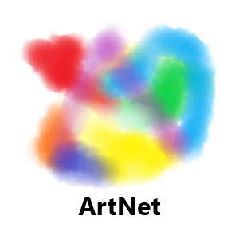
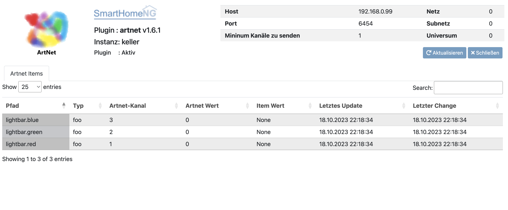

.. index:: Plugins; artnet
.. index:: artnet

======
artnet
======

Anforderungen
=============

Sie benötigen ein Gerät, das Artnet versteht. Es wird die Verwendung der Software
`OLA <http://www.opendmx.net/index.php/Open_Lighting_Architecture>`_ empfohlen,
um die ArtNet-Pakete in DMX-Signale zu übersetzen. Alternativ kann auch
ein beliebiger Art-Net zu DMX Adapter verwendet werde. (Getestet mit `Radig Art-Net Box <https://www.ulrichradig.de/home/index.php/dmx/art-net-box>`_) OLA unterstützt
die meisten zur Zeit erhältlichen USB -> DMX-Adapter. Für Spezifikationen
des Art-Net ist die `Art-Net Doku <https://art-net.org.uk/resources/art-net-specification/>`_ heranzuziehen.

Unterstützte Hardware
=====================

Von `OLA <http://www.opendmx.net/index.php/Open_Lighting_Architecture>`_ unterstützte Hardware

Konfiguration
=============

.. important::

      Detaillierte Informationen zur Konfiguration des Plugins sind unter :doc:`/plugins_doc/config/artnet` zu finden.

plugins.yaml
~~~~~~~~~~~~

.. code-block:: yaml

    # etc/plugin.yaml
    artnet1:
      plugin_name: artnet
      artnet_universe: 0
      artnet_net: 0
      artnet_subnet: 0
      ip: 192.168.0.99
      port: 6454
      update_cycle: 120
      instance: keller

items.yaml
~~~~~~~~~~

.. code-block:: yaml

       lightbar:
           red:
               artnet_address@keller: 1 # DMX Adresse
           green:
               artnet_address@keller: 2 # DMX Adresse
           blue:
               artnet_address@keller: 3 # DMX Adresse

logic.yaml
~~~~~~~~~~

Hinweis: Der erste DMX-Kanal ist 1! Nicht 0!

Um DMX-Daten an das in plugin.yaml eingestellte "Universum" zu senden, gibt es vier
Möglichkeiten:

a) Nutzen der Item-Einträge

siehe oben

b) einzelnen Wert senden

``sh.artnet1(<DMX_CHAN>, <DMX_VALUE>)``

Setzt DMX_CHAN auf den Wert DMX_VALUE.

Beispiel: ``sh.artnet1(12,255)``
Wenn die Kanäle 1-11 bereits gesetzt sind,
werden sie nicht geändert. Wenn die Kanäle 1-11 noch nicht gesetzt sind, werden sie
auf den Wert 0 gesetzt. Dies ist notwendig, weil man bei einem DMX-Bus nicht nur einen
bestimmten Kanal einstellen kann. Sie müssen mit dem ersten Kanal beginnen und die
Werte einstellen.

c) Liste von Werten ab einem bestimmten Kanal senden

``sh.artnet1(<DMX_CHAN>, <DMX_VALUE_LIST>)``

Beispiel: ``sh.artnet1(10,[0,33,44,55,99])``
Wenn die Kanäle 1-9 bereits eingestellt sind, werden sie nicht geändert.
Wenn die Kanäle 1-9 noch nicht gesetzt sind, wird der
auf den Wert 0 gesetzt werden. Dies ist notwendig, weil man auf einem DMX-Bus nicht
nur einen bestimmten Kanal einstellen kann. Sie müssen mit dem ersten Kanal beginnen
mit der Einstellung der Werte. Die Werte in eckigen Klammern werden an die Kanäle 10-14 geschickt.

d) Liste von Werten setzen

``sh.artnet1(<DMX_VALUE_LIST>)``

Sendet an den DMX Bus beginnend mit Kanal 1, prinzipiell äquivalent mit Variante c.

Beispiel: ``sh.artnet1([0,33,44,55,99])``
Die Werte in eckigen Klammern werden auf den Kanal (1-5) geschrieben

Web Interface
=============

Das Web Interface enthält folgende Informationen:

-  **Pfad**: Itempfad

-  **Typ**: Itemtyp

-  **Artnet-Kanal**: Nummer des Kanals

-  **Artnet-Wert**: Artnet Wert

-  **Itemwert**: Wert des Items

-  **Letztes Update**: Zeit und Datum der letzten Itemaktualisierung

-  **Letzter Change**: Zeit und Datum der letzten Itemänderung

