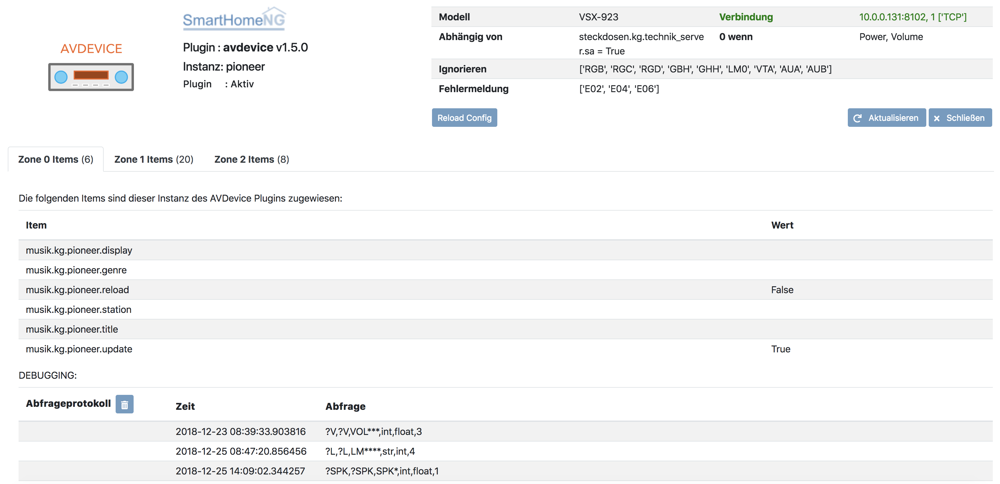

.. index:: Plugins; avdevice
.. index:: avdevice

========
avdevice
========

Steuerung eines AV Gerätes über TCP/IP oder RS232 Schnittstelle.

Das Plugin unterstützt eine Vielzahl von AV-Geräten und wurde mit folgenden Geräten getestet:
- Pioneer AV Receiver < 2016
- Denon AV Receiver > 2016
- Epson Projektor < 2010
- Oppo UHD Player

Konfiguration
=============

Diese Plugin Parameter und die Informationen zur Item-spezifischen Konfiguration des Plugins sind
unter :doc:`/plugins_doc/config/avdevice` beschrieben.

plugin.yaml
-----------

.. code-block:: yaml

    # etc/plugin.yaml
    avdevice:
        plugin_name: avdevice
        model: sc-lx86
        #instance: pioneer_one
        tcp_ip: 10.0.0.130
        #tcp_port: 23
        #tcp_timeout: 1
        rs232_port: /dev/ttyUSB1
        #rs232_baudrate: 9600
        #rs232_timeout: 0.1
        #ignoreresponse: 'RGB,RGC,RGD,GBH,GHH,VTA,AUA,AUB'
        #forcebuffer: 'GEH01020, GEH04022, GEH05024'
        #inputignoredisplay: ''
        #dependson_item: ''
        #dependson_value: True
        #errorresponse: E02, E04, E06
        #resetonerror: False
        #depend0_power0: False
        #depend0_volume0: False
        #sendretries: 10
        #resendwait: 1.0
        #reconnectretries: 13
        #reconnectcycle: 10
        #secondstokeep: 50
        #responsebuffer: 5
        #autoreconnect: false
        #update_exclude: ''

Items
=====

avdevice_zone[0-4]@[Instanz]: [Funktion]
----------------------------------------

Angabe der Zonennummer und Instanz. Wenn keine Zonen verwendet werden, können
entweder ``avdevice`` oder ``avdevice_zone0`` als Attribute verwendet werden.

Der angegebene Befehl muss einem Befehl in der Konfigurationsdatei im avdevice-Plugin-Ordner entsprechen.
Die Konfigurationsdatei ist mit dem gleichen Namen wie ``model`` in plugin.yaml abzuspeichern.

Es ist wichtig, für jedes Item den korrekten Typ zu deklarieren. Der Pioneer RS232-Codesatz erwartet Bool- und Int-Typen.
Wenn beispielsweise der Wiedergabemodus auf "Pure Direct" eingestellt werden soll, muss das Item als "int" oder "num" deklariert sein
und der Wert des Items auf "8" gesetzt werden. Soll das ``translation-feature`` verwendet werden, muss das Item auf ``foo``
gesetzt werden. Das Feature wird später im Detail erklärt.

Vollständige Item-Beispiele sind als separate YAML-Dateien für Pioneer und
Denon-Geräte im models-Ordner enthalten. Die Beispiele erlauben einfaches Kopieren/Einfügen der Befehle für andere Modelle
der gleichen Hersteller.

Die speziellen Attributwere statusupdate und reload werden in :doc:`/plugins_doc/config/avdevice` detailliert beschrieben.

avdevice_zone[0-4]_speakers@[Instanz]: [Funktion]
-------------------------------------------------

Angabe der Zonennummer und Instanz. Dieses Attribut wird genutzt, um zwischen Speakers A, B und AB hin und herzuschalten.
Lautsprecher-Items sollten wie im folgenden Beispiel konfiguriert werden. Die Zahlen 1 und 2 entsprechen dabei den
Werten von Pioneer Receivern < 2016 für die Speaker Commands (SPK1, SPK2).

.. code-block:: yaml

    # items/my.yaml
    Pioneer:
        type: foo

        Speakers:
            type: num
            visu_acl: rw
            avdevice_zone1: speakers

        SpeakerA:
            type: bool
            visu_acl: rw
            avdevice_zone1_speakers: 1

        SpeakerB:
            type: bool
            visu_acl: rw
            avdevice_zone1_speakers: 2

avdevice_zone[0-4]_depend@[Instanz]: [Funktion]
-----------------------------------------------

Angabe der Zonennummer und Instanz.
Mit dem Attribut depend wird für ein Item definiert, dass es von anderen Items bzw. Funktionen abhängt.
Ist eine solche Abhängigkeit definiert, werden folgende Dinge berücksichtigt:

- Das Item wird nur aktualisiert, wenn die Abhängigkeit erfüllt ist.

- Eine momentan laufende Statusabfrage zum Item wird abgebrochen und aus der Kommando-Liste gelöscht.

- Eine Statusabfrage wird erst hinzugefügt, sobald das Master-Item geändert und die Abhängigkeit erfüllt wird.

- Nach dem Verbinden mit dem Gerät wird die Statusabfrage nur dann durchgeführt, wenn die Dependency auf ``init`` gestellt ist.

Es können mehrere abhängige Elemente und Attribute verwendet werden. Es ist sogar möglich, ``und/oder`` für die Abhängigkeiten zu definieren,
indem bis zu vier verschiedene Gruppen (a, b, c, d) mit einem Komma ``,`` getrennt dem Wert angehängt wird.

Neben der Angabe eines ``Master Items`` ist auch die Angabe eines ``Master Werts`` möglich,
wobei sämtliche Python Vergleichsoperatoren genutzt werden können. Ist kein Operator oder Wert gesetzt,
wird ``==`` und ``True`` angenommen. Ist keine Gruppe deklariert, wird die Gruppe ``a`` angenommen, wodurch
die Abhängigkeiten als ``or`` evaluiert werden.

Das folgende Beispiel zeigt diese Abhängigkeiten:

- Der Disktyp wird immer sofort nach einer neuen Verbindung mit dem Gerät abgefragt, sofern ein Query-Command im Textfile angegeben ist.

- Tonencoding und -sprache werden nach der Verbindung abgefragt oder sobald auf ``play`` gedrückt wurde

- Die Tracknummer wird unter folgenden Bedingungen abgefragt oder aktualisiert: play ODER status sind wahr UND Verbose ist auf 2 gesetzt UND der Audiotyp ist entweder PCM ODER PCM 44.1/16

- Der Trackname wird aktualisiert/abgefragt, wenn folgende Bedingung erfüllt ist: (play == True OR status == "play") AND verbose == 2 AND audiotype == (PCM or PCM 44.1/16) AND disctpye == (DVD-AUDIO or CDDA or DATA-DISC)

.. code-block:: yaml

    # items/my.yaml
    Oppo:
        type: foo

        Power:
          visu_acl: rw
          type: bool
          avdevice@oppo: power

        Verbose:
          visu_acl: rw
          type: num
          cache: 'false'
          enforce_updates: 'yes'
          avdevice@oppo: verbose

        Status:
          visu_acl: rw
          type: str
          cache: 'False'
          enforce_updates: 'yes'
          avdevice@oppo: status
          on_change:
              - ..Pause = True if value == 'PAUSE' else False
              - ..Stop = True if not (value == 'PLAY' or value == 'PAUSE' or value == 'INVALID') else False
              - ..Play = True if value == 'PLAY' else False

        Play:
          visu_acl: rw
          type: bool
          enforce_updates: 'yes'
          avdevice@oppo: play

        Disctype:
          visu_acl: rw
          type: str
          cache: 'False'
          enforce_updates: 'yes'
          avdevice@oppo: disctype
          avdevice_depend@oppo: init

        Audio:
          type: foo

          Language:
            visu_acl: rw
            type: str
            cache: 'False'
            enforce_updates: 'yes'
            avdevice@oppo: audiolanguage
            avdevice_depend@oppo:
              - play
              - init

          Encoding:
            visu_acl: rw
            type: str
            cache: 'False'
            enforce_updates: 'yes'
            avdevice@oppo: audiotype
            avdevice_depend@oppo:
              - play
              - init

        Track:
          visu_acl: rw
          type: num
          cache: 'False'
          enforce_updates: 'yes'
          avdevice@oppo: audiotrack
          avdevice_depend@oppo:
              - play = True, a
              - status = PLAY, a
              - verbose = 2, b
              - audiotype = PCM, c
              - audiotype = PCM 44.1/16, c

        Trackname:
          visu_acl: rw
          type: str
          avdevice@oppo: trackname
          avdevice_depend@oppo:
            - disctype = DVD-AUDIO, a
            - disctype = CDDA, a
            - disctype = DATA-DISC, a
            - play = True, b
            - status = PLAY, b
            - audiotype = PCM, c
            - audiotype = PCM 44.1/16, c
            - verbose = 2, d

avdevice_zone[0-4]_init@[Instanz]: [Funktion]
---------------------------------------------

Angabe der Zonennummer und Instanz.
Das init Attribut ermöglich es, ein spezielles Kommando mit einem konkreten Wert sofort nach der Verbindung zum AV Gerät zu senden.
Möchte man beispielsweise bei einem Gerät das Verbose Leven auf 2 setzen, sobald eine Verbindung aufgebaut ist (beim Plugin-Start oder
erneuten Verbindung bei schaltbaren Steckdosen), kann "avdevice_init" genutzt werden. Der Wert des Items (Oppo.Verbose.Init) wird automatisch
an den Befehl "Verbose" angehängt, der wiederum durch Oppo.Verbose aus dem Textfile zugeordnet wird.

Es ist möglich, mehrere Init Items für verschiedene Zonen zu verwenden.

.. code-block:: yaml

    # items/my.yaml
    Oppo:
        type: foo
        Verbose:
          type: bool
          visu_acl: rw
          avdevice_zone1: verbose

          Init:
              visu_acl: rw
              type: bool
              cache: 'true'
              value: 2
              avdevice_zone1_init: verbose

    Pioneer:
        type: foo

        Zone1:
            type: foo

            Mute:
              type: bool
              visu_acl: rw
              avdevice_zone1: mute

              Init:
                  visu_acl: rw
                  type: bool
                  cache: 'true'
                  value: True
                  avdevice_zone1_init: mute

        Zone2:
            type: foo

            Mute:
              type: bool
              visu_acl: rw
              avdevice_zone2: mute

              Init:
                  visu_acl: rw
                  type: bool
                  cache: 'true'
                  value: True
                  avdevice_zone2_init: mute

Kommandos
=========

Die RS232 oder IP-Befehle des Geräts werden in einer Text Datei im Ordner
models abgelegt. Die Datei muss gleich heißen wie das in der plugin.yaml angegebene Modell.
Wurde beispielsweise ``model: vsx-923`` definiert, muss die Datei ``vsx-923.txt`` heißen.

Jede Zeile beinhaltet einen konkreten Befehl, der an das Gerät gesendet werden soll.
Zudem werden Zone, Statusabfrage, Rückmeldewert, etc. definiert. Es ist möglich, Kommentare
mittels ``#`` und ``’’’`` am Beginn von Zeilen bzw. Blöcken auszukommentieren.

-  ``zone``: Zonennummer. Muss mit der Zonennummer im item.yaml übereinstimmen, als z.B. “avdevice_zone1: function". Die Zone 0 beinhaltet allgemeine Kommandos wie Menünavigation, Displayanzeige, Infos zum aktuellen Song, etc.

-  ``function``: Die Funktion kann nach Lust und Laune benannt werden und wird entsprechend als Attributwert über “avdevice: function" referenziert.

-  ``functiontype``: Für boolsche Funktionen sollte hier "on" oder "off" genutzt werden. Für das Setzen von Quellen, Lautstärkewerten, etc. wird "set" genutzt. Um die Lautstärke oder andere Werte schrittweise zu erhöhen wird "increase" genutzt, um sie zu verringern "decrease". Für andere Funktionen sollte dieser Wert leer gelassen werden.

-  ``send``: Das Kommando, das gesendet werden soll, also beispielsweise "PF" zum Ausschalten von Pioneer Verstärkern. Die Pipe “\|” kann genutzt werden, um mehrere Kommandos zu senden. Eine ganze Zahl kann genutzt werden, um eine Pause zwischen zwei Kommandos in Sekunden anzugeben. Beispielsweise sendet “PO\|2\|PO” zwei Mal den Befehl "PO" mit 2 Sekunden Pause dazwischen. Dies ist teilweise beim Senden von "Power On" über RS232 notwendig. Ein Stern “\*” kann als Platzhalter für den zu sendenden Wert genutzt werden. Wird ein Item mit dem Befehl “\*\*\*VL” beispielsweise auf 5 gestellt, wird das Kommando automatisch richtig auf “005VL” formatiert.

-  ``query``: Statusabfrage. Diese wird für gewöhnlich beim ersten Verbinden und beim Einschalten einer Zone benötigt, um die korrekten Werte auszulesen. Weiters wird das Kommando genutzt, um sicherzustellen, dass ein Befehl richtig beim Gerät ankommt. Es wird empfohlen, diesen Befehl nur bei on, off und set zu nutzen.

-  ``response``: Die erwartete Antwort nach dem Senden eines Befehls. "none" führt dazu, dass auf keine Antwort gewartet wird. Ansonsten funktioniert die Schreibweise gleich wie bei send. Auch hier ist es möglich, mehrere Antworten durch “\|” getrennt anzugeben.

-  ``readwrite``: R steht für "nur lesen", W für "nur schreiben" und RW für beides. Beispielsweise sind Displayanzeigen reine Lesewerte, wohingegen ein Erhöhen der Lautstärke keine Antwort erwartet und somit ein reiner Schreibwert ist. Ein richtiges Setzen dieses Wert ermöglicht einen schnellen und zuverlässigen Betrieb des Plugins.

-  ``invertresponse``: Einige Geräte reagieren mit gänzlich unlogischen Antworten, beispielsweise mit "0" für ON und "1" für OFF. Wird dieser Wert auf "yes" gesetzt, wird dieser Dummheit entgegengewirkt.

-  ``minvalue``: Minimumwert für eine Funktion, beispielsweise zum Limitieren von Lautstärken oder Bass-Einstellungen. Wird hier beispielsweise "-3" angegeben und der Wert in der Visu oder CLI versehentlich auf "-5" gestellt, wird der Wert automatisch auf "-3" limitiert.

-  ``maxvalue``: Maximum für eine Funktion, beispielsweise zum Limitieren von Lautstärken oder Bass-Einstellungen. Wird hier beispielsweise "100" angegeben und der Wert in der Visu oder CLI versehentlich auf "120" gestellt, wird der Wert automatisch auf "100" limitiert.

-  ``responsetype``: Definiert den Typ der Antwort: "bool", "num", "str" oder eine durch “\|” oder Komma “,” getrennte Mischung. Die meisten Antworttypen werden beim Pluginstart automatisch eruiert. Sollte ein Kommando aber nicht wie gewünscht funktionieren, kann hier der Wert in Anlehnung an die Beispiel Textfiles manuell gesetzt werden.

-  ``translationfile``: Soll ein Wert/Code in einen anderen übersetzt werden, wird hier der Name einex Text-Files angegeben, das im Unterordner translations angelegt werden muss. Dieses Feature wird später im Detail erklärt.

.. code-block:: none

   # plugins/avdevice/pioneer.txt
   ZONE; FUNCTION; FUNCTIONTYPE; SEND; QUERY; RESPONSE; READWRITE; INVERTRESPONSE; MINVALUE; MAXVALUE; RESPONSETYPE; TRANSLATIONFILE
   1; power; on; PO|PO; ?P; PWR*; RW; yes
   1; power; off; PF; ?P; PWR*; RW; yes
   1; volume+; increase; VU; ; VOL; W
   1; volume-; decrease; VD; ; VOL; W
   1; volume; set; ***VL; ?V; VOL***; RW; ; 80; 185
   1; input; set; **FN; ?F; FN**; RW
   1; speakers; set; *SPK; ?SPK; SPK*; RW
   '''
   #commented out from here
   2; power; on; APO|APO; ?AP; APR*; RW; yes
   2; power; off; APF; ?AP; APR*; RW; yes
   0; title; ; ; ; GEH01020; R
   0; station; ; ; ; GEH04022; R
   0; genre; ; ; ; GEH05024; R
   #commented out until here
   '''
   0; display; ; ?FL; ?FL; FL******************************; R
   1; input; set; **FN; ?F; FN**; RW; ; ; ; ; pioneer_input
   1; mode; set; ****SR; ?S; SR****; RW; ; ; ; num; pioneer_SR
   1; playingmode; ; ?L; ?L; LM****; R; ; ; ; str,int; pioneer_LM
   #0; test; ; ; ; noidea; R (commented out)

Struct Vorlagen
===============

Ab smarthomeNG 1.6 können Vorlagen aus dem Plugin einfach eingebunden werden. Dabei stehen folgende Vorlagen zur Verfügung:

- general: Display, Menü, Cursorssteuerung, Statusupdate, Neuladen der Konfiguration, etc.
- speaker_selection: Zur Auswahl von Speaker A, B oder beide
- individual_volume: Zur Einstellung der Lautstärke für jeden einzelnen Lautsprecher
- sound_settings: Listening Mode, Bass und Höhen, dynamische Kompression, etc.
- video_settings: Aspect Ratio, Monitorout, etc.
- zone1, zone2, zone3: Sämtliche für die Zonen relevante Features wie Quelle, Lautstärke, etc.

Die Vorlagen beinhalten möglicherweise zu viele Items bzw. Items, die vom Gerät nicht unterstützt werden. Wenn aber kein entsprechendes Kommando im models/model.txt File hinterlegt ist, werden die betroffenen Items einfach ignoriert. Also kein Problem!

Übersetzungen
=============

Durch das Erstellen einer Datei namens denon_volume.txt und das Verlinken auf diese Datei
in der Model-Textdatei durch Angabe von "denon_volume" am Ende einer Kommandozeile können
Kommando-Werte in andere Werte übersetzt werden. Beispielsweise ist für Denon Verstärker ein
Kommawert wie 50,5 immer 505. Um dies korrekt in einer Visu darzustellen, sollte folgender Eintrag
im entsprechenden translation Textfile definiert sein:

.. code-block:: none

   # plugins/avdevice/denon_volume.txt
   CODE; TRANSLATION
   ***; **.*

Pioneer Versärker nutzen Nummern, um Quellen und Hörmodi zu definieren, was nicht
sonderlich nutzerfreundlich ist. Einträge wie im folgenden Beispiel zu sehen in einer Datei
namens translations/pioneer_input.txt
und die Angabe dieser Datei in models/model.txt beheben das Problem:

.. code-block:: none

   # plugins/avdevice/pioneer_input.txt
   CODE; TRANSLATION
   00; PHONO
   01; CD
   02; TUNER

Wenn das Plugin den Wert FN01 erhält, wird das Item mit der entsprechenden
Funktion automatisch auf "CD" statt auf "1" gestellt. Umgekehrt wird auch
der Befehl korrekt umgewandelt, sobald das Item entsprechend über eine Visu
aktualisiert wird. Es wird empfohlen, den Typ des Items auf "foo" zu setzen.

Wildcards
=========

Für die Antworten in der model.txt Datei ist es möglich, unbekannte
Teile der Antwort mittels "?" zu integrieren. Dies ist vor allem bei
Oppo Playern relevant.

Die Anzahl der Fragezeichen wird durch die Anzahl an Buchstaben oder Ziffern
bestimmt. Ist die Länge des unbekannten Ausdrucks unbekannt, kann ein “?{str}”
genutzt werden.

.. code-block:: none

    # plugins/avdevice/oppo-udp203.txt
    ZONE; FUNCTION; FUNCTIONTYPE; SEND; QUERY; RESPONSE; READWRITE; INVERTRESPONSE; MINVALUE; MAXVALUE; RESPONSETYPE; TRANSLATIONFILE
    0; audiotype; ; ; #QAT; @QAT OK ?/? *** ?????; R; ; ; ; str
    0; audiotrack; ; #AUD; #QTK; @UAT ?{str} **|@QTK OK */?; RW; ; ; ; num

Der Rückmeldung für den Audiotyp im oben angegebenen Beispiel besteht folglich aus:
"@QAT OK" zu Beginn und zwei Ziffern hintereinander, die durch einen Schrägstrich
getrennt sind. Welche Ziffern das sind, soll egal sein. Danach folgt der relevante Teil
der Antwort, der aus drei Zeichen besteht. Hinten kommen nochmals fünf unbekannte Zeichen.

Das Beispiel zum Audiotrack bedeutet Folgendes:
Auf “@UAT” folgt ein Wort beliebiger Länge und nach einem Leerzeichen der relevante
Wert mit zwei Zeichen. Alternativ kann die Antwort auch mit "@QTK OK" beginnen,
wobei dann der relevante Teil der Antwort direkt nach einem Leerzeichen folgt. Das
darauf folgende "/?" ist deshalb wichtig, weil auch die Gesämtlänge der Antwort für
die richtige Zuordnung eine Rolle spielt (außer bei der Angabe von {str}).

Dieses Feature befindet sich immer noch in der Entwicklung. Erfahrungen bitte im Support Thread
im KNX-Forum teilen.

Web Interface
=============

Das Webinterface kann genutzt werden, um die Items und deren Werte auf einen Blick zu sehen,
die dem Plugin zugeordner sind. Außerdem können Historien von Kommandos und Abfragen
eingesehen und die Kommando-Dateien neu geladen werden.

Fehlerbehebung
==============
1.) Webinterface: Hier können Kommando-Protokolle eingesehen werden.

2.) Smarthome Log-Files: Hier können neben dem sonst üblichen DEBUG
Level auch die Zahlen 9 (=VERBOSE1) und 8 (VERBOSE2) deklariert werden.

3.) Die Anzahl der Sterne in den Kommandos und Antworten im Text-File muss
unbedingt mit der Anzahl an Ziffern oder Buchstaben übereinstimmen, die vom Gerät erwartet
wird. Pioneer Receiver benötigen beispielsweise für die Lautstärke drei Sterne,
Denon Geräte für ON zwei Sterne, für OFF drei Sterne, etc. Ist unklar, wie lange
eine Antwort sein wird (z.B. CD oder GAME) sollte "\*{str}" genutzt werden. Es wird
also eine unbestimmte Anzahl an Buchstaben erwartet.

4.) Der "Response Type" im Textfile muss unbedingt mit dem erwarteten Wert übereinstimmen oder
sollte im Zweifelsfall leer gelassen werden. Für die Timerfunktion von Denon Verstärkern
muss der Typ z.B. auf "bool|num" gestellt werden, da sowohl OFF als auch eine Zahl gesendet/empfangen
werden kann. Durch diese Angabe von bool und num wird eine 0 automatisch in OFF umgewandelt und umgekehrt.
