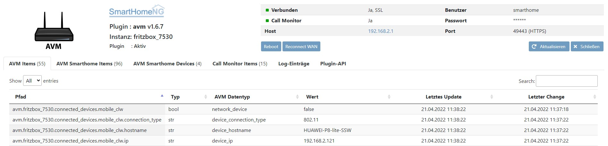
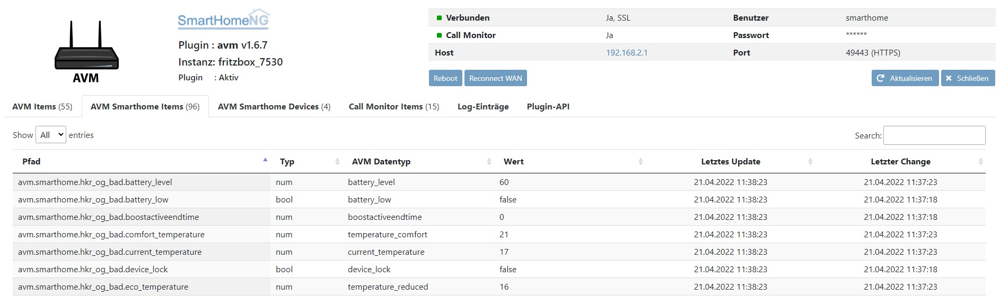
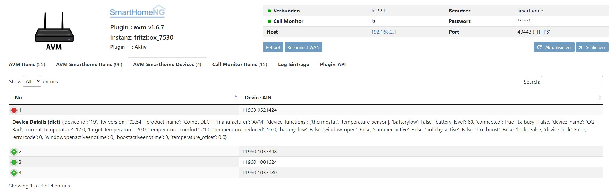
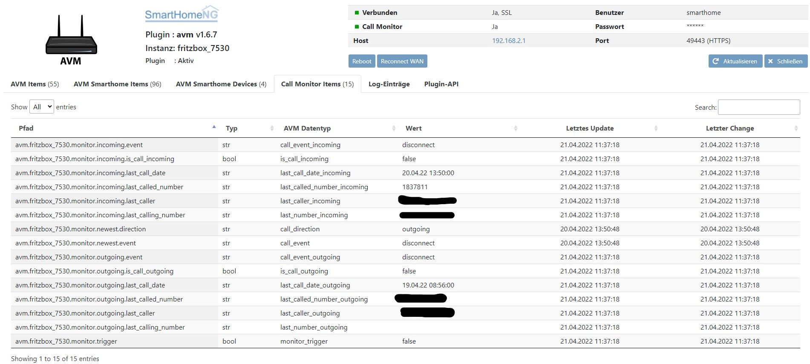
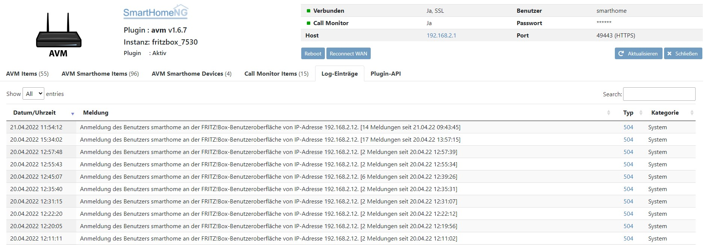
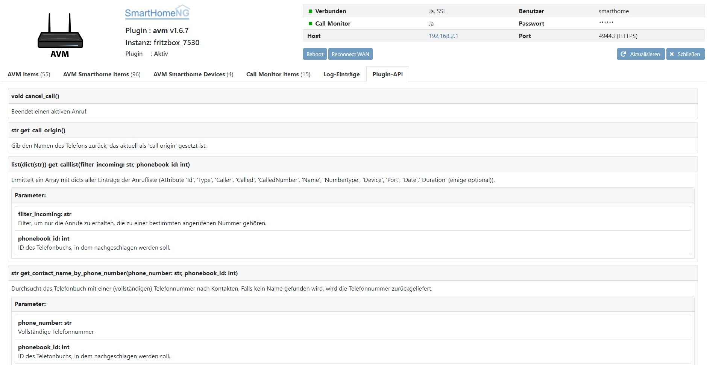

AVM
===

Changelog
---------

1.6.8
~~~~~
- HKR: Allow set temperature to be set directly to value 126.5 (off=frost protection mode). Until now, a bug mapped value off (=126.5) to maximum heating (=127).

1.6.7
~~~~~
- Implement plugin configuration "avm_home_automation" to use AHA (AVM HomeAutomation) Interface (Default: False)
- correct typo "temperatur" to "temperature" in struct
- add method "get_device_log_from_lua_separated" to get log already as list of list
- limit Log entries shown on WebIF to recent 200
- Update WebIF with possibility to adapt table size to screen
- Debugging for 'button' e.g. DECT440
- Minor code correction / debugging
- Adapt user_doc.rst
- feature provided by plugin avm_smarthome are completely integrated. Therefore tat plugin is marked as deprecated.

1.6.6
~~~~~

- Methode get_color_defaults implementiert, welche die aktuell von AVM unterstützen diskreten RGB Farben ausliest.
- Methode set_color und color auf diskrete RGB farben umgestellt. Beliebige RGB Farbwerte werden erst ab Q2 2022 von AVM unterstützt.

1.6.5
~~~~~

- Session_ID wird nur noch bei Bedarf erzeugt (bleibt nach Erstellung 20min gültig und verlängert sich bei erfolgreichem Login)
- Update auf PBKDF2 zur Absicherung der Anmeldung; MD5 als Backup
- Methoden "_get_sid", "_get_login_infos_from_http_request", "_http_logout_request", "_check_sid", "_calculate_pbkdf2_response", "_calculate_md5_response" hinzu
- Bugfixing, Verbesserung der Logausgaben
- Codevereinfachung und Korrektur
- Plugin Parameter für WebIF Page Length hinzu
- Plugin Parameter für Aktivierung der Nutzung des AHA-HTTP Interfaces hinzu

1.6.4
~~~~~

- Attribut 'ain' deprecated gesetzt; Verwendung von 'avm_ain', so dass alle avm Plugin Attribute auch mit 'avm' beginnen
- Überprüfung aller unterstützen Attributwerte avm_data_type
- Anpassung der update_black_list
- Verbesserung des Handling von avm_data_type für r/o, w/o und r/w Items
- Vereinfachung des Code bei _update_x methods
- Ergänzung weiterer Attributwerte bei avm_data_type

1.6.3
~~~~~

- Debug des Attributs set_hkr_boost und hkr_boost
- Update der Datatables im WebIF
- Update des automatischen Update im WebIF
- Information zu Attributwerten von 'avm_data_type' ergänzt
- Beispiel für Anwendung der structs mit Instanz erstellt
- Änderung von 'temperatur' auf 'temperature' im struct
- Verbesserung der LogAusgabe, wenn AbfrageAttribut vorhanden aber Wert nicht vorhanden ist

1.6.2
~~~~~
- Bugfixing der neuen Funktionen in 1.6.0

1.6.1
~~~~~
- Bugfixing der neuen Funktionen in 1.6.0

1.6.0
~~~~~

- Anbindung der Smarthome Devices über AHA-Interface hinzugefügt (getestet mit Fritz 440, Comet Dect)
- Funktionen für Rufumleitungen hinzugefügt (getestet mit Fritzbox 7530)
- Plugin Parameter "index" in "avm_tam_index" umbenannt
- Code Cleanup (add new functions to minimize code repetitions)
- Verbesserung der Fehlerbehandlung (insbesondere bei Zugriffsfehlern auf des FritzDevice)

Allgemeine Informationen
------------------------

Im Plugin wird das TR-064 Protokoll und das AHA Protokoll verwendet.

Links zur Definition des TR-064 Protokolls:
    https://avm.de/fileadmin/user_upload/Global/Service/Schnittstellen/X_contactSCPD.pdf
    http://avm.de/fileadmin/user_upload/Global/Service/Schnittstellen/hostsSCPD.pdf
    http://avm.de/fileadmin/user_upload/Global/Service/Schnittstellen/wanipconnSCPD.pdf
    http://avm.de/fileadmin/user_upload/Global/Service/Schnittstellen/x_voipSCPD.pdf

Links zur Definition des AHA Protokolls:
    https://avm.de/fileadmin/user_upload/Global/Service/Schnittstellen/AHA-HTTP-Interface.pdf

Unterstützung erhält man im Forum unter: https://knx-user-forum.de/forum/supportforen/smarthome-py/934835-avm-plugin

Konfiguration der Fritz!Box
---------------------------

Für die Nutzung der Informationen über Telefonereignisse muss der CallMonitor aktiviert werden. Dazu muss auf
einem direkt an die Fritz!Box angeschlossenen Telefon (Analog, ISDN S0 oder DECT) \*96#5# eingegeben werden.

Bei neueren Firmware Versionen (ab Fritz!OS v7) Muss die Anmeldung an der Box von "nur mit Kennwort" auf "Benutzername
und Kennwort umgestellt werden" und es sollte ein eigener User für das AVM Plugin auf der Fritz!Box eingerichtet werden.

Konfiguration des Plugins
---------------------------

Die Konfiguration des Plugins erfolgt über das Admin-Interface.
Dafür stehen die folgenden Einstellungen zur Verfügung:

- `username`: Required login information
- `password`: Required login information
- `host`: Hostname or ip address of the FritzDevice.
- `port`: Port of the FritzDevice, typically 49433 for https or 49000 for http
- `cycle`: timeperiod between two update cycles. Default is 300 seconds.
- `ssl`: True or False => True will add "https", False "http" to the URLs in the plugin
- `verify`: True or False => Turns certificate verification on or off. Typically False
- `call_monitor`: True or False => Activates or deactivates the MonitoringService, which connects to the FritzDevice's call monitor
- 'call_monitor_incoming_filter': Filter only specific numbers to be watched by call monitor
- 'avm_home_automation': True or False => Activates or deactivates the AHA Interface to communicate with HomeAutomation Devices,
- 'log_entry_count': Number of Log-Messages, which will be displayed.
- 'webif_pagelength': Number of items being listed in a web interface table per page by default.
- `instance`: Unique identifier for each FritzDevice / each instance of the plugin

Alternativ kann das Plugin auch manuell konfiguriert werden.

.. code-block:: yaml

    fb1:
        class_name: AVM
        class_path: plugins.avm
        username: ...    # optional
        password: '...'
        host: fritz.box
        port: 49443
        cycle: 300
        ssl: True    # use https or not
        verify: False    # verify ssl certificate
        call_monitor: 'True'
        call_monitor_incoming_filter: "...    ## optional, don't set if you don't want to watch only one specific number with your call monitor"
        avm_home_automation: 'True'
        instance: fritzbox_7490

    fb2:
        class_name: AVM
        class_path: plugins.avm
        username: ...    # optional
        password: '...'
        host: '...'
        port: 49443
        cycle: 300
        ssl: True    # use https or not
        verify: False    # verify ssl certificate
        call_monitor: 'True'
        avm_home_automation: 'False'
        instance: wlan_repeater_1750

.. note::

    Kürzere Updatezyklen können abhängig vm Fritzdevice aufgrund von CPU Auslastung und damit zu Problemen (u.a.
    zu Nichterreichbarkeit des Webservice) führen. Wird ein kürzerer Updatezyklus benötigt, sollte das shNG Log
    beobachtet werden. Dort werden entsprechende Fehlermeldungen hinterlegt.

Konfiguration des Items
-----------------------

Zur Konfiguration der Items stehen folgende Parameter zur Verfügung:

avm_data_type
~~~~~~~~~~~~~
This attribute defines supported functions that can be set for an item. Full set see plugin.yaml.
For most items, the avm_data_type can be bound to an instance via @... . Only in some points the items
are parsed as child items.

avm_incoming_allowed
~~~~~~~~~~~~~~~~~~~~
Definition der erlaubten eingehenden Rufnummer in Items vom avm_data_type `monitor_trigger`.'

avm_target_number
~~~~~~~~~~~~~~~~~
Definition der erlaubten angerufenen Rufnummer in Items vom avm_data_type `monitor_trigger`.'

avm_wlan_index
~~~~~~~~~~~~~~
Definition des Wlans ueber index: (1: 2.4Ghz, 2: 5Ghz, 3: Gaeste).'

avm_mac
~~~~~~~
Definition der MAC Adresse für Items vom avm_data_type `network_device`. Nur für diese Items mandatory!'

avm_ain
~~~
Definition der Aktor Identifikationsnummer (AIN)Items für smarthome Items. Nur für diese Items mandatory!'

avm_tam_index
~~~~~~~~~~~~~
Index für den Anrufbeantworter, normalerweise für den ersten eine "1". Es werden bis zu 5 Anrufbeantworter vom Gerät
unterstützt.'

avm_deflection_index
~~~~~~~~~~~~~~~~~~~~
Index für die Rufumleitung, normalerweise für die erste eine "1".'

item_structs
------------
Zur Vereinfachung der Einrichtung von Items sind für folgende Item-structs vordefiniert:

- ``info``  -  General Information about Fritzbox
- ``monitor``  -  Call Monitor
- ``tam``  -  (für einen) Anrufbeantworter
- ``deflection``  -  (für eine) Rufumleitung
- ``wan``  -  WAN Items
- ``wlan``  -  Wireless Lan Items
- ``device``  -  Items eines verbundenen Gerätes
- ``smarthome_general``  -  Allgemeine Informationen eines AVM HomeAutomation Devices
- ``smarthome_hkr``  -  spezifische Informationen eines AVM HomeAutomation Thermostat Devices
- ``smarthome_temperatur_sensor``  -  spezifische Informationen eines AVM HomeAutomation Devices mit Temperatursensor
- ``smarthome_alert``  -  spezifische Informationen eines AVM HomeAutomation Devices mit Alarmfunktion
- ``smarthome_switch``  -  spezifische Informationen eines AVM HomeAutomation Devices mit Schalter
- ``smarthome_powermeter``  -  spezifische Informationen eines AVM HomeAutomation Devices mit Strommessung

Item Beispiel mit Verwendung der structs ohne Instanz
~~~~~~~~~~~~~~~~~~~~~~~~~~~~~~~~~~~~~~~~~~~~~~~~~~~~~

.. code-block:: yaml

    avm:
        fritzbox:
            info:
                struct:
                  - avm.info
            reboot:
                type: bool
                visu_acl: rw
                enforce_updates: yes
            monitor:
                struct:
                  - avm.monitor
            tam:
                struct:
                  - avm.tam
            rufumleitung:
                rufumleitung_1:
                    struct:
                      - avm.deflection
                rufumleitung_2:
                    avm_deflection_index: 2
                    struct:
                      - avm.deflection
            wan:
                struct:
                  - avm.wan
            wlan:
                struct:
                  - avm.wlan
            connected_devices:
                mobile_1:
                    avm_mac: xx:xx:xx:xx:xx:xx
                    struct:
                      - avm.device
                mobile_2:
                    avm_mac: xx:xx:xx:xx:xx:xx
                    struct:
                      - avm.device
        smarthome:
            hkr_og_bad:
                type: foo
                avm_ain: 'xxxxx xxxxxxx'
                struct:
                  - avm.smarthome_general
                  - avm.smarthome_hkr
                  - avm.smarthome_temperatur_sensor

Item Beispiel mit Verwendung der structs mit Instanz
~~~~~~~~~~~~~~~~~~~~~~~~~~~~~~~~~~~~~~~~~~~~~~~~~~~~

.. code-block:: yaml

    smarthome:
        socket_3D_Drucker:
            type: foo
            ain@fritzbox_1: 'xxxxx xxxxxxx'
            instance: fritzbox_1
            struct:
              - avm.smarthome_general
              - avm.smarthome_switch
              - avm.smarthome_powermeter
              - avm.smarthome_temperature_sensor
            temperature:
                database: 'yes'
            power:
                database: 'yes'

Hier wird zusätzlich das Item "smarthome.socket_3D_Drucker.temperature", welches durch das struct erstellt wird, um das
Attribut "database" ergänzt, um den Wert in die Datenbank zuschreiben.

Plugin Funktionen
-----------------

cancel_call
~~~~~~~~~~~

Beendet einen aktiven Anruf.

get_call_origin
~~~~~~~~~~~~~~~

Gib den Namen des Telefons zurück, das aktuell als 'call origin' gesetzt ist.

.. code-block:: python

    phone_name = sh.fritzbox_7490.get_call_origin()

CURL for this function:

.. code-block:: bash

    curl --anyauth -u user:password "https://fritz.box:49443/upnp/control/x_voip" -H "Content-Type: text/xml; charset="utf-8"" -H "SoapAction:urn:dslforum-org:service:X_VoIP:1#X_AVM-DE_DialGetConfig" -d "<?xml version='1.0' encoding='utf-8'?><s:Envelope s:encodingStyle='http://schemas.xmlsoap.org/soap/encoding/' xmlns:s='http://schemas.xmlsoap.org/soap/envelope/'><s:Body><u:X_AVM-DE_DialGetConfig xmlns:u='urn:dslforum-org:service:X_VoIP:1' /></s:Body></s:Envelope>" -s -k

get_calllist
~~~~~~~~~~~~
Ermittelt ein Array mit dicts aller Einträge der Anrufliste (Attribute 'Id', 'Type', 'Caller', 'Called', 'CalledNumber', 'Name', 'Numbertype', 'Device', 'Port', 'Date',' Duration' (einige optional)).

get_contact_name_by_phone_number(phone_number)
~~~~~~~~~~~~~~~~~~~~~~~~~~~~~~~~~~~~~~~~~~~~~~
Durchsucht das Telefonbuch mit einer (vollständigen) Telefonnummer nach Kontakten. Falls kein Name gefunden wird, wird die Telefonnummer zurückgeliefert.

get_device_log_from_lua
~~~~~~~~~~~~~~~~~~~~~~~
Ermittelt die Logeinträge auf dem Gerät über die LUA Schnittstelle /query.lua?mq_log=logger:status/log.

get_device_log_from_tr064
~~~~~~~~~~~~~~~~~~~~~~~~~
Ermittelt die Logeinträge auf dem Gerät über die TR-064 Schnittstelle.

get_host_details
~~~~~~~~~~~~~~~~
Ermittelt die Informationen zu einem Host an einem angegebenen Index.
dict keys: name, interface_type, ip_address, mac_address, is_active, lease_time_remaining

get_hosts
~~~~~~~~~
Ermittelt ein Array mit den Details aller verbundenen Hosts. Verwendet wird die Funktion "get_host_details"

Beispiel einer Logik, die die Host von 3 verbundenen Geräten in eine Liste zusammenführt und in ein Item schreibt.
'avm.devices.device_list'

.. code-block:: python

    hosts = sh.fritzbox_7490.get_hosts(True)
    hosts_300 = sh.wlan_repeater_300.get_hosts(True)
    hosts_1750 = sh.wlan_repeater_1750.get_hosts(True)

    for host_300 in hosts_300:
        new = True
        for host in hosts:
            if host_300['mac_address'] == host['mac_address']:
                new = False
        if new:
            hosts.append(host_300)
    for host_1750 in hosts_1750:
        new = True
        for host in hosts:
            if host_1750['mac_address'] == host['mac_address']:
                new = False
        if new:
            hosts.append(host_1750)

    string = '<ul>'
    for host in hosts:
        device_string = '<li><strong>'+host['name']+':</strong> '+host['ip_address']+', '+host['mac_address']+'</li>'
        string += device_string

    string += '</ul>'
    sh.avm.devices.device_list(string)

get_phone_name
~~~~~~~~~~~~~~
Gibt den Namen eines Telefons an einem Index zurück. Der zurückgegebene Wert kann in 'set_call_origin' verwendet werden.

.. code-block:: python

    phone_name = sh.fb1.get_phone_name(1)

get_phone_numbers_by_name(name)
~~~~~~~~~~~~~~~~~~~~~~~~~~~~~~~
Durchsucht das Telefonbuch mit einem Namen nach nach Kontakten und liefert die zugehörigen Telefonnummern.

.. code-block:: python

    result_numbers = sh.fritzbox_7490.get_phone_numbers_by_name('Mustermann')
    result_string = ''
    keys = {'work': 'Geschäftlich', 'home': 'Privat', 'mobile': 'Mobil', 'fax_work': 'Fax', 'intern': 'Intern'}
    for contact in result_numbers:
        result_string += '
<h2>'+contact+'</h2>'
        i = 0
        result_string += '<table>'
        while i < len(result_numbers[contact]):
            number = result_numbers[contact][i]['number']
            type_number = keys[result_numbers[contact][i]['type']]
            result_string += '<tr><td>' + type_number + ':</td><td><a href="tel:' + number + '" style="font-weight: normal;">' + number + '</a></td></tr>'
            i += 1
        result_string += '</table>
'
    sh.general_items.number_search_results(result_string)

is_host_active
~~~~~~~~~~~~~~
Prüft, ob eine MAC Adresse auf dem Gerät aktiv ist. Das kann bspw. für die Umsetzung einer Präsenzerkennung genutzt
werden.

CURL for this function:

.. code-block:: bash

    curl --anyauth -u user:password "https://fritz.box:49443/upnp/control/hosts" -H "Content-Type: text/xml; charset="utf-8"" -H "SoapAction:urn:dslforum-org:service:Hosts:1#GetSpecificHostEntry" -d "<?xml version='1.0' encoding='utf-8'?><s:Envelope s:encodingStyle='http://schemas.xmlsoap.org/soap/encoding/' xmlns:s='http://schemas.xmlsoap.org/soap/envelope/'><s:Body><u:GetSpecificHostEntry xmlns:u='urn:dslforum-org:service:Hosts:1'><s:NewMACAddress>XX:XX:XX:XX:XX:XX</s:NewMACAddress></u:GetSpecificHostEntry></s:Body></s:Envelope>" -s -k

reboot
~~~~~~
Startet das Gerät neu.

reconnect
~~~~~~~~~
Verbindet das Gerät neu mit dem WAN (Wide Area Network).

set_call_origin
~~~~~~~~~~~~~~~
Setzt den 'call origin', bspw. vor dem Aufruf von 'start_call'. Typischerweise genutzt vor der Verwendung von "start_call".
Der Origin kann auch mit direkt am Fritzdevice eingerichtet werden: "Telefonie -> Anrufe -> Wählhilfe verwenden ->
Verbindung mit dem Telefon".

.. code-block:: python

    sh.fb1.set_call_origin("<phone_name>")

start_call
~~~~~~~~~~
Startet einen Anruf an eine übergebene Telefonnummer (intern oder extern).

.. code-block:: python

    sh.fb1.start_call('0891234567')
    sh.fb1.start_call('**9')

wol(mac_address)
~~~~~~~~~~~~~~~~
Sendet einen WOL (WakeOnLAN) Befehl an eine MAC Adresse.

get_number_of_deflections
~~~~~~~~~~~~~~~~~~~~~~~~~
Liefert die Anzahl der Rufumleitungen zurück.

get_deflection
~~~~~~~~~~~~~~
Liefert die Details der Rufumleitung der angegebenen ID zurück (Default-ID = 0)

get_deflections
~~~~~~~~~~~~~~~
Liefert die Details aller Rufumleitungen zurück.

set_deflection_enable
~~~~~~~~~~~~~~~~~~~~~
Schaltet die Rufumleitung mit angegebener ID an oder aus.

Web Interface
-------------

Das avm Plugin verfügt über ein Webinterface, mit dessen Hilfe die Items die das Plugin nutzen
übersichtlich dargestellt werden.

.. important::

   Das Webinterface des Plugins kann mit SmartHomeNG v1.4.2 und davor **nicht** genutzt werden.
   Es wird dann nicht geladen. Diese Einschränkung gilt nur für das Webinterface. Ansonsten gilt
   für das Plugin die in den Metadaten angegebene minimale SmartHomeNG Version.

Aufruf des Webinterfaces
~~~~~~~~~~~~~~~~~~~~~~~~

Das Plugin kann aus dem Admin-IF aufgerufen werden. Dazu auf der Seite Plugins in der entsprechenden
Zeile das Icon in der Spalte **Web Interface** anklicken.

Es werden nur die Tabs angezeigt, deren Funktionen im Plugin aktiviert sind bzw. die von Fritzdevice unterstützt werden.

Im WebIF stehen folgende Reiter zur Verfügung:

AVM Items
~~~~~~~~~

Tabellarische Auflistung aller Items, die mit dem TR-064 Protokoll ausgelesen werden

AVM Smarthome Items
~~~~~~~~~~~~~~~~~~~
Tabellarische Auflistung aller Items, die mit dem AHA Protokoll ausgelesen werden (Items der AVM HomeAutomation Geräte)

AVM Smarthome Devices
~~~~~~~~~~~~~~~~~~~~~

Auflistung der mit der Fritzbox verbundenen AVM HomeAutomation Geräte

Call Monitor Items
~~~~~~~~~~~~~~~~~~

Tabellarische Auflistung des Anrufmonitors (nur wenn dieser konfiguriert ist)

Log-Einträge
~~~~~~~~~~~~

Listung der Logeinträge der Fritzbox

Plugin-API
~~~~~~~~~~

Beschreibung der Plugin-API

