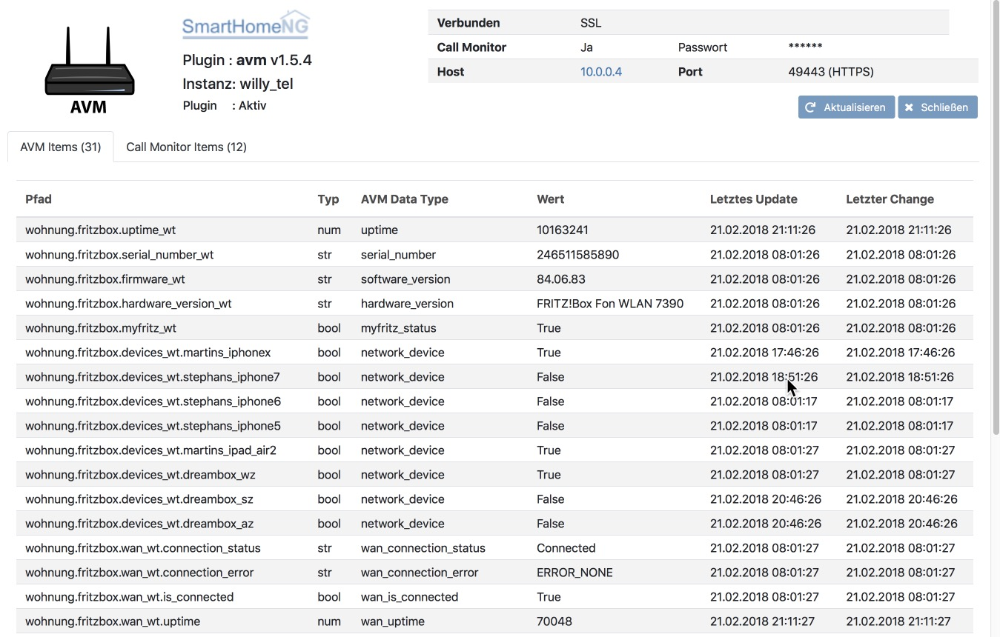
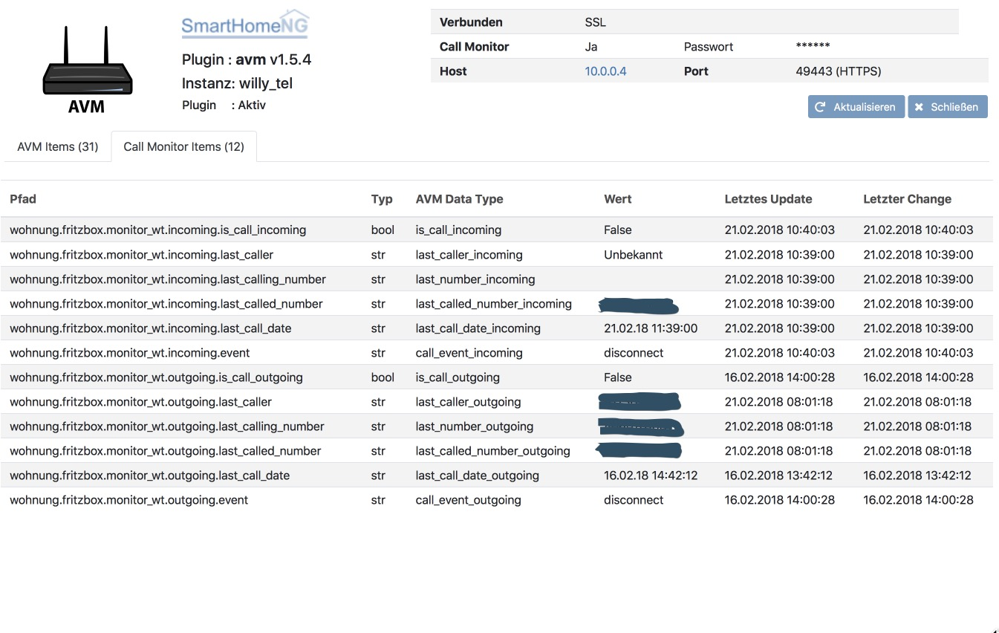

.. index:: Plugins; AVM (Unterstützung für Fritz!Box usw.)
.. index:: AVM

avm
###

Konfiguration
=============

Die Informationen zur Konfiguration des Plugins sind unter :doc:`/plugins_doc/config/avm` beschrieben.

Konfiguration der Fritz!Box
===========================

Für die Nutzung der Informationen über Telefonereignisse muss der CallMonitor aktiviert werden. Dazu muss auf
einem direkt an die Fritz!Box angeschlossenen Telefon (Analog, ISDN S0 oder DECT) \*96#5# eingegeben werden.

Bei neueren Firmware Versionen (ab Fritz!OS v7) Muss die Anmeldung an der Box von "nur mit Kennwort" auf "Benutzername
und Kennwort umgestellt werden" und es sollte ein eigener User für das AVM Plugin auf der Fritz!Box eingerichtet werden.

Web Interface
=============

Das avm Plugin verfügt über ein Webinterface, mit dessen Hilfe die Items die das Plugin nutzen
übersichtlich dargestellt werden.

.. important::

   Das Webinterface des Plugins kann mit SmartHomeNG v1.4.2 und davor **nicht** genutzt werden.
   Es wird dann nicht geladen. Diese Einschränkung gilt nur für das Webinterface. Ansonsten gilt
   für das Plugin die in den Metadaten angegebene minimale SmartHomeNG Version.

Aufruf des Webinterfaces
------------------------

Das Plugin kann aus dem backend aufgerufen werden. Dazu auf der Seite Plugins in der entsprechenden
Zeile das Icon in der Spalte **Web Interface** anklicken.

Außerdem kann das Webinterface direkt über ``http://smarthome.local:8383/avm`` bzw.
``http://smarthome.local:8383/avm_<Instanz>`` aufgerufen werden.

Beispiele
---------

Folgende Informationen können im Webinterface angezeigt werden:

Oben rechts werden allgemeine Parameter zum Plugin angezeigt.

Im ersten Tab werden die Items angezeigt, die das avm Plugin nutzen:

Im zweiten Tab werden Call Monitor Items zum avm Plugin angezeigt:

