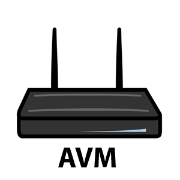
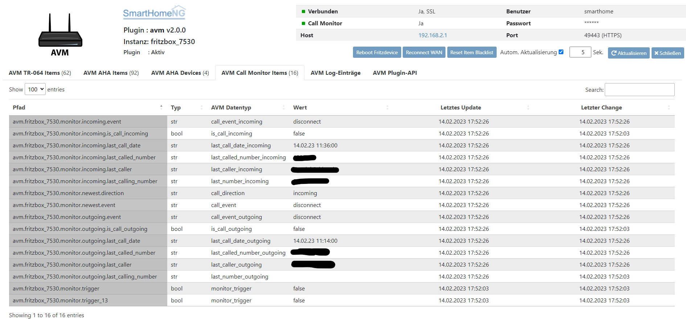
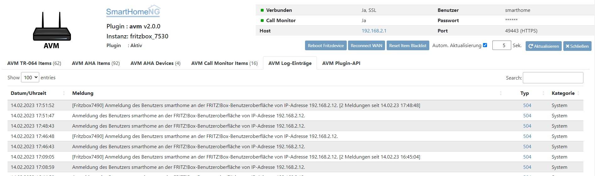
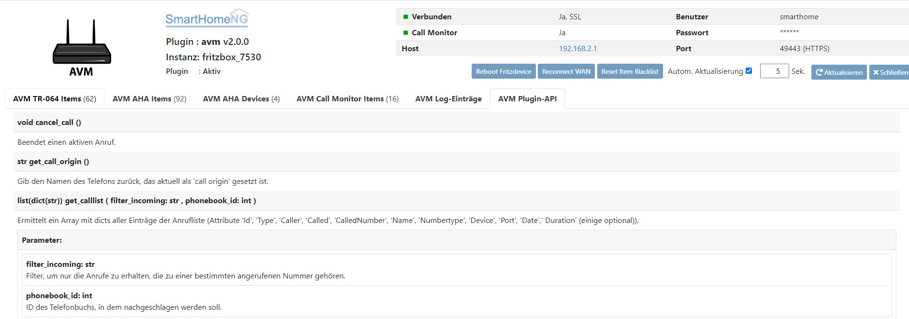

.. index:: Plugins; avm
.. index:: avm

===
avm
===

Allgemeine Informationen
========================

Im Plugin wird das TR-064 Protokoll und das AHA Protokoll verwendet.

Links zur Definition des TR-064 Protokolls:
    https://avm.de/fileadmin/user_upload/Global/Service/Schnittstellen/X_contactSCPD.pdf
    http://avm.de/fileadmin/user_upload/Global/Service/Schnittstellen/hostsSCPD.pdf
    http://avm.de/fileadmin/user_upload/Global/Service/Schnittstellen/wanipconnSCPD.pdf
    http://avm.de/fileadmin/user_upload/Global/Service/Schnittstellen/x_voipSCPD.pdf

Links zur Definition des AHA Protokolls:
    https://avm.de/fileadmin/user_upload/Global/Service/Schnittstellen/AHA-HTTP-Interface.pdf

Unterstützung erhält man im Forum unter: https://knx-user-forum.de/forum/supportforen/smarthome-py/934835-avm-plugin

Konfiguration der Fritz!Box
===========================

Für die Nutzung der Informationen über Telefonereignisse muss der CallMonitor aktiviert werden. Dazu muss auf
einem direkt an die Fritz!Box angeschlossenen Telefon (Analog, ISDN S0 oder DECT) \*96#5# eingegeben werden.

Bei neueren Firmware Versionen (ab Fritz!OS v7) Muss die Anmeldung an der Box von "nur mit Kennwort" auf "Benutzername
und Kennwort umgestellt werden" und es sollte ein eigener User für das AVM Plugin auf der Fritz!Box eingerichtet werden.

Konfiguration des Plugins
=========================

Diese Plugin Parameter und die Informationen zur Item-spezifischen Konfiguration des Plugins sind
unter :doc:`/plugins_doc/config/avm` beschrieben.

.. note::

    Kürzere Updatezyklen können abhängig vom FritzDevice aufgrund hoher CPU Auslastung zu Problemen
    (u.a. zu Nichterreichbarkeit des Webservice) führen. 
    Wird ein kürzerer Updatezyklus benötigt, sollte das SmartHomeNG Log beobachtet
    werden. Dort werden entsprechende Fehlermeldungen hinterlegt.

Attribute und Beschreibung
==========================

Dieses Kapitel wurde automatisch durch Ausführen des Skripts in der Datei 'datapoints.py' erstellt.

Nachfolgend eine Auflistung der möglichen Attribute für das Plugin:

TR064-Interface
---------------

- uptime: Laufzeit des Fritzdevice in Sekunden | Zugriff: ro | Item-Type: num

- serial_number: Serialnummer des Fritzdevice | Zugriff: ro | Item-Type: str

- software_version: Software Version | Zugriff: ro | Item-Type: str

- hardware_version: Hardware Version | Zugriff: ro | Item-Type: str

- manufacturer: Hersteller | Zugriff: ro | Item-Type: str

- product_class: Produktklasse | Zugriff: ro | Item-Type: str

- manufacturer_oui: Hersteller OUI | Zugriff: ro | Item-Type: str

- model_name: Modellname | Zugriff: ro | Item-Type: str

- description: Modellbeschreibung | Zugriff: ro | Item-Type: str

- device_log: Geräte Log | Zugriff: ro | Item-Type: str

- security_port: Security Port | Zugriff: ro | Item-Type: str

- reboot: Startet das Gerät neu | Zugriff: wo | Item-Type: bool

- myfritz_status: MyFritz Status (an/aus) | Zugriff: ro | Item-Type: bool

- call_direction: Richtung des letzten Anrufes | Zugriff: ro | Item-Type: str

- call_event: Status des letzten Anrufes | Zugriff: ro | Item-Type: str

- monitor_trigger: Monitortrigger | Zugriff: ro | Item-Type: bool

- is_call_incoming: Eingehender Anruf erkannt | Zugriff: ro | Item-Type: bool

- last_caller_incoming: Letzter Anrufer | Zugriff: ro | Item-Type: str

- last_call_date_incoming: Zeitpunkt des letzten eingehenden Anrufs | Zugriff: ro | Item-Type: str

- call_event_incoming: Status des letzten eingehenden Anrufs | Zugriff: ro | Item-Type: str

- last_number_incoming: Nummer des letzten eingehenden Anrufes | Zugriff: ro | Item-Type: str

- last_called_number_incoming: Angerufene Nummer des letzten eingehenden Anrufs | Zugriff: ro | Item-Type: str

- is_call_outgoing: Ausgehender Anruf erkannt | Zugriff: ro | Item-Type: bool

- last_caller_outgoing: Letzter angerufener Kontakt | Zugriff: ro | Item-Type: str

- last_call_date_outgoing: Zeitpunkt des letzten ausgehenden Anrufs | Zugriff: ro | Item-Type: str

- call_event_outgoing: Status des letzten ausgehenden Anrufs | Zugriff: ro | Item-Type: str

- last_number_outgoing: Nummer des letzten ausgehenden Anrufes | Zugriff: ro | Item-Type: str

- last_called_number_outgoing: Letzte verwendete Telefonnummer für ausgehenden Anruf | Zugriff: ro | Item-Type: str

- call_duration_incoming: Dauer des eingehenden Anrufs | Zugriff: ro | Item-Type: num

- call_duration_outgoing: Dauer des ausgehenden Anrufs | Zugriff: ro | Item-Type: num

- tam: TAM an/aus | Zugriff: rw | Item-Type: bool

- tam_name: Name des TAM | Zugriff: ro | Item-Type: str 

- tam_new_message_number: Anzahl der alten Nachrichten | Zugriff: ro | Item-Type: num 

- tam_old_message_number: Anzahl der neuen Nachrichten | Zugriff: ro | Item-Type: num 

- tam_total_message_number: Gesamtanzahl der Nachrichten | Zugriff: ro | Item-Type: num 

- wan_connection_status: WAN Verbindungsstatus | Zugriff: ro | Item-Type: str

- wan_connection_error: WAN Verbindungsfehler | Zugriff: ro | Item-Type: str

- wan_is_connected: WAN Verbindung aktiv | Zugriff: ro | Item-Type: bool

- wan_uptime: WAN Verbindungszeit | Zugriff: ro | Item-Type: str

- wan_ip: WAN IP Adresse | Zugriff: ro | Item-Type: str

- wan_upstream: WAN Upstream Datenmenge | Zugriff: ro | Item-Type: num

- wan_downstream: WAN Downstream Datenmenge | Zugriff: ro | Item-Type: num

- wan_total_packets_sent: WAN Verbindung-Anzahl insgesamt versendeter Pakete | Zugriff: ro | Item-Type: num

- wan_total_packets_received: WAN Verbindung-Anzahl insgesamt empfangener Pakete | Zugriff: ro | Item-Type: num

- wan_current_packets_sent: WAN Verbindung-Anzahl aktuell versendeter Pakete | Zugriff: ro | Item-Type: num

- wan_current_packets_received: WAN Verbindung-Anzahl aktuell empfangener Pakete | Zugriff: ro | Item-Type: num

- wan_total_bytes_sent: WAN Verbindung-Anzahl insgesamt versendeter Bytes | Zugriff: ro | Item-Type: num

- wan_total_bytes_received: WAN Verbindung-Anzahl insgesamt empfangener Bytes | Zugriff: ro | Item-Type: num

- wan_current_bytes_sent: WAN Verbindung-Anzahl aktuelle Bitrate Senden | Zugriff: ro | Item-Type: num

- wan_current_bytes_received: WAN Verbindung-Anzahl aktuelle Bitrate Empfangen | Zugriff: ro | Item-Type: num

- wan_link: WAN Link | Zugriff: ro | Item-Type: bool

- wlanconfig: WLAN An/Aus | Zugriff: rw | Item-Type: bool

- wlanconfig_ssid: WLAN SSID | Zugriff: ro | Item-Type: str

- wlan_guest_time_remaining: Verbleibende Zeit, bis zum automatischen Abschalten des Gäste-WLAN | Zugriff: ro | Item-Type: num

- wlan_associates: Anzahl der verbundenen Geräte im jeweiligen WLAN | Zugriff: ro | Item-Type: num

- wps_active: Schaltet WPS für das entsprechende WlAN an / aus | Zugriff: rw | Item-Type: bool

- wps_status: WPS Status des entsprechenden WlAN | Zugriff: ro | Item-Type: str

- wps_mode: WPS Modus des entsprechenden WlAN | Zugriff: ro | Item-Type: str

- wlan_total_associates: Anzahl der verbundenen Geräte im WLAN | Zugriff: ro | Item-Type: num

- hosts_count: Anzahl der Hosts | Zugriff: ro | Item-Type: num

- hosts_info: Informationen über die Hosts | Zugriff: ro | Item-Type: dict

- mesh_topology: Topologie des Mesh | Zugriff: ro | Item-Type: dict

- number_of_hosts: Anzahl der verbundenen Hosts (Muss Child von "network_device" sein) | Zugriff: ro | Item-Type: num

- hosts_url: URL zu Hosts (Muss Child von "network_device" sein) | Zugriff: ro | Item-Type: str

- mesh_url: URL zum Mesh (Muss Child von "network_device" sein) | Zugriff: ro | Item-Type: str

- network_device: Verbindungsstatus des Gerätes // Defines Network device via MAC-Adresse | Zugriff: ro | Item-Type: bool

- device_ip: Geräte-IP (Muss Child von "network_device" sein) | Zugriff: ro | Item-Type: str

- device_connection_type: Verbindungstyp (Muss Child von "network_device" sein) | Zugriff: ro | Item-Type: str

- device_hostname: Gerätename (Muss Child von "network_device" sein | Zugriff: ro | Item-Type: str

- connection_status: Verbindungsstatus (Muss Child von "network_device" sein) | Zugriff: ro | Item-Type: bool

- is_host_active: Host aktiv? (Muss Child von "network_device" sein) | Zugriff: ro | Item-Type: bool

- host_info: Informationen zum Host (Muss Child von "network_device" sein) | Zugriff: ro | Item-Type: str

- number_of_deflections: Anzahl der eingestellten Rufumleitungen | Zugriff: ro | Item-Type: num

- deflections_details: Details zu allen Rufumleitung (als dict) | Zugriff: ro | Item-Type: dict

- deflection_details: Details zur Rufumleitung (als dict); Angabe der Rufumleitung mit Parameter "avm_deflection_index" im Item | Zugriff: ro | Item-Type: dict

- deflection_enable: Rufumleitung Status an/aus; Angabe der Rufumleitung mit Parameter "avm_deflection_index" im Item bzw Parent-Item | Zugriff: rw | Item-Type: bool

- deflection_type: Type der Rufumleitung; Angabe der Rufumleitung mit Parameter "avm_deflection_index" im Item bzw Parent-Item | Zugriff: ro | Item-Type: str

- deflection_number: Telefonnummer, die umgeleitet wird; Angabe der Rufumleitung mit Parameter "avm_deflection_index" im Item bzw Parent-Item | Zugriff: ro | Item-Type: str

- deflection_to_number: Zielrufnummer der Umleitung; Angabe der Rufumleitung mit Parameter "avm_deflection_index" im Item bzw Parent-Item | Zugriff: ro | Item-Type: str

- deflection_mode: Modus der Rufumleitung; Angabe der Rufumleitung mit Parameter "avm_deflection_index" im Item bzw Parent-Item | Zugriff: ro | Item-Type: str

- deflection_outgoing: Outgoing der Rufumleitung; Angabe der Rufumleitung mit Parameter "avm_deflection_index" im Item bzw Parent-Item | Zugriff: ro | Item-Type: str

- deflection_phonebook_id: Phonebook_ID der Zielrufnummer (Only valid if Type==fromPB); Angabe der Rufumleitung mit Parameter "avm_deflection_index" im Item bzw Parent-Item | Zugriff: ro | Item-Type: str

- aha_device: Steckdose schalten; siehe "switch_state" | Zugriff: rw | Item-Type: bool

- hkr_device: Status des HKR (OPEN; CLOSED; TEMP) | Zugriff: ro | Item-Type: str

- set_temperature: siehe "target_temperature" | Zugriff: ro | Item-Type: num

- temperature: siehe "current_temperature" | Zugriff: ro | Item-Type: num

- set_temperature_reduced: siehe "temperature_reduced" | Zugriff: ro | Item-Type: num

- set_temperature_comfort: siehe "temperature_comfort" | Zugriff: ro | Item-Type: num

- firmware_version: siehe "fw_version" | Zugriff: ro | Item-Type: str

AHA-Interface
-------------

- device_id: Geräte -ID | Zugriff: ro | Item-Type: str 

- manufacturer: Hersteller | Zugriff: ro | Item-Type: str 

- product_name: Produktname | Zugriff: ro | Item-Type: str 

- fw_version: Firmware Version | Zugriff: ro | Item-Type: str 

- connected: Verbindungsstatus | Zugriff: ro | Item-Type: bool

- device_name: Gerätename | Zugriff: ro | Item-Type: str 

- tx_busy: Verbindung aktiv | Zugriff: ro | Item-Type: bool

- device_functions: Im Gerät vorhandene Funktionen | Zugriff: ro | Item-Type: list

- set_target_temperature: Soll-Temperatur Setzen | Zugriff: wo | Item-Type: num 

- target_temperature: Soll-Temperatur (Status und Setzen) | Zugriff: rw | Item-Type: num 

- current_temperature: Ist-Temperatur | Zugriff: ro | Item-Type: num 

- temperature_reduced: Eingestellte reduzierte Temperatur | Zugriff: ro | Item-Type: num 

- temperature_comfort: Eingestellte Komfort-Temperatur | Zugriff: ro | Item-Type: num 

- temperature_offset: Eingestellter Temperatur-Offset | Zugriff: ro | Item-Type: num 

- set_window_open: Window-Open-Funktion (Setzen) | Zugriff: wo | Item-Type: bool

- window_open: Window-Open-Funktion (Status und Setzen) | Zugriff: rw | Item-Type: bool

- windowopenactiveendtime: Zeitliches Ende der "Window Open" Funktion | Zugriff: ro | Item-Type: num 

- set_hkr_boost: Boost-Funktion (Setzen) | Zugriff: wo | Item-Type: bool

- hkr_boost: Boost-Funktion (Status und Setzen) | Zugriff: rw | Item-Type: bool

- boost_active: Status der "Boost" Funktion | Zugriff: ro | Item-Type: bool

- boostactiveendtime: Zeitliches Ende der Boost Funktion | Zugriff: ro | Item-Type: num 

- summer_active: Status der "Sommer" Funktion | Zugriff: ro | Item-Type: bool

- holiday_active: Status der "Holiday" Funktion | Zugriff: ro | Item-Type: bool

- battery_low: Battery-low Status | Zugriff: ro | Item-Type: bool

- battery_level: Batterie-Status in % | Zugriff: ro | Item-Type: num 

- lock: Tastensperre über UI/API aktiv | Zugriff: ro | Item-Type: bool

- device_lock: Tastensperre direkt am Gerät ein | Zugriff: ro | Item-Type: bool

- errorcode: Fehlercodes die der HKR liefert | Zugriff: ro | Item-Type: num 

- set_simpleonoff: Gerät/Aktor/Lampe an-/ausschalten | Zugriff: wo | Item-Type: bool

- simpleonoff: Gerät/Aktor/Lampe (Status und Setzen) | Zugriff: rw | Item-Type: bool

- set_level: Level/Niveau von 0 bis 255 (Setzen) | Zugriff: wo | Item-Type: num 

- level: Level/Niveau von 0 bis 255 (Setzen & Status) | Zugriff: rw | Item-Type: num 

- set_levelpercentage: Level/Niveau in Prozent von 0% bis 100% (Setzen) | Zugriff: wo | Item-Type: num 

- levelpercentage: Level/Niveau in Prozent von 0% bis 100% (Setzen & Status) | Zugriff: rw | Item-Type: num 

- set_hue: Hue mit Wertebereich von 0° bis 359° (Setzen) | Zugriff: wo | Item-Type: num 

- hue: Hue mit Wertebereich von 0° bis 359° (Status und Setzen) | Zugriff: rw | Item-Type: num 

- set_saturation: Saturation mit Wertebereich von 0 bis 255 (Setzen) | Zugriff: wo | Item-Type: num 

- saturation: Saturation mit Wertebereich von 0 bis 255 (Status und Setzen) | Zugriff: rw | Item-Type: num 

- set_colortemperature: Farbtemperatur mit Wertebereich von 2700K bis 6500K (Setzen) | Zugriff: wo | Item-Type: num 

- colortemperature: Farbtemperatur mit Wertebereich von 2700K bis 6500K (Status und Setzen) | Zugriff: rw | Item-Type: num 

- unmapped_hue: Hue mit Wertebereich von 0° bis 359° (Status und Setzen) | Zugriff: rw | Item-Type: num 

- unmapped_saturation: Saturation mit Wertebereich von 0 bis 255 (Status und Setzen) | Zugriff: rw | Item-Type: num 

- color: Farbwerte als Liste [Hue, Saturation] (Status und Setzen) | Zugriff: rw | Item-Type: list 

- hsv: Farbwerte und Helligkeit als Liste [Hue (0-359), Saturation (0-255), Level (0-255)] (Status und Setzen) | Zugriff: rw | Item-Type: list 

- color_mode: Aktueller Farbmodus (1-HueSaturation-Mode; 4-Farbtemperatur-Mode) | Zugriff: ro | Item-Type: num 

- supported_color_mode: Unterstützer Farbmodus (1-HueSaturation-Mode; 4-Farbtemperatur-Mode) | Zugriff: ro | Item-Type: num 

- fullcolorsupport: Lampe unterstützt setunmappedcolor | Zugriff: ro | Item-Type: bool

- mapped: von den Colordefaults abweichend zugeordneter HueSaturation-Wert gesetzt | Zugriff: ro | Item-Type: bool

- switch_state: Schaltzustand Steckdose (Status und Setzen) | Zugriff: rw | Item-Type: bool

- switch_mode: Zeitschaltung oder manuell schalten | Zugriff: ro | Item-Type: str 

- switch_toggle: Schaltzustand umschalten (toggle) | Zugriff: wo | Item-Type: bool

- power: Leistung in W (Aktualisierung alle 2 min) | Zugriff: ro | Item-Type: num 

- energy: absoluter Verbrauch seit Inbetriebnahme in Wh | Zugriff: ro | Item-Type: num 

- voltage: Spannung in V (Aktualisierung alle 2 min) | Zugriff: ro | Item-Type: num 

- humidity: Relative Luftfeuchtigkeit in % (FD440) | Zugriff: ro | Item-Type: num 

- alert_state: letzter übermittelter Alarmzustand | Zugriff: ro | Item-Type: bool

- blind_mode: automatische Zeitschaltung oder manuell fahren | Zugriff: ro | Item-Type: str 

- endpositionsset: ist die Endlage für das Rollo konfiguriert | Zugriff: ro | Item-Type: bool

- statistics_temp: Wertestatistik für Temperatur | Zugriff: ro | Item-Type: list

- statistics_hum: Wertestatistik für Feuchtigkeit | Zugriff: ro | Item-Type: list

- statistics_voltage: Wertestatistik für Spannung | Zugriff: ro | Item-Type: list

- statistics_power: Wertestatistik für Leistung | Zugriff: ro | Item-Type: list

- statistics_energy: Wertestatistik für Energie | Zugriff: ro | Item-Type: list

item_structs
============
Zur Vereinfachung der Einrichtung von Items sind für folgende Item-structs vordefiniert:

Fritz!Box // Fritz!Repeater mit TR-064
    - ``info``  -  Allgemeine Information zur Fritz!Box oder Fritz!Repeater
    - ``monitor``  -  Call Monitor (nur Fritz!Box)
    - ``tam``  -  Anrufbeantworter (nur Fritz!Box)
    - ``deflection``  -  Rufumleitung (nur Fritz!Box)
    - ``wan``  -  WAN Verbindung (nur Fritz!Box)
    - ``wlan``  -  WLAN Verbimdungen (Fritz!Box und Fritz!Repeater)
    - ``device``  -  Information zu einem bestimmten mit der Fritz!Box oder dem Fritz!Repeater verbundenen Netzwerkgerät (Fritz!Box und Fritz!Repeater)

Fritz!DECT mit AHA (FRITZ!DECT 100, FRITZ!DECT 200, FRITZ!DECT 210, FRITZ!DECT 300, FRITZ!DECT 440, FRITZ!DECT 500, Comet DECT)
    - ``aha_general``  -  Allgemeine Informationen eines AVM HomeAutomation Devices (alle)
    - ``aha_thermostat``  -  spezifische Informationen eines AVM HomeAutomation Thermostat Devices (thermostat)
    - ``aha_temperature_sensor``  -  spezifische Informationen eines AVM HomeAutomation Devices mit Temperatursensor (temperature_sensor)
    - ``aha_humidity_sensor``  -  spezifische Informationen eines AVM HomeAutomation Devices mit Feuchtigkeitssensor (bspw. FRITZ!DECT 440) (humidity_sensor)
    - ``aha_alert``  -  spezifische Informationen eines AVM HomeAutomation Devices mit Alarmfunktion (alarm)
    - ``aha_switch``  -  spezifische Informationen eines AVM HomeAutomation Devices mit Schalter (switch)
    - ``aha_powermeter``  -  spezifische Informationen eines AVM HomeAutomation Devices mit Strommessung (powermeter)
    - ``aha_level``  -  spezifische Informationen eines AVM HomeAutomation Devices mit Dimmfunktion oder Höhenverstellung (dimmable_device)
    - ``aha_blind``  -  spezifische Informationen eines AVM HomeAutomation Devices mit Blind / Rollo (blind)
    - ``aha_on_off``  -  spezifische Informationen eines AVM HomeAutomation Devices mit An/Aus (on_off_device)
    - ``aha_button``  -  spezifische Informationen eines AVM HomeAutomation Devices mit Button (bspw. FRITZ!DECT 440) (button)
    - ``aha_color``  -  spezifische Informationen eines AVM HomeAutomation Devices mit Color (bspw. FRITZ!DECT 500) (color_device)

Welche Funktionen Euer spezifisches Gerät unterstützt, könnt ihr im WebIF im Reiter "AVM AHA Devices" im "Device Details (dict)" unter "device_functions" sehen.

Item Beispiel mit Verwendung der structs ohne Instanz
-----------------------------------------------------

.. code-block:: yaml

    avm:
        fritzbox:
            info:
                struct:
                  - avm.info
            reboot:
                type: bool
                visu_acl: rw
                enforce_updates: yes
            monitor:
                struct:
                  - avm.monitor
            tam:
                struct:
                  - avm.tam
            rufumleitung:
                rufumleitung_1:
                    struct:
                      - avm.deflection
                rufumleitung_2:
                    avm_deflection_index: 2
                    struct:
                      - avm.deflection
            wan:
                struct:
                  - avm.wan
            wlan:
                struct:
                  - avm.wlan
            connected_devices:
                mobile_1:
                    avm_mac: xx:xx:xx:xx:xx:xx
                    struct:
                      - avm.device
                mobile_2:
                    avm_mac: xx:xx:xx:xx:xx:xx
                    struct:
                      - avm.device
        smarthome:
            hkr_og_bad:
                type: foo
                avm_ain: 'xxxxx xxxxxxx'
                struct:
                  - avm.aha_general
                  - avm.aha_thermostat
                  - avm.aha_temperature_sensor

Item Beispiel mit Verwendung der structs mit Instanz
----------------------------------------------------

.. code-block:: yaml

    smarthome:
        socket_3D_Drucker:
            type: foo
            ain@fritzbox_1: 'xxxxx xxxxxxx'
            instance: fritzbox_1
            struct:
              - avm.aha_general
              - avm.aha_switch
              - avm.aha_powermeter
              - avm.aha_temperature_sensor
            temperature:
                database: 'yes'
            power:
                database: 'yes'

Hier wird zusätzlich das Item "smarthome.socket_3D_Drucker.temperature", welches durch das struct erstellt wird, um das
Attribut "database" ergänzt, um den Wert in die Datenbank zuschreiben.

Plugin Funktionen
=================

cancel_call
-----------

Beendet einen aktiven Anruf.

get_call_origin
---------------

Gib den Namen des Telefons zurück, das aktuell als 'call origin' gesetzt ist.

.. code-block:: python

    phone_name = sh.fritzbox_7490.get_call_origin()

CURL for this function:

.. code-block:: bash

    curl --anyauth -u user:password "https://fritz.box:49443/upnp/control/x_voip" -H "Content-Type: text/xml; charset="utf-8"" -H "SoapAction:urn:dslforum-org:service:X_VoIP:1#X_AVM-DE_DialGetConfig" -d "<?xml version='1.0' encoding='utf-8'?><s:Envelope s:encodingStyle='http://schemas.xmlsoap.org/soap/encoding/' xmlns:s='http://schemas.xmlsoap.org/soap/envelope/'><s:Body><u:X_AVM-DE_DialGetConfig xmlns:u='urn:dslforum-org:service:X_VoIP:1' /></s:Body></s:Envelope>" -s -k

get_calllist
------------
Ermittelt ein Array mit dicts aller Einträge der Anrufliste (Attribute 'Id', 'Type', 'Caller', 'Called', 'CalledNumber', 'Name', 'Numbertype', 'Device', 'Port', 'Date',' Duration' (einige optional)).

get_contact_name_by_phone_number(phone_number)
----------------------------------------------
Durchsucht das Telefonbuch mit einer (vollständigen) Telefonnummer nach Kontakten. Falls kein Name gefunden wird, wird die Telefonnummer zurückgeliefert.

get_device_log_from_lua
-----------------------
Ermittelt die Logeinträge auf dem Gerät über die LUA Schnittstelle /query.lua?mq_log=logger:status/log.

get_device_log_from_tr064
-------------------------
Ermittelt die Logeinträge auf dem Gerät über die TR-064 Schnittstelle.

get_host_details
----------------
Ermittelt die Informationen zu einem Host an einem angegebenen Index.
dict keys: name, interface_type, ip_address, mac_address, is_active, lease_time_remaining

get_hosts
---------
Ermittelt ein Array mit den Details aller verbundenen Hosts. Verwendet wird die Funktion "get_host_details"

Beispiel einer Logik, die die Host von 3 verbundenen Geräten in eine Liste zusammenführt und in ein Item schreibt.
'avm.devices.device_list'

.. code-block:: python

    hosts = sh.fritzbox_7490.get_hosts(True)
    hosts_300 = sh.wlan_repeater_300.get_hosts(True)
    hosts_1750 = sh.wlan_repeater_1750.get_hosts(True)

    for host_300 in hosts_300:
        new = True
        for host in hosts:
            if host_300['mac_address'] == host['mac_address']:
                new = False
        if new:
            hosts.append(host_300)
    for host_1750 in hosts_1750:
        new = True
        for host in hosts:
            if host_1750['mac_address'] == host['mac_address']:
                new = False
        if new:
            hosts.append(host_1750)

    string = '<ul>'
    for host in hosts:
        device_string = '<li><strong>'+host['name']+':</strong> '+host['ip_address']+', '+host['mac_address']+'</li>'
        string += device_string

    string += '</ul>'
    sh.avm.devices.device_list(string)

get_hosts_list
--------------

Ermittelt ein Array mit (gefilterten) Informationen der verbundenen Hosts. Dabei wird die die Abfrage der "Host List Contents" verwendet.
Der Vorteil gegenüber "get_hosts" liegt in der deutlich schnelleren Abfrage.

In Abfrage der Hosts liefert folgenden Werte:

  - 'Index'
  - 'IPAddress'
  - 'MACAddress'
  - 'Active'
  - 'HostName'
  - 'InterfaceType'
  - 'Port'
  - 'Speed'
  - 'UpdateAvailable'
  - 'UpdateSuccessful'
  - 'InfoURL'
  - 'MACAddressList'
  - 'Model'
  - 'URL'
  - 'Guest'
  - 'RequestClient'
  - 'VPN'
  - 'WANAccess'
  - 'Disallow'
  - 'IsMeshable'
  - 'Priority'
  - 'FriendlyName'
  - 'FriendlyNameIsWriteable'

Auf all diese Werte kann mit dem Parameter "filter_dict" gefiltert werden. Dabei können auch mehrere Filter gesetzt werden.

Das folgende Beispiel liefert alle Informationen zu den aktiven Hosts zurück:

.. code-block:: python

    hosts = sh.fritzbox_7490.get_hosts_list(filter_dict={'Active': True})

Das folgende Beispiel liefer alle Informationen zu den aktiven Hosts zurück, bei den ein Update vorliegt:

.. code-block:: python

    hosts = sh.fritzbox_7490.get_hosts_list(filter_dict={'Active': True, 'UpdateAvailable': True})

Des Weiteren können über den Parameter "identifier_list" die Identifier des Hosts festgelegt werden, die zurückgegeben werden sollen.
Möglich sind: 'index', 'ipaddress', 'macaddress', 'hostname', 'friendlyname'

Das folgende Beispiel liefer 'IPAddress' und 'MACAddress' zu den aktiven Hosts zurück, bei den ein Update vorliegt:

.. code-block:: python

    hosts = sh.fritzbox_7490.get_hosts_list(identifier_list=['ipaddress', 'macaddress'], filter_dict={'Active': True, 'UpdateAvailable': True})

get_phone_name
--------------
Gibt den Namen eines Telefons an einem Index zurück. Der zurückgegebene Wert kann in 'set_call_origin' verwendet werden.

.. code-block:: python

    phone_name = sh.fb1.get_phone_name(1)

get_phone_numbers_by_name(name)
-------------------------------
Durchsucht das Telefonbuch mit einem Namen nach nach Kontakten und liefert die zugehörigen Telefonnummern.

.. code-block:: python

    result_numbers = sh.fritzbox_7490.get_phone_numbers_by_name('Mustermann')
    result_string = ''
    keys = {'work': 'Geschäftlich', 'home': 'Privat', 'mobile': 'Mobil', 'fax_work': 'Fax', 'intern': 'Intern'}
    for contact in result_numbers:
        result_string += '
<h2>'+contact+'</h2>'
        i = 0
        result_string += '<table>'
        while i < len(result_numbers[contact]):
            number = result_numbers[contact][i]['number']
            type_number = keys[result_numbers[contact][i]['type']]
            result_string += '<tr><td>' + type_number + ':</td><td><a href="tel:' + number + '" style="font-weight: normal;">' + number + '</a></td></tr>'
            i += 1
        result_string += '</table>
'
    sh.general_items.number_search_results(result_string)

is_host_active
--------------
Prüft, ob eine MAC Adresse auf dem Gerät aktiv ist. Das kann bspw. für die Umsetzung einer Präsenzerkennung genutzt
werden.

CURL for this function:

.. code-block:: bash

    curl --anyauth -u user:password "https://fritz.box:49443/upnp/control/hosts" -H "Content-Type: text/xml; charset="utf-8"" -H "SoapAction:urn:dslforum-org:service:Hosts:1#GetSpecificHostEntry" -d "<?xml version='1.0' encoding='utf-8'?><s:Envelope s:encodingStyle='http://schemas.xmlsoap.org/soap/encoding/' xmlns:s='http://schemas.xmlsoap.org/soap/envelope/'><s:Body><u:GetSpecificHostEntry xmlns:u='urn:dslforum-org:service:Hosts:1'><s:NewMACAddress>XX:XX:XX:XX:XX:XX</s:NewMACAddress></u:GetSpecificHostEntry></s:Body></s:Envelope>" -s -k

reboot
------
Startet das Gerät neu.

reconnect
---------
Verbindet das Gerät neu mit dem WAN (Wide Area Network).

set_call_origin
---------------
Setzt den 'call origin', bspw. vor dem Aufruf von 'start_call'. Typischerweise genutzt vor der Verwendung von "start_call".
Der Origin kann auch mit direkt am Fritzdevice eingerichtet werden: "Telefonie -> Anrufe -> Wählhilfe verwenden ->
Verbindung mit dem Telefon".

.. code-block:: python

    sh.fb1.set_call_origin("<phone_name>")

start_call
----------
Startet einen Anruf an eine übergebene Telefonnummer (intern oder extern).

.. code-block:: python

    sh.fb1.start_call('0891234567')
    sh.fb1.start_call('**9')

wol(mac_address)
----------------
Sendet einen WOL (WakeOnLAN) Befehl an eine MAC Adresse.

get_number_of_deflections
-------------------------
Liefert die Anzahl der Rufumleitungen zurück.

get_deflection
--------------
Liefert die Details der Rufumleitung der angegebenen ID zurück (Default-ID = 0)

get_deflections
---------------
Liefert die Details aller Rufumleitungen zurück.

set_deflection_enable
---------------------
Schaltet die Rufumleitung mit angegebener ID an oder aus.

Farb- und Helligkeitseinstellungen bspw. an DECT!500
====================================================

Zur Einstellung von Farbe und Helligkeit bspw. an einem DECT500 stehen divese Attributwerte zur Verfügung.
Diese sind:

- level: Level/Niveau von 0 bis 255 (Setzen & Status) | Zugriff: rw | Item-Type: num 

- levelpercentage: Level/Niveau von 0% bis 100% (Setzen & Status) | Zugriff: rw | Item-Type: num 

- hue: Hue von 0 bis 359 (Status und Setzen) | Zugriff: rw | Item-Type: num 

- saturation: Saturation von 0 bis 255 (Status und Setzen) | Zugriff: rw | Item-Type: num 

- colortemperature: Farbtemperatur von 2700K bis 6500K (Status und Setzen) | Zugriff: rw | Item-Type: num 

- color: Farbwerte als Liste [hue, saturation] (Status und Setzen) | Zugriff: rw | Item-Type: list 

- hsv: Farbwerte und Helligkeit als Liste [hue, saturation ,levelpercentage] (Status und Setzen) | Zugriff: rw | Item-Type: list 

Farbeinstellung
---------------

Zur Einstellung von Farbe werden die Größen **hue** und **saturation** verwendet. Die Angabe von Hue erfolgt in Grad von 0° bis 359°. Die Angabe von Saturation erfolgt im Bereich von 0 bis 255

Es sind Attributwerte verfügbar, mit denen **hue** und **saturation** jeweils getrennt geändert werden, als auch der Attributwert **color**, bei dem **hue** und **saturation** gemeinsam als Liste [hue,saturation] übergeben und damit geändert werden.

Helligkeitseinstellungen
------------------------

Die kombinierte Einstellung der Farbe und Helligkeit kann über die Attributwerte **level** im Bereich 0 bis 255 oder über **levelpercentage** im Wertebereich 0% bis 100% vorgenommen werden. 

Kombinierte Einstellung von Farbe und Helligkeit
------------------------------------------------

Die Einstellung der Helligkeit kann über den Attributwert **hsv** vorgenommen werden. Dabei muss der Wert eine Liste aus **hue**, **saturation** und **levelpercentage**, also[hue,saturation,levelpercentage] sein.

Einstellung der Farbtemperatur im "Weiß-Modus"
----------------------------------------------

Um eine spezifische Farbtemperatur im "Weiß-Modus" darstellen, wird der Attributwert **colortemperature** verwendet. Geschieht dies, wird in der Leuchte der Modus von "Full Color" auf "White" geändert.
Als Itemwerte sind Farbtemperaturen in Kelvin im Bereich 2700K bis 6500K zulässig.
Die Umstellung auf den "Full Color" Mode erfolgt automatisch, wenn Hue oder Saturation Werte gesendet werden.

Web Interface
=============

Das avm Plugin verfügt über ein Webinterface, mit dessen Hilfe die Items die das Plugin nutzen
übersichtlich dargestellt werden.

.. important::

   Das Webinterface des Plugins kann mit SmartHomeNG v1.4.2 und davor **nicht** genutzt werden.
   Es wird dann nicht geladen. Diese Einschränkung gilt nur für das Webinterface. Ansonsten gilt
   für das Plugin die in den Metadaten angegebene minimale SmartHomeNG Version.

Aufruf des Webinterfaces
------------------------

Das Plugin kann aus dem Admin-IF aufgerufen werden. Dazu auf der Seite Plugins in der entsprechenden
Zeile das Icon in der Spalte **Web Interface** anklicken.

Es werden nur die Tabs angezeigt, deren Funktionen im Plugin aktiviert sind bzw. die von Fritzdevice unterstützt werden.

Im WebIF stehen folgende Reiter zur Verfügung:

AVM AVM TR-064 Items
--------------------

Tabellarische Auflistung aller Items, die mit dem TR-064 Protokoll ausgelesen werden

AVM AHA Items
-------------
Tabellarische Auflistung aller Items, die mit dem AHA Protokoll ausgelesen werden (Items der AVM HomeAutomation Geräte)

AVM AHA Devices
---------------

Auflistung der mit der Fritzbox verbundenen AVM HomeAutomation Geräte

.. image:: user_doc/assets/webif_tab3.jpg
   :class: screenshot

AVM Call Monitor Items
----------------------

Tabellarische Auflistung des Anrufmonitors (nur wenn dieser konfiguriert ist)

AVM Log-Einträge
----------------

Listung der Logeinträge der Fritzbox

AVM Plugin-API
--------------

Beschreibung der Plugin-API

Vorgehen bei Funktionserweiterung des Plugins bzw. Ergänzung weiterer Werte für Itemattribut `avm_data_type`
============================================================================================================

Augrund der Vielzahl der möglichen Werte des Itemattribut `avm_data_type` wurde die Erstellung/Update des entsprechenden Teils der
`plugin.yam` sowie die Erstellung der Datei `item_attributes.py`, die vom Plugin verwendet wird, automatisiert.

Die Masterinformationen Itemattribut `avm_data_type` sowie die Skipte zum Erstellen/Update der beiden Dateien sind in der
Datei `item_attributes_master.py` enthalten.

.. important::

    Korrekturen, Erweiterungen etc. des Itemattributs `avm_data_type` sollten nur in der Datei `item_attributes_master.py`
    in Dict der Variable `AVM_DATA_TYPES` vorgenommen werden. Das Ausführen der Datei `item_attributes_master.py` (main) erstellt die `item_attributes.py` und aktualisiert
    `valid_list` und `valid_list_description` von `avm_data_type` in `plugin.yaml`.