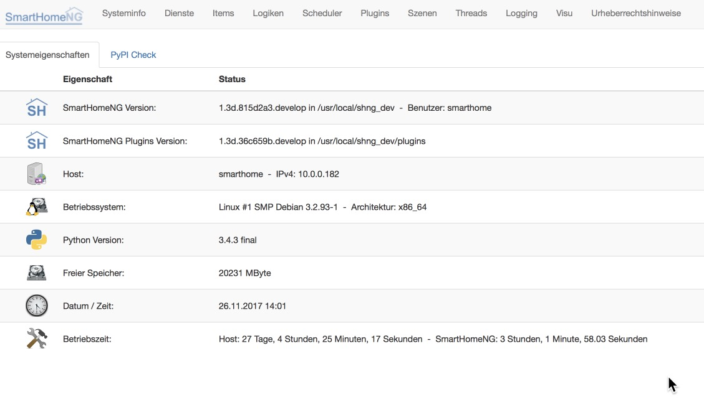

.. index:: Plugins; Backend (Administrations GUI)
.. index:: Administrations GUI
.. index:: Webinterfaces; Administrations GUI (Backend)

###################
Administrations GUI
###################

Seit SmartHomeNG v1.2 steht eine graphische Oberfläche zur Verfügung, die bei der Administration
von SmartHomeNG hilft.

Diese Oberfläche wird durch das **Backend Plugin** zur Verfügung gestellt. Dazu implementiert 
SmartHomeNG einen eigenen Webserver, der in der Standardkonfiguration auf **Port 8383** hört.

Das Backen Plugin liefert Informationen über die aktuelle SmartHomeNG Installation. Im Moment 
dient es als Support-Tool, um anderen Benutzern bei einer Installation zu helfen, die nicht 
ordnungsgemäß ausgeführt wird.

Einige Höhepunkte:

eine Liste der installierten Python-Module wird gegenüber den verfügbaren Versionen von PyPI angezeigt
eine Liste von Elementen und ihren Attributen wird angezeigt
eine Liste von Logiken und ihrer nächsten Ausführungszeit
eine Liste der aktuellen Scheduler und ihrer nächsten Ausführungszeit
Direkter Download der sqlite Datenbank (falls Plugin verwendet wird) und smarthome.log
Einige Informationen über häufig verwendete Daemons wie knxd / eibd sind enthalten
unterstützt die Standardauthentifizierung
mehrsprachige Unterstützung
Es gibt jedoch nur einen grundlegenden Schutz vor unbefugtem Zugriff oder Verwendung des Plugins. Seien Sie also vorsichtig, wenn Sie es mit Ihrem Netzwerk aktivieren.

Die GUI ermöglicht bereits einige Administrations Tasks direkt durchzuführen. Dazu gehören:

- Setzen von Item Werten
- Erstellen, Änden und Löschen von Python Logiken
- Konfiguration von Lokigen
- Das Enablen und Disablen von Logiken

Die Administrations GUI wird durch folgenden Aufruf gestartet:

.. code::

   http://<ip Ihres SmartHomeNG-Servers>:8383

Ab SmartHomeNG v1.4 erreichen sie die Administrations GUI (je nach Konfiguration von SmartHomeNG)
nur über den Aufruf:

.. code::

   http://<ip Ihres SmartHomeNG-Servers>:8383/backend

Ein Beispiel Schirm mit allgemeinen Informationen über SmartHomeNG und das System auf dem
SmartHomeNG läuft:

.. toctree::
   :maxdepth: 4
   :hidden:
   :titlesonly:
   
   items
   logiken
