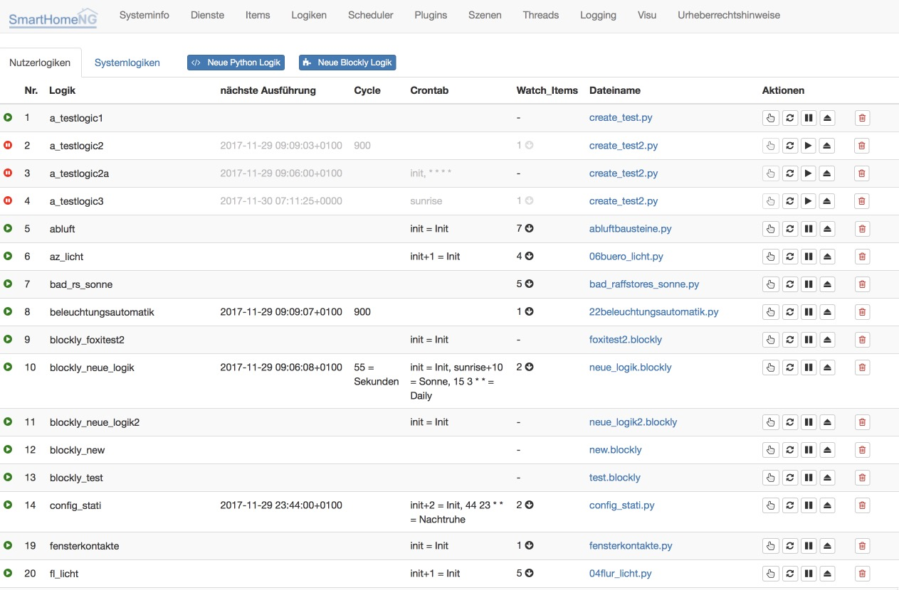
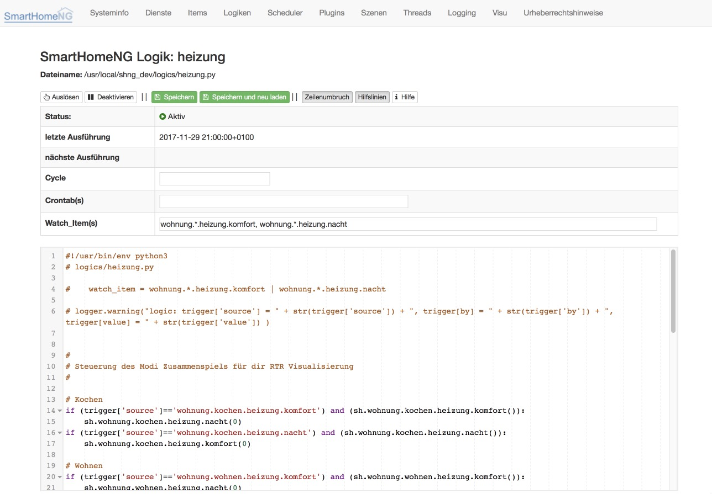

.. index:: backend Plugin; Logiken

#######
Logiken
#######

Ab SmartHomeNG v1.4 stehen in der graphischen Oberfläche Funktionen zur Verfügung, mit der
Logiken vollständig verwaltet (erstellt, geändert und konfiguriert) werden können.

.. index:: Logik Liste

Logik Liste
===========

Die Logik Liste zeigt die Übersicht aller Logiken mit Informationen zu ihrer Konfiguration an.

Aus dieser Liste heraus kann man die Logiken triggern, neu laden, aktivieren bzw. deaktivieren,
entladen und löschen. Ein Klick auf den Dateinamen führt in den Logik Editor.

.. index:: Logik Editor

Logik Editor
============

Im Logik Editor können die Konfigurationsparameter einer Logik angepasst werden und der Code
der Logik kann editiert werden.

