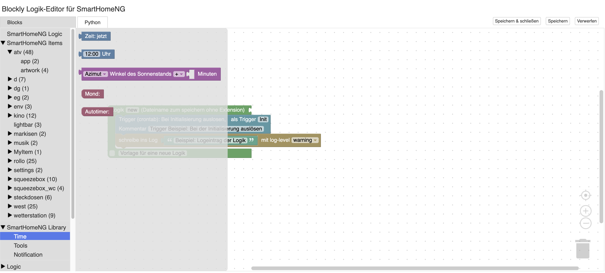

.. index:: Plugins; blockly
.. index:: blockly

=======
blockly
=======

.. image:: webif/static/img/plugin_logo.svg
   :alt: plugin logo
   :width: 300px
   :height: 300px
   :scale: 50 %
   :align: left

Beschreibung von developers.google.com:
Die Blockly-Bibliothek fügt Ihrer App einen Editor hinzu, der Codierungskonzepte
als ineinandergreifende Blöcke darstellt.
Es gibt syntaktisch korrekten Code in der Programmiersprache Ihrer Wahl aus.
Sie können benutzerdefinierte Blöcke erstellen, um eine Verbindung zu Ihrer
eigenen Anwendung herzustellen.

Voraussetzungen
===============

Dieses Plugin läuft unter Python >= 3.4 sowie den Bibliotheken cherrypy
und jinja2.

.. important::

    Dieses Plugin benötigt das SmartHomeNG Modul ``http``.

Konfiguration
=============

.. important::

    Detaillierte Informationen zur Konfiguration des Plugins sind unter :doc:`/plugins_doc/config/blockly` zu finden.

.. code-block:: yaml

   # etc/plugin.yaml
   blockly:
       plugin_name: blockly

Aktualisierung
==============

Es ist möglich, das gesamte ZIP File von `Github <https://github.com/google/blockly/releases/latest>`_
herunterzuladen. Aus dem entpackten File sind folgende Dateien nötig:

* blockly_compressed.js

* blocks_compressed.js

* python_compressed.js

* demos/code/style.css

* msg/js/de.js

* msg/js/en.js

* msg/js/fr.js

* LICENSE

* README.md

Diese Dateien müssen direkt in den Ordner ``plugins/blockly/webif/static/blockly`` kopiert werden.

Zusätzlich muss das komplette ``media`` Verzeichnis in den gleichen Ordner kopiert werden.

Web Interface
=============

Das Web Interface ist das Kernstück des Plugins - hier ist es möglich, mit Hilfe
der verschiedenen Blöcke einfach Logiken für SmarthomeNG zu erstellen.

