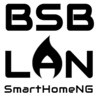

.. index:: Plugins; bsblan
.. index:: bsblan

======
bsblan
======

Verbindet einen BSB-LAN-Adapter (https://github.com/fredlcore/BSB-LAN) mit SmartHomeNG. BSB-LAN
ist eine LAN-Schnittstelle für den Boiler-System-Bus (BSB), über die sich Heizungsanlagen von Elco,
Brötje und ähnlichen Herstellern ansteuern lassen. Das Plugin liest alle verfügbaren
Kesselparameter aus und schreibt alle beschreibbaren Parameter.

.. important::

   Dieses Plugin ist als **develop** gekennzeichnet. Es kann sein, dass es noch nicht alle
   Funktionen unterstützt oder noch fehlerhaft ist.

Konfiguration
=============

Die Informationen zur Konfiguration des Plugins sind unter :doc:`/plugins_doc/config/bsblan` beschrieben.

Item-Attribute
--------------

**bsb_lan** ist unter :doc:`/plugins_doc/config/bsblan` beschrieben.

Ein optionales Kind-Item namens **descr** vom Typ ``str`` wird vom Plugin automatisch mit der vom
BSB-LAN-Adapter gelieferten Parameterbeschreibung befüllt.

Beispiele
=========

::

    bsblan:
        Komfortsollwert_HK1:
            type: num
            bsb_lan: 710
            visu_acl: rw
            descr:
                type: str
        Vorlauftemperatur_HK1:
            type: num
            bsb_lan: 8743
            visu_acl: ro
            descr:
                type: str
        Trinkwassertemperatur:
            type: num
            bsb_lan: 8830
            visu_acl: ro
            descr:
                type: str
