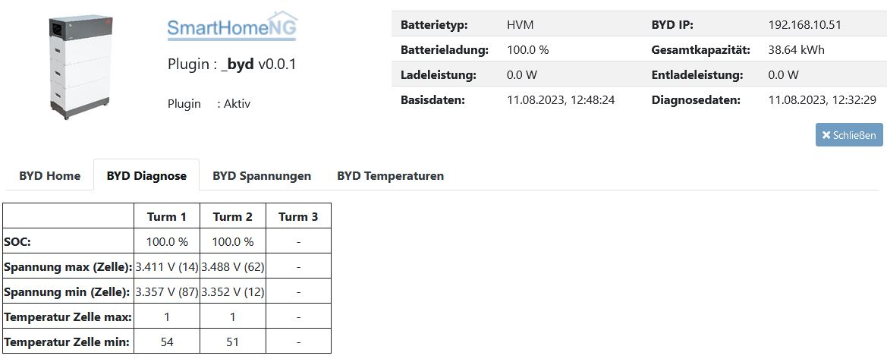
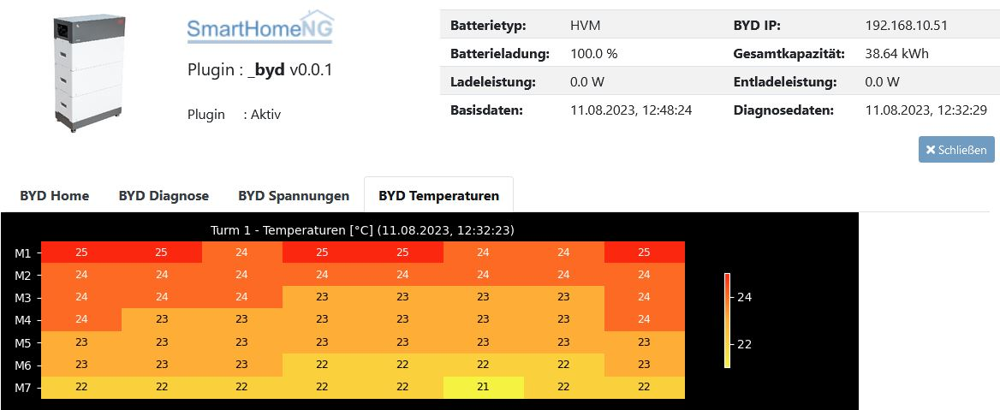

.. index:: Plugins; byd_bat
.. index:: byd_bat

=======
byd_bat
=======

.. image:: webif/static/img/plugin_logo.png
   :alt: plugin logo
   :width: 300px
   :height: 300px
   :scale: 50 %
   :align: left

Mit Hilfe dieses Plugins können diverse Daten aus einem BYD Energiespeicher ausgelesen werden. Die Parameter entsprechen den Daten, die in der Software "Be_Connect_Plus" von BYD angezeigt werden.

Es werden 1-3 Türme und die Batteriesysteme HVS, HVM und LVS unterstützt.

Das Plugin benötigt nur ein Item mit der folgenden Deklaration:

byd:
    struct: byd_bat.byd_struct

Alle verfügbaren Daten werden im Struct 'byd_struct' bereitgestellt. Diverse Parameter besitzen bereits die Eigenschaft 'database: init', so dass die Daten für die Visualisierung (z.Bsp. in smartVISU) bereitgestellt werden.

Die Grunddaten des Systems werden alle 60 Sekunden aktualisiert. Die Diagnosedaten werden beim Start des Plugins und gemäss dem Parameter 'diag_cycle' abgerufen.

Der BYD Energiespeicher akzeptiert nur 1 Verbindung gleichzeitig. Mit dem Item 'byd.enable_connection' kann die Verbindung pausiert werden. Im Web Interface ist dieses Item ebenfalls vorhanden.

Die Log-Daten werden alle 300 Sekunden abgerufen, wenn der Parameter 'log_data' auf 'true' gesetzt ist. Die Logdaten werden in den Items 'visu/...' als HTML-Tabellen oder JSON-Daten bereitgestellt. Diese Items können in smartVISU wie folgt dargestellt werden:

HTML-Tabelle:

  {{ basic.print('','byd.visu.bmu_log.log_html','html') }}
  {{ basic.print('','byd.visu.tower1_log.log_html','html') }}
  
JSON-Daten:

  {{ status.activelist('','byd.visu.bmu_log.log_jsonlist','title','date','content','level') }}
  {{ status.activelist('','byd.visu.tower1_log.log_jsonlist','title','date','content','level') }}
  
Zusätzlich werden die Log-Daten tageweise in Logdateien im Verzeichnis 'var/log/byd_logs' gespeichert. Der Parameter 'log_age' definiert, wie viele Tage die Logs gespeichert bleiben sollen.

Das Plugin generiert aus den Spannungs- und Temperaturwerten für jeden Turm Plots als Bitmap-Dateien (in den folgenden Dateinamen ist X = Nummer des Turms [1-3]):

  * bydvtX.png  : Spannungen Heatmap
  * bydvbtX.png : Spannungen Balkendiagramm
  * bydttX.png  : Temperaturen Heatmap

Diese Plots werden im Web Interface angezeigt. Zusätzlich können diese Bilder auch in ein weiteres Verzeichnis kopiert werden (z.Bsp. für smartVISU, siehe Parameter 'imgpath').

Die Änderungen im Plugin sind am Anfang der Datei '__init__.py' im Abschnitt 'History' dokumentiert.

Anforderungen
=============

Der BYD Energiespeicher muss mit dem LAN verbunden sind. Die IP-Adresse des BYD wird über DHCP zugewiesen und muss ermittelt werden. Diese IP-Adresse muss in der Plugin-Konfiguration gespeichert werden. In Systemen mit mehr als 1 Turm wird nur der Master mit dem LAN verbunden.

Notwendige Software
-------------------

* matplotlib

Unterstützte Geräte
-------------------

Folgende BYD-Typen werden unterstützt:

* HVS (noch nicht getestet)
* HVM (getestet mit HVM 19.3kWh und 2 Türmen)
* LVS (noch nicht getestet)

Bitte Debug-Daten (level: DEBUG) von noch nicht getesteten BYD Energiespeichern an Plugin-Autor senden. Beim Start von SmartHomeNG werden die Diagnosedaten sofort ermittelt.

Konfiguration
=============

Detaillierte Information sind :doc:`/plugins_doc/config/byd_bat` zu entnehmen.

Web Interface
=============

Ein Web Interface ist implementiert und zeigt die eingelesenen Daten an.

Beispiele
=========

Oben rechts werden die wichtigsten Daten zum BYD Energiespeicher angezeigt. Mit dem Schalter "Verbindung" kann die Kommunikation mit dem Energiespeicher pausiert werden, um beispielsweise mit einer anderen Software auf das System zugreifen zu können.

.. image:: assets/base.png
   :class: screenshot

Im Tab "BYD Home" sind die Grunddaten des Energiespeichers dargestellt:

Im Tab "BYD Diagnose" werden Diagnosedaten angezeigt:

Im Tab "BYD Spannungen" werden die Spannungen der Module als Plot angezeigt:

Im Tab "BYD Temperaturen" werden die Temperaturen der Module als Heatmap angezeigt:

Im Tab "BYD Log-Daten" werden die Log-Daten angezeigt:

.. image:: assets/logdata.png
   :class: screenshot
