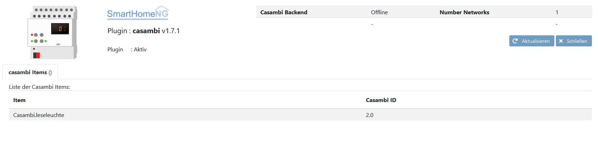

.. index:: Plugins; casambi
.. index:: casambi

=======
casambi
=======

Dieses Plugin unterstützt Casambi und Occhio Lichter durch die Verwendung des Casambi Backend API.
Die Kommunikation erfolgt über Bluetooth Low Energy (BLE) und die Casambi Produkte sind in vielen
Geräten verbaut, beispielsweise von Occhio.

Für weitere Informationen empfiehlt sich die Lektüre der offiziellen
`Casambi API Dokumentation <https://developer.casambi.com/>`_

Konfiguration
=============

Die Informationen zur Konfiguration des Plugins sind unter :doc:`/plugins_doc/config/casambi` beschrieben.

Gateway Hardware
================

Das Casambi Konzept sieht vor, ein Mobilgerät (z.B. Handy oder Tablett) als Hardwaregateway zwischen dem lokalen BLE Netzwerk und dem Casambi Backend
enzusetzen.

Anforderungen
============
Das Casambi Plugin benötigt einen validen Casambi API key, der hier beantragt werden kann:
``support@casambi.com``

Beispiele
=========

Beispiel für einen Dimmer (Occhio Sento) mit zusätzlichen Möglichkeiten für heller-dunkler und vertikales dimmen.

.. code:: yaml

    readinglight:
        casambi_id: 2
        enforce_updates: True

        backendstatus:
            type: bool
            casambi_rx_key: BACKEND_ONLINE_STAT
            visu_acl: ro

        light:
            type: bool
            casambi_rx_key: ON
            casambi_tx_key: ON
            visu_acl: rw
            enforce_updates: True

            level:
                type: num
                value: 0
                casambi_rx_key: DIMMER
                casambi_tx_key: DIMMER
                visu_acl: rw
                enforce_updates: True

            vertical:
                type: num
                value: 0
                casambi_rx_key: VERTICAL
                casambi_tx_key: VERTICAL
                visu_acl: rw
                enforce_updates: True

Beispiel für einen Tunable White Dimmer :

.. code:: yaml

    spotlight:
        casambi_id: 3
        enforce_updates: True

        light:
            type: bool
            casambi_rx_key: ON
            casambi_tx_key: ON
            visu_acl: rw
            enforce_updates: True

            level:
                type: num
                value: 0
                casambi_rx_key: DIMMER
                casambi_tx_key: DIMMER
                visu_acl: rw
                enforce_updates: True

            tunablewhite:
                type: num
                value: 0
                casambi_rx_key: CCT
                casambi_tx_key: CCT
                visu_acl: rw
                enforce_updates: True

Web Interface
=============

Das casambi Plugin verfügt über ein Webinterface, auf dem die Casambi Items dargestellt werden.

.. important::

   Das Webinterface des Plugins kann mit SmartHomeNG v1.4.2 und davor **nicht** genutzt werden.
   Es wird dann nicht geladen. Diese Einschränkung gilt nur für das Webinterface. Ansonsten gilt
   für das Plugin die in den Metadaten angegebene minimale SmartHomeNG Version.

Aufruf des Webinterfaces
------------------------

Das Plugin kann aus dem Admin Interface aufgerufen werden. Dazu auf der Seite Plugins in der entsprechenden
Zeile das Icon in der Spalte **Web Interface** anklicken.

Außerdem kann das Webinterface direkt über ``http://smarthome.local:8383/casambi`` aufgerufen werden.

Beispiele
---------

Folgende Informationen können im Webinterface angezeigt werden:

Oben rechts werden allgemeine Parameter zum Plugin wie die Verbindung zum Casambi Backend und die Anzahl der gefundenen Casambi Netzwerke angezeigt.

Im ersten Tab werden die Items angezeigt, die das Casambi Plugin nutzen:

Changelog
=========

V1.7.5
    improved webinterface
    improved command sending, if connection is no longer available (broken pipe). Resent once immediately.

V1.7.4
    added backend online status parsing to item
    removed unjustified warning messages

V1.7.3
    added support for tunable white devices

V1.7.1
    Initial release

