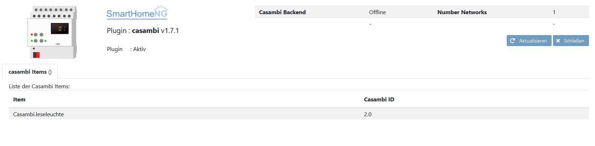

.. index:: Plugins; casambi_bt
.. index:: casambi_bt

=======
casambi
=======

Dieses Plugin (casambi_bt) unterstützt Casambi und Occhio Lichter und verbindet sich direkt lokal per Bluetooth mit den Leuchten. 
Die Kommunikation erfolgt über Bluetooth Low Energy (BLE). Die Casambi Produkte sind in vielen
Ger√§ten verbaut, beispielsweise von Occhio. Zur Steuerung der Casambi Produkte nicht lokal sondern ¸ber das Casambi Backend
bitte das andere Plugin casambi verwenden.

Dieses Plugin basiert auf dem Open Source Python Projekt von L.Kempf
`Github Projekt <https://github.com/lkempf/casambi-bt>`_

Konfiguration
=============

Die Informationen zur Konfiguration des Plugins sind unter :doc:`/plugins_doc/config/casambi_bt` beschrieben.

Gateway Hardware
================

Es wird ein Rechner mit Bluetooth benoetigt

Anforderungen
=============

Das Casambi_bt Plugin benötigt die MAC Adresse und das Passwort einer lokal per Bluetooth erreichbaren Casambi Netzwerk, Leuchte oder anderem Artikel.

Beispiele
=========

Beispiel für einen Dimmer (Occhio Sento) mit zusätzlichen Möglichkeiten für heller-dunkler und vertikales dimmen.

.. code:: yaml

    readinglight:
        casambi_id: 2
        enforce_updates: True

        backendstatus:
            type: bool
            casambi_rx_key: BACKEND_ONLINE_STAT
            visu_acl: ro

        light:
            type: bool
            casambi_rx_key: ON
            casambi_tx_key: ON
            visu_acl: rw
            enforce_updates: True

            level:
                type: num
                value: 0
                casambi_rx_key: DIMMER
                casambi_tx_key: DIMMER
                visu_acl: rw
                enforce_updates: True

            vertical:
                type: num
                value: 0
                casambi_rx_key: VERTICAL
                casambi_tx_key: VERTICAL
                visu_acl: rw
                enforce_updates: True

Beispiel für einen Tunable White Dimmer :

.. code:: yaml

    spotlight:
        casambi_id: 3
        enforce_updates: True

        light:
            type: bool
            casambi_rx_key: ON
            casambi_tx_key: ON
            visu_acl: rw
            enforce_updates: True

            level:
                type: num
                value: 0
                casambi_rx_key: DIMMER
                casambi_tx_key: DIMMER
                visu_acl: rw
                enforce_updates: True

            tunablewhite:
                type: num
                value: 0
                casambi_rx_key: CCT
                casambi_tx_key: CCT
                visu_acl: rw
                enforce_updates: True

Web Interface
=============

Das casambi_bt Plugin verfügt über ein Webinterface, auf dem die Casambi Items dargestellt werden.

.. important::

   Das Webinterface des Plugins kann mit SmartHomeNG v1.4.2 und davor **nicht** genutzt werden.
   Es wird dann nicht geladen. Diese Einschränkung gilt nur für das Webinterface. Ansonsten gilt
   für das Plugin die in den Metadaten angegebene minimale SmartHomeNG Version.

Aufruf des Webinterfaces
------------------------

Das Plugin kann aus dem Admin Interface aufgerufen werden. Dazu auf der Seite Plugins in der entsprechenden
Zeile das Icon in der Spalte **Web Interface** anklicken.

Außerdem kann das Webinterface direkt über ``http://smarthome.local:8383/casambi_bt`` aufgerufen werden.

Beispiele
---------

Folgende Informationen können im Webinterface angezeigt werden:

Oben rechts werden allgemeine Parameter zum Plugin wie der Status des AsyncIO Tasks sowie die Anzahl der per Bluetooth gefundenen Leuchten angezeigt.

Im ersten Tab werden die Items angezeigt, die das Casambi Plugin nutzen:

Changelog
=========

V1.0.0
    Erste Version

