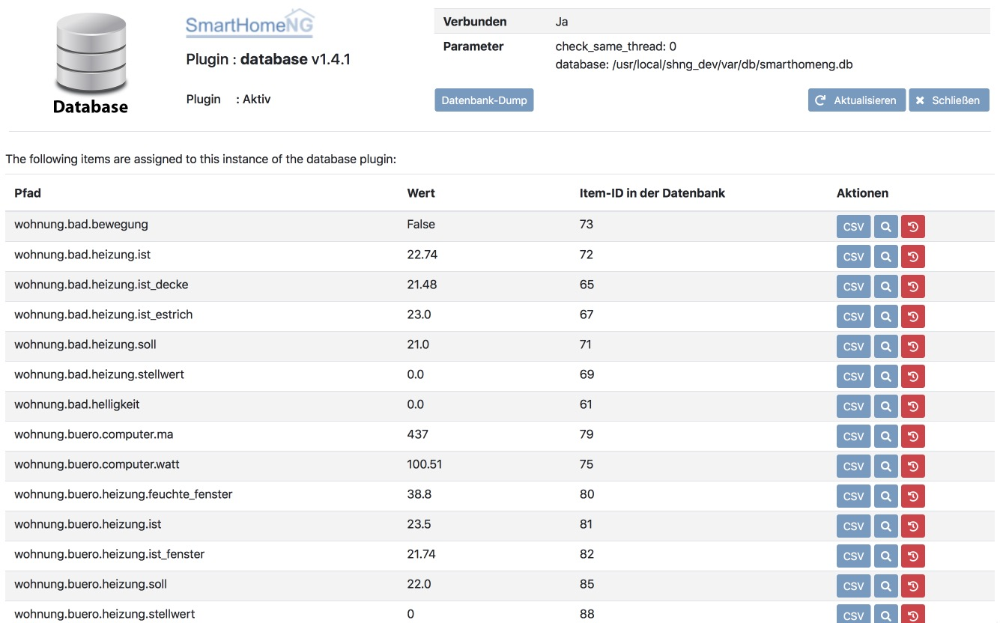
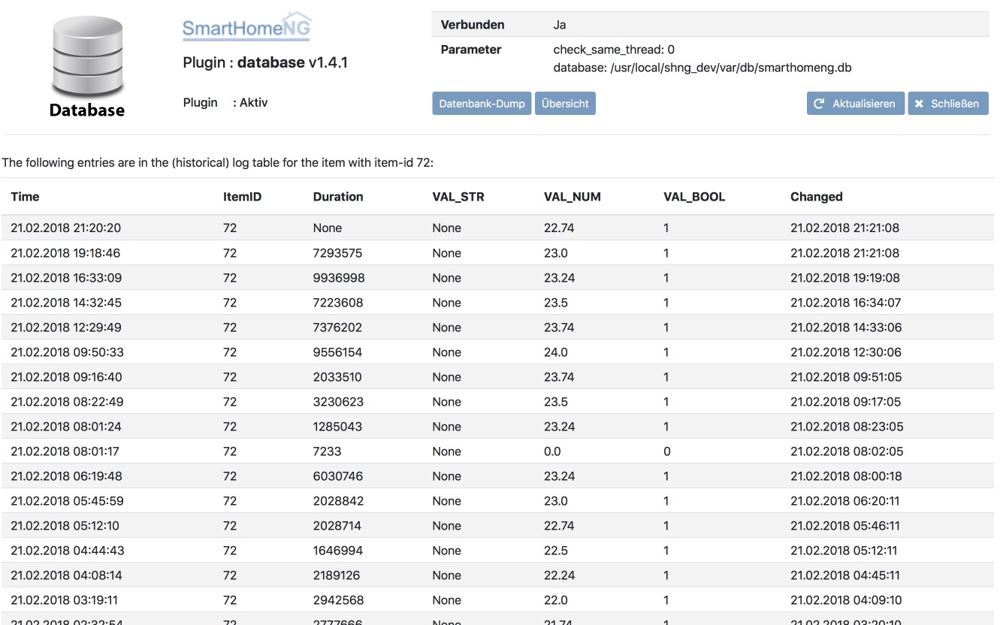

.. index:: Plugins; database (Datenbank Unterstützung)
.. index:: database

========
database
========

Database plugin, mit Unterstützung für SQLite 3 und MySQL.

Verwenden Sie dieses Plugin, um Itemwerte in einer Datenbank zu speichern. Es unterstützt
verschiedene Datenbanken, die eine Python DB API 2 <http://www.python.org/dev/peps/pep-0249/>`_ Implementierung
bereitstellen (z. B. `SQLite <http://docs.python.org/3.2/library/sqlite3.html>`_
welches bereits mit Python oder MySQL gebundeled ist, und über das
`Implementierungsmodul <https://wiki.python.org/moin/MySQL>`_ verwendet wird).

Konfiguration
=============

Die Informationen zur Konfiguration des Plugins sind unter :doc:`/plugins_doc/config/database` beschrieben.

.. important::

   Falls mehrere Instanzen des Plugins konfiguriert werden sollen, ist darauf zu achten, dass für eine der Instanzen
   **KEIN** **instance** Attribut konfiguriert werden darf, da sonst die Systemdaten nicht gespeichert werden und
   Abfragen aus dem Admin Interface und der smartVISU ins Leere laufen und Fehlermeldungen produzieren.

Standarmässig schreibt das Plugin vor dem Beenden von SmarthomeNG alle am Plugin registrierten Items nochmal mit aktuellem
Wert in die Datenbank. Die kann durch Setzen des Item Attributes database_write_on_shutdown: False unterdrückt werden.
Ein typischer Anwendungsfall sind zum Beispiel monoton steigende Werte wie Zählerstände, die selten geschrieben werden
und für die doppelte Einträge durch smarthomeNG Neustarts stoerend in Datenbank und optionalen Plots in einer
Visualisierung sind.

Web Interface
=============

Das database Plugin verfügt über ein Webinterface, mit dessen Hilfe die Items die das Plugin nutzen
übersichtlich dargestellt werden.

.. important::

   Das Webinterface des Plugins kann mit SmartHomeNG v1.4.2 und davor **nicht** genutzt werden.
   Es wird dann nicht geladen. Diese Einschränkung gilt nur für das Webinterface. Ansonsten gilt
   für das Plugin die in den Metadaten angegebene minimale SmartHomeNG Version.

Aufruf des Webinterfaces
------------------------

Das Plugin kann aus dem Admin Interface aufgerufen werden. Dazu auf der Seite Plugins in der entsprechenden
Zeile das Icon in der Spalte **Web Interface** anklicken.

Außerdem kann das Webinterface direkt über ``http://smarthome.local:8383/database`` bzw.
``http://smarthome.local:8383/database_<Instanz>`` aufgerufen werden.

Beispiele
---------

Folgende Informationen können im Webinterface angezeigt werden:

Oben rechts werden allgemeine Parameter zum Plugin angezeigt.

Im ersten Tab werden die Items angezeigt, die das database Plugin nutzen:

Auf der Detailseite zu den Item Einträgen werden die geloggten Werte angezeigt:

Aufbau der Datenbank
====================

Das Plugin erzeugt und verwendet zwei Tabellen in der Datenbank:

  * Table `item` - Die Tabelle beinhaltet alle Items und ihren letzten bekannten Wert
  * Table `log` - Die Tabelle listet alle historischen Werte der Items auf

Die `item` Tabelle enthält die folgenden Spalten:

  * Column `id` - Eine eindeutige Kennung die für jedes neue Item inkrementiert wird
  * Column `name` - Der ItemName
  * Column `time` - Ein UNIX Zeitstempel in eine Auflösung von Mikrosekunden
  * Column `val_str` - Der Itemwert als Zeichenkette wenn das Item den Typ `str` hat
  * Column `val_num` - Der Itemwert als Zahl, wenn das Item den Typ `num` hat
  * Column `val_bool` - Der Itemwert als Wahrheitswert, das Item den Typ `bool` oder `num` hat
  * Column `changed` - Ein UNIX Zeitstempel (in einer Auflösung von Mikrosekunden) der letzen Änderung

Die `log` Tabelle enthält die folgenden Spalten:

  * Column `time` - Ein UNIX Zeitstempel in eine Auflösung von Mikrosekunden
  * Column `item_id` - Eine Referenz auf eine eindeutige Kennung eines Items in der Tabelle ìtem
  * Column `duration` - Die Dauer in Mikrosekunden
  * Column `val_str` - Der Itemwert als Zeichenkette wenn das Item den Typ `str` hat
  * Column `val_num` - Der Itemwert als Zahl, wenn das Item den Typ `num` hat
  * Column `val_bool` - Der Itemwert als Wahrheitswert, das Item den Typ `bool` oder `num` hat
  * Column `changed` - Ein UNIX Zeitstempel (in einer Auflösung von Mikrosekunden) der letzen Änderung

Es gibt aktuell nur eine Möglichkeit die Anzahl der Datensätze pro Item zu begrenzen: 
Durch die Angabe des Item Attributs ``database_maxage`` wird das maximale Alter der Einträge eines Items begrenzt.
Regelmässig werden Werte deren Zeitstempel älter ist als die angegebene Zeitspanne aus der Datenbank gelöscht.