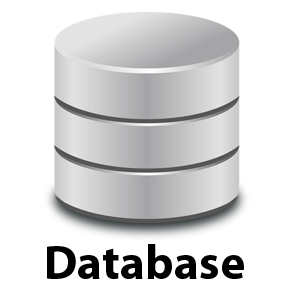
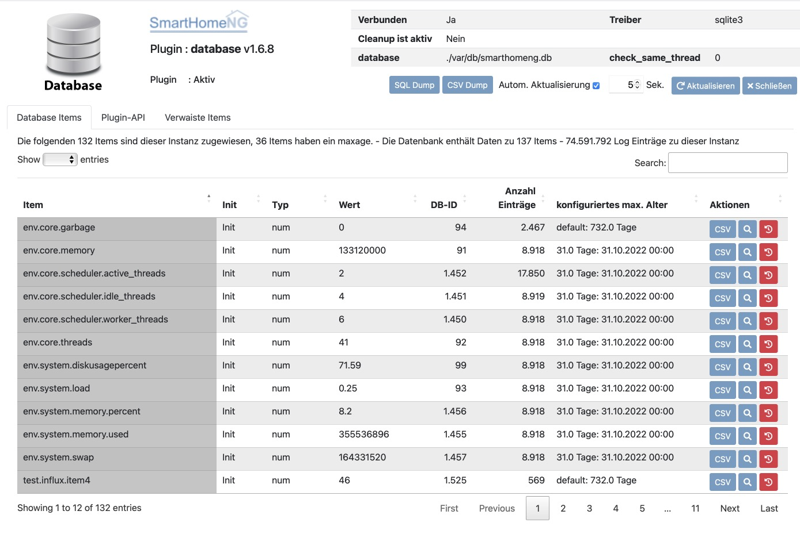
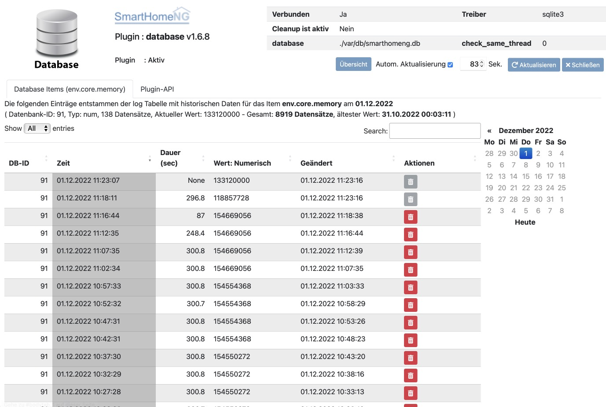
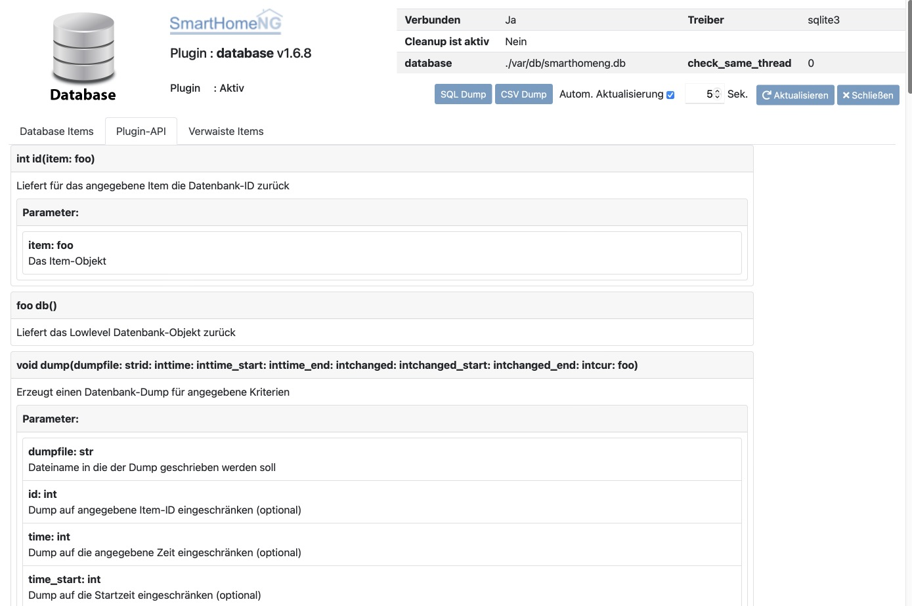
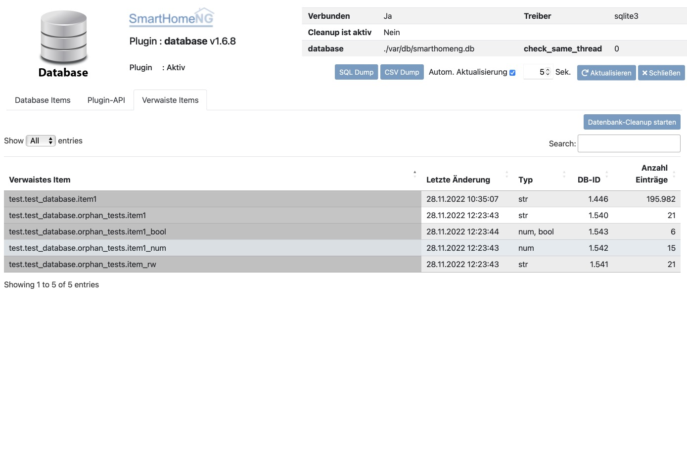

.. index:: Plugins; database (Datenbank Unterstützung)
.. index:: database

========
database
========

Database plugin, mit Unterstützung für SQLite3 und MySQL.

Verwenden Sie dieses Plugin, um Itemwerte in einer Datenbank zu speichern. Es unterstützt
verschiedene Datenbanken, die eine Python DB API 2 <http://www.python.org/dev/peps/pep-0249/>`_ Implementierung
bereitstellen (z. B. `SQLite <http://docs.python.org/3.2/library/sqlite3.html>`_
welches bereits mit Python oder MySQL gebundeled ist, und über das
`Implementierungsmodul <https://wiki.python.org/moin/MySQL>`_ verwendet wird).

Konfiguration
=============

Die Informationen zur Konfiguration des Plugins sind unter :doc:`/plugins_doc/config/database` beschrieben.

.. important::

   Falls mehrere Instanzen des Plugins konfiguriert werden sollen, ist darauf zu achten, dass für eine der Instanzen
   **KEIN** **instance** Attribut konfiguriert werden darf, da sonst die Systemdaten nicht gespeichert werden und
   Abfragen aus dem Admin Interface und der smartVISU ins Leere laufen und Fehlermeldungen produzieren.

Standarmäßig schreibt das Plugin vor dem Beenden von SmarthomeNG alle am Plugin registrierten Items nochmal mit aktuellem
Wert in die Datenbank. Die kann durch Setzen des Item Attributes database_write_on_shutdown: False unterdrückt werden.
Ein typischer Anwendungsfall sind zum Beispiel monoton steigende Werte wie Zählerstände, die selten geschrieben werden
und für die doppelte Einträge durch smarthomeNG Neustarts störend in Datenbank und optionalen Plots in einer
Visualisierung sind.

Web Interface
=============

Das database Plugin verfügt über ein Webinterface, mit dessen Hilfe die Items die das Plugin nutzen
übersichtlich dargestellt werden.

Aufruf des Webinterfaces
------------------------

Das Plugin kann aus dem Admin Interface aufgerufen werden. Dazu auf der Seite Plugins in der entsprechenden
Zeile das Icon in der Spalte **Web Interface** anklicken.

Außerdem kann das Webinterface direkt über ``http://smarthome.local:8383/database`` bzw.
``http://smarthome.local:8383/database_<Instanz>`` aufgerufen werden.

Das Web Interface verfügt über 3 Tabs, sowie Informationen und Buttons im Kopfbereich. Im Kopfbereich werden
Informationen zum Zustand des Plugins und zur verwendeten Datenbank angezeigt.

Database Items
--------------

Auf diesem Tab werden die Items angezeigt, für welche Daten in der Datenbank gespeichert werden.

Durch einen einen Klick auf den **CSV** Button in der Zeile des Items, wird ein Download der gespeicherten Daten
zu dem Item erzeugt.

Auf dem Tab wird als **Wert** der letzte in der Datenbank gespeicherte Wert angezeigt. Um eine Historie zu sehen,
muss rechts in der Zeile des Items auf den Button mit der Lupe geklickt werden.

Auf der Detail-Seite wird die Liste der gespeicherten Werte zu einem Tag angezeigt. Der anzuzeigende Tag kann rechts
im Kalender gewählt werden.

Zu jedem Wert wird angezeigt, wann er gespeichert wurde und für welche Dauer er gültig war. Beim aktuellen Wert
wird als Dauer **None** angezeigt, da der Wert noch gültig ist und die Dauer daher unbekannt ist.

Durch einen Klick auf den Button **Übersicht**, kann zur Standard Anzeige des Tabs **Database Items** zurück gekehrt
werden.

Plugin-API
----------

Auf diesem Tab werden die öffentlichen Funktionen des Plugins angezeigt, die z.B. in Logiken genutzt werden können.
Diese Informationen sind auch in dieser Dokumentation auf der Seite mit den Konfigurationsdaten vorhanden.

Verwaiste Items
---------------

Dieses Tab wird nur angezeigt, wenn in der Datenbank verwaiste Items vorhanden sind. Verwaiste Items sind Items, zu
denen Informationen in der Datenbank gespeichert sind, zu denen es aber im Item Tree von SmartHomeNG keine
Entsprechungen gibt, also kein Item mit dem gleichen Pfad, welches für das database Plugin konfiguriert ist.

Wenn die Daten zu den verwaisten Items nicht mehr benötigt werden, können diese durch klicken des Buttons
**Datenbank-Cleanup starten** gelöscht werden.

Sollen einige Daten erhalten bleiben, so müssen die Items dazu vorher in SmartHomeNG (wieder) konfiguriert werden.

Export von Daten
----------------

Das Plugin verfügt über zwei Möglichkeiten, um Daten zu exportieren. Wobei die Zweite (SQL Dump) nur bei Verwendung
von SQLite3 zur Verfügung steht.

Der Export wird gestartet, indem einer der beiden Buttons im Kopfbereich des Plugins geklickt wird.
Anschließend wird auf dem System auf dem SmartHomeNG läuft, lokal ein Export der Daten erzeugt und anschließend
herunter geladen. Während die Erzeugung es Exports läuft, wird im Browser ein leeres Fenster angezeigt. Das
Fenster muss bis zum Abschluss des Exports geöffnet bleiben. Der Export kann, je nach Datenbank Größe, bis
zu über einer Stunde dauern. Nach Abschluss des Exports wird die Datei herunter geladen und im Fenster wird wieder das
Web Interface des database Plugins angezeigt.

CSV Dump
~~~~~~~~

Durch einen Klick auf den Button **CSV Dump** wird ein vollständiger Dump der in der Datenbank gespeicherten
Informationen erzeugt und im Browser runter geladen.

Die Daten in der heruntergeladenen Datei haben folgende Struktur:

.. code-block:: text

    item_id;item_name;time;duration;val_str;val_num;val_bool;changed;time_date;changed_date
    3;wohnung.kochen.kochfeldg.ma;1606258889619;17998;;217.0;1;1606258947266;2020-11-25 00:01:29.619000;2020-11-25 00:02:27.266000
    3;wohnung.kochen.kochfeldg.ma;1606258907617;17993;;216.0;1;1606258947266;2020-11-25 00:01:47.617000;2020-11-25 00:02:27.266000
    3;wohnung.kochen.kochfeldg.ma;1606258925610;5996;;217.0;1;1606258947266;2020-11-25 00:02:05.610000;2020-11-25 00:02:27.266000
    3;wohnung.kochen.kochfeldg.ma;1606258931606;18006;;216.0;1;1606259007370;2020-11-25 00:02:11.606000;2020-11-25 00:03:27.370000
    3;wohnung.kochen.kochfeldg.ma;1606258949612;5993;;217.0;1;1606259007370;2020-11-25 00:02:29.612000;2020-11-25 00:03:27.370000
    3;wohnung.kochen.kochfeldg.ma;1606258955605;30001;;216.0;1;1606259007370;2020-11-25 00:02:35.605000;2020-11-25 00:03:27.370000
    3;wohnung.kochen.kochfeldg.ma;1606258985606;53991;;217.0;1;1606259067523;2020-11-25 00:03:05.606000;2020-11-25 00:04:27.523000
    3;wohnung.kochen.kochfeldg.ma;1606259039597;24006;;216.0;1;1606259067523;2020-11-25 00:03:59.597000;2020-11-25 00:04:27.523000
    3;wohnung.kochen.kochfeldg.ma;1606259063603;11984;;217.0;1;1606259127224;2020-11-25 00:04:23.603000;2020-11-25 00:05:27.224000

Es handelt sich hierbei um einen reinen Dump der Daten, nicht um ein Abbild der Datenbank Struktur.

SQL Dump
~~~~~~~~

Im Gegensatz zum CSV Dump, wird bei einem SQL Dump die vollständige Datenbank (Daten und Struktur) herunter geladen.
Diese Funktion steht allerdings nur bei Nutzung einer SQLite3 Datenbank zur Verfügung.

Die heruntergeladene Datei hat dabei folgendes Format:

.. code-block:: text

    BEGIN TRANSACTION;
    CREATE TABLE database_version(version NUMERIC, updated BIGINT, rollout TEXT, rollback TEXT);
    INSERT INTO "database_version" VALUES(1,1518289184830,'CREATE TABLE log (time BIGINT, item_id INTEGER, duration BIGINT, val_str TEXT, val_num REAL, val_bool BOOLEAN, changed BIGINT);','DROP TABLE log;');
    INSERT INTO "database_version" VALUES(2,1518289184835,'CREATE TABLE item (id INTEGER, name varchar(255), time BIGINT, val_str TEXT, val_num REAL, val_bool BOOLEAN, changed BIGINT);','DROP TABLE item;');
    INSERT INTO "database_version" VALUES(3,1518289184840,'CREATE UNIQUE INDEX log_item_id_time ON log (item_id, time);','DROP INDEX log_item_id_time;');
    INSERT INTO "database_version" VALUES(4,1518289184845,'CREATE INDEX log_item_id_changed ON log (item_id, changed);','DROP INDEX log_item_id_changed;');
    INSERT INTO "database_version" VALUES(5,1518289184849,'CREATE UNIQUE INDEX item_id ON item (id);','DROP INDEX item_id;');
    INSERT INTO "database_version" VALUES(6,1518289184854,'CREATE INDEX item_name ON item (name);','DROP INDEX item_name;');
    CREATE TABLE item (id INTEGER, name varchar(255), time BIGINT, val_str TEXT, val_num REAL, val_bool BOOLEAN, changed BIGINT);
    INSERT INTO "item" VALUES(3,'wohnung.kochen.kochfeldg.ma',1669554322161,NULL,202.0,1,1669554363596);

    ...

    INSERT INTO "log" VALUES(1669557938064,101,NULL,NULL,527.0,1,1669557938992);
    INSERT INTO "log" VALUES(1669557928298,105,NULL,NULL,230.0,1,1669557939008);
    INSERT INTO "log" VALUES(1669557928356,107,NULL,NULL,227.0,1,1669557939032);
    INSERT INTO "log" VALUES(1669557906685,1446,NULL,'1.45',NULL,1,1669557939063);
    INSERT INTO "log" VALUES(1669557906694,1447,NULL,'1.45',NULL,1,1669557939071);
    CREATE UNIQUE INDEX log_item_id_time ON log (item_id, time);
    CREATE INDEX log_item_id_changed ON log (item_id, changed);
    CREATE UNIQUE INDEX item_id ON item (id);
    CREATE INDEX item_name ON item (name);
    COMMIT;

Das herunter geladene SQL Skript kann in eine leere Datenbank importiert werden. Dieses kann zum Beispiel zum
Verkleinern des Datenbank Datei nach dem Löschen einer größeren Menge von Daten genutzt werden.

Aufbau der Datenbank
====================

Das Plugin erzeugt und verwendet zwei Tabellen in der Datenbank:

  * Table `item` - Die Tabelle beinhaltet alle Items und ihren letzten bekannten Wert
  * Table `log` - Die Tabelle listet alle historischen Werte der Items auf

Die `item` Tabelle enthält die folgenden Spalten:

  * Column `id` - Eine eindeutige Kennung die für jedes neue Item inkrementiert wird
  * Column `name` - Der ItemName
  * Column `time` - Ein UNIX Zeitstempel in eine Auflösung von Mikrosekunden
  * Column `val_str` - Der Itemwert als Zeichenkette wenn das Item den Typ `str` hat
  * Column `val_num` - Der Itemwert als Zahl, wenn das Item den Typ `num` hat
  * Column `val_bool` - Der Itemwert als Wahrheitswert, das Item den Typ `bool` oder `num` hat
  * Column `changed` - Ein UNIX Zeitstempel (in einer Auflösung von Mikrosekunden) der letzen Änderung

Die `log` Tabelle enthält die folgenden Spalten:

  * Column `time` - Ein UNIX Zeitstempel in eine Auflösung von Mikrosekunden
  * Column `item_id` - Eine Referenz auf eine eindeutige Kennung eines Items in der Tabelle `item`
  * Column `duration` - Die Dauer in Mikrosekunden
  * Column `val_str` - Der Itemwert als Zeichenkette wenn das Item den Typ `str` hat
  * Column `val_num` - Der Itemwert als Zahl, wenn das Item den Typ `num` hat
  * Column `val_bool` - Der Itemwert als Wahrheitswert, das Item den Typ `bool` oder `num` hat
  * Column `changed` - Ein UNIX Zeitstempel (in einer Auflösung von Mikrosekunden) der letzen Änderung

Es gibt aktuell nur eine Möglichkeit die Anzahl der Datensätze pro Item zu begrenzen:
Durch die Angabe des Item Attributs ``database_maxage`` wird das maximale Alter der Einträge eines Items begrenzt.
Regelmässig werden Werte deren Zeitstempel älter ist als die angegebene Zeitspanne aus der Datenbank gelöscht.
