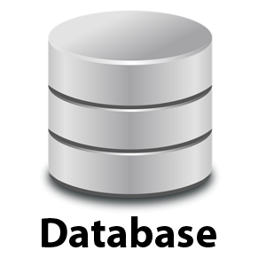
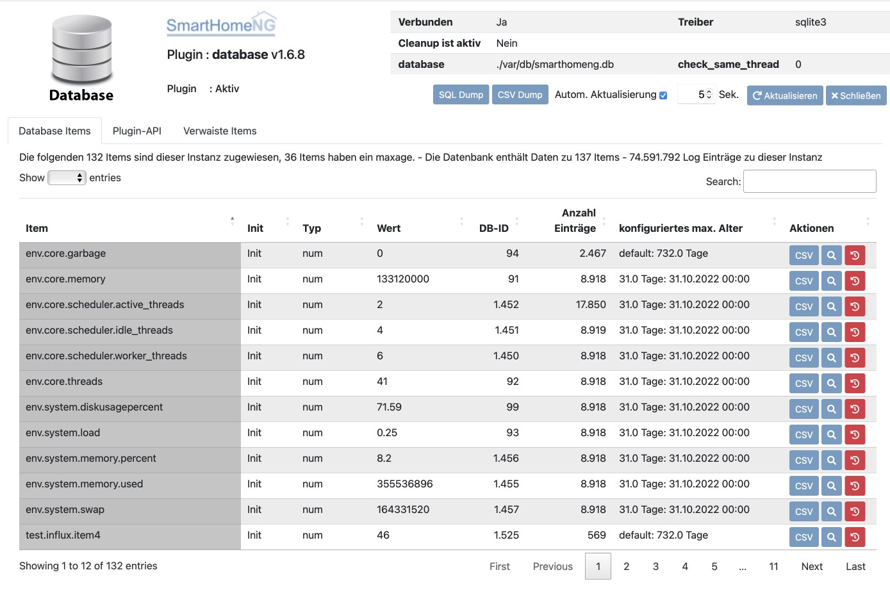
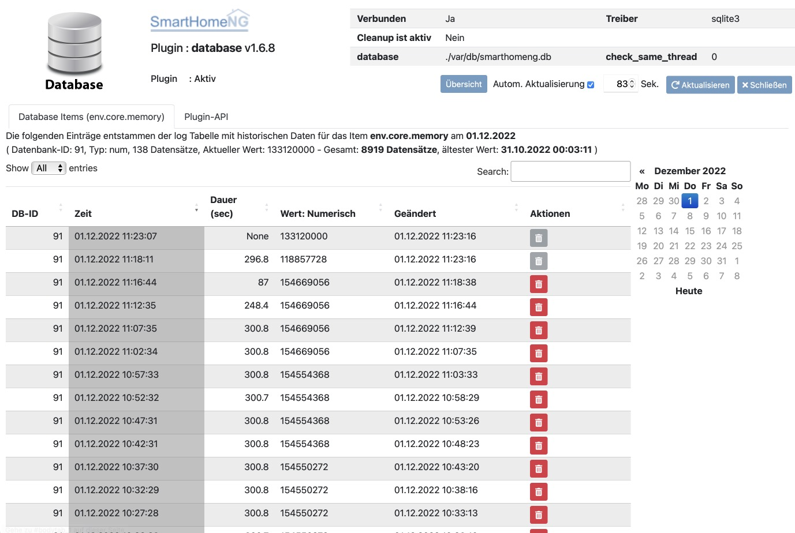
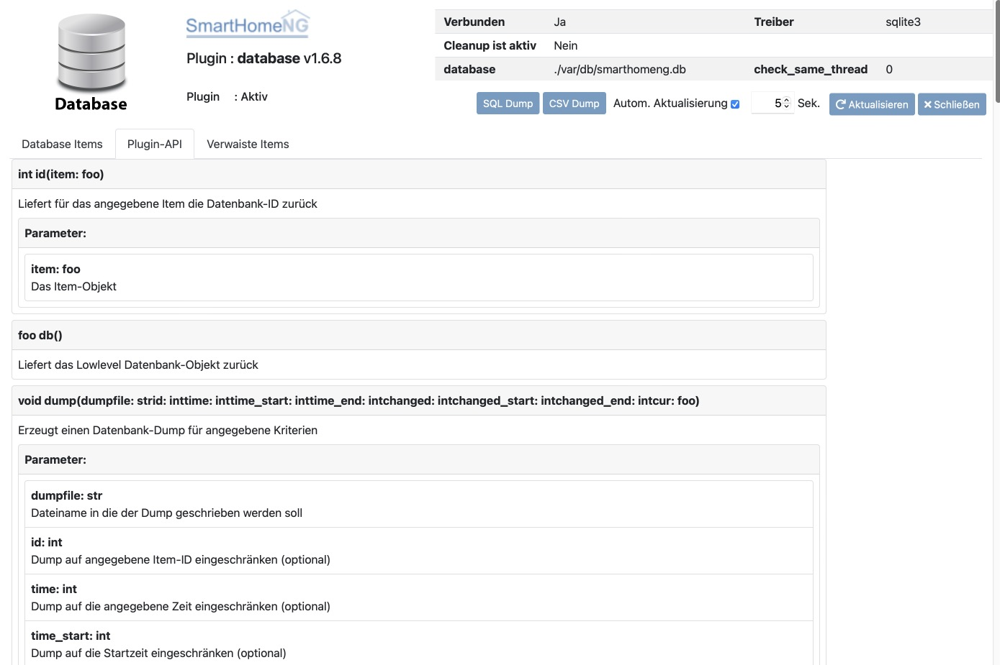
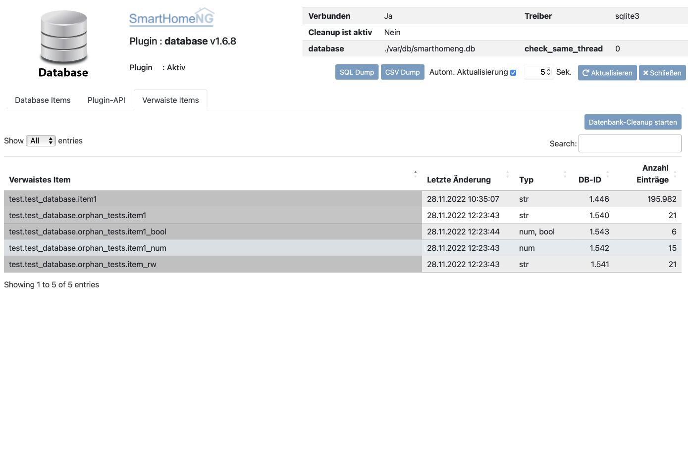

.. index:: Plugins; database (Datenbank Unterstützung)
.. index:: database

========
database
========

Database plugin, mit Unterstützung für SQLite3, MySQL/MariaDB und PostgreSQL+TimescaleDB.

Verwenden Sie dieses Plugin, um Itemwerte in einer Datenbank zu speichern. Es unterstützt
verschiedene Datenbanken, die eine Python DB API 2 <http://www.python.org/dev/peps/pep-0249/>`_ Implementierung
bereitstellen (z. B. `SQLite <http://docs.python.org/3.2/library/sqlite3.html>`_
welches bereits mit Python oder MySQL gebundeled ist, und über das
`Implementierungsmodul <https://wiki.python.org/moin/MySQL>`_ verwendet wird, oder PostgreSQL,
optional mit der `TimescaleDB <https://www.timescale.com/>`_ Extension - siehe
"PostgreSQL+TimescaleDB Unterstützung" weiter unten).

Konfiguration
=============

Die Informationen zur Konfiguration des Plugins sind unter :doc:`/plugins_doc/config/database` beschrieben.

.. important::

   Falls mehrere Instanzen des Plugins konfiguriert werden sollen, ist darauf zu achten, dass für eine der Instanzen
   **KEIN** **instance** Attribut konfiguriert werden darf, da sonst die Systemdaten nicht gespeichert werden und
   Abfragen aus dem Admin Interface und der smartVISU ins Leere laufen und Fehlermeldungen produzieren.

.. note::

   Hinweise für MySQL/MariaDB:

   - Textwerte (``val_str``) sind auf 64 KB begrenzt (Spaltentyp ``TEXT``). SQLite hat diese
     Grenze nicht.
   - Beim ersten Start nach einem Update kann die Schema-Migration auf Version 7 (neue Spalte
     ``val_quality``) auf MariaDB vor 10.3 lange dauern, da die komplette Log-Tabelle neu
     aufgebaut wird.
   - Die Auswertungsfunktionen ``diff`` und ``differentiate`` benötigen Window-Funktionen:
     MariaDB ab 10.2, MySQL ab 8.0, SQLite ab 3.25. PostgreSQL unterstützt Window-Funktionen
     bereits seit Version 8.4 (2009) - hier ist keine Mindestversion zu beachten.

Standarmäßig schreibt das Plugin vor dem Beenden von SmarthomeNG alle am Plugin registrierten Items nochmal mit aktuellem
Wert in die Datenbank. Die kann durch Setzen des Item Attributes database_write_on_shutdown: False unterdrückt werden.
Ein typischer Anwendungsfall sind zum Beispiel monoton steigende Werte wie Zählerstände, die selten geschrieben werden
und für die doppelte Einträge durch smarthomeNG Neustarts störend in Datenbank und optionalen Plots in einer
Visualisierung sind.

Treiber-Auswahl
---------------

.. index:: database; driver

Der Parameter ``driver`` bestimmt, welches DB-API2-Modul verwendet wird. Neben den echten
Modulnamen (``sqlite3``, ``pymysql``, ``psycopg2``, ``psycopg``) akzeptiert das Plugin auch
sprechende Datenbank-Namen, die automatisch auf das passende Modul abgebildet werden:

======================================= =========================================================
Wert                                    Ergebnis
======================================= =========================================================
``sqlite3``                             SQLite3 (in Python enthalten)
``mysql`` / ``mariadb``                 MySQL/MariaDB über ``pymysql``
``postgres`` / ``postgresql`` /         PostgreSQL über ``psycopg2`` oder ``psycopg`` (v3) - es
``timescale`` / ``timescaledb``         wird automatisch erkannt, welches der beiden Module
                                         installiert ist, ``psycopg2`` wird bevorzugt.
======================================= =========================================================

Beispiel für eine PostgreSQL+TimescaleDB-Instanz:

.. code-block:: yaml

    database_timescale:
        plugin_name: database
        driver: timescaledb
        connect:
        -   host:127.0.0.1
        -   port:5432
        -   user:shng
        -   password:shng_password
        -   database:shng

.. note::

   Hinweis für SQLite3:

   - Mit ``sqlite_wal_mode: true`` kann die Datenbankdatei in den WAL-Journal-Modus versetzt
     werden, was parallele Schreib- und Lesevorgänge erlaubt. Dies ist eine Einwegentscheidung:
     WAL ist eine Eigenschaft der Datenbankdatei selbst, bleibt über Neustarts hinweg bestehen
     und wird von jeder künftigen Verbindung (auch von anderen Tools) übernommen. Ein
     Zurücksetzen des Parameters macht eine bereits umgestellte Datei nicht rückgängig.

Kompaktierung statt Löschen (database_maxage_action)
====================================================

Standardmäßig löscht ``database_maxage`` alte Werte ersatzlos. Über das Item Attribut
``database_maxage_action`` kann stattdessen festgelegt werden, dass alte Rohwerte zu jeweils **einem**
Wert pro Kompaktierungsintervall verdichtet werden, statt komplett zu verschwinden. So bleibt zum
Beispiel der Verlauf eines Werts über Jahre hinweg als Tagesmittelwert erhalten, während die
minütlichen Rohdaten irgendwann gelöscht werden.

Die Kompaktierung läuft im selben Turnus wie das bisherige Löschen (Parameter ``removeold_cycle``)
und arbeitet sich - genau wie das Löschen - in begrenzten Schritten durch alte Daten (Parameter
``max_aggregate_intervals``), um die Datenbank nicht mit einem einzigen großen Durchlauf zu blockieren.

Auf PostgreSQL+TimescaleDB kann diese Kompaktierung alternativ vom Datenbank-Server selbst
übernommen werden (``timescale_native_aggregation``) - siehe "PostgreSQL+TimescaleDB
Unterstützung" weiter unten.

Item Attribute
--------------

``database_maxage_action``
    Legt fest, was mit Werten passiert, die älter als ``database_maxage`` sind. Standardwert ist
    ``delete`` (bisheriges Verhalten). Jeder andere Wert ersetzt die Rohwerte eines Intervalls durch
    **einen** berechneten Wert:

    ========= ========================================== ============== ===========================================
    Wert      Bedeutung                                  Gültig für Typ Anwendung bei täglicher Kompaktierung
    ========= ========================================== ============== ===========================================
    delete    Werte löschen (Standard)                   beliebig
    avg       Zeitgewichteter Mittelwert                 num, bool      Raumtemperatur - Tagesmittelwert
    sum       Summe der Werte                            num, bool      Energieverbrauch aus Einzelverbrauchswerten
    min       Minimalwert                                num, bool      Kälteste Außentemperatur
    max       Maximalwert                                num, bool      Spitzenleistung eines Wechselrichters
    integrate Diskretes Integral über der Zeit           num, bool      Solarproduktion aus Momentanleistung
    on        Prozentzahl der Werte > 0 (zeitgewichtet)  bool           Anteilige Arbeitszeit der Heizkreispumpe
    countall  Anzahl der Rohwerte im Intervall           beliebig       Anzahl Auslösungen Türkontakt
    first     Ältester Rohwert im Intervall, unverändert beliebig       Erster Statuswert des Tages
    last      Neuester Rohwert im Intervall, unverändert beliebig       Zählerstand am Tagesende
    ========= ========================================== ============== ===========================================

    Die Funktionen ``avg``, ``sum``, ``min``, ``max``, ``integrate``, ``on`` und ``countall``
    entsprechen den gleichnamigen Funktionen aus dem Abschnitt "Datenbankfunktionen für
    Einzelauswertungen" weiter unten. ``first`` und ``last`` gibt es dort nicht - sie behalten den
    tatsächlich gespeicherten Wert bei, statt etwas zu berechnen, und sind deshalb die einzigen
    Funktionen, die auch für Items vom Typ ``str`` sinnvoll funktionieren (z.B. um den letzten
    Status-Text eines Tages zu behalten, statt nur die Anzahl der Statuswechsel zu zählen).

    Ist ein Wert für den Typ des Items ungültig (z.B. ``sum`` bei einem ``str``-Item, dessen
    numerische Spalte immer leer ist), wird dies beim Start als Fehler geloggt und für dieses Item
    automatisch auf ``delete`` zurückgefallen.

``database_maxage_interval``
    Größe eines Kompaktierungsintervalls, im gleichen Format wie ``cycle``/``autotimer``
    (z.B. ``24h``, ``30m`` - **kein** ``d``-Suffix für Tage). Nur relevant, wenn
    ``database_maxage_action`` nicht ``delete`` ist. Ohne Angabe gilt der Plugin-Parameter
    ``default_maxage_interval``.

Beide Attribute haben bewusst **keinen** Standardwert direkt am Item-Attribut, damit die
Plugin-Parameter ``default_maxage_action``/``default_maxage_interval`` als Fallback greifen können,
wenn ein Item nur ``database_maxage`` setzt, aber keine eigene Aktion/Intervall konfiguriert.

Beispiel
--------

.. code-block:: yaml

    solar:
        leistung:
            type: num
            database: true
            database_maxage: 90
            database_maxage_action: avg
            database_maxage_interval: 24h

Werte, die älter als 90 Tage sind, werden zu einem Tagesmittelwert zusammengefasst statt gelöscht zu
werden.

Minimum/Maximum als eigenständige Items (database.min / database.max)
---------------------------------------------------------------------

``database_maxage_action`` liefert bewusst nur **einen** Wert pro Intervall - wer zusätzlich zum
Mittelwert auch Minimum und/oder Maximum eines Intervalls dauerhaft speichern möchte, kann dafür die
mitgelieferten Structs ``database.min`` und ``database.max`` nutzen. Sie legen jeweils ein eigenes
Kind-Item an (``db_min`` bzw. ``db_max``), das den Wert des übergeordneten Items live mitschreibt und
unabhängig mit ``database_maxage_action: min`` bzw. ``max`` kompaktiert wird:

.. code-block:: yaml

    solar:
        leistung:
            type: num
            database: true
            database_maxage: 90
            database_maxage_action: avg
            struct:
              - database.min
              - database.max

Dadurch entstehen ``solar.leistung.db_min`` und ``solar.leistung.db_max`` als vollwertige,
eigenständig geloggte Items.

.. note::

   Die Structs kopieren ``database_maxage``/``database_maxage_interval`` **nicht** vom
   übergeordneten Item - beide Kind-Items nutzen die gleichen Plugin-Parameter
   (``default_maxage``/``default_maxage_interval``) wie jedes andere Item auch, das diese Attribute
   nicht selbst setzt. Setzt das übergeordnete Item einen abweichenden, expliziten Wert für
   ``database_maxage`` (wie im Beispiel oben, ``90``), muss dieser bei Bedarf zusätzlich lokal auf
   den Kind-Items gesetzt werden:

   .. code-block:: yaml

       solar:
           leistung:
               ...
               struct:
                 - database.min
                 - database.max

               db_min:
                   database_maxage: 90
               db_max:
                   database_maxage: 90

Fehlende Messwerte (Datenlücken)
================================

Wenn ein Gerät (z. B. ein Wechselrichter) zeitweise nicht erreichbar ist, behält das Item
in SmartHomeNG seinen letzten Wert. Ohne weiteres würde diese Zeitspanne fälschlicherweise
als "Wert unverändert" in der Datenbank gespeichert — mit Auswirkungen auf Mittelwerte und
Energieberechnungen.

.. note::

   Eine Datenlücke entsteht nicht automatisch, nur weil eine Datenquelle keine neuen Werte
   mehr liefert. Das jeweilige Quell-Plugin muss dies aktiv erkennen und
   ``item.db_mark_invalid()`` aufrufen (siehe "Datenqualität und Datenlücken" weiter unten in
   der Referenz). Unterstützt ein Plugin dies nicht, bleibt der letzte bekannte Wert unverändert
   in der Datenbank stehen, ohne dass eine Lücke markiert wird.

   Die einzige eingebaute Ausnahme, die ohne Unterstützung durch das Quell-Plugin auskommt, ist
   das folgende automatische Ungültigmarkieren bei ausbleibenden Änderungen oder Updates.

Es gibt zwei Möglichkeiten, die Anzahl der Datensätze pro Item zu begrenzen: Durch die Angabe des
Item Attributs ``database_maxage`` wird das maximale Alter der Einträge eines Items begrenzt.
Standardmäßig werden Werte, deren Zeitstempel älter ist als die angegebene Zeitspanne, regelmäßig aus
der Datenbank gelöscht. Alternativ können ältere Werte statt gelöscht zu werden auch zu einem Wert pro
Kompaktierungsintervall verdichtet werden, siehe oben "Kompaktierung statt Löschen".

Automatisches Ungültigmarkieren bei ausbleibenden Änderungen oder Updates (database_invalid_after)
--------------------------------------------------------------------------------------------------

.. index:: database; database_invalid_after
.. index:: database; invalid_check_cycle

Für Items, deren Datenquelle bei Ausfall einfach keine neuen Werte mehr liefert (statt aktiv
eine Störung zu melden), kann das Item Attribut ``database_invalid_after`` genutzt werden, um
automatisch eine Datenlücke zu öffnen, wenn über die angegebene Zeitspanne keine Änderungen
oder Updates eingehen - ohne dass das Quell-Plugin dafür etwas Besonderes unterstützen muss.

.. code-block:: yaml

    solar:
        leistung:
            type: num
            database: init
            enforce_updates: true
            database_invalid_after: 10m

Voraussetzungen und Hinweise:

* Nur sinnvoll bei Items, die für eine regelmäßige Aktualisierung konfiguriert sind (z.B. über
  ``cycle`` oder ``crontab``). Bei Items, die ohnehin nur unregelmäßig/ereignisgesteuert
  aktualisiert werden, führt dies sonst zu Fehlalarmen.
* Das Item Attribut ``enforce_updates`` muss gesetzt sein, sonst wird eine unveränderte
  Wiederholung desselben Werts nicht als Lebenszeichen erkannt.
* Nicht kombinierbar mit ``database_acl: ro``.
* Wie oft geprüft wird, bestimmt der Plugin-Parameter ``invalid_check_cycle`` (Standard 60
  Sekunden).
* ``invalid_check_grace_time`` (Standard 60 Sekunden) verlängert die Zeit nach dem Start des
  Plugins, bevor ein Item das erste Mal als ungültig markiert werden kann - das verhindert
  Fehlalarme direkt nach einem Neustart, bevor die erste reguläre Aktualisierung eingetroffen
  ist.

Technisch entspricht dies einem automatischen Aufruf von ``item.db_mark_invalid()`` (siehe
"Datenqualität und Datenlücken" weiter unten) - die Lücke wird beim nächsten echten Update des
Items automatisch wieder geschlossen, ohne dass ``item.db_mark_valid()`` explizit aufgerufen
werden muss.

PostgreSQL+TimescaleDB Unterstützung
====================================

.. index:: database; PostgreSQL
.. index:: database; TimescaleDB

Neben SQLite3 und MySQL/MariaDB unterstützt das Plugin auch PostgreSQL, optional mit der
`TimescaleDB <https://www.timescale.com/>`_ Extension. TimescaleDB wandelt die ``log``-Tabelle
in eine sogenannte Hypertable um und stellt zusätzliche, server-seitige Funktionen für native
Kompression und Aggregation historischer Daten bereit. Die Treiber-Auswahl ist oben unter
"Konfiguration" beschrieben.

Hypertable und Zeitpartitionen
------------------------------

.. index:: database; timescale_hypertable
.. index:: database; timescale_chunk_interval

Ist die TimescaleDB-Extension auf dem PostgreSQL-Server installiert, wandelt das Plugin die
``log``-Tabelle standardmäßig (Parameter ``timescale_hypertable``, Standard ``true``) in eine
Hypertable um. Das beschleunigt zeitbereichsbasierte Abfragen (Graphen, Statistiken) auf großen
Tabellen erheblich, ohne dass sich am Zugriff auf die Tabelle sonst etwas ändert.

Ist die Extension nicht installiert, wird eine Warnung ausgegeben und das Plugin arbeitet
unverändert mit einer normalen PostgreSQL-Tabelle weiter.

Die Größe der einzelnen Zeitpartitionen wird über ``timescale_chunk_interval`` festgelegt
(Standard ``168h``, entspricht 7 Tagen).

Kompression
-----------

.. index:: database; timescale_compress

Mit ``timescale_compress: true`` aktiviert das Plugin native spaltenbasierte Kompression der
``log``-Tabelle. Alle Zeitpartitionen außer der aktuellsten werden komprimiert.

TimescaleDBs eigene Dokumentation nennt typische Kompressionsraten von 10-20x (90-95%
Speicherplatzersparnis) für Zeitreihendaten; im eigenen Test dieses Plugins gegen einen echten
Datensatz mit rund 22 Millionen Zeilen wurden 17,39x gemessen.

.. warning::

   Einmal aktivierte Kompression lässt sich nicht über das Plugin rückgängig machen. Das
   Zurücksetzen von ``timescale_compress`` auf ``false`` verhindert nur künftige
   Aktivierungsversuche.

Native Aggregation und Retention
--------------------------------

.. index:: database; timescale_native_aggregation
.. index:: database; timescale_native_retention
.. index:: database; Continuous Aggregates

Standardmäßig (``timescale_native_aggregation: false``) kompaktiert das Plugin alte Werte wie
gewohnt selbst in Python (siehe "Kompaktierung statt Löschen" weiter oben) - das funktioniert
auf allen unterstützten Datenbanken identisch.

Mit ``timescale_native_aggregation: true`` übernimmt stattdessen TimescaleDB die Aggregation
über sogenannte *Continuous Aggregates* - dieselben Item-Attribute (``database_maxage``,
``database_maxage_action``, ``database_maxage_interval``) steuern weiterhin, was aggregiert
wird, nur die Ausführung verlagert sich auf den Datenbank-Server. Die Plugin-seitige
Kompaktierung läuft in diesem Modus nicht mehr.

.. important::

   Ein Wechsel von ``timescale_native_aggregation: true`` zurück zu ``false`` ist nicht
   vorgesehen und kann nicht verlustfrei erfolgen.

Zusätzlich kann ``timescale_native_retention: true`` (nur bei aktivem
``timescale_native_aggregation``) alte Rohdaten-Zeitpartitionen automatisch auf dem
Datenbank-Server entfernen, statt sie vom Plugin einzeln löschen zu lassen.

.. warning::

   Die Löschung erfolgt partitionsweise für alle Items gemeinsam, nicht garantiert exakt
   nach Ablauf der pro Item eingestellten Zeit. Es betrifft **alle** Items - auch solche ohne
   gesetztes ``database_maxage``. Ein unbegrenztes Aufbewahren einzelner Items ist in diesem
   Modus nicht möglich. Es wird empfohlen, den Plugin-Parameter ``default_maxage`` auf einen
   Wert größer 0 zu setzen und ``default_maxage_action`` nicht auf ``delete``, damit auch Items
   ohne eigenes ``database_maxage`` ein Continuous Aggregate erhalten, bevor ihre Rohdaten
   entfernt werden.

   Einmal entfernte Rohdaten sind unwiderruflich verloren.

Web Interface
=============

Das database Plugin verfügt über ein Webinterface, mit dessen Hilfe die Items die das Plugin nutzen
übersichtlich dargestellt werden.

Aufruf des Webinterfaces
------------------------

Das Plugin kann aus dem Admin Interface aufgerufen werden. Dazu auf der Seite Plugins in der entsprechenden
Zeile das Icon in der Spalte **Web Interface** anklicken.

Außerdem kann das Webinterface direkt über ``http://smarthome.local:8383/database`` bzw.
``http://smarthome.local:8383/database_<Instanz>`` aufgerufen werden.

Das Web Interface verfügt über 3 Tabs, sowie Informationen und Buttons im Kopfbereich. Im Kopfbereich werden
Informationen zum Zustand des Plugins und zur verwendeten Datenbank angezeigt.

Database Items
--------------

Auf diesem Tab werden die Items angezeigt, für welche Daten in der Datenbank gespeichert werden.

Durch einen einen Klick auf den **CSV** Button in der Zeile des Items, wird ein Download der gespeicherten Daten
zu dem Item erzeugt.

Auf dem Tab wird als **Wert** der letzte in der Datenbank gespeicherte Wert angezeigt. Um eine Historie zu sehen,
muss rechts in der Zeile des Items auf den Button mit der Lupe geklickt werden.

Auf der Detail-Seite wird die Liste der gespeicherten Werte zu einem Tag angezeigt. Der anzuzeigende Tag kann rechts
im Kalender gewählt werden.

Zu jedem Wert wird angezeigt, wann er gespeichert wurde und für welche Dauer er gültig war. Beim aktuellen Wert
wird als Dauer **None** angezeigt, da der Wert noch gültig ist und die Dauer daher unbekannt ist.

Durch einen Klick auf den Button **Übersicht**, kann zur Standard Anzeige des Tabs **Database Items** zurück gekehrt
werden.

Plugin-API
----------

Auf diesem Tab werden die öffentlichen Funktionen des Plugins angezeigt, die z.B. in Logiken genutzt werden können.
Diese Informationen sind auch in dieser Dokumentation auf der Seite mit den Konfigurationsdaten vorhanden.

Verwaiste Items
---------------

Dieses Tab wird nur angezeigt, wenn in der Datenbank verwaiste Items vorhanden sind. Verwaiste Items sind Items, zu
denen Informationen in der Datenbank gespeichert sind, zu denen es aber im Item Tree von SmartHomeNG keine
Entsprechungen gibt, also kein Item mit dem gleichen Pfad, welches für das database Plugin konfiguriert ist.

Wenn die Daten zu den verwaisten Items nicht mehr benötigt werden, können diese durch klicken des Buttons
**Datenbank-Cleanup starten** gelöscht werden.

Sollen einige Daten erhalten bleiben, so müssen die Items dazu vorher in SmartHomeNG (wieder) konfiguriert werden.

Export von Daten
----------------

Das Plugin verfügt über zwei Möglichkeiten, um Daten zu exportieren. Wobei die Zweite (SQL Dump) nur bei Verwendung
von SQLite3 zur Verfügung steht.

Der Export wird gestartet, indem einer der beiden Buttons im Kopfbereich des Plugins geklickt wird.
Anschließend wird auf dem System auf dem SmartHomeNG läuft, lokal ein Export der Daten erzeugt und anschließend
herunter geladen. Während die Erzeugung es Exports läuft, wird im Browser ein leeres Fenster angezeigt. Das
Fenster muss bis zum Abschluss des Exports geöffnet bleiben. Der Export kann, je nach Datenbank Größe, bis
zu über einer Stunde dauern. Nach Abschluss des Exports wird die Datei herunter geladen und im Fenster wird wieder das
Web Interface des database Plugins angezeigt.

CSV Dump
~~~~~~~~

Durch einen Klick auf den Button **CSV Dump** wird ein vollständiger Dump der in der Datenbank gespeicherten
Informationen erzeugt und im Browser runter geladen.

Die Daten in der heruntergeladenen Datei haben folgende Struktur:

.. code-block:: text

    item_id;item_name;time;duration;val_str;val_num;val_bool;changed;time_date;changed_date
    3;wohnung.kochen.kochfeldg.ma;1606258889619;17998;;217.0;1;1606258947266;2020-11-25 00:01:29.619000;2020-11-25 00:02:27.266000
    3;wohnung.kochen.kochfeldg.ma;1606258907617;17993;;216.0;1;1606258947266;2020-11-25 00:01:47.617000;2020-11-25 00:02:27.266000
    3;wohnung.kochen.kochfeldg.ma;1606258925610;5996;;217.0;1;1606258947266;2020-11-25 00:02:05.610000;2020-11-25 00:02:27.266000
    3;wohnung.kochen.kochfeldg.ma;1606258931606;18006;;216.0;1;1606259007370;2020-11-25 00:02:11.606000;2020-11-25 00:03:27.370000
    3;wohnung.kochen.kochfeldg.ma;1606258949612;5993;;217.0;1;1606259007370;2020-11-25 00:02:29.612000;2020-11-25 00:03:27.370000
    3;wohnung.kochen.kochfeldg.ma;1606258955605;30001;;216.0;1;1606259007370;2020-11-25 00:02:35.605000;2020-11-25 00:03:27.370000
    3;wohnung.kochen.kochfeldg.ma;1606258985606;53991;;217.0;1;1606259067523;2020-11-25 00:03:05.606000;2020-11-25 00:04:27.523000
    3;wohnung.kochen.kochfeldg.ma;1606259039597;24006;;216.0;1;1606259067523;2020-11-25 00:03:59.597000;2020-11-25 00:04:27.523000
    3;wohnung.kochen.kochfeldg.ma;1606259063603;11984;;217.0;1;1606259127224;2020-11-25 00:04:23.603000;2020-11-25 00:05:27.224000

Es handelt sich hierbei um einen reinen Dump der Daten, nicht um ein Abbild der Datenbank Struktur.

SQL Dump
~~~~~~~~

Im Gegensatz zum CSV Dump, wird bei einem SQL Dump die vollständige Datenbank (Daten und Struktur) herunter geladen.
Diese Funktion steht allerdings nur bei Nutzung einer SQLite3 Datenbank zur Verfügung.

Die heruntergeladene Datei hat dabei folgendes Format:

.. code-block:: text

    BEGIN TRANSACTION;
    CREATE TABLE database_version(version NUMERIC, updated BIGINT, rollout TEXT, rollback TEXT);
    INSERT INTO "database_version" VALUES(1,1518289184830,'CREATE TABLE log (time BIGINT, item_id INTEGER, duration BIGINT, val_str TEXT, val_num REAL, val_bool BOOLEAN, changed BIGINT);','DROP TABLE log;');
    INSERT INTO "database_version" VALUES(2,1518289184835,'CREATE TABLE item (id INTEGER, name varchar(255), time BIGINT, val_str TEXT, val_num REAL, val_bool BOOLEAN, changed BIGINT);','DROP TABLE item;');
    INSERT INTO "database_version" VALUES(3,1518289184840,'CREATE UNIQUE INDEX log_item_id_time ON log (item_id, time);','DROP INDEX log_item_id_time;');
    INSERT INTO "database_version" VALUES(4,1518289184845,'CREATE INDEX log_item_id_changed ON log (item_id, changed);','DROP INDEX log_item_id_changed;');
    INSERT INTO "database_version" VALUES(5,1518289184849,'CREATE UNIQUE INDEX item_id ON item (id);','DROP INDEX item_id;');
    INSERT INTO "database_version" VALUES(6,1518289184854,'CREATE INDEX item_name ON item (name);','DROP INDEX item_name;');
    CREATE TABLE item (id INTEGER, name varchar(255), time BIGINT, val_str TEXT, val_num REAL, val_bool BOOLEAN, changed BIGINT);
    INSERT INTO "item" VALUES(3,'wohnung.kochen.kochfeldg.ma',1669554322161,NULL,202.0,1,1669554363596);

    ...

    INSERT INTO "log" VALUES(1669557938064,101,NULL,NULL,527.0,1,1669557938992);
    INSERT INTO "log" VALUES(1669557928298,105,NULL,NULL,230.0,1,1669557939008);
    INSERT INTO "log" VALUES(1669557928356,107,NULL,NULL,227.0,1,1669557939032);
    INSERT INTO "log" VALUES(1669557906685,1446,NULL,'1.45',NULL,1,1669557939063);
    INSERT INTO "log" VALUES(1669557906694,1447,NULL,'1.45',NULL,1,1669557939071);
    CREATE UNIQUE INDEX log_item_id_time ON log (item_id, time);
    CREATE INDEX log_item_id_changed ON log (item_id, changed);
    CREATE UNIQUE INDEX item_id ON item (id);
    CREATE INDEX item_name ON item (name);
    COMMIT;

Das herunter geladene SQL Skript kann in eine leere Datenbank importiert werden. Dieses kann zum Beispiel zum
Verkleinern des Datenbank Datei nach dem Löschen einer größeren Menge von Daten genutzt werden.

Aufbau der Datenbank
====================

Das Plugin erzeugt und verwendet zwei Tabellen in der Datenbank:

  * Table `item` - Die Tabelle beinhaltet alle Items und ihren letzten bekannten Wert
  * Table `log` - Die Tabelle listet alle historischen Werte der Items auf

Die `item` Tabelle enthält die folgenden Spalten:

  * Column `id` - Eine eindeutige Kennung die für jedes neue Item inkrementiert wird
  * Column `name` - Der ItemName
  * Column `time` - Ein UNIX Zeitstempel in eine Auflösung von Mikrosekunden
  * Column `val_str` - Der Itemwert als Zeichenkette wenn das Item den Typ `str` hat
  * Column `val_num` - Der Itemwert als Zahl, wenn das Item den Typ `num` hat
  * Column `val_bool` - Der Itemwert als Wahrheitswert, das Item den Typ `bool` oder `num` hat
  * Column `changed` - Ein UNIX Zeitstempel (in einer Auflösung von Mikrosekunden) der letzen Änderung

Die `log` Tabelle enthält die folgenden Spalten:

  * Column `time` - Ein UNIX Zeitstempel in eine Auflösung von Mikrosekunden
  * Column `item_id` - Eine Referenz auf eine eindeutige Kennung eines Items in der Tabelle `item`
  * Column `duration` - Die Dauer in Mikrosekunden (NULL = Wert aktuell aktiv, Dauer noch offen)
  * Column `val_str` - Der Itemwert als Zeichenkette wenn das Item den Typ `str` hat
  * Column `val_num` - Der Itemwert als Zahl, wenn das Item den Typ `num` hat
  * Column `val_bool` - Der Itemwert als Wahrheitswert, das Item den Typ `bool` oder `num` hat
  * Column `changed` - Ein UNIX Zeitstempel (in einer Auflösung von Mikrosekunden) der letzen Änderung
  * Column `val_quality` - Datenqualitätsflag: ``0`` = normaler Messwert (Standard), ``1`` = keine Daten verfügbar (Lücke)

Datenbankfunktionen für Datenreihen/Plots
=========================================

Nachfolgende Tabelle zeigt die implementierten Datenbankfunktionen für Plots. Die Funktionen werden dabei auf die verfügbaren Datenbankwerte eines bestimmten Intervalls, definiert
mit t_start und t_end, ausgeführt und liefern Datenreihen zurück.

=============== =====================================================================
Funktion                Bedeutung
=============== =====================================================================
avg                  Mittelwert
integrate            Diskretes Integral der Werte über der Zeit
differentiate        Diskretes Differential der Werte über der Zeit
diff                 Differenz zu dem vorherigen Wert, funktioniert nur bei Monotonie
duration             Dauer des Wertes
count                Anzahl aller Werte, die eine bestimmte Bedingung erfüllen
countall             Anzahl aller Werte
min                  Minimalwert
max                  Maximalwert
on                   Prozentzahl der Werte > 0
sum                  Summe der Werte
raw                  Rohwerte ohne Berechnung
=============== =====================================================================

Über das SmartVisu Widget plot.period können die genannten Datenbankfunktionen genutzt werden, um Plots der Werte zu erstellen.
Beispiele finden sich in der SmartVisu Dokumentation unter plot.period.

Datenbankfunktionen für Einzelauswertungen
==========================================

Das Plugin stellt außerdem Funktionen bereit, um Berechnungen über alle Werte innerhalb eines definierten Intervalls (t_start und t_end) zu machen und als
**genau ein** Wert zurückzugeben. Diese Funktionen können dann z.B. aus Logiken heraus verwendet werden.

Folgende Funktionen werden hier unterstützt:

=============== ================================================================
Funktion                Bedeutung
=============== ================================================================
avg                     Mittelwert
integrate               Diskretes Integral über der Zeit
count                   Anzahl aller Werte, die eine bestimmte Bedingung erfüllen
countall                Anzahl aller Werte
min                     Minimalwert
max                     Maximalwert
diff                    Differenz, funktioniert nur bei Monotonie
on                      Prozentzahl der Werte > 0
sum                     Summe aller Werte
raw                     Rohwerte
=============== ================================================================

Beispiele:

Integral aller Werte der letzten Woche, z.B. um Leistungen zu einem Verbrauch aufzuintegrieren

.. code-block:: yaml

    item.db('integrate','1w')

Differenz der Datenbank zwischen heute und vor einem Jahr:

.. code-block:: yaml

    item.db('diff','365d', 'now')

Datenqualität und Datenlücken
=============================

Wenn eine Datenquelle (z. B. ein Wechselrichter oder ein Cloud-Dienst) zeitweise
nicht erreichbar ist, behält das Item in SmartHomeNG seinen letzten bekannten Wert.
Ohne besondere Maßnahmen würde diese Zeitspanne fälschlicherweise als "Wert
unverändert" in der Datenbank gespeichert, was Mittelwerte und Energieberechnungen
verfälscht.

Ab **Schemaversion 7** unterstützt das Plugin explizite Datenlücken.  Jeder
Eintrag in der ``log``-Tabelle trägt jetzt eine Spalte ``val_quality``:

+-------+-----------------------------------------------------------+
| Wert  | Bedeutung                                                 |
+=======+===========================================================+
| ``0`` | Normaler, gültiger Messwert (Standard; alle alten Zeilen).|
+-------+-----------------------------------------------------------+
| ``1`` | Keine Daten verfügbar (Lücke).  Alle ``val_*`` Spalten    |
|       | sind ``NULL``.  Wird bei Aggregationen ausgeschlossen.    |
+-------+-----------------------------------------------------------+
| ``2`` | Manuell als ungültig markiert.  Der ursprüngliche Wert    |
|       | bleibt erhalten, wird aber wie eine Lücke behandelt und   |
|       | kann jederzeit wiederhergestellt werden.                  |
+-------+-----------------------------------------------------------+

item.db_mark_invalid()
----------------------

Öffnet eine Datenlücke in der Datenbank für dieses Item.

Das Plugin injiziert diese Methode auf allen registrierten Items in
``parse_item()``.  Sie wird vom Datenquellen-Plugin aufgerufen, wenn die
Verbindung zur Datenquelle unterbrochen wird.

Der Python-Wert des Items bleibt dabei **unverändert** — die Methode wirkt
ausschließlich auf den Datenbankpuffer.

.. code-block:: python

    # Beispiel: im solar-Plugin, wenn die Verbindung verloren geht
    sh.solar.leistung.db_mark_invalid(caller='solar_plugin', source='connection_lost')

**Parameter:**

:caller: Optionaler Bezeichner des Aufrufers (erscheint im Log).
:source: Optionale Quellbeschreibung (erscheint im Log).

item.db_mark_valid()
--------------------

Schließt eine offene Datenlücke für dieses Item.

Wird aufgerufen, wenn die Verbindung zur Datenquelle wiederhergestellt wird.
Die offene Lücke erhält die berechnete Dauer zugewiesen.  Anschließend sollte
der neue Messwert normal gesetzt werden.

.. code-block:: python

    # Beispiel: im solar-Plugin, wenn die Verbindung wieder besteht
    sh.solar.leistung.db_mark_valid(caller='solar_plugin', source='connection_restored')
    sh.solar.leistung(neuer_wert, 'solar_plugin')

**Parameter:**

:caller: Optionaler Bezeichner des Aufrufers.
:source: Optionale Quellbeschreibung.

Auswirkung auf Abfragen
-----------------------

Einträge mit ``val_quality = 1`` werden bei folgenden Funktionen automatisch
**ausgeschlossen**:

``avg``, ``sum``, ``integrate``, ``on``, ``min``, ``max``

Bei Rohwertabfragen (``raw``) erscheinen Lückeneinträge als ``NULL``, damit
Visualisierungen die Unterbrechung als echte Lücke darstellen können.

Einzelnen Datensatz ungültig markieren (Webinterface)
-----------------------------------------------------

In der Detailansicht eines Items (``log``-Tabelle) lässt sich ein einzelner
Datensatz über das Papierkorb-Symbol als ungültig markieren, statt ihn zu
löschen. Der Wert bleibt in der Datenbank erhalten, zählt aber ab sofort nicht
mehr bei ``avg``, ``sum``, ``integrate``, ``on``, ``min`` und ``max`` mit.

Ein hartes Löschen einzelner Datensätze würde die Dauer des vorherigen Eintrags
verfälschen, da die Summe aller Dauern nicht mehr der tatsächlich vergangenen
Zeit entspräche. Das Markieren als ungültig vermeidet das: Die Dauer des
vorherigen Eintrags bleibt unangetastet, und der markierte Datensatz lässt
sich über das Wiederherstellen-Symbol jederzeit zurücksetzen.

Diese Aktion steht nur für die letzten beiden, noch offenen Werte eines Items
nicht zur Verfügung (Schaltfläche ist deaktiviert), da diese den aktuell
gültigen Wert des Items abbilden.

Das vollständige Löschen der Werthistorie eines Items (Papierkorb-Symbol in der
Übersicht) ist davon nicht betroffen und bleibt ein echtes, unwiderrufliches
Löschen.

Implizite Revalidierung
-----------------------

Trifft ein neuer Messwert über ``update_item()`` ein, während für das Item noch
eine offene Datenlücke besteht, **schließt das Plugin die Lücke automatisch** —
ohne dass ``db_mark_valid()`` vorher explizit aufgerufen werden muss.  Die
Lückendauer wird dabei korrekt ab dem Öffnungszeitpunkt der Lücke berechnet,
nicht ab der letzten regulären Wertänderung.

Das bedeutet: Wenn ein Gerät nach einem Verbindungsabbruch wieder Werte liefert,
genügt es, den neuen Messwert direkt zu setzen.  ``db_mark_valid()`` ist dann
optional und muss nur explizit aufgerufen werden, wenn die Lücke geschlossen
werden soll, *bevor* der erste neue Messwert bekannt ist.
