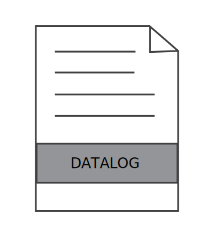

.. index:: Plugins; datalog
.. index:: datalog

=======
datalog
=======

Plugin zum Auslagern der Itemdaten in Dateien auf dem Dateisystem. Es kann verwendet werden,
um verschiedene Logs und Protokollmuster zu konfigurieren und diese den
Items zuzuweisen.

.. important::

    Die Funktionalität des Plugins ist auch über entsprechende Konfiguration der
    ``etc/logging.yaml`` Datei sowie durch Nutzen des ``log_change`` Itemattributs abbildbar.

Ersatz durch Bordmittel
=======================

Details zum Loghandler sind unter :doc:`Logging Handler </referenz/logging/logging_handler>`
zu finden. Informationen zum Loggen bei Itemänderungen findet man unter
:doc:`log_change </referenz/items/standard_attribute/log_change>`.

Es können beim Nutzen des ``DateTimeRotatingFileHandler`` wie beim datalog Plugin Platzhalter zur Benennung der Dateien genutzt werden: {year}, {month}, {day}, {hour}, {stamp}.

Beispiel
--------

Das Logging wird in der Datei ``etc/logging.yaml`` wie folgt konfiguriert.

.. code-block:: yaml

    # etc/logging.yaml
    formatters:
        datalog:
            format: '%(message)s'

    handlers:
        csv:
            (): lib.log.DateTimeRotatingFileHandler
            formatter: datalog
            filename: ./var/log/data-{year}-{month:02}-{day:02}.csv
            encoding: utf8

        txt:
            (): lib.log.ShngTimedRotatingFileHandler
            formatter: datalog
            filename: ./var/log/datalog.txt
            encoding: utf8

    loggers:
        items.log_multi:
            handlers: [csv, txt]
        items.log_csv:
            handlers: [csv]
        items.log_txt:
            handlers: [txt]

Nun können mehrere Items über die entsprechenden Attribute in das jeweilige Log schreiben.
Dank ``cycle`` und ``enforce_change`` Attribute ist auch ein regelmäßiges Schreiben möglich.

.. code-block:: yaml

    #items/item.yaml
    some:
        item1:
            type: str
            log_change: log_csv
            log_text: '{time};{id};{value}'
        item2:
            type: num
            log_change: log_multi
            log_text: '{id} is {value}'
        item3:
            type: num
            log_change: log_txt
            cycle: 30
            enforce_change: true

Konfiguration
=============

.. important::

      Detaillierte Informationen zur Konfiguration des Plugins sind unter :doc:`/plugins_doc/config/datalog` zu finden.

plugin.yaml
-----------

.. code-block:: yaml

   datalog:
       plugin_name: datalog
   #    path: var/log/data
   #    filepatterns:
   #      - default:{log}-{year}-{month}-{day}.csv
   #      - yearly:{log}-{year}.csv
   #    logpatterns:
   #      - csv:{time};{item};{value}\n
   #    cycle: 300

Dies wird die Protokolle ``default`` und ``yearly`` einrichten, die das
konfigurierte Muster verwenden, um den Zieldateinamen (Schlüssel-Wert-Paare) zu erstellen. Das
``default`` Protokoll wird automatisch konfiguriert, wenn keine Dateimuster angegeben werden.

Zusätzlich werden die Muster, die verwendet werden sollen, um die Daten in die Dateien zu protokollieren, ebenfalls dort konfiguriert. Die Schlüssel-Wert-Paare spezifizieren die Dateierweiterung
und das zu verwendende Log-Muster. In diesem Beispiel werden alle Logdateien
mit der Endung ``.csv`` unter Verwendung des konfigurierten Musters protokolliert. Das obere Beispiel ist
auch die Standardvorgabe, wenn in der Konfiguration keine Log-Muster angegeben werden.

Beide Einstellungen können einige Platzhalter verwenden (siehe unten).

Der Parameter path kann verwendet werden, um in einem anderen Pfad als dem
Standardpfad zu protokollieren, und der Parameter cycle definiert das Intervall, in dem
die Daten in die Logdateien zu übertragen sind. Der Standardwert ist 300 Sekunden.

Platzhalter, die beim Attribut ``logpatterns`` verwendet werden können:

-  ``time``: String der aktuellen Uhrzeit im Format HH:MM:SS
-  ``stamp``: UNIX Zeitstempel der aktuellen Zeit
-  ``item``: die Item-ID
-  ``value``: der Wert des Items

items.yaml
----------

.. code-block:: yaml

   some:
       item1:
           type: str
           datalog: default
       item2:
           type: num
           datalog:
             - default
             - custom
       item3:
           type: num
           datalog: custom

Sobald sich item1 ändert, wird ein Eintrag in das default Log geschrieben. Beim Ändern
von item2, werden Einträge in das default und custom Log geschrieben und beim item3 in das custom Log.

Web Interface
=============

Das Plugin beinhaltet kein Web Interface.
