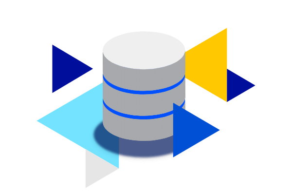

.. index:: Plugins; db_addon (Datenbank Unterstützung)
.. index:: db_addon

========
db_addon
========

Das Plugin bietet eine Funktionserweiterung zum Database Plugin und ermöglicht die einfache Auswertung von Messdaten.
Basierend auf den Daten in der Datenbank können bspw. Auswertungen zu Verbrauch (heute, gestern, ...) oder zu Minimal-
und Maximalwerten gefahren werden.
Diese Auswertungen werden zyklisch zum Tageswechsel, Wochenwechsel, Monatswechsel oder Jahreswechsel, in Abhängigkeit
der Funktion erzeugt.
Um die Zugriffe auf die Datenbank zu minimieren, werden diverse Daten zwischengespeichert.

Die Items mit einem DatabaseAddon-Attribut müssen im gleichen Pfad sein, wie das Item, für das das Database Attribut
konfiguriert ist.
Bedeutet: Die Items mit dem DatabaseAddon-Attribute müssen Kinder oder Kindeskinder oder Kindeskinderkinder des Items
sein, für das das Database Attribut konfiguriert ist

Bsp:

.. code-block:: yaml

    temperatur:
        type: bool
        database: yes

        auswertung:
            type: foo

            heute_min:
                type: num
                db_addon_fct: heute_min

            gestern_max:
                type: num
                db_addon_fct: heute_minus1_max

|

Anforderungen
=============

Es muss das Database Plugin konfiguriert und aktiv sein. In den Plugin Parametern ist der Name der Konfiguration des
Database-Plugins anzugeben. Damit ist auch eine etwaig definierte Instanz des Database-Plugins definiert.
Die Konfiguration des DatabaseAddon-Plugin erfolgt automatisch bei Start.

Hinweis: Das Plugin selbst ist aktuell nicht multi-instance fähig. Das bedeutet, dass das Plugin aktuell nur eine Instanz
des Database-Plugin abgebunden werden kann.

|

Konfiguration
=============

Diese Plugin Parameter und die Informationen zur Item-spezifischen Konfiguration des Plugins sind
unter :doc:`/plugins_doc/config/db_addon` beschrieben.

mysql Datenbank
---------------

Bei Verwendung von mysql sollten einige Variablen der Datenbank angepasst werden, so dass die komplexeren Anfragen
ohne Fehler bearbeitet werden.

Dazu folgenden Block am Ende der Datei */etc/mysql/my.cnf* einfügen bzw den existierenden ergänzen.

.. code-block:: bash

    [mysqld]
    connect_timeout = 60
    net_read_timeout = 60
    wait_timeout = 28800
    interactive_timeout = 28800

|

Hinweise
========

 - Das Plugin startet die Berechnungen der Werte nach einer gewissen (konfigurierbaren) Zeit (Attribut `startup_run_delay`) nach dem Start von shNG, um den Startvorgang nicht zu beeinflussen.
 - Bei Start werden automatisch nur die Items berechnet, für das das Attribute `db_addon_startup` gesetzt wurde. Alle anderen Items werden erst zu konfigurierten Zeit berechnet. Über das WebIF kann die Berechnung aller definierten Items ausgelöst werden.
 - Für sogenannte `on_change` Items, also Items, deren Berechnung bis zum Jetzt (bspw. verbrauch-heute) gehen, wird die Berechnung immer bei eintreffen eines neuen Wertes gestartet. Zu Reduktion der Belastung auf die Datenbank werden die Werte für das Ende der letzten Periode gecached.
 - Berechnungen werden nur ausgeführt, wenn für den kompletten abgefragten Zeitraum Werte in der Datenbank vorliegen. Wird bspw. der Verbrauch des letzten Monats abgefragt wobei erst Werte ab dem 3. des Monats in der Datenbank sind, wird die Berechnung abgebrochen.
   Mit dem Attribut `use_oldest_entry` kann dieses Verhalten verändert werden. Ist das Attribut gesetzt, wird, wenn für den Beginn der Abfragezeitraums keinen Werte vorliegen, der älteste Eintrag der Datenbank genutzt.
 - Für die Auswertung kann es nützlich sein, bestimmte Werte aus der Datenbank bei der Berechnung auszublenden. Hierfür stehen 2 Möglichkeiten zur Verfügung:
    - Plugin-Attribut `ignore_0`: (list of strings) Bei Items, bei denen ein String aus der Liste im Pfadnamen vorkommt, werden 0-Werte (val_num = 0) bei Datenbankauswertungen ignoriert. Hat also das Attribut den Wert ['temp'] werden bei allen Items mit 'temp' im Pfadnamen die 0-Werte bei der Auswertung ignoriert.
    - Item-Attribut `db_addon_ignore_value`: (num) Dieser Wert wird bei der Abfrage bzw. Auswertung der Datenbank für diese Item ignoriert.
 - Das Plugin enthält sehr ausführliche Logginginformation. Bei unerwartetem Verhalten, den LogLevel entsprechend anpassen, um mehr information zu erhalten.
 - Berechnungen des Plugins können im WebIF unterbrochen werden. Auch das gesamte Plugin kann pausiert werden. Dies kann be starker Systembelastung nützlich sein.

|

Beispiele
=========

Verbrauch
---------

Soll bspw. der Verbrauch von Wasser ausgewertet werden, so ist dies wie folgt möglich:

.. code-block:: yaml

    wasserzaehler:
        zaehlerstand:
            type: num
            knx_dpt: 12
            knx_cache: 5/3/4
            eval: round(value/1000, 1)
            database: init
            struct:
                  - db_addon.verbrauch_1
                  - db_addon.verbrauch_2
                  - db_addon.zaehlerstand_1

Die Werte des Wasserzählerstandes werden in die Datenbank geschrieben und darauf basierend ausgewertet. Die structs
'db_addon.verbrauch_1' und 'db_addon.verbrauch_2' stellen entsprechende Items für die Verbrauchsauswerten zur Verfügung.

minmax
------

Soll bspw. die minimalen und maximalen Temperaturen ausgewertet werden, kann dies so umgesetzt werden:

.. code-block:: yaml

    temperature:
        aussen:
            nord:
                name: Außentemp Nordseite
                type: num
                visu_acl: ro
                knx_dpt: 9
                knx_cache: 6/5/1
                database: init
                struct:
                  - db_addon.minmax_1
                  - db_addon.minmax_2

Die Temperaturwerte werden in die Datenbank geschrieben und darauf basierend ausgewertet. Die structs
'db_addon.minmax_1' und 'db_addon.minmax_2' stellen entsprechende Items für die min/max Auswertung zur Verfügung.

|

Web Interface
=============

Das WebIF stellt neben der Ansicht verbundener Items und deren Parameter und Werte auch Funktionen für die
Administration des Plugins bereit.

Es stehen Button für:

- Neuberechnung aller Items
- Abbruch eines aktiven Berechnungslaufes
- Pausieren des Plugins
- Wiederaufnahme des Plugins

bereit.

Achtung: Das Auslösen einer kompletten Neuberechnung aller Items kann zu einer starken Belastung der Datenbank
aufgrund vieler Leseanfragen führen.

db_addon Items
--------------

Dieser Reiter des Webinterface zeigt die Items an, für die ein DatabaseAddon Attribut konfiguriert ist.

db_addon Maintenance
--------------------

Das Webinterface zeigt detaillierte Informationen über die im Plugin verfügbaren Daten an.
Dies dient der Maintenance bzw. Fehlersuche. Dieser Tab ist nur bei Log-Level "Debug" verfügbar.
