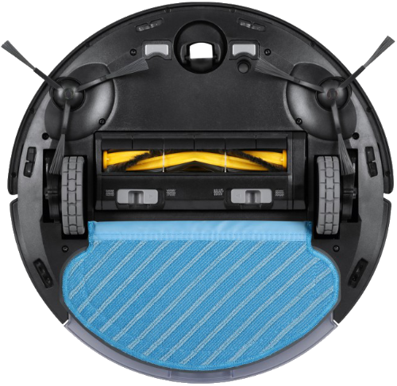

.. index:: Plugins; deebot_ozmo
.. index:: deebot_ozmo

===========
deebot_ozmo
===========

Das Plugin steuert und überwacht einen Ecovacs Deebot Ozmo Saugroboter (920 / 950 / 960).

Voraussetzungen
================

Für den Betrieb wird ein Ecovacs-Konto benötigt (Zugangsdaten für die Parameter **account** und
**password**). Getestet wurde das Plugin mit einem Deebot Ozmo 950; laut Autor der zugrunde
liegenden Bibliothek sollte es auch mit den Modellen 920 und 960 funktionieren.

Konfiguration
=============

Die Informationen zur Konfiguration des Plugins sind unter :doc:`/plugins_doc/config/deebot_ozmo`
beschrieben.

Beispiele
=========

Um alle verfügbaren Items einzubinden, lassen sich sämtliche Item-Structs des Plugins in der
eigenen ``items.yaml`` referenzieren::

    deebot:
        general:
            struct: deebot_ozmo.general
        settings:
            struct: deebot_ozmo.settings
        components:
            struct: deebot_ozmo.components
        maps:
            struct: deebot_ozmo.maps
        history:
            struct: deebot_ozmo.history
        controls:
            struct: deebot_ozmo.controls

Web Interface
=============

Der Tab **Properties** zeigt Modell, Akkustand, Name sowie den Verschleißstatus von Bürste,
Seitenbürsten und Filter; außerdem lassen sich hier Saugstärke (**fan_speed**) und Wassermenge
(**water_level**) einstellen und über die Raumliste gezielt einzelne Räume reinigen.

Über die Schaltflächen oberhalb der Tabs kann die Reinigung gestartet, pausiert bzw. fortgesetzt,
zur Ladestation zurückgeschickt werden, oder es kann der Standort des Roboters angezeigt werden
(**locate**).

Der Tab **Live map** zeigt die aktuelle Karte während der Reinigung.

Der Tab **Cleaning log** listet vergangene Reinigungen mit Datum, Uhrzeit, Typ und Vorschaubild.

Der Tab **Items** zeigt alle vom Plugin genutzten Items mit aktuellem Wert.

Die Steuerfunktionen des Roboters (**clean()**, **clean_spot_area()**, **pause()**, **resume()**,
**charge()**, **locate()**, **set_fan_speed()**, **set_water_level()**) lassen sich auch direkt aus
Logiken heraus aufrufen (Instanzname entsprechend der eigenen Konfiguration, z.B.
``sh.deebot_ozmo.clean()``) und sind mit ihren Parametern unter
:doc:`/plugins_doc/config/deebot_ozmo` beschrieben.
