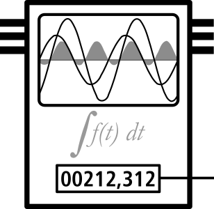
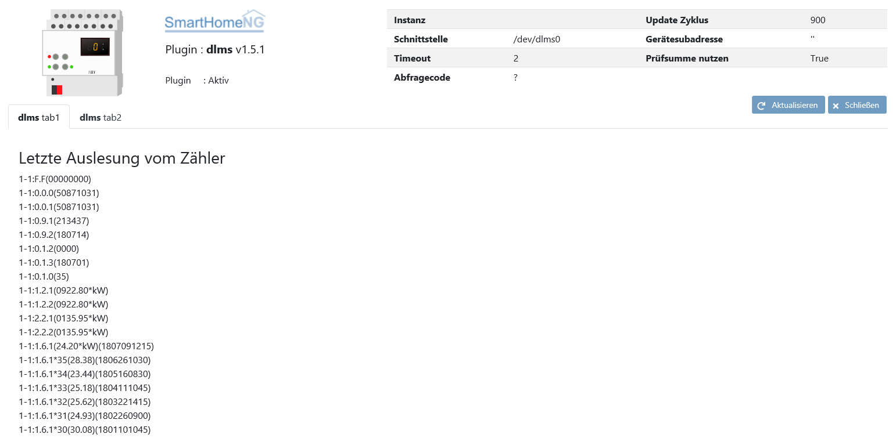
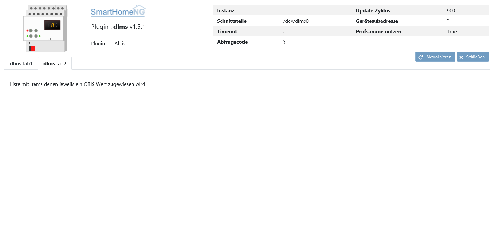

.. index:: Plugins; dlms (Auslesen von Smartmetern via DLMS)
.. index:: dlms

====
dlms
====

Das Plugin dient zum Auslesen von Smartmetern die das DLMS Protokoll beherrschen.

Anforderungen
=============

- Smartmeter mit DLMS-Protokoll (Device Language Message Specification) gemäß IEC 62056-21
- USB-Schnittstelle mit IR Lesekopf (z.B. von `volkszaehler.org <http://www.volkszaehler.org>`_ )

Das Python Modul Pyserial wird benötigt. Die Installation ab SmartHomeNG 1.8 erfolgt automatisch
über den Inhalt der mitgelieferten Datei ``requirements.txt`` oder manuell auf der Konsole mit

.. code:: bash

   python3 -m pip install pyserial --user

Es muß sichergestellt sein, das der Benutzer der SmartHomeNG ausführt auch die Brechtigung hat
den seriellen Port zu verwenden. Möglicherweise muß eine udev-Regel erstellt werden.

Ein Beispiel für eine aktuelle Version des Volkszaehler IR-Lesekopfes bei der jeweils
Vendor- und Product-ID für den eigenen Lesekopf angepaßt werden müssen:

.. code:: bash

   echo 'SUBSYSTEM=="tty", ATTRS{idVendor}=="10c4", ATTRS{idProduct}=="ea60", ATTRS{serial}=="0092C9FE", MODE="0666", GROUP="dialout" , SYMLINK+="dlms0"' > /etc/udev/rules.d/11-dlms.rules
   udevadm-Trigger

Der Symlink erstellt dabei einen passenden Namen der Schnittstelle der natürlich den eigenen Anforderungen angepasst werden kann.

Unterstützte Hardware
======================

- Smart Meter mit DLMS (Device Language Message Specification) IEC 62056-21
- Landis & Gyr ZMD120
- Landis & Gyr E350
- Landis & Gyr ZMD310CT
- Elster AS 1440
- Elster AS 3000
- Pafal 12EC3g
- itron ACE3000

Nicht unterstütze Hardware
=============================

Die folgenden Smartmeter werden **nicht unterstützt**, da sie das SML Protokoll unterstützen, nicht aber DLMS:

- Landis & Gyr E220
- Easymeter Q3BA1022	SML
- Easymeter Q3MA3120	SML
- EMH ED300L
- Hager 363W5
- Hager EHZ363WA
- Holley DTZ541  (Achtung: Implementierung von SML in einigen Modellen fehlerbehaftet)
- Iskra MT681

Konfiguration
=============

Die Informationen zur Konfiguration des Plugins sind unter :doc:`/plugins_doc/config/dlms` beschrieben.

Beispiele für die plugin.yaml
------------------------------

.. code:: yaml

   dlms:
       class_name: DLMS
       class_path: plugins.dlms
       serialport: /dev/dlms0
       update_cycle: 900

Im ersten Beispiel wird das Plugin alle 900 Sekunden also alle 15 Minuten den Smartmeter abfragen.
Da cycle nicht zu einem bestimmten Zeitpunkt aufgerufen wird sondern der Abstand zwischen den Abfragen
nur entsprechend lang ist, ist auch der Zeitpunkt der Daten recht variabel.

Alternativ dazu lässt sich ein crontab für die Abfrage definieren um zu genauen Zeitpunkten eine Zählerauswertung zu haben.
Im nachfolgenden Beispiel wird alle 60 Sekunden eine Zählerabfrage gestartet. Dabei muß die Abfragedauer und Systemauslastung
berücksichtigt werden sowie die Notwendigkeit von kurzen Abfragezyklen.

.. code:: yaml

   dlms:
      plugin_name: dlms
      serialport: /dev/dlms0
      update_crontab: 0 * * * * *

Einrichtungsverfahren:
----------------------

Das Plugin kann im **Standalone-Modus** mit einer Shell aus dem Plugin
Verzeichnis z.B. **/usr/local/smarthome/plugins/dlms** gestartet werden mit ``python3
dlms.py <serieller Port>``
Eine Hilfe zu verfügbaren Parametern wird mit ``python3 dlms.py -h`` angezeigt.

Wichtig ist es zunächst zu wissen ob ein Smartmeter nur auf Anforderung Daten sendet
oder von sich aus Daten sendet ohne einen Anstoss zu benötigen.

Sendet ein Smartmeter von sich aus, so gibt dessen Bedienungsanleitung Auskunft mit welcher
Geschwindigkeit die Schnittstelle betrieben werden kann. Im folgenden wird die Kommunikation
mit einem Easymeter der Q3D Serie abgefragt der keine Checksumme der Daten unterstützt,
und ohne Aufforderung mit 9600 Baud sendet:

``python3 dlms.py <serieller Port> -c -l -s 9600``

Das Ergebnis der Auslesung wird auf der Konsole ausgegeben, siehe Codebeispiele A und B.
Aus den aufgelisten Obis Codes lassen sich die Einstellungen
für die Itemdefinition ableiten.

Die gewählten Parameter für den Standalone Modus finden sich in den Einstellungen für die ``plugin.yaml``
von SmartHomeNG wieder. Alternativ kann die Einstellung auch über das Admin Interface vorgenommen werden.

Einige Hintergrundinformationen zu OBIS-Codes
=============================================

OBIS-Codes sind eine Kombination aus sechs Wertgruppen die die genaue Bedeutung jedes Datenelements beschreiben:

Eine einzelne **Zeile** kann so aussehen:

.. code:: text

   A-B:C.D.E*F(Wert*Einheit)(anderer Wert)

Die Wertegruppen **A** und **B** sind optional, ebenso **E** und **F**.
Der zweite Wert kann weggelassen werden, ebenso die Einheit des ersten Wertes.
Jede Smartmeter-Anzeige sieht anders aus.
Eine direkte Vorschrift wie die Werte zu interpretieren sind gibt es nicht.
In jeder Smartmeter Spezifikation wird beschrieben welche Werte geliefert werden und welche
Wertegruppen belegt sind. Allerdings sind die Zeile sehr ähnlich von Smartmeter und daher kann
leicht geraten werden welche Wertezusammensetzung wie zu interpretieren ist.

A
--

Grundlegende Eigenschaft des Datenelements (abstrakte Daten, Strom-, Gas-, Wärme-, wasserbezogene Daten)

- **0** Abstrakte Objekte
- **1** Objekte mit Bezug auf Elektrizität

B
--
**Kanalnummer**, d.h. die Nummer des Eingangs einer Messung Geräte mit mehreren Eingängen
zur Messung der Energie von gleiche oder unterschiedliche Typen (z.B. in Datenkonzentratoren, Registrierungseinheiten).
Daten von verschiedene Quellen können somit identifiziert werden. Die Definitionen für
diese Wertegruppe ist unabhängig aus der Wertegruppe A.

C
--
abstrakte oder physische Datenelemente bezogen auf die Informationsquelle
betroffen, z.B. Strom, Spannung, Leistung, Lautstärke, Temperatur.
Die Definitionen hängen vom Wert der Wertegruppe A ab.
Vermessung, Tarifabwicklung und Datenspeicherungsmethoden dieser Mengen werden durch den Wert definiert
Gruppen D, E und F Für abstrakte Daten, die hierarchische Struktur der 6 Codefelder ist nicht zutreffend.

D
--

Typen oder das Ergebnis der Verarbeitung physikalischer Größen
identifiziert mit den Wertegruppen A und C, nach verschiedenen speziellen Algorithmen.
Die Algorithmen können Energie liefern und Bedarfsmengen sowie andere physikalische Größen.

E
--

Weiterverarbeitung der Messung Ergebnisse identifiziert mit Wert Gruppen A bis D zum Tarif
registriert, nach dem Tarif(e) im Einsatz. Für abstrakte Daten oder für Messergebnisse
für die Tarife nicht relevant, diese Wertegruppe kann zur weiteren Klassifizierung verwendet.

F
--

die Speicherung von Daten, identifiziert nach Wertegruppen A bis E,
zu unterschiedlichen Abrechnungszeiträumen.
Wo dies nicht relevant ist, kann diese Wertegruppe für weitere Klassifizierung verwendet werden.

Im folgenden zwei Beispiele um eine Vorstellung von den Unterschieden zu bekommen:

OBIS-Codebeispiel A
~~~~~~~~~~~~~~~~~~~

Einige erste Zeilen einer beispielhaften OBIS-Code-Auslesung für einen **Landis & Gyr ZMD
310** Smartmeter für industrielle Zwecke

.. code:: text

   1-1:F.F(00000000)
   1-1:0.0.0(50871031)
   1-1:0.0.1(50871031)
   1-1:0.9.1(155420)
   1-1:0.9.2(170214)
   1-1:0.1.2(0000)
   1-1:0.1.3(170201)
   1-1:0.1.0(18)
   1-1:1.2.1(0451.17*kW)
   1-1:1.2.2(0451.17*kW)
   1-1:2.2.1(0060.24*kW)
   1-1:2.2.2(0060.24*kW)
   1-1:1.6.1(27.19*kW)(1702090945)
   1-1:1.6.1*18(28.74)(1701121445)
   1-1:1.6.1*17(28.95)(1612081030)
   1-1:1.6.1*16(25.82)(1611291230)
   1-1:1.8.0(00051206*kWh)
   1-1:1.8.0*18(00049555)
   1-1:1.8.0*17(00045862)
   ...

OBIS-Codebeispiel B
~~~~~~~~~~~~~~~~~~~

Beispiel für das Auslesen eines OBIS-Codes von einem relativ einfachen **Pafal 12EC3g**
Smartmeter:

.. code:: text

   0.0.0(72044837)(72044837)
   0.0.1(PAF)(PAF)
   F.F(00)(00)
   0.2.0(1.29)(1.29)
   1.8.0*00(000783.16)(000783.16)
   2.8.0*00(000045.38)(000045.38)
   C.2.1(000000000000)(                                                )(000000000000)(                                                )
   0.2.2(:::::G11)!(:::::G11)(!)

Web Interface
=============

Das dlms Plugin verfügt über ein Webinterface, mit dessen Hilfe die Items die das Plugin nutzen
übersichtlich dargestellt werden.

.. important::

   Das Webinterface des Plugins kann mit SmartHomeNG v1.4.2 und davor **nicht** genutzt werden.
   Es wird dann nicht geladen. Diese Einschränkung gilt nur für das Webinterface. Ansonsten gilt
   für das Plugin die in den Metadaten angegebene minimale SmartHomeNG Version.

Werte aus den Codezeilen ermitteln
----------------------------------

Im Vergleich der Beispiele wird offensichtlich das der grundsätzlich gleiche OBIS Code leicht
unterschiedlich erscheint:

+-------------------------+--------------------------------+
| Beispiel A              | Beispiel B                     |
+=========================+================================+
| 1-1:F.F(00000000)       | F.F(00)(00)                    |
+-------------------------+--------------------------------+
| 1-1:1.8.0(00051206*kWh) | 1.8.0*00(000783.16)(000783.16) |
+-------------------------+--------------------------------+

Um den Wert von ``1-1:1.8.0(00051206*kWh)`` in ein Item zu bekommen, bekommt das Item folgende
Attribute:

.. code:: yaml

   zaehler:
      type: num
      dlms_obis_code:
         - '1-1:1.8.0'
         - 0
         - 'Value'
         - 'num'

Um den Wert von ``1.8.0*00(000783.16)(000783.16)`` in ein Item zu bekommen, bekommt das Item folgende
Attribute:

.. code:: yaml

   zaehler:
      type: num
      dlms_obis_code:
         - '1.8.0*00'
         - 0
         - 'Value'
         - 'num'

Um die Einheit von ``1-1:1.8.0(00051206*kWh)`` in ein Item zu bekommen, bekommt das Item folgende Attribute:

.. code:: yaml

   zaehler_unit:
      type: str
      dlms_obis_code:
         - '1-1:1.8.0'
         - 0
         - 'Unit'
         - 'str'

Eine Beispielhafte **item.yaml** für die OBIS Codes aus **Beispiel A** könnte wie folgt aussehen:

.. code:: yaml

   Stromzaehler:
       Auslesung:
           type: str
           dlms_obis_readout: yes
       Seriennummer:
           type: str
           dlms_obis_code:
               - '1-1:0.0.0
               - 0
               - 'Value'
               - 'str'

       Ablesung:
           # Datum und Uhrzeit der letzten Ablesung
           Uhrzeit:
               type: foo
               dlms_obis_code:
                 - '1-1:0.9.1'
                 - 0
                 - 'Value'
                 - 'Z6'
           Datum:
               type: foo
               dlms_obis_code:
                 - '1-1:0.9.2'
                 - 0
                 - 'Value'
                 - 'D6'
           Datum_Aktueller_Abrechnungsmonat:
               type: foo
               dlms_obis_code:
                 - '1-1:0.1.3'
                 - 0
                 - 'Value'
                 - 'D6'
           Monatszaehler:
               # Billing period counter
               type: num
               dlms_obis_code:
                 - '1-1:0.1.0'
                 - 0
                 - 'Value'
                 - 'num'

       Bezug:
           Energie:
               type: num
               sqlite: yes
               dlms_obis_code:
                 - '1-1:1.8.1'
                 - 0
                 - 'Value'
                 - 'num'

           Energie_Einheit:
               type: str
               sqlite: yes
               dlms_obis_code:
                 - '1-1:1.8.1'
                 - 0
                 - 'Unit'
                 - 'str'

       Lieferung:
           Energie:
               type: num
               sqlite: yes
               dlms_obis_code:
                 - '1-1:2.8.1'
                 - 0
                 - 'Value'
                 - 'num'

           Energie_Einheit:
               type: str
               sqlite: yes
               dlms_obis_code:
                 - '1-1:2.8.1'
                 - 0
                 - 'Unit'
                 - 'str'

Die Syntax für das Item Attribut **dlms_obis_code** ist wie folgt:

.. code:: yaml

   my_item:
      dlms_obis_code:
         - 1-1:1.6.2*01
         - Index
         - 'Value' or 'Unit'
         - Value Type

dabei ist

-  **Index** die Nummer der Wertegruppe die gelesen werden soll
-  **Value** oder **Unit** je nachdem ob der Wert (meistens) oder die Einheit (z.B. 'kWh' zugewiesen werden soll
-  **Value Type** die Beschreibung des Wertetyps um damit die Konvertierung für das Item vorzunehmen

   -  **Z6** (Zeit codiert mit hhmmss),
   -  **Z4** (Zeit codiert mit hhmm),
   -  **D6** (Datum codiert mit YYMMDD),
   -  **ZST10** (Datum und zeit codiert mit YYMMDDhhmm),
   -  **ZST12** (Datum und zeit codiert mit YYMMDDhhmmss),
   -  **str** eine Zeichenkette
   -  **float** eine Fließkommazahl
   -  **int** eine ganze Zahl
   -  **num** eine beliebige Zahl

Für einen Wertetyp mit ``time`` oder ``date`` wird für das Item ein Python datetime erstellt.
Das impliziert, das das Item einen Typ ``foo`` in der Definition in der entsprechenden item.yaml bekommt.

Aufruf des Webinterfaces
------------------------

Das Plugin kann aus dem backend aufgerufen werden. Dazu auf der Seite Plugins in der entsprechenden
Zeile das Icon in der Spalte **Web Interface** anklicken.

Außerdem kann das Webinterface direkt über ``http://smarthome.local:8383/dlms`` bzw.
``http://smarthome.local:8383/dlms_<Instanz>`` aufgerufen werden.

Beispiele
---------

Folgende Informationen können im Webinterface angezeigt werden:

Oben rechts werden allgemeine Parameter zum Plugin angezeigt.

Im ersten Tab wird das Ergebnis der letzten Auslesung angezeigt:

Im zweiten Tab werden items aufgelistet, die mit Informationen aus der letzten Auslesung befüllt werden:

