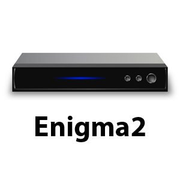

.. index:: Plugins; enigma2
.. index:: enigma2

=======
enigma2
=======

Das Plugin steuert Enigma2-basierte Sat-Receiver (z.B. VU+ oder Dreambox) und liest Informationen von
ihnen aus. Voraussetzung ist, dass auf dem Receiver das OpenWebIF installiert ist, über das das Plugin
komplett kommuniziert. Das Plugin unterstützt mehrere Receiver gleichzeitig über die Mehrinstanzfähigkeit
von SmartHomeNG.

Voraussetzungen
================

Das Plugin benötigt das Python-Modul **requests**. Ab SmartHomeNG 1.8 wird es automatisch anhand der
mitgelieferten Datei ``requirements.txt`` installiert, alternativ manuell mit::

    sudo pip3 install requests --upgrade

Getestet ist das Plugin mit VU+ Solo2, VU+ Solo4K sowie Dreambox 8000 und 7020HD.

Konfiguration
=============

Die Informationen zur Konfiguration des Plugins sind unter :doc:`/plugins_doc/config/enigma2`
beschrieben.

Da das Plugin mehrinstanzfähig ist, werden die Item-Attribute des Plugins mit dem Instanznamen als
Suffix angegeben, z.B. **enigma2_data_type@vusolo2**.

Item-Attribute
===============

enigma2_data_type
------------------

Legt fest, welcher Wert vom Receiver gelesen wird. Für die meisten Werte entspricht **enigma2_data_type**
dem Namen des XML-Feldes, das die entsprechende OpenWebIF-Seite liefert (z.B. **e2model**, **e2ip**,
**e2capacity**). Daneben gibt es einige feste Werte, die eigene Abfragen auslösen:

- **current_volume** - aktuelle Lautstärke, kann auch geschrieben werden.
- **current_eventtitle**, **current_eventdescription**, **current_eventdescriptionextended** - Titel
  bzw. Beschreibung der aktuell laufenden Sendung.
- **e2servicename**, **e2servicereference** - Name bzw. Referenz des aktuell eingestellten Senders;
  **e2servicereference** kann auch geschrieben werden, um den Sender zu wechseln.

enigma2_page
------------

Notwendig, wenn der in **enigma2_data_type** angegebene Wert von einer der folgenden OpenWebIF-Seiten
gelesen werden muss: ``about``, ``powerstate``, ``subservices`` oder ``deviceinfo``. Ohne dieses Attribut
fragt das Plugin den aktuellen Gerätestatus ab.

enigma2_remote_command_id
--------------------------

Numerischer OpenWebIF-Fernbedienungscode. Wird das Item auf ``True`` gesetzt, sendet das Plugin den
entsprechenden Tastendruck an den Receiver.

sref
----

Service-Referenz eines Senders. Wird das Item auf ``True`` gesetzt, schaltet das Plugin den Receiver auf
diesen Sender.

Beispiele
=========

Geräteinformationen von der Seite ``deviceinfo`` lesen::

    disc_model:
        type: str
        enigma2_data_type@vusolo2: e2hdd/e2model
        enigma2_page@vusolo2: deviceinfo
        visu_acl: ro

Aktuelle Lautstärke lesen und setzen (keine Angabe von **enigma2_page** notwendig)::

    currentvolume:
        type: num
        enigma2_data_type@vusolo2: current_volume
        visu_acl: rw

Fernbedienungstaste simulieren::

    RED:
        type: bool
        visu_acl: rw
        enigma2_remote_command_id@vusolo2: 399
        enforce_updates: 'true'

Sender per Service-Referenz umschalten::

    DasErste_HD:
        type: bool
        sref@vusolo2: '1:0:19:283D:3FB:1:C00000:0:0:0:'
        enforce_updates: 'true'
        visu_acl: rw

Web Interface
=============

Das enigma2 Plugin verfügt über ein Webinterface mit drei Tabs. Im Kopfbereich werden Cycle, Fast
Cycle sowie Host, Port, Benutzername und Passwort der Instanz angezeigt.

Aufruf des Webinterfaces
-------------------------

Das Plugin kann aus der Admin GUI (von der Seite Plugins/Plugin Liste aus) aufgerufen werden. Dazu auf
der Seite in der entsprechenden Zeile das Icon in der Spalte **Web Interface** anklicken.

Außerdem kann das Webinterface direkt über ``http://smarthome.local:8383/enigma2_<Instanz>`` aufgerufen
werden.

Enigma2 Items
-------------

Zeigt alle konfigurierten Items der Instanz getrennt nach Fast Items und regulären Items, jeweils mit
Pfad, Typ, Enigma2 Datentyp, aktuellem Wert sowie Zeitpunkt des letzten Updates und der letzten Änderung.

Remote Command Items
---------------------

Zeigt die Items, die über **enigma2_remote_command_id** oder **sref** eine Fernbedienungstaste bzw.
einen Senderwechsel auslösen, mit Pfad, Typ, aktuellem Wert sowie Zeitpunkt des letzten Updates und der
letzten Änderung.

Plugin-API
----------

Zeigt die öffentlichen Funktionen des Plugins (siehe :doc:`/plugins_doc/config/enigma2`).
