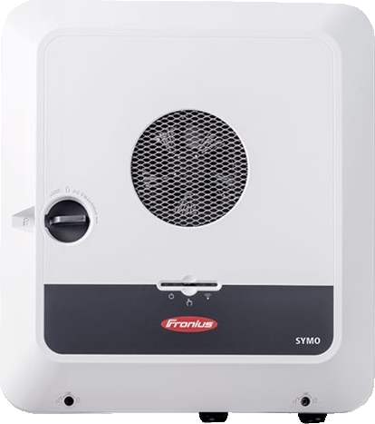

.. index:: Plugins; fronius
.. index:: fronius

=======
fronius
=======

Unterstützte Geräte
===================

Fronius Symo GEN24

Konfiguration
=============

Die Pluginparameter und die Informationen zur Item-spezifischen Konfiguration des Plugins sind
unter :doc:`/plugins_doc/config/fronius` beschrieben.

Web Interface
=============

Das Plugin stellt ein WebIF zur Verfügung, in dem alle mit dem Plugin verknüpften Items gelistet sind.
