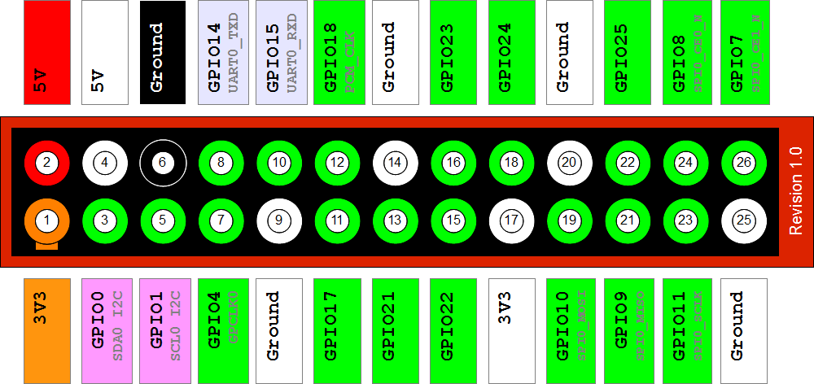
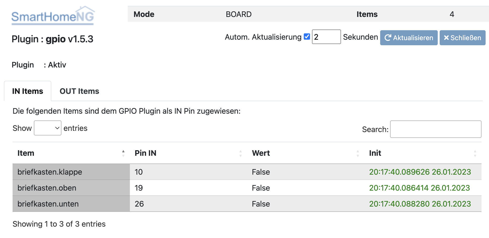

.. index:: Plugins; gpio
.. index:: gpio

====
gpio
====

Konfiguration
=============

Die Informationen zur Konfiguration des Plugins sind unter :doc:`/user/plugins_doc/config/gpio` beschrieben.

Beschreibung
============

GPIO-Unterstützung für den Raspberry Pi. Dieses Plugin unterstützt über das RPi.GPIO-Modul das Einbinden von externen Sensoren und Aktoren, die direkt am Raspberry Pi angeschlossen werden. Damit ist es beispielsweise möglich, den Zustand von Reedkontakten einzulesen oder LEDs zu aktivieren.

Web Interface
=============

Das Plugin Webinterface kann aus dem Admin Interface aufgerufen werden. Dazu auf der Seite Plugins in der entsprechenden
Zeile das Icon in der Spalte **Web Interface** anklicken.

Darunter gibt es für Ein- und Ausgänge je einen Tab mit Informationen zu den Items, die das GPIO Plugin
implementiert haben, den Pin, Wert und die Initialisierungszeit (nur bei IN Pins).

