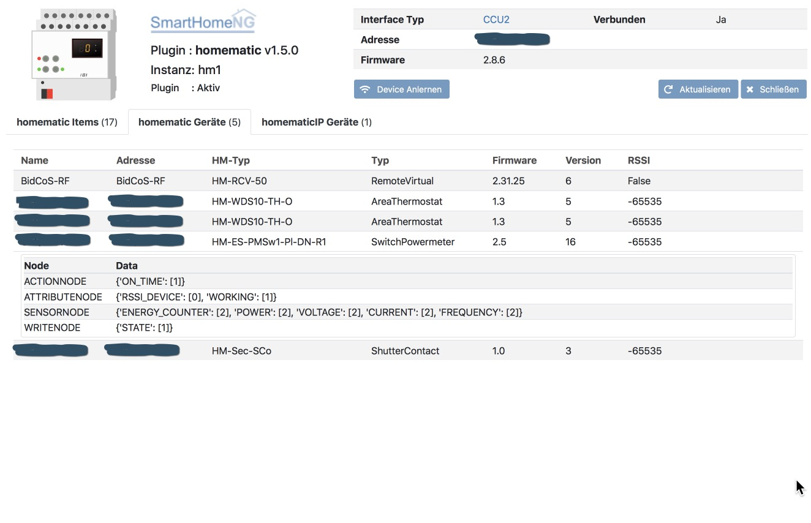

.. index:: Plugins; homematic (HomeMatic Unterstützung)
.. index:: homematic HomeMaticIP

homematic
#########

Das Plugin unterstützt HomeMatic und HomeMatic IP Geräte, die an einer HomeMatic CCU2 angelernt sind.
Es wird eine große Zahl von HomeMatic Geräten unterstützt. Wenn ein Gerät nicht unterstützt wird,
hilft evtl. ein einfaches Update des Python Modules **pyhomematic** mit dem folgenden Kommando:

    sudo pip3 install -U pyhomematic
    
    
Die Unterstützung der einzelnen HomeMatic und HomeMatic IP Geräte ist in dem Python Modul implementiert.

Konfiguration
=============

Die Informationen zur Konfiguration des Plugins sind unter :doc:`/plugins_doc/config/homematic` beschrieben.

Web Interface
=============

Das homematic Plugin verfügt über ein Webinterface, mit dessen Hilfe die Items die das Plugin nutzen
übersichtlich dargestellt werden. Außerdem können Informationen zu den Devices angezeigt werden, 
die an der HomeMatic CCU2 angelernt sind. Ein Anlernen neuer Devices wird durch das Webinterface
unterstützt.

.. important:: 

   Das Webinterface des Plugins kann mit SmartHomeNG v1.4.2 und davor **nicht** genutzt werden.
   Es wird dann nicht geladen. Diese Einschränkung gilt nur für das Webinterface. Ansonsten gilt 
   für das Plugin die in den Metadaten angegebene minimale SmartHomeNG Version.

Aufruf des Webinterfaces
------------------------

Das Plugin kann aus dem backend aufgerufen werden. Dazu auf der Seite Plugins in der entsprechenden
Zeile das Icon in der Spalte **Web Interface** anklicken.

Außerdem kann das Webinterface direkt über ``http://smarthome.local:8383/homematic`` bzw. 
``http://smarthome.local:8383/homematic_<Instanz>`` aufgerufen werden.

Beispiele
---------

Folgende Informationen können im Webinterface angezeigt werden:

Oben rechts werden allgemeine Parameter zum Plugin angezeigt. 

Im ersten Tab werden die Items angezeigt, die das homematic Plugin nutzen. Falls Items so
definiert sind, dass sie nicht zu den in der HomeMatic CCU2 angelernten Devices passen, wird
ein entsprechender Fehler angezeigt:

.. image:: assets/webif1.jpg

Im zweiten Tab werden Devices angezeigt, die an der HomeMatic CCU2 angelernt sind:

.. image:: assets/webif2.jpg

Durch anklicken der Zeilen mit den Devices, die an der HomeMatic CCU2 angelernt sind, können
weitere Details zu den Devices angezeigt werden

Auf dem dritten Reiter werden Informationen zu HomeMatic IP Geräten angezeigt, die an der CCU2
angelernt sind.

.. hint:: 

   HomeMatic IP Geräte müssen direkt an der CCU2 angelernt werden. Ein Anlernen über das Web Interface
   des SmartHomeNG Plugins ist **nicht** möglich.

Unterstützte HomeMatic und HomeMatic IP Geräte
----------------------------------------------

In der Version 0.1.41 von **pyhomematic** werden die folgenden Geräte unterstützt und sollten
mit dem Plugin laufen. (Getestet sind sie natürlich nicht alle):

Actors
~~~~~~

DEVICETYPES = {
    "HM-LC-Bl1-SM": Blind,
    "HM-LC-Bl1-SM-2": Blind,
    "HM-LC-Bl1-FM": Blind,
    "HM-LC-Bl1-FM-2": Blind,
    "HM-LC-Bl1PBU-FM": Blind,
    "HM-LC-Bl1-PB-FM": Blind,
    "HM-LC-Ja1PBU-FM": Blind,
    "ZEL STG RM FEP 230V": Blind,
    "263 146": Blind,
    "263 147": Blind,
    "HM-LC-BlX": Blind,
    "HM-Sec-Win": Blind,
    "HmIP-BROLL": IPKeyBlind,
    "HmIP-BBL": IPKeyBlindTilt,
    "HM-LC-Dim1L-Pl": Dimmer,
    "HM-LC-Dim1L-Pl-2": Dimmer,
    "HM-LC-Dim1L-Pl-3": Dimmer,
    "HM-LC-Dim1L-CV": Dimmer,
    "HM-LC-Dim1L-CV-2": Dimmer,
    "HM-LC-Dim1T-Pl": Dimmer,
    "HM-LC-Dim1T-Pl-2": Dimmer,
    "HM-LC-Dim1T-Pl-3": Dimmer,
    "HM-LC-Dim1T-CV": Dimmer,
    "HM-LC-Dim1T-CV-2": Dimmer,
    "HM-LC-Dim1T-DR": Dimmer,
    "HM-LC-Dim1T-FM": Dimmer,
    "HM-LC-Dim1T-FM-2": Dimmer,
    "HM-LC-Dim1T-FM-LF": Dimmer,
    "HM-LC-Dim1PWM-CV": Dimmer,
    "HM-LC-Dim1PWM-CV-2": Dimmer,
    "HM-LC-Dim1TPBU-FM": Dimmer,
    "HM-LC-Dim1TPBU-FM-2": Dimmer,
    "HM-LC-Dim2L-CV": Dimmer,
    "HM-LC-Dim2L-SM": Dimmer,
    "HM-LC-Dim2L-SM-2": Dimmer,
    "HM-LC-Dim2T-SM": Dimmer,
    "HM-LC-Dim2T-SM-2": Dimmer,
    "HSS-DX": Dimmer,
    "263 132": Dimmer,
    "263 133": Dimmer,
    "263 134": Dimmer,
    "HM-Dis-TD-T": Switch,
    "HM-OU-CF-Pl": Switch,
    "HM-OU-CM-PCB": Switch,
    "HM-OU-CFM-Pl": Switch,
    "HM-OU-CFM-TW": Switch,
    "HM-LC-Sw1-PCB": Switch,
    "HM-LC-Sw1-Pl": Switch,
    "HM-LC-Sw1-Pl-2": Switch,
    "HM-LC-Sw1-Pl-3": Switch,
    "HM-LC-Sw1-Pl-DN-R1": Switch,
    "HM-LC-Sw1-Pl-DN-R2": Switch,
    "HM-LC-Sw1-Pl-DN-R3": Switch,
    "HM-LC-Sw1-Pl-DN-R4": Switch,
    "HM-LC-Sw1-Pl-DN-R5": Switch,
    "HM-LC-Sw1-Pl-CT-R1": Switch,
    "HM-LC-Sw1-Pl-CT-R2": Switch,
    "HM-LC-Sw1-Pl-CT-R3": Switch,
    "HM-LC-Sw1-Pl-CT-R4": Switch,
    "HM-LC-Sw1-Pl-CT-R5": Switch,
    "HM-LC-Sw1-Pl-OM54": Switch,
    "HM-LC-Sw1-DR": Switch,
    "HM-LC-Sw1-SM": Switch,
    "HM-LC-Sw1-SM-2": Switch,
    "HM-LC-Sw1-FM": Switch,
    "HM-LC-Sw1-FM-2": Switch,
    "HM-LC-Sw1-PB-FM": Switch,
    "HM-LC-Sw1-Ba-PCB": Switch,
    "HM-LC-Sw1-SM-ATmega168": Switch,
    "HM-LC-Sw1PBU-FM": Switch,
    "HM-LC-Sw2-SM": Switch,
    "HM-LC-Sw2-FM": Switch,
    "HM-LC-Sw2-FM-2": Switch,
    "HM-LC-Sw2-DR": Switch,
    "HM-LC-Sw2-DR-2": Switch,
    "HM-LC-Sw2-PB-FM": Switch,
    "HM-LC-Sw2PBU-FM": Switch,
    "HM-LC-Sw4-Ba-PCB": Switch,
    "HM-LC-Sw4-SM": Switch,
    "HM-LC-Sw4-SM-2": Switch,
    "HM-LC-Sw4-SM-ATmega168": Switch,
    "HM-LC-Sw4-PCB": Switch,
    "HM-LC-Sw4-PCB-2": Switch,
    "HM-LC-Sw4-WM": Switch,
    "HM-LC-Sw4-WM-2": Switch,
    "HM-LC-Sw4-DR": Switch,
    "HM-LC-Sw4-DR-2": Switch,
    "263 130": Switch,
    "263 131": Switch,
    "ZEL STG RM FZS": Switch,
    "ZEL STG RM FZS-2": Switch,
    "HM-LC-SwX": Switch,
    "HM-MOD-Re-8": Switch,
    "IT-Switch": Switch,
    "REV-Ritter-Switch": Switch,
    "HM-ES-PMSw1-Pl": SwitchPowermeter,
    "HM-ES-PMSw1-Pl-DN-R1": SwitchPowermeter,
    "HM-ES-PMSw1-Pl-DN-R2": SwitchPowermeter,
    "HM-ES-PMSw1-Pl-DN-R3": SwitchPowermeter,
    "HM-ES-PMSw1-Pl-DN-R4": SwitchPowermeter,
    "HM-ES-PMSw1-Pl-DN-R5": SwitchPowermeter,
    "HM-ES-PMSw1-DR": SwitchPowermeter,
    "HM-ES-PMSw1-SM": SwitchPowermeter,
    "HM-ES-PMSwX": SwitchPowermeter,
    "HMW-IO-12-Sw7-DR": IOSwitch,
    "HMW-IO-12-Sw14-DR": HMWIOSwitch,
    "HMW-LC-Sw2-DR": IOSwitch,
    "HMW-LC-Bl1-DR": KeyBlind,
    "HMW-LC-Bl1-DR-2": KeyBlind,
    "HMW-LC-Dim1L-DR": KeyDimmer,
    "HMIP-PS": IPSwitch,
    "HmIP-PS": IPSwitch,
    "HMIP-PSM": IPSwitchPowermeter,
    "HmIP-PSM": IPSwitchPowermeter,
    "HmIP-PSM-CH": IPSwitchPowermeter,
    "HmIP-FSM": IPSwitchPowermeter,
    "HmIP-BSM": IPSwitchPowermeter,
    "HMIP-BDT": IPKeyDimmer,
    "HmIP-BDT": IPKeyDimmer,
    "HM-Sec-Key": KeyMatic,
    "HM-Sec-Key-S": KeyMatic,
    "HM-Sec-Key-O": KeyMatic,
    "HM-Sec-Key-Generic": KeyMatic,
    "HM-Sen-RD-O": Rain,
    "ST6-SH": EcoLogic,
    "HM-Sec-Sir-WM": RFSiren,
}

Sensors
~~~~~~~

DEVICETYPES = {
    "HM-Sec-SC": ShutterContact,
    "HM-Sec-SC-2": ShutterContact,
    "HM-Sec-SCo": ShutterContact,
    "ZEL STG RM FFK": ShutterContact,
    "BC-SC-Rd-WM-2": MaxShutterContact,
    "BC-SC-Rd-WM": MaxShutterContact,
    "HM-SCI-3-FM": IPShutterContact,
    "HMIP-SWDO": IPShutterContact,
    "HmIP-SWDO": IPShutterContact,
    "HmIP-SWDO-I": IPShutterContact,
    "HmIP-SRH": RotaryHandleSensor,
    "HM-Sec-RHS": RotaryHandleSensor,
    "ZEL STG RM FDK": RotaryHandleSensor,
    "HM-Sec-RHS-2": RotaryHandleSensor,
    "HM-Sec-xx": RotaryHandleSensor,
    "HM-Sec-WDS": WaterSensor,
    "HM-Sec-WDS-2": WaterSensor,
    "HM-ES-TX-WM": PowermeterGas,
    "HM-Sen-DB-PCB": GongSensor,
    "HM-Sec-SD": Smoke,
    "HM-Sec-SD-Generic": Smoke,
    "HM-Sec-SD-2": SmokeV2,
    "HM-Sec-SD-2-Generic": SmokeV2,
    "HmIP-SWSD": IPSmoke,
    "HM-Sen-MDIR-WM55": RemoteMotion,
    "HM-Sen-MDIR-SM": Motion,
    "HM-Sen-MDIR-O": Motion,
    "HM-MD": Motion,
    "HM-Sen-MDIR-O-2": Motion,
    "HM-Sec-MDIR-3": MotionV2,
    "HM-Sec-MDIR-2": MotionV2,
    "HM-Sec-MDIR": MotionV2,
    "263 162": MotionV2,
    "HM-Sec-MD": MotionV2,
    "HmIP-SMI": MotionIP,
    "HmIP-SMO": MotionIP,
    "HmIP-SMO-A": MotionIP,
    "HmIP-SPI": PresenceIP,
    "HM-Sen-LI-O": LuxSensor,
    "HM-Sen-EP": ImpulseSensor,
    "HM-Sen-X": ImpulseSensor,
    "ASH550I": AreaThermostat,
    "ASH550": AreaThermostat,
    "HM-WDS10-TH-O": AreaThermostat,
    "HM-WDS20-TH-O": AreaThermostat,
    "HM-WDS40-TH-I": AreaThermostat,
    "HM-WDS40-TH-I-2": AreaThermostat,
    "263 157": AreaThermostat,
    "263 158": AreaThermostat,
    "IS-WDS-TH-OD-S-R3": AreaThermostat,
    "HM-WDS100-C6-O": WeatherSensor,
    "HM-WDS100-C6-O-2": WeatherSensor,
    "KS550": WeatherSensor,
    "KS888": WeatherSensor,
    "KS550Tech": WeatherSensor,
    "KS550LC": WeatherSensor,
    "HmIP-SWO-PR": IPWeatherSensor,
    "WS550": WeatherStation,
    "WS888": WeatherStation,
    "WS550Tech": WeatherStation,
    "WS550LCB": WeatherStation,
    "WS550LCW": WeatherStation,
    "HM-WDC7000": WeatherStation,
    "HM-Sec-TiS": TiltSensor,
    "HM-CC-SCD": CO2Sensor,
    "263 160": CO2Sensor,
    "HM-WDS30-OT2-SM": TemperatureDiffSensor,
    "HM-WDS30-OT2-SM-2": TemperatureDiffSensor,
    "HM-WDS30-T-O": TemperatureSensor,
    "S550IA": TemperatureSensor,
    "HM-Sen-Wa-Od": FillingLevel,
    "HMW-Sen-SC-12-DR": WiredSensor,
    "HMW-Sen-SC-12-FM": WiredSensor,
    "HM-CC-VD": ValveDrive,
    "ZEL STG RM FSA": ValveDrive,
    "HmIP-SAM": TiltIP,
    "HmIP-STHO": IPAreaThermostat,
    "HmIP-STHO-A": IPAreaThermostat,
}

Thermostate
~~~~~~~~~~~

DEVICETYPES = {
    "HM-CC-VG-1": ThermostatGroup,
    "HM-CC-RT-DN": Thermostat,
    "HM-CC-RT-DN-BoM": Thermostat,
    "HM-TC-IT-WM-W-EU": ThermostatWall,
    "HM-CC-TC": ThermostatWall2,
    "ZEL STG RM FWT": ThermostatWall2,
    "BC-RT-TRX-CyG": MAXThermostat,
    "BC-RT-TRX-CyG-2": MAXThermostat,
    "BC-RT-TRX-CyG-3": MAXThermostat,
    "BC-RT-TRX-CyG-4": MAXThermostat,
    "BC-RT-TRX-CyN": MAXThermostat,
    "BC-TC-C-WM-2": MAXWallThermostat,
    "BC-TC-C-WM-4": MAXWallThermostat,
    "HMIP-eTRV": IPThermostat,
    "HmIP-eTRV": IPThermostat,
    "HmIP-eTRV-2": IPThermostat,
    "HmIP-STHD": IPThermostatWall,
    "HmIP-STH": IPThermostatWall,
    "HmIP-WTH-2": IPThermostatWall,
    "HMIP-WTH": IPThermostatWall,
    "HmIP-WTH": IPThermostatWall,
    "HmIP-BWTH": IPThermostatWall,
}

Sonstige
~~~~~~~~

DEVICETYPES = {
    "HM-RCV-50": RemoteVirtual,
    "HM-RC-2-PBU-FM": Remote,
    "HM-RC-Dis-H-x-EU": Remote,
    "HM-RC-4": Remote,
    "HM-RC-4-B": Remote,
    "HM-RC-4-2": Remote,
    "HM-RC-4-3": Remote,
    "HM-RC-4-3-D": Remote,
    "HM-RC-8": Remote,
    "HM-RC-12": Remote,
    "HM-RC-12-B": Remote,
    "HM-RC-12-SW": Remote,
    "HM-RC-19": Remote,
    "HM-RC-19-B": Remote,
    "HM-RC-19-SW": Remote,
    "HM-RC-Key3": Remote,
    "HM-RC-Key3-B": Remote,
    "HM-RC-Key4-2": Remote,
    "HM-RC-Key4-3": Remote,
    "HM-RC-Sec3": Remote,
    "HM-RC-Sec3-B": Remote,
    "HM-RC-Sec4-2": Remote,
    "HM-RC-Sec4-3": Remote,
    "HM-RC-P1": Remote,
    "HM-RC-SB-X": Remote,
    "HM-RC-X": Remote,
    "HM-PB-2-FM": Remote,
    "HM-PB-2-WM": Remote,
    "BC-PB-2-WM": RemotePress,
    "HM-PB-4-WM": Remote,
    "HM-PB-6-WM55": Remote,
    "HM-PB-2-WM55-2": Remote,
    "HM-PB-2-WM55": Remote,
    "HM-PBI-4-FM": Remote,
    "HM-PBI-X": Remote,
    "HM-Dis-WM55": Remote,
    "HM-Dis-EP-WM55": Remote,
    "HM-MOD-EM-8": Remote,
    "RC-H": Remote,
    "BRC-H": Remote,
    "atent": Remote,
    "ZEL STG RM WT 2": Remote,
    "ZEL STG RM HS 4": Remote,
    "ZEL STG RM FST UP4": Remote,
    "263 145": Remote,
    "263 135": Remote,
    "HM-OU-LED16": Remote,
    "HM-PB-4Dis-WM": Remote,
    "HM-PB-4Dis-WM-2": Remote,
    "HMW-IO-4-FM": Remote,
    "HMW-IO-12-FM": Remote,
    "HMIP-WRC2": Remote,
    "HmIP-WRC2": Remote,
    "HmIP-WRC6": Remote,
    "HM-SwI-3-FM": RemotePress,
    "ZEL STG RM FSS UP3": RemotePress,
    "263 144": RemotePress,
    "HM-SwI-X": RemotePress,
    "HMW-RCV-50": RemoteVirtual,
    "HmIP-RC8": Remote,
}

