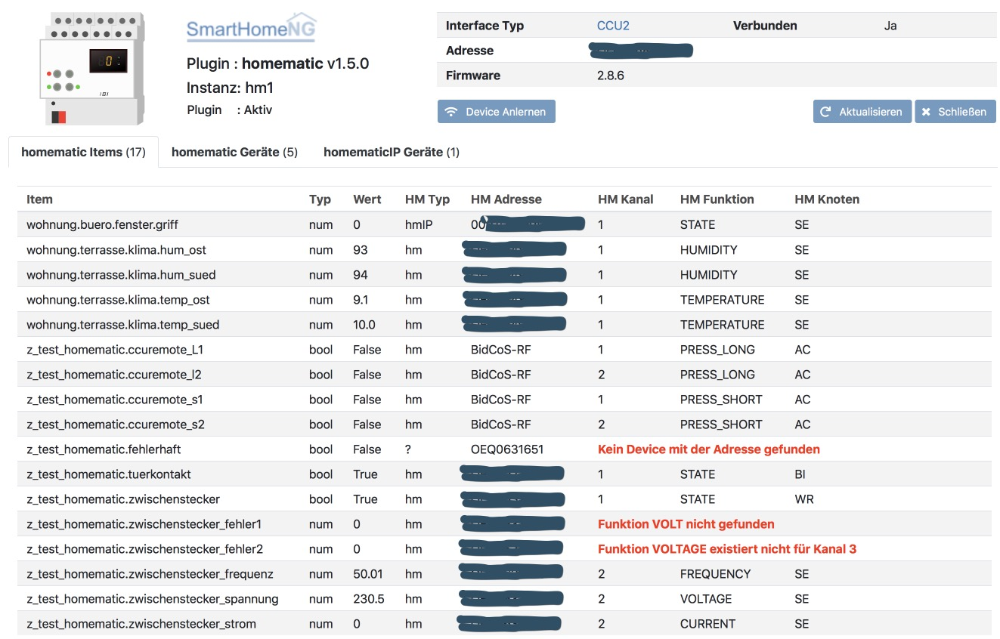

.. index:: Plugins; homematic (HomeMatic Unterstützung)
.. index:: homematic

homematic
#########

Konfiguration
=============

Die Informationen zur Konfiguration des Plugins sind unter :doc:`/plugins_doc/config/homematic` beschrieben.

Web Interface
=============

Das homematic Plugin verfügt über ein Webinterface, mit dessen Hilfe die Items die das Plugin nutzen
übersichtlich dargestellt werden. Außerdem können Informationen zu den Devices angezeigt werden, 
die an der HomeMatic CCU2 angelernt sind. Ein Anlernen neuer Devices wird durch das Webinterface
unterstützt.

.. important:: 

   Das Webinterface des Plugins kann mit SmartHomeNG v1.4.2 und davor **nicht** genutzt werden.
   Es wird dann nicht geladen. Diese Einschränkung gilt nur für das Webinterface. Ansonsten gilt 
   für das Plugin die in den Metadaten angegebene minimale SmartHomeNG Version.

Aufruf des Webinterfaces
------------------------

Das Plugin kann aus dem backend aufgerufen werden. Dazu auf der Seite Plugins in der entsprechenden
Zeile das Icon in der Spalte **Web Interface** anklicken.

Außerdem kann das Webinterface direkt über ``http://smarthome.local:8383/homematic`` bzw. 
``http://smarthome.local:8383/homematic_<Instanz>`` aufgerufen werden.

Beispiele
---------

Folgende Informationen können im Webinterface angezeigt werden:

Oben rechts werden allgemeine Parameter zum Plugin angezeigt. 

Im ersten Tab werden die Items angezeigt, die das homematic Plugin nutzen. Falls Items so
definiert sind, dass sie nicht zu den in der HomeMatic CCU2 angelernten Devices passen, wird
ein entsprechender Fehler angezeigt:

Im zweiten Tab werden Devices angezeigt, die an der HomeMatic CCU2 angelernt sind:

.. image:: assets/webif2.jpg

Durch anklicken der Zeilen mit den Devices, die an der HomeMatic CCU2 angelernt sind, können
weitere Details zu den Devices angezeigt werden

.. image:: assets/webif2_1.jpg

