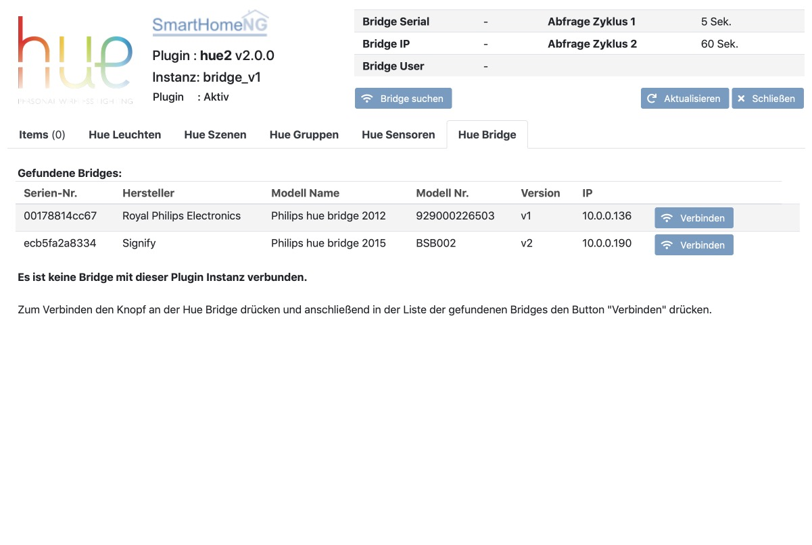
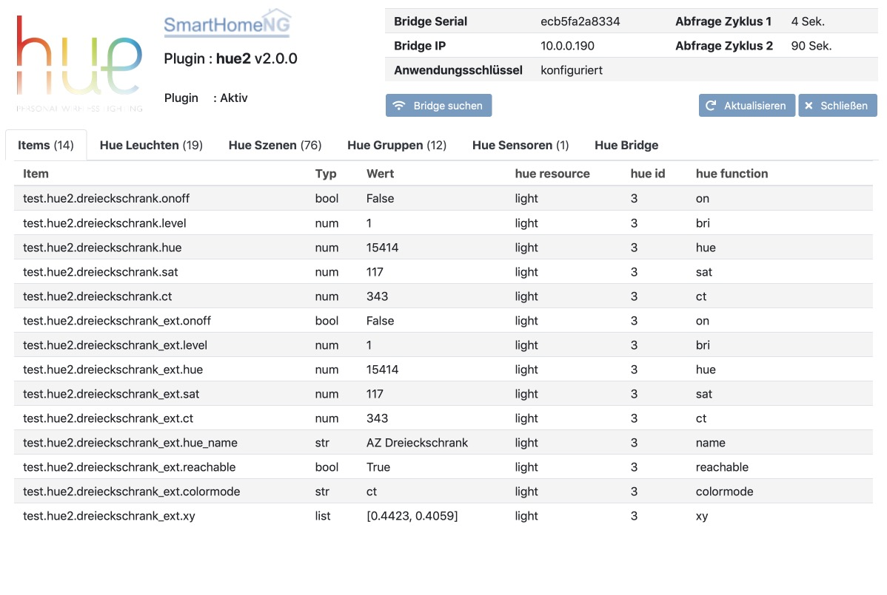
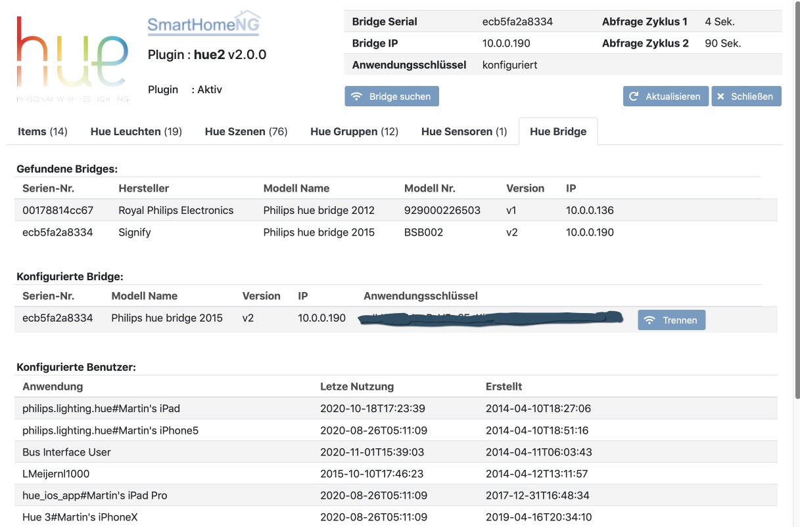

.. index:: Plugins; hue2 (Philips Hue v2)
.. index:: hue2 hue

====
hue2
====

.. image:: webif/static/img/plugin_logo.png
   :alt: plugin logo
   :width: 300px
   :height: 300px
   :scale: 50 %
   :align: left

Das Plugin unterstützt Philips Hue Bridges. Es ist eine komplette Neuentwicklung mit einem deutlich erweiterten
Funktionsumfang gegenüber dem alten Hue Plugin.

Es unterstützt die zweite Generation der Philips Hue Bridges und bisher auch noch die Bridges der ersten Generation,
die von Philips inzwischen retired wurden und keine Unterstützung durch Philips mehr erfahren.

Neue Features
=============

Das Plugin bietet im Vergleich zum **hue** Plugin zusätzlich folgende Features:

- Die Authorisierung an der Hue Bride ist in das Plugin integriert und erfolgt über das Webinferface des Plugins.
- Das Plugin hat eine Funktion um aktive Hue Bridges im lokalen Netzwerk zu finden.
- Das Plugin unterstützt je Instanz im Gegensatz zum alten Plugin nur eine Bridge. Dafür ist es Multi-Instance fähig,
  so dass bei Einsatz mehrerer Bridges einfach mehrere Instanzen des Plugins konfiguriert werden können.
- Zur Vereinfachten Einrichtung von Items liefert das Plugin Struktur Templates.
- Funktionalitäten von Hue Gruppen werden großteils unterstützt.

Plugin Instanz hinzufügen
=========================

Da das Plugin ohne vorherige Konfiguration weiterer Parameter lauffähig ist, wird die Instanz beim Hinzufügen in
der Admin GUI auch gleich aktiviert und beim Neustart von SmartHomeNG geladen. Die Konfiguration erfolgt anschließend
im Web Interface.

Konfiguration
=============

Die grundlegende Konfiguration des Plugins selbst, erfolgt durch das Web Interface des Plugins. Mit dem Web Interface
kann die Verbindung zu einer Bridge hergestellt werden kann. Optionale weitere Einstellungen (z.B. Abfrage Zyklus)
können über die Admin GUI vorgenommen werden. Diese Parameter und die Informationen zur Item-spezifischen
Konfiguration des Plugins sind unter :doc:`/plugins_doc/config/hue2` beschrieben.

Bridge verbinden
----------------

Die Herstellung der Verbindung zu einer Bridge erfolgt für das Web Interface des Plugins. Dazu in der Admin GUI
die **Liste der Plugins** aufrufen und in der Zeile des Hue Plugins auf den Button **Web IF** klicken. (Das
Webinterface ist weiter unten ausführlich beschrieben.)

Das Web Interface zeigt wenn keine Bridge mit der Instanz des Plugins verbunden ist, automatisch den Tab
**Hue Bridge** an.

Um die Verbindung zu einer Bridge herzustellen, zuerst den Link-Button auf der Bridge drücken und anschließend
den **Verbinden** Button neben der entsprechenden Bridge im Web Interface klicken.

Sollte die gewünschte Bridge in der Liste der gefundenen Bridges nicht angezeigt werden, kann über den Button
**Bridge suchen** eine neue Suche nach Hue Bridges im LAN gestartet werden. Nach Abschluß der Suche zum Verbinden
wie oben beschrieben verfahren.

Anschließend wird die verbundende Bridge mit dem generierten Anwendungsschlüssel/Username angezeigt. Diese
Konfiguration des Plugins wird automatisch gespeichert. (in der Konfigurationsdatei ``/etc/plugin.yaml``)

.. image:: assets/webif_connect_2.jpg
   :class: screenshot

.. note::

    Es wird auch bei einer neuen bisher nicht genutzten Bridge ein Sensor gefunden, da der **Daylight Sensor**
    Bestandteil der Firmware der Hue Bridges ist.

|

Verwendung von structs
----------------------

Mit der Hilfe von Struktur Templates wird die Einrichtung von Items stark vereinfacht. Hierzu werden für
Leuchten Templates vom Plugin mitgeliefert.

Grundsätzliche Item Definitionen für Leuchten:

- **hue2.light** - Standard Definition für Philips Hue Leuchten
- **hue2.light_ww** - Standard Definition für Philips Warmwhite Leuchten
- **hue2.light_xy** - Standard Definition für Leuchten von Dritt-Anbietern, die kein **sat** und **hue** unterstützen, sondern nur **xy**

Erweiterte Item Definitionen für oben genannten Leuchten-Typen:

- **hue2.light_extended**
- **hue2.light_ww_extended**
- **hue2.light_xy_extended**

Ein Item für eine Hue Leuchte kann einfach folgendermaßen konfiguriert werden, indem nur die Id der zu
steuernden Leuchts als ``hue2_id`` angegeben wird:

.. code-block:: yaml

    test_leuchte:
        hue2_id: 3
        struct: hue2.light

Damit werden zum Item ``test_leuchte`` die Sub-Items ``onoff``, ``level``, ``hue``, ``sat`` und ``ct`` definiert
und passend konfiguriert.

Das hat die selbe Wirkung, als hätte man ohne Struktur Template folgende Item-Konfiguration vorgenommen:

.. code-block:: yaml

    test_leuchte:
        hue2_id: 3

        name: Vorlage-Struktur für eine Hue Leuchte
        type: foo
        hue2_resource: light

        onoff:
            type: bool
            hue2_resource: ..:.
            hue2_id: ..:.
            hue2_function: on

        level:
            type: num
            hue2_resource: ..:.
            hue2_id: ..:.
            hue2_function: bri

        hue:
            type: num
            hue2_resource: ..:.
            hue2_id: ..:.
            hue2_function: hue

        sat:
            type: num
            hue2_resource: ..:.
            hue2_id: ..:.
            hue2_function: sat

        ct:
            type: num
            hue2_resource: ..:.
            hue2_id: ..:.
            hue2_function: ct

Das Struktur Template **hue2.light_extended** definiert zusätzlich noch die Sub-Items ``light_name``, ``reachable``,
``colormode``, ``xy``, ``light_type``, ``modelid`` und ``swversion``. Die Sub-Items
``reachable``, ``colormode``, ``light_type``, ``modelid`` und ``swversion`` können nur aus der Bridge gelesen
werden. Änderungen an dem Item werden von der Bridge ignoriert.

Item Attribute
--------------

Das Plugin verwendet drei Item Attribute: ``hue2_resource``, ``hue2_id`` und ``hue2_function``.

Mit ``hue2_resource`` wird festgelegt, auf welche Resource der Bridge zugegriffen werden soll: ``light``, ``group``,
``scene`` oder ``sensor``.

.. note::

    Bisher sind nur die Resouce-Typen ``light``, ``group`` und ``sensor`` implementiert.

Mit ``hue2_id`` wird festgelegt auf welche Resource des gewählten Typs zugegriffen werden soll. Die Id kann im
Web Interface im Tab des entsprechenden Resource-Typs nachgesehen werden.

Mit ``hue2_function`` wird festgelegt, welche Funktion der gewählten Resource abgefragt oder gesteuert werden soll.
Für den Resource-Typ ``light`` sind die folgenden Funktionen implementiert (einige erlauben nur die Abfrage):

    - ``on``
    - ``bri``
    - ``bri_inc``
    - ``hue``
    - ``sat``
    - ``ct``
    - ``dict``
    - ``name``
    - ``reachable``
    - ``colormode``
    - ``xy``
    - ``type``
    - ``modelid``
    - ``swversion``
    - ``activate_scene``
    - ``modify_scene``
    - ``alert``
    - ``effect``

Für den Resource-Typ ``sensor`` sind die folgenden Funktionen implementiert, welche nur die Abfrage erlauben:

    - ``daylight``
    - ``temperature``
    - ``presence``
    - ``lightlevel``
    - ``status``

Die vollständige Übersicht über die unterstützen Funktionen und die Datentypen dazu kann auf der
Seite :doc:`/plugins_doc/config/hue2` in der Beschreibung des Item Attributes ``hue2_function`` nachgelesen
werden.

.. note::

    Pullrequest https://github.com/smarthomeNG/plugins/pull/590 implementierte zusätzliche für hue2_function die
    zusätzlichen Optionen ``bri_inc`` und ``dict``, welche noch nicht vollständig dokumentiert sind.

Um den Namen der Leuchte mit der Id 3 abzufragen, muss ein Item folgendermaßen konfiguriert werden:

.. code-block:: yaml

    leuchten_name:
        type: str
        hue2_resource: light
        hue2_id: 3
        hue2_function: name

|

Web Interface
=============

Das hue2 Plugin verfügt über ein Webinterface, mit dessen Hilfe die Items die das Plugin nutzen
übersichtlich dargestellt werden. Außerdem können Informationen zu den Devices angezeigt werden,
die an der Hue Brigde angemeldet sind.

Aufruf des Webinterfaces
------------------------

Das Plugin kann aus der Admin GUI (von der Seite Plugins/Plugin Liste aus) aufgerufen werden. Dazu auf der Seite
in der entsprechenden Zeile das Icon in der Spalte **Web Interface** anklicken.

Außerdem kann das Webinterface direkt über ``http://smarthome.local:8383/plugin/hue2`` bzw.
``http://smarthome.local:8383/plugin/hue2<Instanz>`` aufgerufen werden.

|

Beispiele
---------

Folgende Informationen können im Webinterface angezeigt werden:

Oben rechts werden allgemeine Parameter zum Plugin angezeigt. Die weiteren Informationen werden in den
sechs Tabs des Webinterface angezeigt.

Im ersten Tab werden die Items angezeigt, die das Hue Plugin nutzen:

|
|

Im zweiten Tab werden Informationen zu den Leuchten angezeigt, die in der Hue Bridge bekannt sind:

.. image:: assets/webif_tab2.jpg
   :class: screenshot

|
|

Im dritten Tab werden die Szenen angezeigt, die in der Hue Bridge definiert sind:

.. image:: assets/webif_tab3.jpg
   :class: screenshot

|
|

Im vierten Tab werden die Gruppen angezeigt, die in der Hue Bridge definiert sind:

.. image:: assets/webif_tab4.jpg
   :class: screenshot

|
|

Im fünften Tab werden die Sensoren angezeigt, die in der Hue Bridge bekannt sind:

.. image:: assets/webif_tab5.jpg
   :class: screenshot

|
|

Auf dem sechten Reiter werden Informationen zur Hue Bridge angezeigt. Wenn weitere Anwendungen die Bridge nutzen,
wird zusätzlich eine Liste der in der Bridge konfigurierten Benutzer/Apps angezeigt.

|
|

