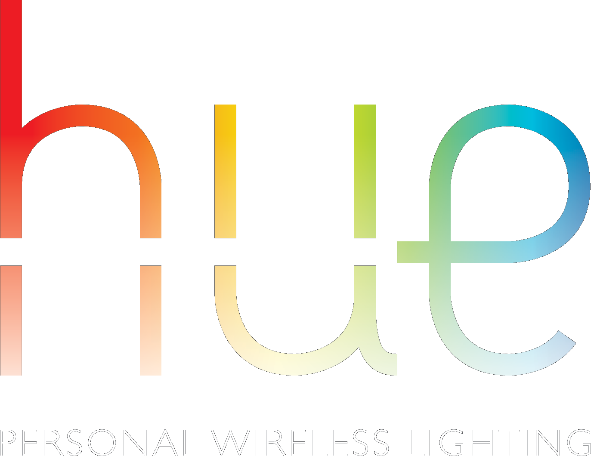
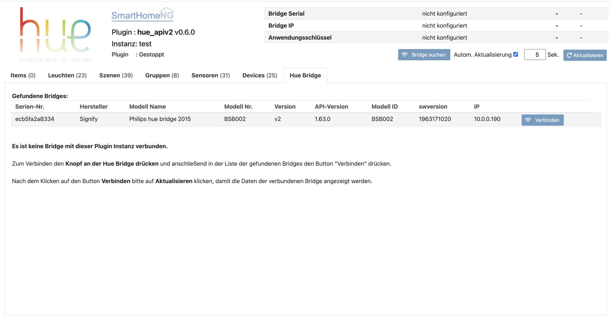
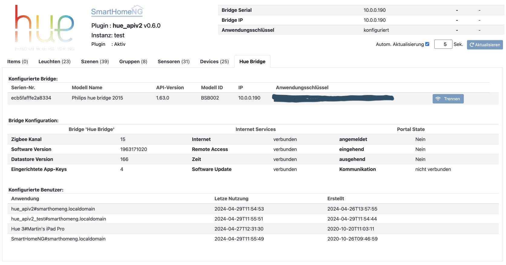
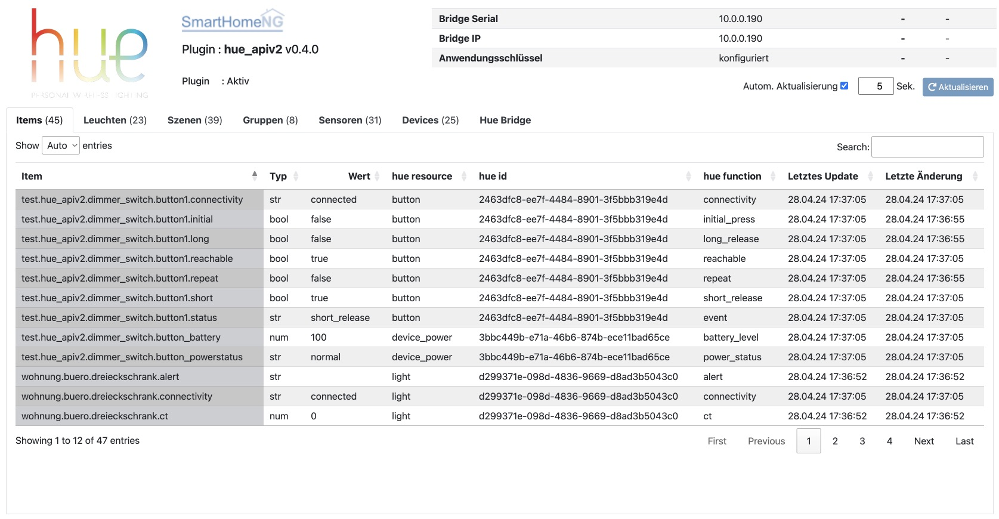
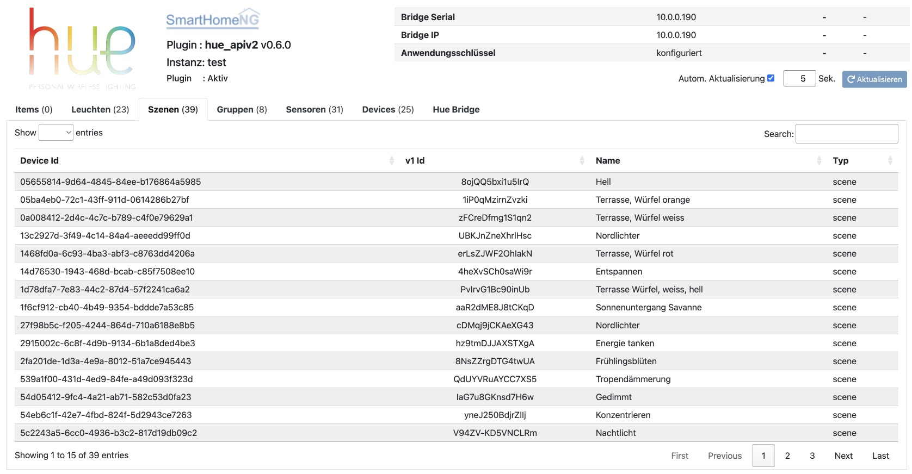
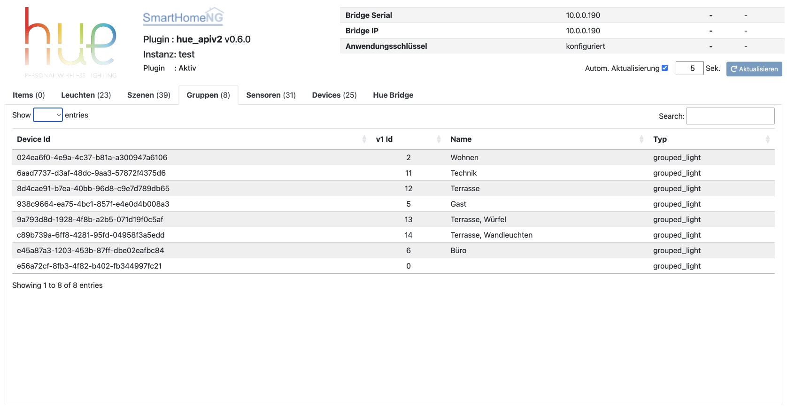
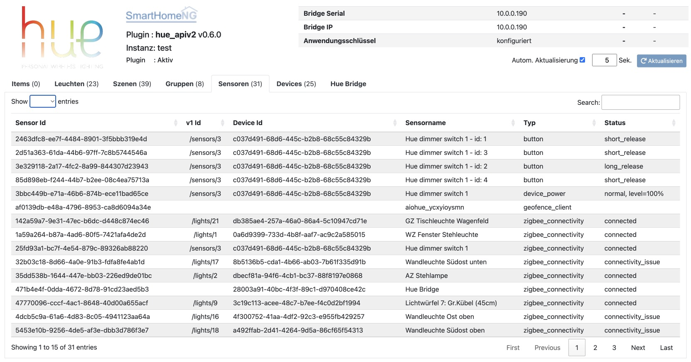
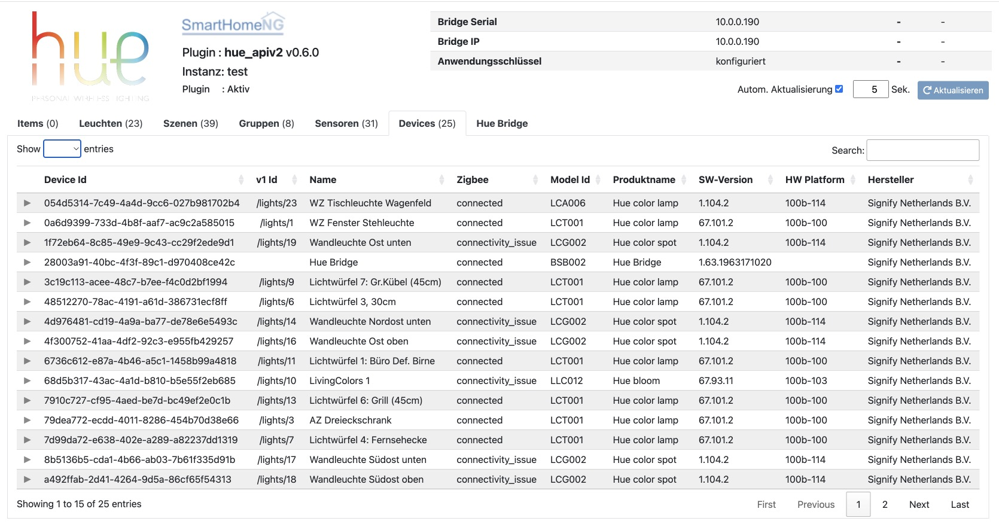

.. index:: Plugins; hue3
.. index:: hue3 hue

====
hue3
====

Das Plugin unterstützt Philips/Signify Hue Bridges. Es setzt auf dem API v2 von Philips auf und unterstützt daher
nur die aktuellen Bridges der zweiten Generation (die Eckigen). Diese Bridges unterstützen zwar auch noch das API v1,
allerdings soll laut Philips diese Unterstützung irgendwann enden. Neue Hue Features werden allerdings nur im API v2
implementiert.

Wenn eine Philips Hue Bridge der ersten Generation (die runden Bridges) angesprochen werden soll, muss das bisherige
**Plugin hue2** verwendet werden. Diese Bridges sind von Philips inzwischen retired worden und werden keine
Unterstützung durch Philips mehr erfahren.

Das Hue API v2 enthält gegenüber dem API v1 eine Reihe von breaking Changes, so dass die Entwicklung eines neuen
Plugin notwendig wurde, um das neue API zu unterstützen.

Die wichtigsten Features/Änderungen beim API v2:

- Aktive Meldung von Veränderungen durch die Bridge, das Plugin muss den Status nicht mehr periodisch pollen
- https Verbindung statt http
- neue (längere) Ids (z.B.: 2915002c-6c8f-4d9b-9134-6b1a8ded4be3)
- Unterstützung mehrerer Lights in einem Device
- Andere Ansteuerung von Szenen
- Konzentration auf das Farbsystem xy
- Keine Unterstützung für hue und sat Werte
- Unterstützung von ct nur beim setzen von Werten (keine ct Werte von der Bridge)
- Keine Untersützung von bri_inc
- brightness Werte in Prozent (also 0 ... 100, nicht mehr 0 ... 255)
- Keine Unterstützung durch die alten (runden) Bridges (und deCONZ)

|

Plugin Instanz hinzufügen
=========================

Da das Plugin ohne vorherige Konfiguration weiterer Parameter lauffähig ist, wird die Instanz beim Hinzufügen in
der Admin GUI auch gleich aktiviert und beim Neustart von SmartHomeNG geladen. Die Konfiguration erfolgt anschließend
im Web Interface.

Das Plugin unterstützt je Instanz nur eine Bridge. Dafür ist es Multi-Instance fähig, so dass bei Einsatz mehrerer
Bridges einfach mehrere Instanzen des Plugins konfiguriert werden können.

Konfiguration
=============

Die grundlegende Konfiguration des Plugins selbst, erfolgt durch das Web Interface des Plugins. Mit dem Web Interface
kann die Verbindung zu einer Bridge hergestellt werden kann. Optionale weitere Einstellungen
(z.B. default_transitionTime) können über die Admin GUI vorgenommen werden. Diese Parameter und die Informationen
zur Item-spezifischen Konfiguration des Plugins sind unter :doc:`/plugins_doc/config/hue3` beschrieben.

|

Bridge verbinden
----------------

Die Herstellung der Verbindung zu einer Bridge erfolgt für das Web Interface des Plugins. Dazu in der Admin GUI
die **Liste der Plugins** aufrufen und in der Zeile des Hue Plugins auf den Button **Web IF** klicken. (Das
Webinterface ist weiter unten ausführlich beschrieben.)

Das Web Interface zeigt wenn keine Bridge mit der Instanz des Plugins verbunden ist, automatisch den Tab
**Hue Bridge** an.

Um die Verbindung zu einer Bridge herzustellen, zuerst den Link-Button auf der Bridge drücken und anschließend
den **Verbinden** Button neben der entsprechenden Bridge im Web Interface klicken.

Sollte die gewünschte Bridge in der Liste der gefundenen Bridges nicht angezeigt werden, kann über den Button
**Bridge suchen** eine neue Suche nach Hue Bridges im LAN gestartet werden. Nach Abschluß der Suche zum Verbinden
wie oben beschrieben verfahren.

Anschließend wird die verbundende Bridge mit dem generierten Anwendungsschlüssel/Username angezeigt. Diese
Konfiguration des Plugins wird automatisch gespeichert. (in der Konfigurationsdatei ``/etc/plugin.yaml``)

|

Verwendung von structs
----------------------

Mit der Hilfe von Struktur Templates wird die Einrichtung von Items stark vereinfacht. Hierzu werden für
Leuchten Templates vom Plugin mitgeliefert.

Grundsätzliche Item Definitionen für Leuchten:

- **hue3.light** - Standard Definition für Philips Hue Leuchten
- **hue3.light_ww** - Standard Definition für Philips Warmwhite Leuchten
- **hue3.light_xy** - Standard Definition für Leuchten, die kein **sat** und **hue** unterstützt, sondern nur **xy**

Erweiterte Item Definitionen für oben genannten Leuchten-Typen:

- **hue3.light_extended**
- **hue3.light_ww_extended**
- **hue3.light_xy_extended**

Ein Item für eine Hue Leuchte kann einfach folgendermaßen konfiguriert werden, indem nur die Id der zu
steuernden Leuchts als ``hue3_id`` angegeben wird:

.. code-block:: yaml

    test_leuchte:
        hue3_id: d299371e-098d-4836-9669-d8ad3b5043c0
        struct: hue3.light

Damit werden zum Item ``test_leuchte`` unter anderem die Sub-Items ``onoff``, ``level``, ``xy`` und ``ct`` definiert
und passend konfiguriert.

Das hat die selbe Wirkung, als hätte man ohne Struktur Template folgende Item-Konfiguration vorgenommen:

.. code-block:: yaml

    test_leuchte:
        hue3_id: d299371e-098d-4836-9669-d8ad3b5043c0

        name: Vorlage-Struktur für eine Hue Leuchte
        type: foo
        hue3_resource: light

        onoff:
            type: bool
            hue3_resource: ..:.
            hue3_id: ..:.
            hue3_function: on

        level:
            type: num
            hue3_resource: ..:.
            hue3_id: ..:.
            hue3_function: bri

        xy:
            type: num
            hue3_resource: ..:.
            hue3_id: ..:.
            hue3_function: xy

        ct:
            type: num
            hue3_resource: ..:.
            hue3_id: ..:.
            hue3_function: ct

Das Struktur Template **hue3.light_extended** definiert zusätzlich noch die Sub-Items ``light_name``, ``reachable``,
``colormode``, ``xy``, ``light_type``, ``modelid`` und ``swversion``. Die Sub-Items
``reachable``, ``colormode``, ``light_type``, ``modelid`` und ``swversion`` können nur aus der Bridge gelesen
werden. Änderungen an dem Item werden von der Bridge ignoriert.

Item Attribute
--------------

Das Plugin verwendet die Item Attribute: ``hue3_id``, ``hue3_resource``, ``hue3_function``
und ``hue3_transition_time``.

Mit ``hue3_resource`` wird festgelegt, auf welche Resource der Bridge zugegriffen werden soll: ``light``, ``group``,
``scene``, ``sensor``, ``button`` oder ``device_power``.

Mit ``hue3_id`` wird festgelegt auf welche Resource des gewählten Typs zugegriffen werden soll. Die Id kann im
Web Interface im Tab des entsprechenden Resource-Typs nachgesehen werden.

Mit ``hue3_function`` wird festgelegt, welche Funktion der gewählten Resource abgefragt oder gesteuert werden soll.
Für den Resource-Typ ``light`` sind die folgenden Funktionen implementiert (einige erlauben nur die Abfrage):

    - ``on``
    - ``bri``
    - ``bri_inc``
    - ``ct``
    - ``dict``
    - ``name``
    - ``reachable``
    - ``colormode``
    - ``xy``
    - ``type``
    - ``modelid``
    - ``swversion``
    - ``activate_scene``
    - ``modify_scene``
    - ``alert``
    - ``effect``

Die vollständige Übersicht über die unterstützen Funktionen und die Datentypen dazu kann auf der
Seite :doc:`/plugins_doc/config/hue3` in der Beschreibung des Item Attributes ``hue3_function`` nachgelesen
werden.

Um zum Beospiel den Namen der Leuchte mit der Id d299371e-098d-4836-9669-d8ad3b5043c0 abzufragen, muss ein Item
folgendermaßen konfiguriert werden:

.. code-block:: yaml

    leuchten_name:
        type: str
        hue3_resource: light
        hue3_id: d299371e-098d-4836-9669-d8ad3b5043c0
        hue3_function: name

|

Web Interface
=============

Das hue3 Plugin verfügt über ein Webinterface, mit dessen Hilfe die Items die das Plugin nutzen
übersichtlich dargestellt werden. Außerdem können Informationen zu den Devices angezeigt werden,
die an der Hue Brigde angemeldet sind.

Aufruf des Webinterfaces
------------------------

Das Plugin kann aus der Admin GUI (von der Seite Plugins/Plugin Liste aus) aufgerufen werden. Dazu auf der Seite
in der entsprechenden Zeile das Icon in der Spalte **Web Interface** anklicken.

Außerdem kann das Webinterface direkt über ``http://smarthome.local:8383/plugin/hue3`` bzw.
``http://smarthome.local:8383/plugin/hue3_<Instanz>`` aufgerufen werden.

|

Beispiele
---------

Folgende Informationen können im Webinterface angezeigt werden:

Oben rechts werden allgemeine Parameter zum Plugin angezeigt. Die weiteren Informationen werden in den
sechs Tabs des Webinterface angezeigt.

Im ersten Tab werden die Items angezeigt, die das Plugin nutzen:

|
|

Im zweiten Tab werden Informationen zu den Leuchten angezeigt, die in der Hue Bridge bekannt sind:

.. image:: assets/webif_tab2.jpg
   :class: screenshot

|
|

Im dritten Tab werden die Szenen angezeigt, die in der Hue Bridge definiert sind:

|
|

Im vierten Tab werden die Gruppen angezeigt, die in der Hue Bridge definiert sind:

|
|

Im fünften Tab werden die Sensoren angezeigt, die in der Hue Bridge bekannt sind:

|
|

Im sechsten Tab werden die Devices angezeigt, die in der Hue Bridge bekannt sind:

|
|

Auf dem siebten Reiter werden Informationen zur Hue Bridge angezeigt. Wenn weitere Anwendungen die Bridge nutzen,
wird zusätzlich eine Liste der in der Bridge konfigurierten Benutzer/Apps angezeigt.

.. image:: assets/webif_tab7.jpg
   :class: screenshot

|
|

