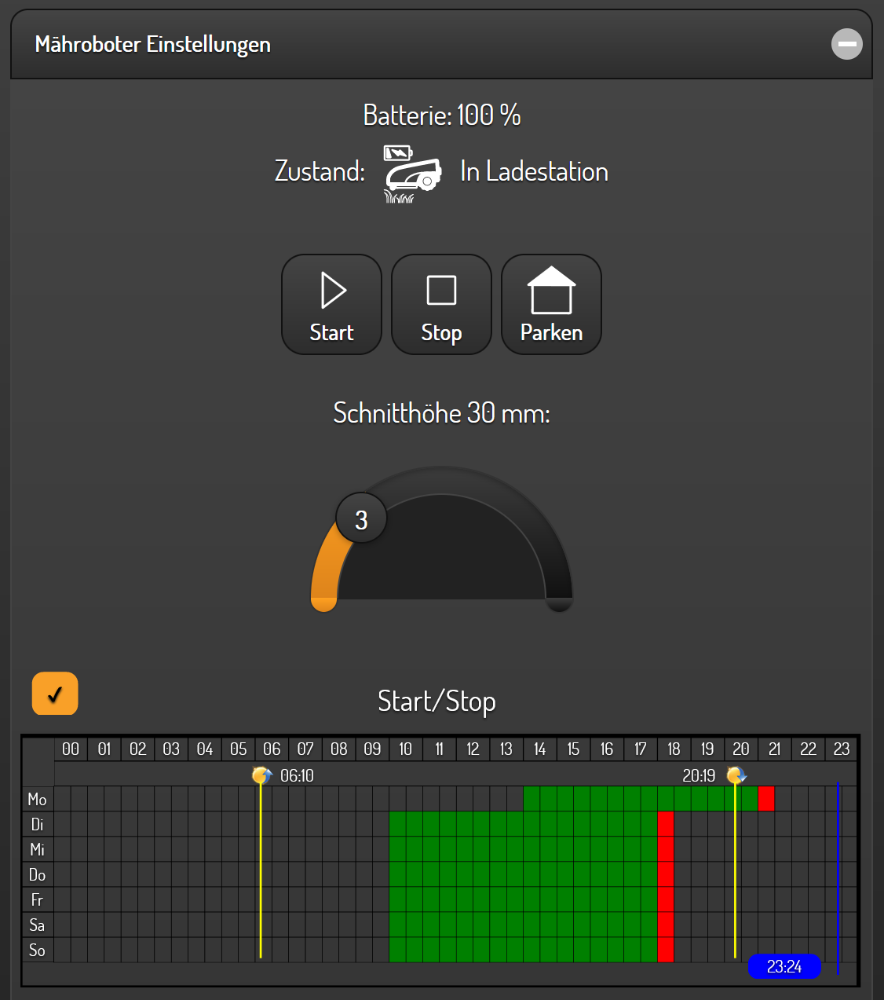
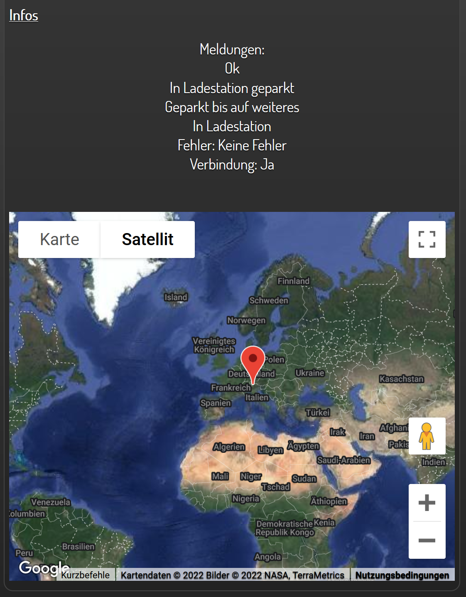
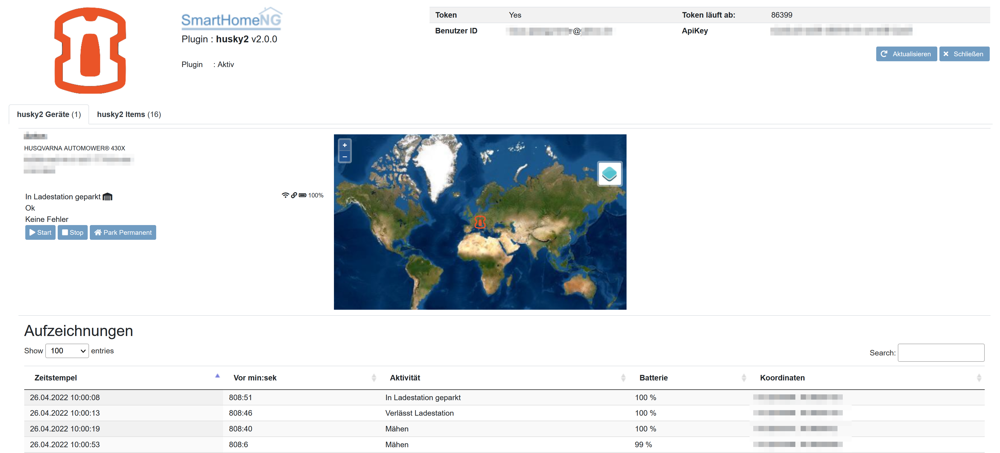

husky2
======

Ein Plugin um diverse Husqvarna Automower (R) mit SmartHomeNG ansteuern zu können, sowie deren Informationen abzufragen.

Anforderungen
-------------
Zur Verwendung des Plugins wird zusätzlich zu einem gültigen Benutzerkonto, welches für die Automower Connect App
verwendet wird, auch ein API-Key benötigt. Dieser Key muss in der Plugin-Konfiguration hinterlegt werden.
Dazu auf https://developer.husqvarnagroup.cloud/apps mit dem bereits aus der App vorhandenen Benutzernamen und
Passwort anmelden und eine neue Applikation erstellen. Abschließend der Applikation noch die "Authentication API" und
die "Automower Connect API" zu zuweisen.

Notwendige Software
~~~~~~~~~~~~~~~~~~~

Für die Kommunikation wird die Python-Bibliothek aioautomower benötigt. Diese wird bei der ersten Verwundung des Plugins
automatisch zu SmarthomeNG hinzugefügt.

Unterstützte Geräte
~~~~~~~~~~~~~~~~~~~

Alle bekannten Automower Modelle können mit dem Plugin angesteuert werden.

Konfiguration
-------------

plugin.yaml
~~~~~~~~~~~

Bitte die Dokumentation lesen, die aus den Metadaten der plugin.yaml erzeugt wurde.

.. code-block:: yaml

    am315x:
        plugin_name: husky2
        userid: email@domain.de
        password: mysecret
        apikey: mykey

items.yaml
~~~~~~~~~~

Als grundlegende Struktur für die Kommunikation wird empfohlen das Item-Struktur Template zu verwenden. Dieses kann
anschließend natürlich nach belieben aus- und umgebaut werden.

Funktionen
~~~~~~~~~~

Zur Zeit stehen keine Funktionen für dieses Plugin zur Verfügung.

Beispiele
---------

Beispielhafte Nutzung des Plugins mit SmartVisu:

Web Interface
-------------

Das Webinterface gibt einen Überblick über den aktuellen und vergangenen Status des Automowers, sowie die Möglichkeit
Ihn mit Start, Stop und Parken grundlegend zu steuern. Weiters sind alle Items gelistet die im Zusammenhang mit dem
Husky2 Plugin und somit dem Automower definiert wurden.

Credits
-------

* SmartHome NG Team
* Thomas Peter Protzner ([@Thomas55555](https://github.com/Thomas55555) and his [aioautomower](https://github.com/Thomas55555/aioautomower) project)
