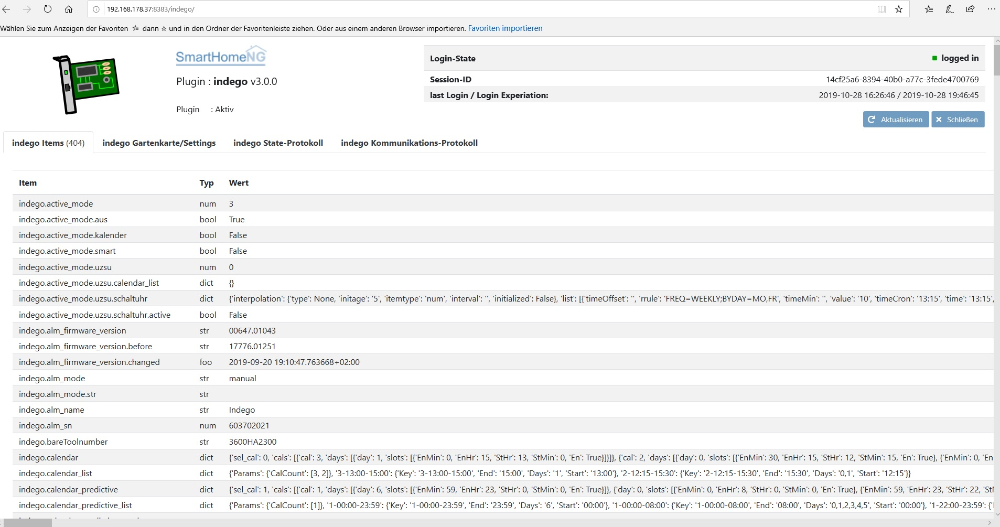
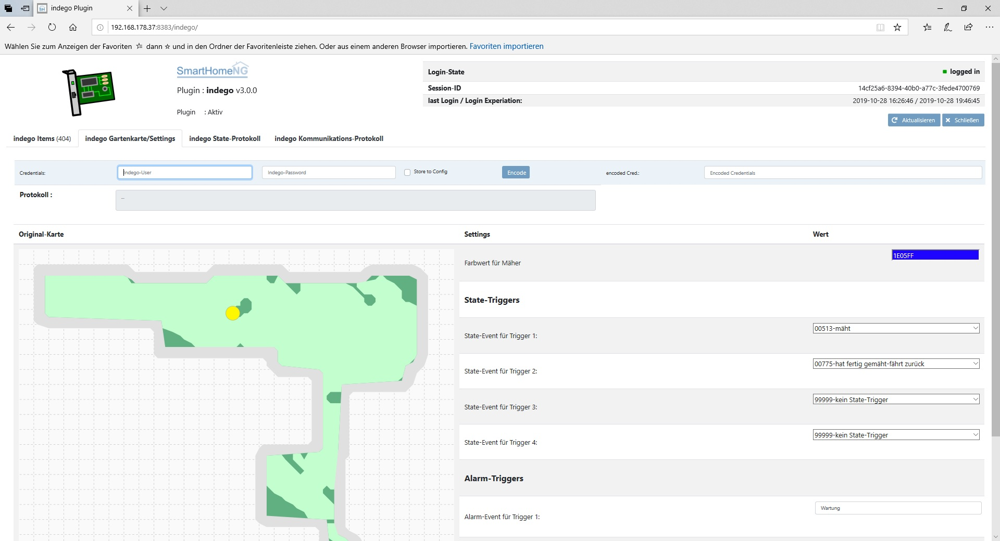
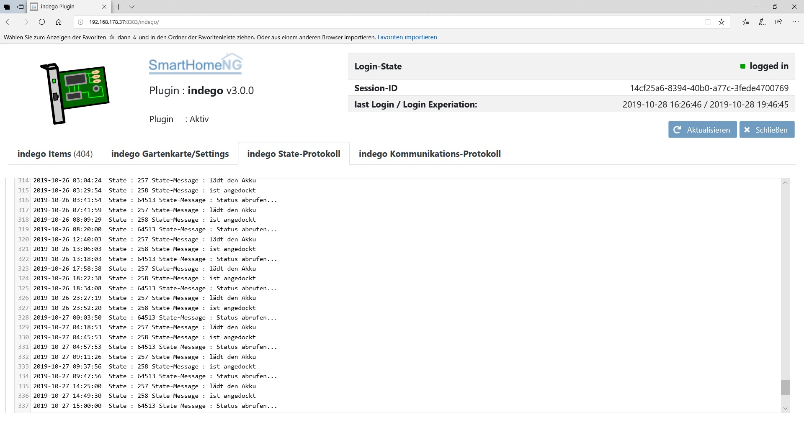
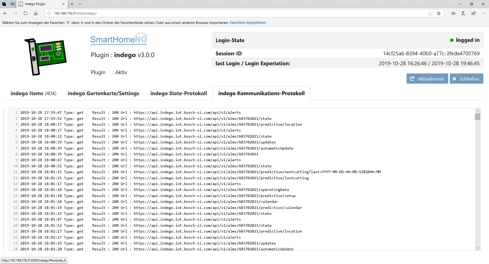
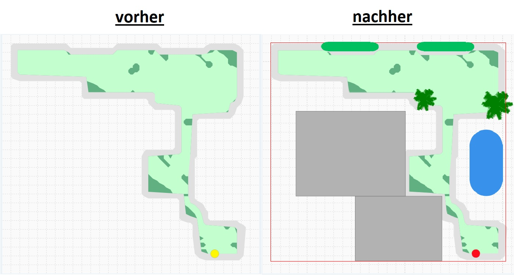

# Indego4shNG

## Table of Content

1. Generell
2. Credits
3. Change Log<sup><span style="color:red"> **Neu**</sup></span>
4. Konfiguration<sup><span style="color:blue"> **Update**</sup></span>
5. Web-Interface
6. Logik-Trigger
7. öffentlich Funktionen (API)
8. Gartenkarte "pimpen"
9. Nutzung der Original Bosch-Mäher-Symbole
10. Die Bosch-Api 4.0.1 - behind the scenes

## Generell<a name="generell"/></a>

Das Indego-Plugin wurde durch ein Reverse-Engineering der aktuellen (Version 3.0) App
von Bosch entwickelt. Als Basis diente das ursprüngliche Plugin von Marcov. Es werden alle Funktionen der App für den Betrieb sowie einige zusätzliche bereitgestellt.
Für die Ersteinrichtung wird weiterhin die Bosch-App benötigt.
Das Plugin erhält die Version der aktuellen Bosch-API. (4.0.1)

## Credits<a name="credits"/></a>

Vielen Dank an schuma für die tolle Unterstützung während der Entwicklungsphase,
die Umsetzung vieler Teile in der Visu sowie den vielen unzähligen Tests und sehr viel Geduld.

Vielen Dank an bmx für das Umstellen des Plugins auf Smart-Plugin.
Vielen Dank an psilo für die Erlaubnis zur Verwendung der LED-Grafiken im Web-Interface.
Vielen Dank an Marcov für die Entwicklung des ursprünglichen Plugins.
Vielen Dank an das Core-Team für die Einführung der STRUCTS, das hat die Arbeit deutlich vereinfacht.
Vielen Dank an Jan Odvarko für die Entwicklung des Color-Pickers (http://jscolor.com) unter Freigabe für Opensource mit GPLv3   

<a name="changelog"/></a>
## Change Log
#### 2023-05-06 V4.0.1
- Login via Single-Key-ID eingebaut
- Endpoit der Bosch-API wurde geändert (siehe Konfiguration)

#### 2023-03-08 V4.0.0
- Login via Bosch-ID eingebaut

#### 2023-02-05 V3.0.2
- Anpassungen für die geänderten Daten für das Wetter (es werden nun 7 Tage statt 5 übermittelt, die Sonnenstunden je Tag wurden entfern)

#### 2021-05-16 V3.0.1
- rücksetzen des Messerzählers eingebaut
- besseres Handling beim automatischen AUS/EIN-Loggen
- Einstellen des Mäher-Standorts über das Web-Interface (die Location wird durch die Bosch-App nicht richtig gesetzt, die Wetterdaten werden dann nicht mehr korrekt übermittelt.)

#### 2019-10-28 V3.0.0
- Kommunikation auf requests geändert
- Verwendung von vordefinierten STRUCTS für alle benötigten Items
- verbessertes Login/Session-Handling
- Umstellung auf Code64 verschlüsselte Credentials
- Integration eines Wintermodus wenn der Mäher stillgelegt ist
- Integration der Mähkalenderverwaltung
- Integration der SmartMow-Einstellungen
- Integration "Mähen nach UZSU"
- verbesserte Darstellung der Icons für das Wetter
- Gartenkarte als Item in Visu integriert
- "pimpen" der Gartenkarte mit eigenen Vektoren
- Mähspurdarstellung für die IndegoConnect 350/400
- Aktualisierung der Mäherposition beim Mähen alle 7 Sekunden
- Darstellung der Informationen zum genutzten GSM-Netz sowie zum verwendeten Standort
- Updatefunktionen für Firmware integriert
- Integration der Sensorempfindlichkeit
- Integration von unterschiedlichen Bilder für Große/Kleine Mäher
- Alarme / Meldungen werden in einem Popup dargestellt und können gelesen/gelöscht werden.
- VISU um Batterie-Informationen erweitert
- diverse Charts für Batterie, Temperatur, Mäheffizienz, Mäh-/Ladezeiten
- Protokoll für Mäher STATI und Bosch-Kommunikation im Web-Interface
- Unterstützung für base64 codierte Credentials im Web-Interface
- Trigger für Alarme und STATI des Mähers im Web-Interface
- Mäherfarbe für die Darstellung der Kartenkarte im Web-Interface wählbar
 


## Requirements

Das UZSU-Plugin wird genutzt. Das UZSU-Plugin sollte <strong>vor</strong> dem Indego4shNG-Plugin geladen sein
(Reihenfolge in der smarthome/etc/plugin.yaml)

### benötigte Software

* SmartVISU 2.9 oder höher (es werden Dropins verwendet)
* smarthomeNg 1.6 oder höher (es werden vordefinierte STRUCTS verwendet)
* für die Darstellung der Charts muss eine Database-plugin aktiviert sein 


### Supported Hardware

* #### Indego Connect 350/S+350/400/S+400, im folgenden die "Kleinen" genannt
* #### Indego Connect 800/1000/1200/1300, im folgenden die "Großen" genannt

Die Firmware der "Kleinen" und der "Großen" liefern unterschiedliche Informationen
 und stellen unterschiedliche Funktionen zur Verfügung. Hier werden kurz die Unterschiede erläutert:
 
Bei den "Großen" gibt es folgende Einschränkungen:
* der Ladezustand des Akkus wird auf Grund der abfallenden Spannung berechnet (35 Volt = 100 %, 28 Volt = 0%)
Langzeitbeobachtungen haben gezeigt, dass die Mähe bei 31 Volt zurück in die Ladestation fahren. Es wird unterstellt,
 dass 31 Volt noch 20 % Akkuladestand sind. 
* Es werden aktuell keine Informationen zur Netznutzung bereitgestellt.
* Die Aktualisierung der Mäherposition erfolgt nur ca. alle 30 Minuten während des Mähens
* Die Sensor-Empfindlichkeit kann nicht eingestellt werden
  
Bei den "Kleinen" gibt es folgende Einschränkungen:
* Es wird von Bosch keine gemähte Fläche übermittelt. Diese kann mittels des "MowTracks" aber angezeigt werden.

<a name="konfiguration"/></a>
## Konfiguration

### plugin.yaml

folgende Einträge werden in der "./etc/plugin.yaml" benötigt.

* `plugin_name: Indego4shNG`:  fix "Indego4shNG"
* `class_path: plugins.indego4shng`:  fix "plugins.indego4shng"
* `path_2_weather_pics: XXXXXXX`: ist der Pfad zu den Bilder des Wetter-Widgets.
(default ="/smartvisu/lib/weather/pics/")
* `img_pfad: XXXXXXX`:  ist der Pfad unter dem die Gartenkarte gespeichert wird. 
(default = "/tmp/garden.svg")
Die Datei wird nicht für die VISU benötigt. Man kann die Datei als Vorlage
zum "pimpen" der Gartenkarte verwenden
* `indego_credentials : XXXXXXX`:  sind die Zugangsdaten für den Bosch-Server im Format base64 encoded.
* `parent_item : indego`:  name des übergeordneten items für alle Child-Items
* `cycle : 30`:  Intervall in Sekunden für das Abrufen des Mäher-Status (default = 30 Sekunden)
* `url: https://api.indego-cloud.iot.bosch-si.com/api/v1/` : Url des Bosch-Endpoints

Die Zugangsdaten (indego_credentials) können nach dem Erststart des Plugins im Web-Interface erfasst und gespeichert werden

<strong>!! Das parent-Item kann umbenannt werden ,es müssen dann aber alle items in der indego.html angepasst werden !!</strong> 

Beispiel:

```yaml
Indego4shNG:
    plugin_name: Indego4shNG
    class_path: plugins.indego4shng
    path_2_weather_pics: /smartvisu/lib/weather/pics/
    img_pfad: /tmp/garden.svg
    indego_credentials:
    parent_item: indego
    cycle: '30'
    url: https://api.indego-cloud.iot.bosch-si.com/api/v1/
```


### items.yaml

Es wird ledigliche folgender Eintrag für die Items benötigt.
Die restlichen Informationen werden aus der mitgelieferten Struct-Definition gelesen.
Eine entsprechende Config-Datei ist im Ordner "items" des Plugins bereits vorhanden und
muss nur in den Ordner "./smarthome/items" kopiert werden.

```yaml
%YAML 1.1
---

indego:
    struct: indego4shng.child
```

### SmartVisu

Die Inhalte des Ordners "./sv_widgets" müssen in den entsprechenden Ordner der VISU.
In der Regel "/var/www/html/smartvisu/dropins" kopiert werden.
Wenn das smartvisu-Plugin verwendet wird und das kopieren der Widget nicht abgeschalten ist, werden die Dateien beim Start von shNG automatisch in den Dropin-Ordner kopiert.
Ansonsten müssen die Daten manuell in das Verzeichnigs "./dropins" kopiert werden.

<strong>Die Icons aus "indego4shng/pages/icons/" müssen in das visu-dir "dropins/icons/ws/" kopiert werden.</strong>

Im Ordner "/pages" des plugins ist eine vorgefertigte Raumseite für die SmartVISU. (indego.html)
Diese muss in den Ordner "/pages/DeinName/" kopiert werden und die Raumnavigation entsprechend ergänzt werden.

<strong>!!! Immer auf die Rechte achten !!!</strong> 

<a name="webinterface"/></a>
## Web-Interface
Kurze Erläuterung zum Web-Interface
### erster Tab - Übersicht Indego-Items



### zweiter Tab - Originalgartenkarte / Settings
Hier wird die Original-Gartenkarte wie sie von Bosch übertragen wird angezeigt.
Es kann mit dem Colour-Picker die Farbe des Mähers in der Visu angepasst werden.
Die Originalkarte bleibt unverändert. Im ersten Tab wird unter dem Item indego.visu.map_2_show
die modifizierte Karte angzeigt.
Es können auf dieser Seite zusätzlich Vektoren eingefügt werden welche die Gartenkarte erweitern bzw."aufhübschen"
Hier kann die Location auf den Bosch-Servern gespeichert werden.
Es müssen Längen/Breitengrad angegeben werden. Wenn noch keine Koordinaten in den Items gespeichert sind werden
die Long/Lat von shNG vorgeschlagen.
Sieh auch hier: gardenmap


Es können hier bis zu 4 Trigger für Stati gewählt werden. 999999 - kein Status gewählt.
Immer wenn der Status des Mähers auf den gewählten Status wechselt wird das Trigger-item
"indego.trigger.state_trigger_<strong>X</strong>:" (X = 1-4 ) gesetzt. Die Trigger können in einer Logik
verarbeitet werden. Beispiel siehe bei Logiken.
Es können bis zu 4 Texte für Meldungen erfasst werden. Wenn der Text in der Überschrift oder im Inhalt der
Meldung ist wird der Trigger "indego.trigger.alarm_trigger_<strong>X</strong>:" (X = 1-4 ) beim eintreffen der Meldung gesetzt. 




### dritter Tab - State-Protokoll
Hier können die einzelnen Statuswechsel des Mähers eingesehen werden.
Es erfolgt bei jedem Statuswechsel ein Eintrag, das Protokoll ist selbst rotierend und hat 
maximal 500 Einträge




### vierter Tab - Kommunikationsprotokoll
Hier können Protokoll-Einträge zu den einzelnen Kommunikationsanfragen mit dem Bosch-Server eingesehen werden.
Es erfolgt bei jedem Statuswechsel ein Eintrag, das Protokoll ist selbst rotierend und hat 
maximal 500 Einträge


<a name="logiktrigger"/></a>
## Logik-Trigger

Über die Items :

<strong>indego.trigger_state_trigger_1(2)(3)(4)</strong>

und
 
<strong>indego.trigger_alarm_trigger_1(2)(3)(4)</strong>

können Events auf state-Wechsel und Meldungen in Logiken ausgeführt werden.
Die Trigger werden über das Web-Interface definiert. Bei den Alarmen wird ein Teil des
Textes der Alarm-Meldung oder der Überschrift angegeben. Groß- Kleinschreibung spielt keine Rolle
Wenn der Text in der Meldung bzw. der Überschrift enthalten ist wird der Trigger ausgelöst.

Beispiel :

```
#!/usr/bin/env python3
# indego2alexa.py

text=''
try:
    triggeredItem=trigger['source']
    triggerValue = trigger['value']
    
    # Check the State-Items 
    if triggeredItem == 'indego.trigger.state_trigger_1':
        if triggerValue == True:
            text = 'Achtung der Indego nimmt seine Arbeit auf'
    
    elif triggeredItem == 'indego.trigger.state_trigger_2':
        if triggerValue == True:
            text = 'Der Indego hat seine Arbeit getan Danke Indego'        
            
    elif triggeredItem == 'indego.trigger.state_trigger_3':
        if triggerValue == True:
            text = ''        
            
    elif triggeredItem == 'indego.trigger.state_trigger_4':
        if triggerValue == True:
            text = ''        
    
    # Now the Alarm-Items
    if triggeredItem == 'indego.trigger.alarm_trigger_1':
        if triggerValue == True:
            text = 'Achtung der Indego benötigt Wartung'
    
    elif triggeredItem == 'indego.trigger.alarm_trigger_2':
        if triggerValue == True:
            text = 'Achtung der Indego benötigt neue Messer'        
            
    elif triggeredItem == 'indego.trigger.alarm_trigger_3':
        if triggerValue == True:
            text = ''        
            
    elif triggeredItem == 'indego.trigger.alarm_trigger_4':
        if triggerValue == True:
            text = ''
            
    if text != '':
        sh.alexarc4shng.send_cmd('Kueche', 'Text2Speech', text);
except:
    pass
```

<a name="api"/></a>
## öffentliche Funkionen

Es gibt eine Funktion die z.B. über Logiken aufgerufen werden kann.
#### send_command(Payload as String)

Man kann so z.B. den Mäher bei einsetzendem Regen der durch die Wetterstation erkannt wird
zurück in die Ladestation schicken.
Anderes Beispiel wäre beim Verlassen des Hauses den Mäher starten.
```
#!/usr/bin/env python3
# indego_rc.py

sh.Indego4shNG.send_command('{"state":"returnToDock"}','Logic')
#sh.Indego4shNG.send_command('{"state":"mow"}','Logic')
#sh.Indego4shNG.send_command('{"state":"pause"}','Logic')


```

<a name="gardenmap"/></a>
## Gardenkarte "pimpen"

Die Gartenkarte wird vom Bosch-Server heruntergeladen und als Item für die Visu verwendet.
Die Datei wird als Vorlage zum Erweitern unter dem angegebenen Pfad gespeichert ( vgl. ```img_pfad``` im Konfig-Teil).

Man kann die Karte als Vorlage in einem Online-Tool (#https://editor.method.ac/) als Vorlage laden.
Es werden dann einfach die zusätzlichen Vektoren eingezeichnet oder via "File / Import Image" hinzugeladen.

Man kann die veränderte Karte auch lokal zwischenspeichern.

Am Ende wählt man im Menü die Ansicht "View" den Eintrag "Source". Hier kann man die erweiterten Vektoren
einfach in die Zwischenablage kopieren und im Web-Interface unter Tab-2 einfügen.
Der letzte Original-Eintrag der Bosch-Karte ist die Zeile mit
 
```
<circle id="svg_8" r="15" cy="792" cx="768" fill="#FFF601" stroke-width="0.5" stroke="#888888"/>
```

<strong>Die Werte können abweichen, da hier auch die Position des Mähers sowie die ID enthalten ist. Am besten auf "circle" und den Farbwert "#FFF601" achten.</strong>

Diese Zeile ist der gelbe Punkt (Mäher) in der Originalkarte.
Beim Verlassen der Textarea werden die neuen Vektoren sofort in ein Item gespeichert und die Gartenkarte neu gerendert.
Das Ergebnis ist in der VISU sofort sichtbar.

## Beispiel :



<a name="boschpics"/></a>
## Nutzung der Original Bosch-Mäher-Symbole

Es werden die Bilder der Bosch 2.2.8 App verwenden. 
Man kann sich die Bilder aus der "Legacy Bosch Smart Gardening"-App extrahieren.
Die APK-Datei ist im Internet zu finden.


Die apk-Datei mit einer Archiv-Verwaltung öffnen und dort im Pfad "/assets/www/assets" die Bilder extrahieren und in den Dropins-Ordner kopieren.
Die Bilder haben folgende Dateinamen :

Für die "Großen"
```
indego.png
indego-docked.png
indego-mowing.png
```

Für die "Kleinen"
```
indego-s.png
indego-docked-s.png
indego-mowing-s.png
```
Sobald die Dateien mit den Bildern vorhanden sind findet das Widget diese und verwendet sie automatisch.
Die entsprechenden Bilder für die "Großen"/"Kleinen" werden auf Grund des Mähertyps automatisch gewählt und dargestellt. 

<a name="boschapi"/></a>
## Die Bosch-Api 4.0.1 - behind the scenes

Hier ist die Schnittstelle der Bosch-API kurz beschrieben und die Implementierung im Plugin dokumentiert.
Der Header ist in den meisten Fällen mit der Session-ID zu füllen :
```
headers = {'accept' : '*/*',
                   'authorization' : 'Bearer '+ self._bearer,
                   'connection' : 'Keep-Alive',
                   'host'  : 'api.indego-cloud.iot.bosch-si.com',
                   'user-agent' : 'Indego-Connect_4.0.0.12253',
                   'content-type' : 'application/json'
           }
```
@Get - steht für einen get-request in Python. Die URL lautet : "https://api.indego-cloud.iot.bosch-si.com/api/v1/" gefolgt vom entsprechenden Zugriffspunkt
```
url = "https://api.indego-cloud.iot.bosch-si.com/api/v1/" +"alms/{}/automaticUpdate".format(alm_sn) 
response = requests.get(url, headers=headers)
```

Über die Items :

<table>
  <thead>
    <tr>
      <th style="text-align: center;width:50px">plugin-Supp.</th>
      <th style="text-align: left;width:400px">API-URL</th>
      <th style="text-align: center;width:200px">Payload</th>
    </tr>
  </thead>
  <tbody>
    <tr>
      <td style="text-align: center">ja</td>
      <td style="text-align: left">"@DELETE("alerts/{alert_id}")"</td>
      <td style="text-align: center">-</td>
    </tr>
    <tr>
      <td style="text-align: center">nein</td>
      <td style="text-align: left">@POST("users")</td>
      <td style="text-align: center">{}</td>
    </tr>
    <tr>
      <td style="text-align: center">nein</td>
      <td style="text-align: left">@DELETE("alerts")</td>
      <td style="text-align: center">-</td>
    </tr>
    <tr>
      <td style="text-align: center">nein</td>
      <td style="text-align: left">@DELETE("alms/{alm_serial}/map")</td>
      <td style="text-align: center">-</td>
    </tr>
    <tr>
      <td style="text-align: center">nein</td>
      <td style="text-align: left">@DELETE("users/{user_id}")</td>
      <td style="text-align: center">-</td>
    </tr>
    <tr>
      <td style="text-align: center">ja</td>
      <td style="text-align: left">@GET("alms/{alm_serial}/config")</td>
      <td style="text-align: center">-</td>
    </tr>
    <tr>
      <td style="text-align: center">ja</td>
      <td style="text-align: left">@GET("alms/{alm_serial}")</td>
      <td style="text-align: center">{"needs_service": false, "alm_firmware_version": "00647.01043", "service_counter": 159551, "bareToolnumber": "3600HA2300", "alm_name": "Indego", "alm_sn": "XXXXXXXXXX", "alm_mode": "manual"}</td>
    </tr>       
     <tr>
      <td style="text-align: center">nein</td>
      <td style="text-align: left">@GET("alms/{alm_serial}")</td>
      <td style="text-align: center">-</td>
    </tr>
     <tr>
      <td style="text-align: center">nein</td>
      <td style="text-align: left">@GET("pub/accessories")</td>
      <td style="text-align: center">-</td>
    </tr>
     <tr>
      <td style="text-align: center">ja</td>
      <td style="text-align: left">@GET("alerts")</td>
      <td style="text-align: center">-</td>
    </tr>
    <tr>
      <td style="text-align: center">ja</td>
      <td style="text-align: left">@GET("alms/{alm_serial}/automaticUpdate")</td>
      <td style="text-align: center">-</td>
    </tr>
    <tr>
      <td style="text-align: center">ja</td>
      <td style="text-align: left">@GET("alms/{alm_serial}/updates")</td>
      <td style="text-align: center">-</td>
    </tr>
     <tr>
      <td style="text-align: center">ja</td>
      <td style="text-align: left">@GET("alms/{alm_serial}/operatingData")</td>
      <td style="text-align: center">-</td>
    </tr>
     <tr>
      <td style="text-align: center">ja</td>
      <td style="text-align: left">@GET("alms/{alm_serial}/calendar")</td>
      <td style="text-align: center">{}</td>
    </tr>
     <tr>
      <td style="text-align: center">ja</td>
      <td style="text-align: left">@GET("alms/{alm_serial}/predictive/location")</td>
      <td style="text-align: center">{}</td>
    </tr>
     <tr>
      <td style="text-align: center">ja</td>
      <td style="text-align: left">@GET("alms/{alm_serial}/predictive/lastcutting")</td>
      <td style="text-align: center">-</td>
    </tr>
     <tr>
      <td style="text-align: center">ja</td>
      <td style="text-align: left">@GET("alms/{alm_serial}/map")</td>
      <td style="text-align: center">-</td>
    </tr>
    <tr>
      <td style="text-align: center">nein</td>
      <td style="text-align: left">@GET("alms/{alm_serial}/info")</td>
      <td style="text-align: center">{"bareToolnumber": "3600HA2300"}</td>
    </tr>
    <tr>
      <td style="text-align: center">ja</td>
      <td style="text-align: left">@GET("alms/{alm_serial}/location")</td>
      <td style="text-align: center">{"longitude": x.xxxx, "latitude": xx.xxxxx}</td>
    </tr>
    <tr>
      <td style="text-align: center">ja</td>
      <td style="text-align: left">@GET("alms/{alm_serial}/network")</td>
      <td style="text-align: center">-</td>
    </tr>
    <tr>
      <td style="text-align: center">ja</td>
      <td style="text-align: left">@GET("alms/{alm_serial}/predictive/nextcutting")</td>
      <td style="text-align: center">-</td>
    </tr>
    <tr>
      <td style="text-align: center">nein</td>
      <td style="text-align: left">@GET("alms/{alm_serial}/info")</td>
      <td style="text-align: center">-</td>
    </tr>
    <tr>
      <td style="text-align: center">nein</td>
      <td style="text-align: left">@GET("pub/accessories/{accessory_code}")</td>
      <td style="text-align: center">-</td>
    </tr>
    <tr>
      <td style="text-align: center">nein</td>
      <td style="text-align: left">@GET("alms/{alm_serial}/security")</td>
      <td style="text-align: center">{"enabled": true, "autolock": false}</td>
    </tr>
    <tr>
      <td style="text-align: center">ja</td>
      <td style="text-align: left">@GET("alms/{alm_serial}/predictive")</td>
      <td style="text-align: center">{"enabled": false}</td>
    </tr>
    <tr>
      <td style="text-align: center">ja</td>
      <td style="text-align: left">@GET("alms/{alm_serial}/predictive/schedule")</td>
      <td style="text-align: left">{'exclusion_days': [{'slots': [{'StHr': 0, 'EnMin': 0, 'EnHr': 8, 'En': True, 'Attr': 'C', 'StMin': 0}, {'StHr': 8, 'EnMin': 0, 'EnHr': 14, 'En': True, 'Attr': 'tTD', 'StMin': 0}, {'StHr': 18, 'EnMin': 0, 'EnHr': 22, 'En': True, 'Attr': 't', 'StMin': 0}, {'StHr': 22, 'EnMin': 59, 'EnHr': 23, 'En': True, 'Attr': 'C', 'StMin': 0}], 'day': 0}, {'slots': [{'StHr': 0, 'EnMin': 0, 'EnHr': 8, 'En': True, 'Attr': 'C', 'StMin': 0}, {'StHr': 8, 'EnMin': 0, 'EnHr': 12, 'En': True, 'Attr': 'tT', 'StMin': 0}, {'StHr': 18, 'EnMin': 0, 'EnHr': 22, 'En': True, 'Attr': 'tT', 'StMin': 0}, {'StHr': 22, 'EnMin': 59, 'EnHr': 23, 'En': True, 'Attr': 'C', 'StMin': 0}], 'day': 1}, {'slots': [{'StHr': 0, 'EnMin': 0, 'EnHr': 8, 'En': True, 'Attr': 'C', 'StMin': 0}, {'StHr': 8, 'EnMin': 0, 'EnHr': 14, 'En': True, 'Attr': 'tTD', 'StMin': 0}, {'StHr': 16, 'EnMin': 0, 'EnHr': 22, 'En': True, 'Attr': 'tT', 'StMin': 0}, {'StHr': 22, 'EnMin': 59, 'EnHr': 23, 'En': True, 'Attr': 'C', 'StMin': 0}], 'day': 2}, {'slots': [{'StHr': 0, 'EnMin': 0, 'EnHr': 8, 'En': True, 'Attr': 'C', 'StMin': 0}, {'StHr': 8, 'EnMin': 0, 'EnHr': 22, 'En': True, 'Attr': 'tTD', 'StMin': 0}, {'StHr': 22, 'EnMin': 59, 'EnHr': 23, 'En': True, 'Attr': 'C', 'StMin': 0}], 'day': 3}, {'slots': [{'StHr': 0, 'EnMin': 0, 'EnHr': 8, 'En': True, 'Attr': 'C', 'StMin': 0}, {'StHr': 8, 'EnMin': 0, 'EnHr': 22, 'En': True, 'Attr': 'tTD', 'StMin': 0}, {'StHr': 22, 'EnMin': 59, 'EnHr': 23, 'En': True, 'Attr': 'C', 'StMin': 0}], 'day': 4}, {'slots': [{'StHr': 0, 'EnMin': 0, 'EnHr': 8, 'En': True, 'Attr': 'C', 'StMin': 0}, {'StHr': 8, 'EnMin': 0, 'EnHr': 14, 'En': True, 'Attr': 'tTD', 'StMin': 0}, {'StHr': 16, 'EnMin': 0, 'EnHr': 22, 'En': True, 'Attr': 'tT', 'StMin': 0}, {'StHr': 22, 'EnMin': 59, 'EnHr': 23, 'En': True, 'Attr': 'C', 'StMin': 0}], 'day': 5}, {'slots': [{'StHr': 0, 'EnMin': 59, 'EnHr': 23, 'En': True, 'Attr': 'C', 'StMin': 0}], 'day': 6}], 'schedule_days': [{'slots': [{'En': True, 'StHr': 14, 'EnMin': 0, 'StMin': 0, 'EnHr': 16}], 'day': 0}]}</td>
    </tr>
    <tr>
      <td style="text-align: center">ja</td>
      <td style="text-align: left">@GET("alms/{alm_serial}/predictive/setup")</td>
      <td style="text-align: center">-</td>
    </tr>
    <tr>
      <td style="text-align: center">ja</td>
      <td style="text-align: left">@GET("alms/{alm_serial}/state")</td>
      <td style="text-align: center">{"svg_xPos": 768, "runtime": {"session": {"charge": 0, "operate": 4}, "total": {"charge": 34352, "operate": 193907}}, "mowed": 89, "mowmode": 0, "xPos": 14, "yPos": 96, "svg_yPos": 792, "mapsvgcache_ts": 1573585675296, "state": 64513, "map_update_available": false}</td>
    </tr>
    <tr>
      <td style="text-align: center">nein</td>
      <td style="text-align: left">@GET("pub/static/{resource_id}")</td>
      <td style="text-align: center">-</td>
    </tr>
    <tr>
      <td style="text-align: center">nein</td>
      <td style="text-align: left">@GET("pub/support/DE")</td>
      <td style="text-align: center">{'email': 'indego.support@de.bosch.com', 'phone': '+49 711 400 40 470'}</td>
    </tr>
    <tr>
      <td style="text-align: center">nein</td>
      <td style="text-align: left">@GET("users/{user_id}")</td>
      <td style="text-align: center">{'optInApp': False, 'display_name': 'XXXXXXXXX', 'email': 'xxxxx.xxxx@xxxxxxxx.xxx', 'country': 'DE', 'language': 'de', 'optIn': False}</td>
    </tr>
    <tr>
      <td style="text-align: center">nein</td>
      <td style="text-align: left">@GET("pub/video&country_code=DE&language=de&mowerType=XXXX")</td>
      <td style="text-align: center">-</td>
    </tr>
    <tr>
      <td style="text-align: center">ja</td>
      <td style="text-align: left">@GET("alms/{alm_serial}/predictive/weather")</td>
      <td style="text-align: center">-</td>
    </tr>
    <tr>
      <td style="text-align: center">ja</td>
      <td style="text-align: left">@POST("authenticate")</td>
      <td style="text-align: center">-</td>
    </tr>
    <tr>
      <td style="text-align: center">nein</td>
      <td style="text-align: left">@POST("authenticate?facebook")</td>
      <td style="text-align: center">-</td>
    </tr>
    <tr>
      <td style="text-align: center">ja</td>
      <td style="text-align: left">@DELETE("authenticate")</td>
      <td style="text-align: center">-</td>
    </tr>
    <tr>
      <td style="text-align: center">nein</td>
      <td style="text-align: left">@POST("alms/{alm_serial}/pair")</td>
      <td style="text-align: center">-</td>
    </tr>
    <tr>
      <td style="text-align: center">nein</td>
      <td style="text-align: left">@POST("alms/{alm_serial}/map")</td>
      <td style="text-align: center">-</td>
    </tr>
    <tr>
      <td style="text-align: center">ja</td>
      <td style="text-align: left">@POST("alms/{alm_serial}/requestPosition")</td>
      <td style="text-align: center">-</td>
    </tr>
    <tr>
      <td style="text-align: center">ja</td>
      <td style="text-align: left">@PUT("alms/{alm_serial}")</td>
      <td style="text-align: center">-</td>
    </tr>
    <tr>
      <td style="text-align: center">ja</td>
      <td style="text-align: left">@PUT("alerts/{alert_id}")</td>
      <td style="text-align: center">-</td>
    </tr>
    <tr>
      <td style="text-align: center">nein</td>
      <td style="text-align: left">@PUT("alerts")</td>
      <td style="text-align: center">-</td>
    </tr>
    <tr>
      <td style="text-align: center">ja*</td>
      <td style="text-align: left">@PUT("alms/{alm_serial}/config")</td>
      <td style="text-align: center">-</td>
    </tr>
    <tr>
      <td style="text-align: center">ja</td>
      <td style="text-align: left">@PUT("alms/{alm_serial}/automaticUpdate")</td>
      <td style="text-align: center">{}</td>
    </tr>
    <tr>
      <td style="text-align: center">nein</td>
      <td style="text-align: left">@PUT("alms/{alm_serial}/updates/notification/{process_id}")</td>
      <td style="text-align: center">-</td>
    </tr>
    <tr>
      <td style="text-align: center">ja</td>
      <td style="text-align: left">@PUT("alms/{alm_serial}/calendar")</td>
      <td style="text-align: center">-</td>
    </tr>
    <tr>
      <td style="text-align: center">nein</td>
      <td style="text-align: left">@PUT("alms/{alm_serial}/dateAndTime")</td>
      <td style="text-align: center">-</td>
    </tr>
    <tr>
      <td style="text-align: center">ja</td>
      <td style="text-align: left">@PUT("alms/{alm_serial}/predictive/location")</td>
      <td style="text-align: center">-</td>
    </tr>
    <tr>
      <td style="text-align: center">ja</td>
      <td style="text-align: left">@PUT("alms/{alm_serial}/updates")</td>
      <td style="text-align: center">-</td>
    </tr>
    <tr>
      <td style="text-align: center">nein</td>
      <td style="text-align: left">@PUT("alms/{alm_serial}/predictive/reset")</td>
      <td style="text-align: center">@Query("reinitialize")</td>
    </tr>
    <tr>
      <td style="text-align: center">nein</td>
      <td style="text-align: left">@PUT("alms/{alm_serial}/security")</td>
      <td style="text-align: center">-</td>
    </tr>
    <tr>
      <td style="text-align: center">ja</td>
      <td style="text-align: left">@PUT("alms/{alm_serial}/predictive")</td>
      <td style="text-align: center">-</td>
    </tr>
    <tr>
      <td style="text-align: center">ja</td>
      <td style="text-align: left">@PUT("alms/{alm_serial}/predictive/setup")</td>
      <td style="text-align: center">-</td>
    </tr>
    <tr>
      <td style="text-align: center">ja</td>
      <td style="text-align: left">@PUT("alms/{alm_serial}/state")</td>
      <td style="text-align: center">-</td>
    </tr>
    <tr>
      <td style="text-align: center">nein</td>
      <td style="text-align: left">@PUT("users/{user_id}")</td>
      <td style="text-align: center">-</td>
    </tr>
    <tr>
      <td style="text-align: center">ja</td>
      <td style="text-align: left">@POST("authenticate/check")</td>
      <td style="text-align: center">-</td>
    </tr>
    <tr>
      <td style="text-align: center">nein</td>
      <td style="text-align: left">@POST("pub/resetpassword")</td>
      <td style="text-align: center">-</td>
    </tr>
    <tr>
      <td style="text-align: center">nein</td>
      <td style="text-align: left">@DELETE("alms/{alm_serial}/pair")</td>
      <td style="text-align: center">-</td>
    </tr>
  </tbody>
</table>
  
'* nur bei 350/350+/400/400+
