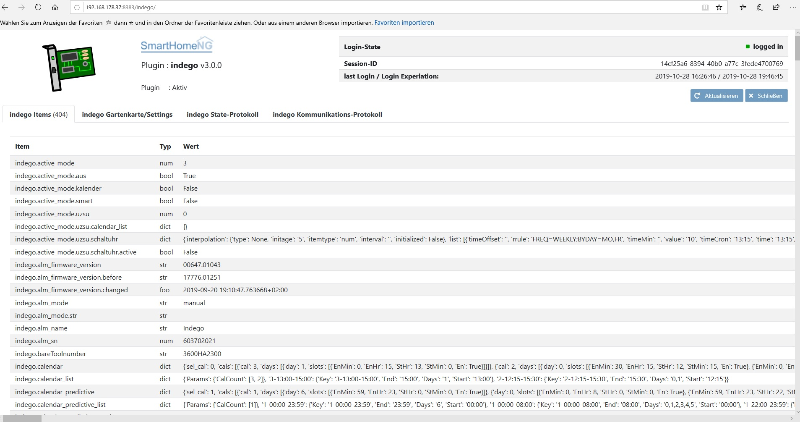
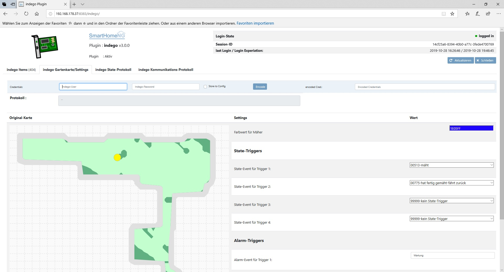
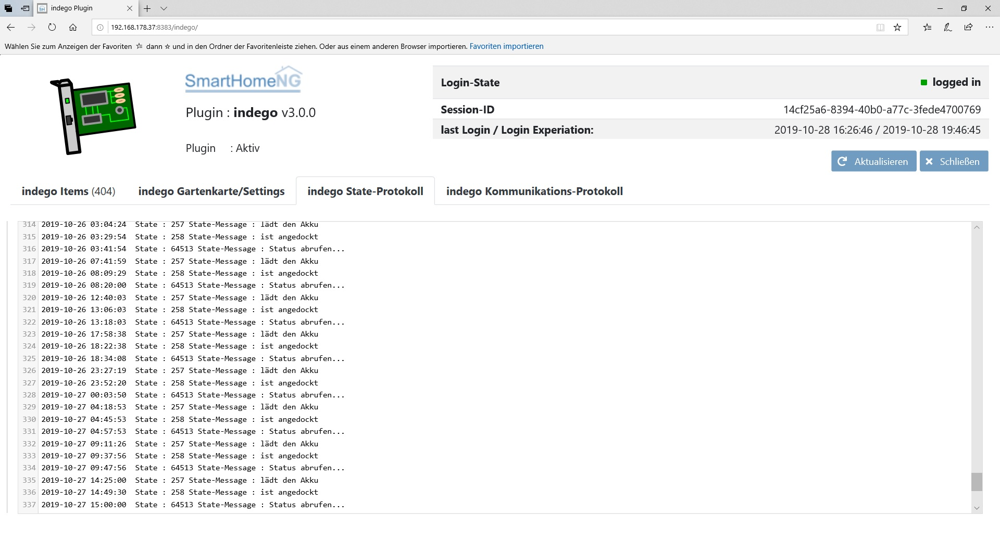
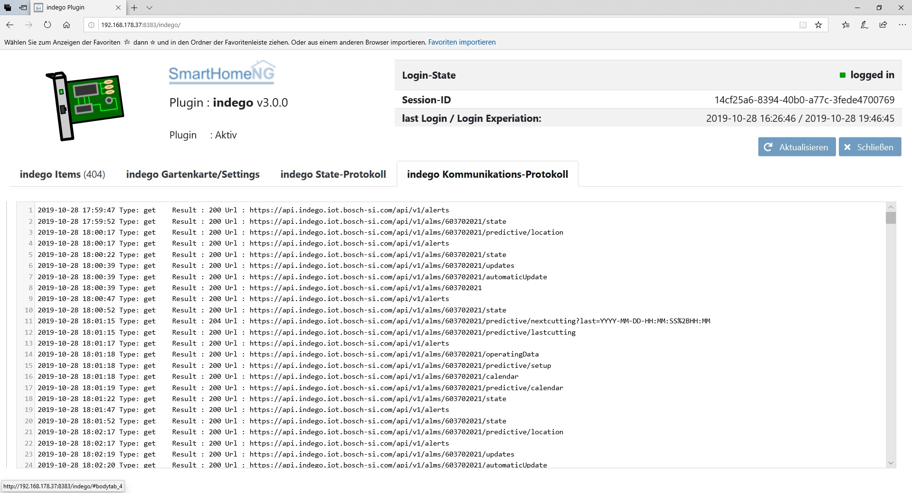
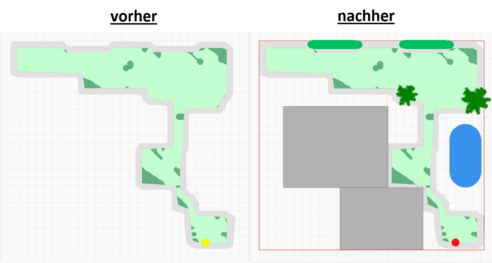

.. index:: Plugins; Indego (Anbindung der Bosch-Indego Connect Mäher)
.. index:: Indego4shNG

===========
indego4shng
===========

Das Indego4shNG-Plugin ermöglicht den Zugriff auf einen Bosch-Indego Rasenmäher. Es werden alle Funktionen der Bosch-App abgebildet. Lediglich die Einrichtung des Mähers
muss über die App erfolgen. Es werden Kalender- sowie Smart-Mow-Funktionen unterstützt. Es werden die Gartenkarte sowie zusätzliche Vektoren dargestellt. Alarme werden in einem Popup-Window angezeigt. Die Wetterinformationen, Akku-Stand, Mäheffizienz, Mäh- und Ladezeiten werden über die SmartVISU dargestellt. Eine fertige smartVISU-Raumseite wird im Ordner ``"/pages"`` mitgeliefert.

.. important::

   Das Plugin kann mit SmartHomeNG v1.6 und höher genutzt werden. Versionen kleiner v1.6 **werden nicht unterstützt**, da STRUCT-Vorlagen genutzt werden.
   Es wird ab SmartVISU v2.9 unterstützt, da DROPINS genutzt werden. Für die Nutzung mit SmartVISU v2.8 müssen manuell Anpassungen vorgenommen werden.

   Das UZSU-Plugin wird genutzt und muss **vor** dem Indego4shNG-Plugin geladen werden
   (Reihenfolge in ``etc/plugin.yaml``).

Unterstützte Hardware
======================

- Indego Connect 350/S+350/400/S+400 (im Folgenden die "Kleinen")
- Indego Connect 800/1000/1200/1300 (im Folgenden die "Großen")

Die Firmware der "Kleinen" und der "Großen" liefert unterschiedliche Informationen und stellt unterschiedliche
Funktionen zur Verfügung:

Bei den "Großen":

- Der Ladezustand des Akkus wird anhand der abfallenden Spannung berechnet (35 V = 100 %, 28 V = 0 %). Langzeitbeobachtungen zeigen, dass der Mäher bei 31 V zurück in die Ladestation fährt; dies wird als ca. 20 % Akkuladestand angenommen.
- Es werden aktuell keine Informationen zur Netznutzung bereitgestellt.
- Die Aktualisierung der Mäherposition erfolgt nur ca. alle 30 Minuten während des Mähens.
- Die Sensor-Empfindlichkeit kann nicht eingestellt werden.

Bei den "Kleinen":

- Es wird von Bosch keine gemähte Fläche übermittelt. Diese kann mittels des "MowTracks" trotzdem angezeigt werden.

Konfiguration
=============

Die Informationen zur Konfiguration des Plugins sind unter :doc:`/plugins_doc/config/indego4shng` beschrieben.

Für die Items wird die mitgelieferte Struct-Definition genutzt. Die passende Config-Datei liegt bereits im
Ordner ``items`` des Plugins und muss nur in den Ordner ``./items`` von SmartHomeNG kopiert werden:

.. code:: yaml

    %YAML 1.1
    ---

    indego:
        struct: indego4shng.child

.. important::

   Wird das übergeordnete Item (Parameter ``parent_item``, Standardwert ``indego``) umbenannt, müssen alle
   Item-Referenzen in der mitgelieferten ``indego.html`` entsprechend angepasst werden.

Die Zugangsdaten (``indego_credentials``) können nach dem Erststart des Plugins bequem über das Web-Interface
erfasst und gespeichert werden, siehe unten.

SmartVISU einbinden
====================

Die Inhalte des Ordners ``sv_widgets`` müssen in den Dropin-Ordner der VISU kopiert werden, in der Regel
``/var/www/html/smartvisu/dropins``. Wird das smartvisu-Plugin verwendet und das automatische Kopieren der
Widgets nicht abgeschaltet, geschieht das automatisch beim Start von SmartHomeNG.

Die Icons aus ``indego4shng/pages/icons/`` müssen zusätzlich in das VISU-Verzeichnis ``dropins/icons/ws/``
kopiert werden.

Im Ordner ``pages`` des Plugins liegt eine vorgefertigte Raumseite für die SmartVISU (``indego.html``). Diese
muss in den eigenen Seiten-Ordner der VISU kopiert und die Raumnavigation entsprechend ergänzt werden.

.. note::

   Auf die Dateiberechtigungen der kopierten Verzeichnisse achten.

Web Interface
=============

Das indego Plugin verfügt über ein Webinterface, mit dessen Hilfe die Items die das Plugin nutzt übersichtlich dargestellt werden. Es können Trigger für die Stati des Mähers und für Meldungen konfiguriert werden. Es kann die Farbe des Mähers in der Gartenkarte konfiguriert werden.
Das encodieren des Users/Passwort mit Speicherung in der ./etc/plugin.yaml wird im Web-Interface unterstützt. Nach dem Encodieren mit speichern in der Konfiguration wird automatisch eingeloggt und alle Daten werden aktualisiert.
Es wird ein kurzes Protokoll zum Einloggen dargestellt.
10 Minuten vor Ablauf der Gültigkeit der aktuell genutzten Session-ID wird am Bosch-Server abgemeldet und im Anschluss wieder neu angemeldet. Die Zeiten für  das letzte Login und den Ablauf der Session-ID werden angezeigt.
Das Web-Interface enthält ein selbst rotierendes Protokoll für die Stati-Wechsel des Mähers sowie für die Kommunikation mit dem Bosch-Server

Aufruf des Webinterfaces
------------------------

Das Plugin kann aus dem backend aufgerufen werden. Dazu auf der Seite Plugins in der entsprechenden
Zeile das Icon in der Spalte **Web Interface** anklicken.

Außerdem kann das Webinterface direkt über ``http://smarthome.local:8383/plugin/indego4shng/`` aufgerufen werden.

Tabs des Webinterfaces
-----------------------

Folgende Informationen können im Webinterface angezeigt werden:

Oben rechts werden allgemeine Parameter zum Plugin angezeigt.

Im ersten Tab werden die Items angezeigt, die das indego Plugin nutzt:

Im zweiten Tab werden die Original-Kartenkarte sowie Login-Informationen und Settings für Trigger/Farbe angezeigt.
Hier kann auch die Location auf den Bosch-Servern gespeichert werden - sind noch keine Koordinaten in den
Items gespeichert, schlägt SmartHomeNG die eigenen Koordinaten vor. Es können bis zu 4 Trigger für Stati
sowie 4 Text-Trigger für Meldungen konfiguriert werden, siehe :ref:`indego4shng_logiktrigger`.

Im dritten Tab wird das Protokoll für die Stati-Wechsel des Mähers angezeigt:

Im vierten Tab wird das Protokoll für die Kommunikation mit dem Bosch-Server  angezeigt:

.. _indego4shng_logiktrigger:

Logik-Trigger
=============

Über die Items ``indego.trigger.state_trigger_1`` bis ``_4`` und ``indego.trigger.alarm_trigger_1`` bis ``_4``
(im Web-Interface auf Tab 2 konfiguriert) können Status-Wechsel und Meldungen des Mähers in Logiken
ausgewertet werden. Bei den Alarm-Triggern wird ein Teilstring der Überschrift oder des Meldungstexts
angegeben (Groß-/Kleinschreibung spielt keine Rolle); trifft der Text zu, wird der jeweilige Trigger gesetzt.

Beispiel, das Status- und Alarmwechsel per Sprachausgabe über ein anderes Plugin meldet:

.. code:: python

    #!/usr/bin/env python3
    # indego2alexa.py

    text = ''
    try:
        triggeredItem = trigger['source']
        triggerValue = trigger['value']

        if triggeredItem == 'indego.trigger.state_trigger_1':
            if triggerValue == True:
                text = 'Achtung der Indego nimmt seine Arbeit auf'

        elif triggeredItem == 'indego.trigger.state_trigger_2':
            if triggerValue == True:
                text = 'Der Indego hat seine Arbeit getan Danke Indego'

        if triggeredItem == 'indego.trigger.alarm_trigger_1':
            if triggerValue == True:
                text = 'Achtung der Indego benötigt Wartung'

        if text != '':
            sh.alexarc4shng.send_cmd('Kueche', 'Text2Speech', text)
    except Exception:
        pass

Mäher per Logik steuern
========================

Über die öffentliche Funktion ``send_command`` (siehe :doc:`/plugins_doc/config/indego4shng`) kann der Mäher
auch direkt aus einer Logik heraus gesteuert werden, z.B. um ihn bei einsetzendem Regen zurück in die
Ladestation zu schicken oder beim Verlassen des Hauses zu starten:

.. code:: python

    #!/usr/bin/env python3
    # indego_rc.py

    sh.Indego4shNG.send_command('{"state":"returnToDock"}', 'Logic')
    #sh.Indego4shNG.send_command('{"state":"mow"}', 'Logic')
    #sh.Indego4shNG.send_command('{"state":"pause"}', 'Logic')

Gartenkarte "pimpen"
=====================

Die Gartenkarte wird vom Bosch-Server heruntergeladen und als Item für die VISU verwendet. Sie wird zusätzlich
als Vorlage unter dem in ``img_pfad`` angegebenen Pfad gespeichert.

Diese Vorlage kann in einem Online-Tool (z.B. https://editor.method.ac/) geladen werden, um zusätzliche
Vektoren einzuzeichnen oder Bilder zu importieren ("File" / "Import Image"). Die veränderte Karte kann dort
auch lokal zwischengespeichert werden.

Über den Menüpunkt "View" → "Source" lassen sich die neu hinzugefügten Vektoren in die Zwischenablage
kopieren und im Web-Interface auf Tab 2 einfügen. Der letzte Original-Eintrag der Bosch-Karte ist eine Zeile
der Form

.. code:: text

    <circle id="svg_8" r="15" cy="792" cx="768" fill="#FFF601" stroke-width="0.5" stroke="#888888"/>

(Werte für Position und ID können abweichen - dies ist der gelbe Punkt, der den Mäher darstellt.) Beim
Verlassen des Textfelds im Web-Interface werden die neuen Vektoren sofort gespeichert und die Gartenkarte
neu gerendert; das Ergebnis ist in der VISU sofort sichtbar.

Original Bosch-Mäher-Symbole nutzen
=====================================

Statt der mitgelieferten Icons können auch die Original-Bildchen der Bosch "Smart Gardening" App (Version 2.2.8)
verwendet werden. Sie lassen sich aus der APK-Datei dieser App extrahieren (im Internet zu finden): Die APK mit
einer Archiv-Verwaltung öffnen und die Bilder aus dem Pfad ``/assets/www/assets`` in den Dropins-Ordner der
VISU kopieren.

Die Dateien müssen folgende Namen tragen, damit das Widget sie automatisch findet und passend zum Mähertyp
("Große"/"Kleine") verwendet:

Für die "Großen": ``indego.png``, ``indego-docked.png``, ``indego-mowing.png``

Für die "Kleinen": ``indego-s.png``, ``indego-docked-s.png``, ``indego-mowing-s.png``
