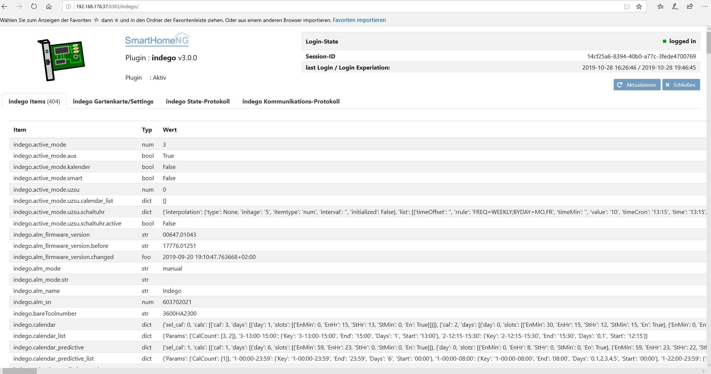
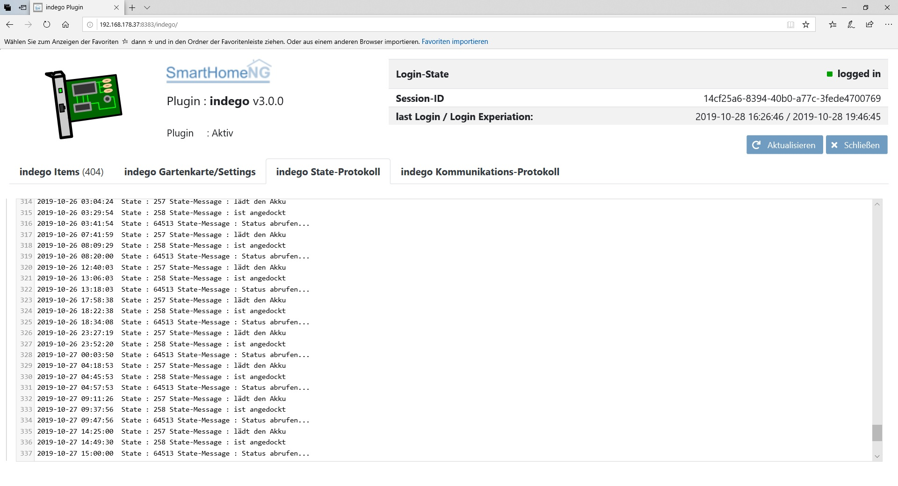
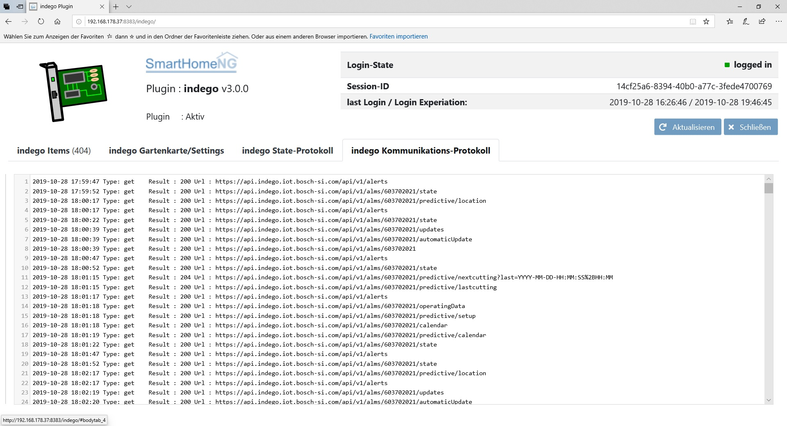

.. index:: Plugins; Indego (Anbindung der Bosch-Indego Connect Mäher)
.. index:: Indego4shNG

===========
indego4shng
===========

Das Indego4shNG-Plugin ermöglicht den Zugriff auf einen Bosch-Indego Rasenmäher. Es werden alle Funktionen der Bosch-App abgebildet. Lediglich die Einrichtung des Mähers
muss über die App erfolgen. Es werden Kalender- sowie Smart-Mow-Funktionen unterstützt. Es werden die Gartenkarte sowie zusätzliche Vektoren dargestellt. Alarme werden in einem Popup-Window angezeigt. Die Wetterinformationen, Akku-Stand, Mäheffizienz, Mäh- und Ladezeiten werden über die SmartVISU dargestellt. Eine fertige smartVISU-Raumseite wird im Ordner ``"/pages"`` mitgeliefert.

Konfiguration
=============

Die Informationen zur Konfiguration des Plugins sind unter :doc:`/plugins_doc/config/indego4shng` beschrieben.

Konfiguration von SmarthoneNG
=============================

Die Konfiguration ist in der README-Datei zum Plugin beschrieben

Web Interface
=============

Das indego Plugin verfügt über ein Webinterface, mit dessen Hilfe die Items die das Plugin nutzt übersichtlich dargestellt werden. Es können Trigger für die Stati des Mähers und für Meldungen konfiguriert werden. Es kann die Farbe des Mähers in der Gartenkarte konfiguriert werden.
Das encodieren des Users/Passwort mit Speicherung in der ./etc/plugin.yaml wird im Web-Interface unterstützt. Nach dem Encodieren mit speichern in der Konfiguration wird automatisch eingeloggt und alle Daten werden aktualisiert.
Es wird ein kurzes Protokoll zum Einloggen dargestellt.
10 Minuten vor Ablauf der Gültigkeit der aktuell genutzten Session-ID wird am Bosch-Server abgemeldet und im Anschluss wieder neu angemeldet. Die Zeiten für  das letzte Login und den Ablauf der Session-ID werden angezeigt.
Das Web-Interface enthält ein selbst rotierendes Protokoll für die Stati-Wechsel des Mähers sowie für die Kommunikation mit dem Bosch-Server

.. important::

   Das Plugin kann mit SmartHomeNG v1.6 und höher genutzt werden. Versionen kleiner v1.6 ** werden nicht unterstützt** da STRUCT-Vorlagen genutzt werden.
   Es wird ab der VISU v2.9 unterstützt da DROPINS genutzt werden. Für die Nutzung von SmartVISU v2.8 müssen manuell Anpassungen vorgenommen werden.

Aufruf des Webinterfaces
------------------------

Das Plugin kann aus dem backend aufgerufen werden. Dazu auf der Seite Plugins in der entsprechenden
Zeile das Icon in der Spalte **Web Interface** anklicken.

Außerdem kann das Webinterface direkt über ``http://smarthome.local:8383/plugin/indego4shng/``

Web Interface
-------------

Folgende Informationen können im Webinterface angezeigt werden:

Oben rechts werden allgemeine Parameter zum Plugin angezeigt.

Im ersten Tab werden die Items angezeigt, die das indego Plugin nutzt:

Im zweiten Tab werden die Original-Kartenkarte sowie Login-Informationen und Settings für Trigger/Farbe angezeigt:

.. image:: assets/webif2.jpg
   :class: screenshot

Im dritten Tab wird das Protokoll für die Stati-Wechsel des Mähers angezeigt:

Im vierten Tab wird das Protokoll für die Kommunikation mit dem Bosch-Server  angezeigt:

