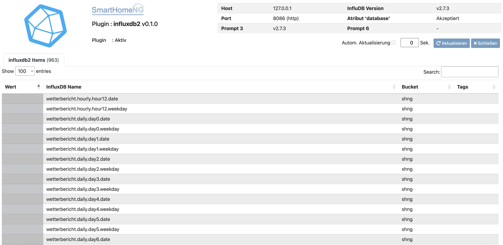

.. index:: Plugins; influxdb2
.. index:: influxdb2
.. index:: InfluxDB; influxdb2 Plugin

=========
influxdb2
=========

.. image:: webif/static/img/plugin_logo.png
   :alt: plugin logo
   :width: 300px
   :height: 300px
   :scale: 50 %
   :align: left

InfluxDB ist ein Open Source Datenbankmanagementsystem (DBMS), speziell für Zeitreihen (engl. time series).
Es wird von der Firma InfluxData entwickelt und vertrieben.

Das influxdb2 Plugin ist eine Neuentwicklung, die auf InfluxDB v2.x aufsetzt. Soll noch eine alte InfluxDB
Software (v1.8 und davor) eingesetzt werden, kann dieses Plugin nicht verwendet werden.

Einführung
==========

Dieses Plugin ermöglicht das Speichern von Daten in der Zeitreihen Datenbank InfluxDB. Es soll auch den Support
für serien (Plots) in smartVISU sicherstellen. Dadurch ist das InfluxDB Plugin in der Lage, als Ersatz für das database
Plugin zu fungieren. Um eine Migration zu erleichtern, kann das InfluxDB Plugin so konfiguriert werden, dass es alle
Werte, die durch das database Plugin in eine SQLite3 bzw. MySQL Datenbank geschrieben werden, zusätzlich in die InfluxDB
schreibt.

Anforderungen
=============

.. Anforderungen des Plugins auflisten. Werden spezielle Soft- oder Hardwarekomponenten benötigt?

Um das Plugin zu nutzen, muss eine InfluxDB Datenbank der Version 2.x installiert und zur Nutzung durch SmartHomeNG
konfiguriert sein.

.. Installation benötigter Software
.. ================================

Installation der InfluxDB Software
==================================

In der Navigation links sind Seiten mit weiteren Informationen zu InfluxDB, der Installation und zur Konfiguration
der InfluxDB Software zur Nutzung mit SmartHomeNG unter folgenden Topics verlinkt:

.. toctree::
  :titlesonly:

  user_doc/influxdb_einfuehrung.rst
  user_doc/influxdb_installation.rst
  user_doc/influxdb_konfiguration.rst

.. Unterstützte Geräte
.. -------------------
..
.. * die
.. * unterstütze
.. * Hardware
.. * auflisten

Gespeicherte Daten
==================

Mit jedem gespeicherten Wert wird unter **_measurement** der Name des Items abgelegt. Mit dem Item-Attribut
**influxdb2_name** kann für das Speichern in der InfluxDB ein Name explizit vergeben werden. Falls das Attribut
**influxdb2_name** nicht definiert wurde, wird der Inhalt des Item-Attributes **name** als Name für die Datenbank
verwendet. Falls **name** nicht spezifiziert ist, wird der Pfadname des Items verwendet.

- **_time** - Der Timestamp wird **nicht** von SmartHomeNG übermittelt, sondern von InfluxDB bei EMpfang der Daten
  bestimmt. Das erleichtert die Synchonisation von Zeitserien, die aus verschiedenen Systemen zusammen geführt werden.
- **_value** - zu speichernder Item Wert

Mit jedem Item Wert, der in einem InfluxDB Bucket abgelegt werden, werden folgende Tags als Metadaten gespeichert:

- **item** - Pfadname des Items
- **item_name** - Im Attribut **name** vergebener Name für das Item
- **caller** - Auslöser für die Änderung des Item Wertes (Plugin, Logik, eval, etc.)
- **source** - Quelle der Änderung: Item Instanz (mit Zusatzdaten), Item, etc.
- **dest** - Ziel der Änderung (z.B. eine GA im knx Plugin)
- **str_value** - enthält nicht numerische Werte, die in der Datenbank abgelegt werden sollen.

Konfiguration
=============

Die Konfiguration der InfluxDB Software ist weiter oben im Abschnitt **Installation der InfluxDB Software** beschrieben.

Die Plugin Parameter und die Informationen zur Item-spezifischen Konfiguration des Plugins sind
unter :doc:`/plugins_doc/config/influxdb2` nachzulesen.

Daten aus dem Database Plugin transferieren
===========================================

Diese Anleitung wurde unter influxdb2 getestet und muss eventuell für influxdb1 adaptiert werden.

1. Pandas und influxdb_client Module für Python installieren
2. CSV-Dump aus dem Webinterface des Datenbank-Plugins herunterladen
3. Anpassen der Zugriffsparameter im unten stehenden Skript
4. Anpassen des Pfads zur CVS-Datei
5. Ausführen des Skripts
6. Abhängig von der Größe der Datenbank ist Geduld gefragt.

.. code-block:: python

    from influxdb_client import InfluxDBClient
    from influxdb_client.client.write_api import SYNCHRONOUS
    import pandas as pd

    # ----------------------------------------------
    ip = "localhost"
    port = 8086
    token = "******************"
    org = "smarthomeng"
    bucket = "shng"
    value_field = "value"
    str_value_field = "str_value"

    csvfile = "smarthomeng_dump.csv"
    # ----------------------------------------------

    client = InfluxDBClient(url=f"http://{ip}:{port}", token=token, org=org)
    write_api = client.write_api(write_options=SYNCHRONOUS)

    df = pd.read_csv(csvfile, sep=';', header=0)
    df = df.reset_index()

    num_rows = len(df.index)
    last_progress_percent = -1

    for index, row in df.iterrows():
      progress_percent = int((index/num_rows)*100)
      if last_progress_percent != progress_percent:
          print(f"{progress_percent}%")
          last_progress_percent = progress_percent

      p = {'measurement': row['item_name'], 'time': int(row['time']) * 1000000,
           'tags': {'item': row['item_name']},
           'fields': {value_field: row['val_num'], str_value_field: row['val_str']}
           }
      write_api.write(bucket=bucket, record=p)

    client.close()

Web Interface
=============

Das Web Interface ermöglicht das Betrachten der Items, die mit der Datenbank verbunden sind.

