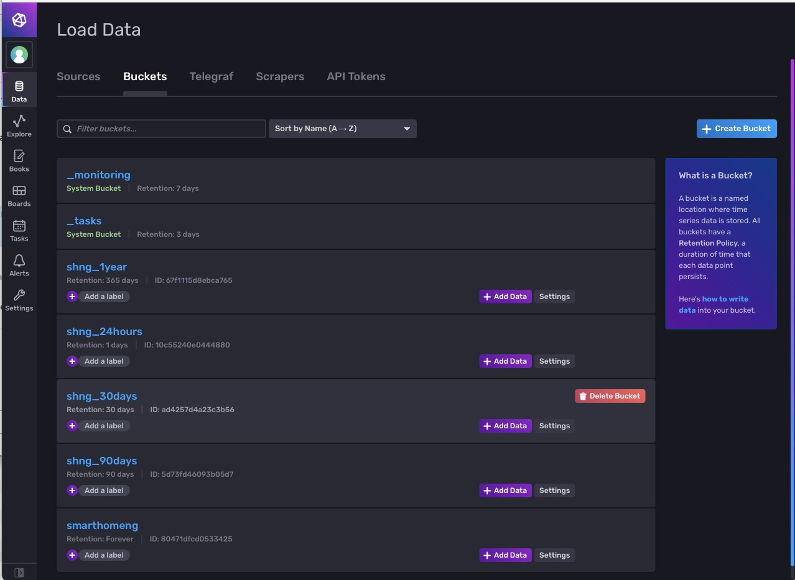
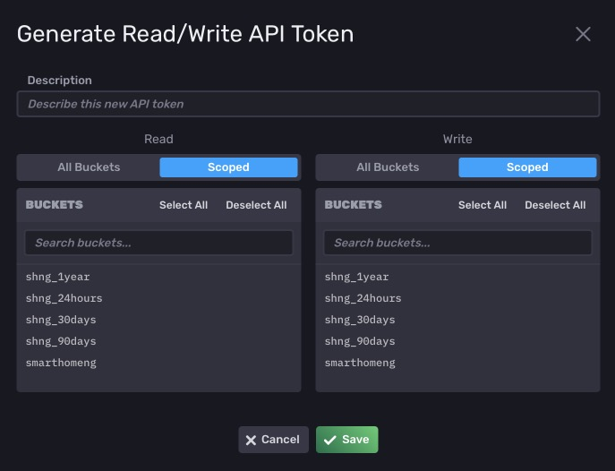
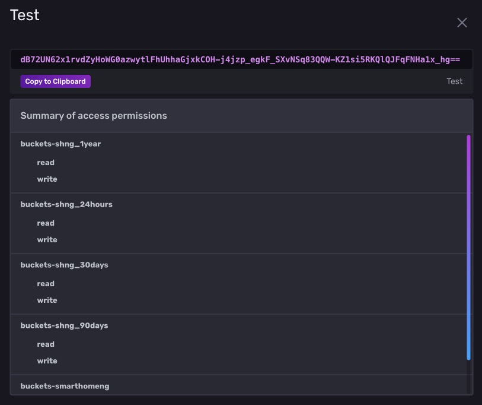
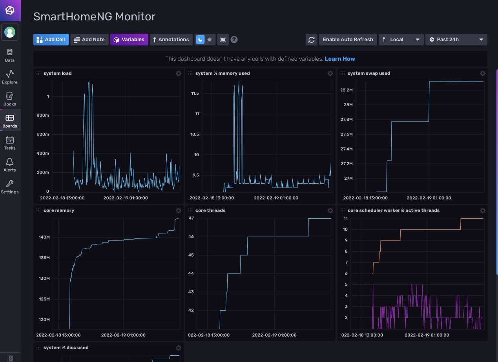
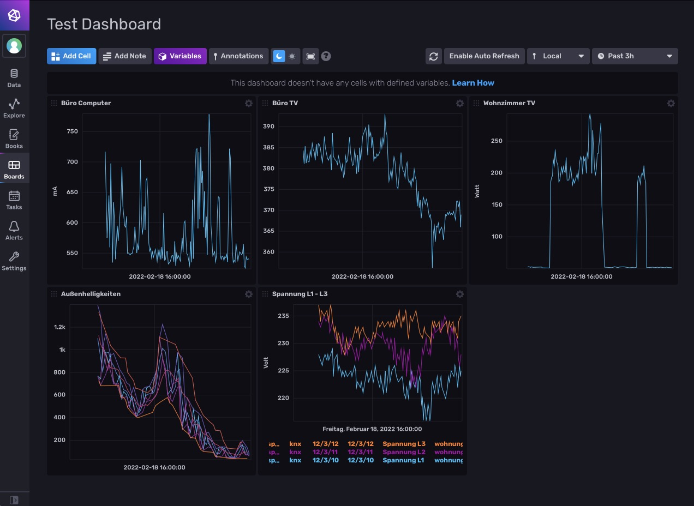

.. index:: InfluxDB; Konfiguration

InfluxDB Konfiguration
======================

...

Buckets anlegen
---------------

Buckets erlauben es, unterschiedliche Aufbewahrungsdauern der Daten festzulegen. Als Minimalkonfiguration muss es
ein Bucket geben, welches als Standard Speicher-Ziel im InfluxDB2 Plugin von SmartHomeNG konfiguriert wird.

Jedem Bucket kann man eine Aufbewahrungsdauer von 1, 6, 12, 24, 48 oder 72 Stunden, von 7, 14, 30 oder 90 Tagen oder von
einem Jahr zuordnen. Alternativ kann auch festgelegt werden, dass Daten in einem Bucket endlos aufgehoben werden.

Es kann jedem Item ein Bucket als Speicherziel zugewiesen werden. Dadurch können die Daten der Zeitreihen je Item
unterschiedlich lange aufbewahrt werden. Falls für ein Item kein Bucket angegeben wird, werden die Daten in dem Bucket
abgelegt, welches als Standard Speicher-Ziel im InfluxDB2 Plugin konfiguriert wurde.

API Token anlegen
-----------------

InfluxDB erwartet bei der Kommunikation über http (und https) einen API Token, um die Requests zu autorisieren.
Damit SmartHomeNG Daten schreiben oder lesen kann, muss ein zuerst ein API Token mit den entsprechenden Rechten
auf die zu nutzenden Buckets generiert werden.

Dazu in GUI von InfluxDB links in der Navigation auf den Button **Data** klicken. Anchließend auf der dann
dargestellten **Load Data** Seite oben in der Navigation **API Token** auswählen.

Oben rechts ist ein Button **Generate API Token**. Nachdem dieser geklickt wurde, erscheint am Button ein Drop-Down
Menü. Hier **Read/Write API Token** auswählen. Daraufhin erscheint folgender Dialog:

Es muss im Feld **Description** eine Beschreibung für den Token vergeben werden (z.B.: influxdb2 Plugin of SmartHomeNG).
Hier können für die einzelenen Buckets (oder für alle Buckets) Lese- und Schreibrechte festgelegt werden, die dem
API Token zugeordnet werden. Hier müssen für alle Buckets, die in SmartHomeNG verwendet werden sollen, Lese- und
Schreibrechte vergeben werden. Zum Abschluß **Save** klicken.

Anschließend muss dieser generierte Token in die Plugin Konfiguration eingetragen werden. Das geschieht am einfachsten,
indem man sich den API Token anzeigen lässt (dazu in der Liste auf die Beschreibung des Token klicken).

Daraufhin erscheint folgender Dialog:

Hier kann man den Token über den Button **Copy to Clipboard** in die Zwischenablage kopieren und anschließend in der
Admin GUI in den entsprechenden Parameter der Plugin Konfiguration einfügen.

Dashboard einrichten
--------------------

Bevor Dashboards eigerichtet werden können, müssen Daten in der InfluxDB gespeichert sein. Also muss SmartHomeNG
mit konfiguriertem InfluxDB2 Plugin und passend konfigurierten Items laufen und Daten in die Datenbank schreiben.

...

...

