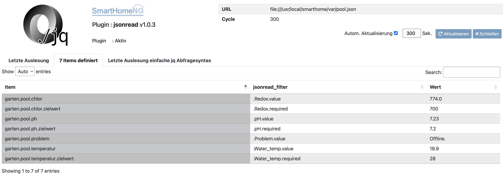

.. index:: Plugins; jsonread
.. index:: jsonread

========
jsonread
========

.. image:: webif/static/img/plugin_logo.svg
   :alt: plugin logo
   :width: 300px
   :height: 300px
   :scale: 50 %
   :align: left

Das vorliegende Plugin ist in der Lage aus einer Datei oder von einer
URL JSON Daten zu lesen
und anhand einer Abfrageanweisung einen Datenpunkt an ein Item zu übergeben.

Anforderungen
=============

Für die Auswertung des JSON Datensatzes wird der flexible JSON Prozessor
`JQ <https://stedolan.github.io/jq/>`_ verwendet.

Jede Webseite, die JSON formatierte Daten liefern kann oder
jede Datei die JSON formatierte
Daten enthält, kann als Datenquelle für das Plugin verwendet werden.

Konfiguration
=============

.. important::

      Detaillierte Informationen zur Konfiguration des Plugins sind unter :doc:`/plugins_doc/config/jsonread` zu finden.

plugin.yaml
-----------

Es können beliebig viele Instanzen des Plugins erstellt werden.
Für jede Datenquelle muß eine Instanz konfiguriert werden.

URL
^^^

Der Ursprung der Daten. Aktuell werden ``http://``, ``https://`` und ``file://`` Schemen unterstützt.

.. note::
    Absolute Pfadangabe für Dateien wie in ``file:///absoluter/pfad/hier`` enthalten **3** Schrägstriche
    relative Pfadangabe für Dateien wie in ``file://relativer/pfad/hier`` enthalten **2** Schrägstriche

Beispiele verschiedener Datenquellen
^^^^^^^^^^^^^^^^^^^^^^^^^^^^^^^^^^^^

Die folgenden Beispiele nutzen `openweathermap <https://openweathermap.org/current>`_  und den Beispiel API Schlüssel.
Der Schlüssel sollte wirklich **nur** für Testzwecke verwendet werden.

**http Quelle**

.. code-block:: yaml

   jsonread:
      plugin_name: jsonread
      url: https://samples.openweathermap.org/data/2.5/weather?q=London,uk&appid=b6907d289e10d714a6e88b30761fae22
      cycle: 30

**Dateiquelle**

.. code-block:: yaml

   jsonread:
      plugin_name: jsonread
      url: file:///path/to/data.json
      cycle: 30

**Mehrere Instanzen**

.. code-block:: yaml

    jsonreadlon:
       plugin_name: jsonread
       url: https://samples.openweathermap.org/data/2.5/weather?q=London,uk&appid=b6907d289e10d714a6e88b30761fae22
       instance: london

    jsonreadcair:
       plugin_name: jsonread
       url: https://samples.openweathermap.org/data/2.5/weather?id=2172797&appid=b6907d289e10d714a6e88b30761fae22
       instance: cairns

items.yaml
----------

Beispiel Klimaabfrage
^^^^^^^^^^^^^^^^^^^^^

Die Abfrage ``https://samples.openweathermap.org/data/2.5/weather?q=London,uk&appid=b6907d289e10d714a6e88b30761fae22``
ergibt ein Ergebnis in etwa wie folgt:

.. code-block:: json

    {
    "coord": {
        "lon": -0.13,
        "lat": 51.51
    },
    "weather": [
        {
            "id": 300,
            "main": "Drizzle",
            "description": "light intensity drizzle",
            "icon": "09d"
        }
    ],
    "base": "stations",
    "main": {
        "temp": 280.32,
        "pressure": 1012,
        "humidity": 81,
        "temp_min": 279.15,
        "temp_max": 281.15
    },
    "visibility": 10000,
    "wind": {
        "speed": 4.1,
        "deg": 80
    },
    "clouds": {
        "all": 90
    },
    "dt": 1485789600,
    "sys": {
        "type": 1,
        "id": 5091,
        "message": 0.0103,
        "country": "GB",
        "sunrise": 1485762037,
        "sunset": 1485794875
    },
    "id": 2643743,
    "name": "London",
    "cod": 200
    }

Mit der Definition

.. code-block:: yaml

    temperature:
        type: num
        jsonread_filter: .main.temp

    windspeed:
        type: num
        jsonread_filter: .wind.speed

werden den entsprechenden Items die Temperatur und die Windgeschwindigkeit zugewiesen.

Wenn mehrere Instanzen für das Plugin definiert werden,
so muss das ``jsonread_filter`` Attribut
erweitert werden mit ``@`` und dem Instanznamen

.. code-block:: yaml

    temperature:
       london:
          type: num
          jsonread_filter@london: .main.temp
       cairns:
          type: num
          jsonread_filter@cairns: .main.temp

Der Attributwert für ``jsonread_filter`` wird direkt an jq weitergegeben.
Auf diese Art und Weise ist es möglich
recht komplexe Filter zu erstellen und für die Itembefüllung zu verwenden.
Dabei muss darauf geachtet werden, dass nur ein einzelner Wert
zurückgegeben werden darf.
Für komplexe JSON Strukturen kann es recht kompliziert sein,
entsprechende Filter zu definieren, daher
könnte es einfacher sein, diese Filter auf der Kommandozeile zu entwickeln:

.. code-block:: bash

    curl https://json.server.org/data.json | jq '.object'

Es lohnt ein Blick ins
`Tutorial für jq <https://jqlang.github.io/jq/tutorial/>`_
um für die Verwendung der Filter einen Eindruck zu bekommen.

Beispiel Batteriedaten
^^^^^^^^^^^^^^^^^^^^^^

In der ``etc/plugin.yaml`` wird das Plugin definiert als:

.. code-block:: yaml

    myreserve:
        plugin_name: jsonread
        url: file:///tmp/BMSData.shtml
        instance: myreserve
        cycle: 10

Die Datei ``/tmp/BMSData.shtml`` wird dabei vom Prozess
``receiveBLE.py`` auf einem Raspi erzeugt (SolarWatt):

.. code-block:: json

    {
    "FData": {
        "IPV": 5.17,
        "VBat": 170.1,
        "VPV": 418.5,
        "PGrid": 18,
        "IBat": -9.91
    },
    "SData": {
        "ACS": {
            "U_L2": 239,
            "f": 49.98
            },
        "SoC": 10
        }
    }

Um die Spannung, den aktuellen Ladestrom und die Ladeleistung zu erhalten,
werden folgende Items für
die Instanz ``myreserve`` definiert:

.. code-block:: yaml

    battery:
        u:
            type: num
            jsonread_filter@myreserve: .FData.VBat
        i:
            type: num
            jsonread_filter@myreserve: .FData.IBat
        power:
            remark: etwas einfache Mathematik kann verwendet werden:
            type: num
            jsonread_filter@myreserve: (.FData.VBat * .FData.IBat * -1)

Beispiel Energiemanager
^^^^^^^^^^^^^^^^^^^^^^^

In der ``etc/plugin.yaml`` wird das Plugin definiert als:

.. code-block:: yaml

    swem:
      plugin_name: jsonread
      url: http://192.168.x.y/rest/kiwigrid/wizard/devices
      instance: swem
      cycle: 30

Die Abfrage der URL liefert ein ziemliche großes JSON Datenpaket mit mehr als
4500 Zeilen. Ein Auszug ist im folgenden dargestellt:

.. code-block:: json

    {
    "result": {
        "items": [
            {
                "guid": "urn:your-inverter-guid",
                "tagValues": {
                    "PowerACOut": {
                        "value": 2419,
                        "tagName": "PowerACOut"
                    }
                }
            }
        ]
    }

Um die aktuelle Inverter AC Ausgangsleistung zu erhalten,
wird folgendes Item mit einem komplexen Filter definiert:

.. code-block:: yaml

    inverter:
        type: num
        jsonread_filter@swem: (.result.items[] | select(.guid == "urn:your-inverter-guid").tagValues.PowerACOut.value)

Auswählen des Arrays ``.result.items``,
dann auswählen des Zweiges, bei dem das Element ``guid`` mit dem eigenen
``your-inverter-guid`` übereinstimmt, und im Zweig weitergehen
und den Wert von ``.tagValues.PowerACOut.value``
abfragen und ins Item schreiben.

Das ``jsonread_filter`` Attribut kann mit Hilfe des
`Blockstils für mehrzeilige Strings <https://yaml-multiline.info/>`_
eben auf mehrere Zeilen aufgeteilt werden.
So ist folgende komplexe Berechnung über einen Filter möglich:

.. code-block:: yaml

    grid:
        type: num
        jsonread_filter@swem: >
            (.result.items[] |
            select(.deviceModel[].deviceClass == "com.kiwigrid.devices.solarwatt.MyReservePowermeter").tagValues.PowerOut.value) -
            (.result.items[] |
            select(.deviceModel[].deviceClass == "com.kiwigrid.devices.solarwatt.MyReservePowermeter").tagValues.PowerIn.value)

Web Interface
=============

Im Webinterface wird das Ergebnis der letzten Abfrage der Quelle
im Original sowie als vereinfachte .jq Abfragesyntax dargestellt.
Außerdem werden die Items mit dem entsprechenden
``jsonread_filter`` Attribut und dem aktuell zugewiesenen Wert angezeigt.
