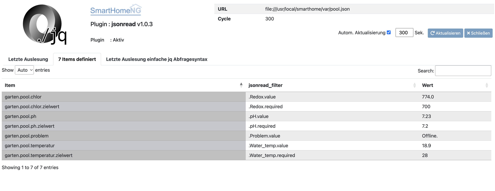

.. index:: Plugins; jsonread
.. index:: jsonread

========
jsonread
========

Das vorliegende Plugin ist in der Lage aus einer Datei oder von einer
URL JSON-Daten zu lesen und anhand einer Abfrageanweisung einen
Datenpunkt an ein Item zu übergeben.

Anforderungen
=============

Jede Webseite, die JSON-formatierte Daten liefern kann oder jede Datei, die JSON-formatierte
Daten enthält, kann als Datenquelle für das Plugin verwendet werden.

Konfiguration
=============

.. important::

      Detaillierte Informationen zur Konfiguration des Plugins sind unter :doc:`/plugins_doc/config/jsonread` zu finden.

plugin.yaml
-----------

Es können beliebig viele Instanzen des Plugins erstellt werden. Für jede Datenquelle muß eine Instanz konfiguriert werden.

URL
^^^

Der Ursprung der Daten. Aktuell werden ``http://``, ``https://`` und ``file://`` als Schemata unterstützt.

.. note::
    Absolute Pfadangabe für Dateien wie in ``file:///absoluter/pfad/hier`` enthalten **3** Schrägstriche
    relative Pfadangabe für Dateien wie in ``file://relativer/pfad/hier`` enthalten **2** Schrägstriche

jq_syntax
^^^^^^^^^

Ab Plugin-Version 2.1.0 gibt es den Parameter ``jq_syntax`` (Standard: ``True``).

Er entscheidet, in welchem Dialekt die ``jsonread_filter``-Ausdrücke in
``items.yaml`` geschrieben werden — und damit, welche Bibliothek die
Ausdrücke tatsächlich auswertet:

- ``jq_syntax: True`` (Standard, keine Änderung nötig): Ausdrücke werden
  wie bisher im plugin-eigenen, an `jq <https://jqlang.github.io/jq/>`_
  angelehnten Dialekt geschrieben (siehe Beispiele weiter unten). Intern
  übersetzt das Plugin diese Ausdrücke automatisch in
  `JMESPath <https://jmespath.org/>`_-Syntax und wertet sie mit der
  JMESPath-Bibliothek aus. **Bestehende Konfigurationen funktionieren
  unverändert weiter**, ein Update auf 2.1.0 erfordert keine Anpassung an
  ``items.yaml``.
- ``jq_syntax: False``: Ausdrücke werden **direkt** als native
  JMESPath-Syntax interpretiert, ohne Übersetzungsschritt. Das ist
  sinnvoll, wenn eine neue Konfiguration von Grund auf aufgebaut wird,
  oder wenn bestehende Filter schrittweise auf JMESPath umgestellt werden
  sollen. Der Abschnitt :ref:`jq_zu_jmespath` weiter unten zeigt, wie sich
  ein Ausdruck von einem Dialekt in den anderen übersetzen lässt, anhand
  der bereits in diesem Dokument verwendeten Beispiele.

.. code-block:: yaml

    myinstance:
        plugin_name: jsonread
        url: file:///path/to/data.json
        cycle: 30
        jq_syntax: False

.. important::

    Warum überhaupt zwei Modi? Der jq-Dialekt, den dieses Plugin bis
    Version 1.0.4 über die externe Bibliothek ``pyjq`` auswertete, wurde
    unter Python 3.13 unbrauchbar (``pyjq`` ist eine C-Erweiterung, die
    dort nicht mehr baut). Ab Version 2.0.0 wertet das Plugin diesen
    Dialekt stattdessen mit einer selbstgeschriebenen, eingeschränkten
    Nachbildung aus — funktional ausreichend für die meisten bisherigen
    Konfigurationen, aber ohne die Testabdeckung und Robustheit einer
    etablierten Bibliothek. JMESPath ist eine reine Python-Bibliothek
    (keine Kompilierung nötig, läuft z.B. auch auf einem Raspberry Pi
    ohne Probleme) und deutlich ausführlicher spezifiziert und getestet
    als die plugin-eigene Nachbildung. ``jq_syntax: False`` erlaubt es,
    direkt auf diese solidere Grundlage zu wechseln, ohne auf den
    weiterhin unterstützten alten Dialekt verzichten zu müssen.

Beispiele verschiedener Datenquellen
^^^^^^^^^^^^^^^^^^^^^^^^^^^^^^^^^^^^

Die folgenden Beispiele nutzen `openweathermap <https://openweathermap.org/current>`_  und den Beispiel API Schlüssel.
Der Schlüssel sollte wirklich **nur** für Testzwecke verwendet werden.

**http Quelle**

.. code-block:: yaml

   jsonread:
      plugin_name: jsonread
      url: https://samples.openweathermap.org/data/2.5/weather?q=London,uk&appid=b6907d289e10d714a6e88b30761fae22
      cycle: 30

**Dateiquelle**

.. code-block:: yaml

   jsonread:
      plugin_name: jsonread
      url: file:///path/to/data.json
      cycle: 30

**Mehrere Instanzen**

.. code-block:: yaml

    jsonreadlon:
       plugin_name: jsonread
       url: https://samples.openweathermap.org/data/2.5/weather?q=London,uk&appid=b6907d289e10d714a6e88b30761fae22
       instance: london

    jsonreadcair:
       plugin_name: jsonread
       url: https://samples.openweathermap.org/data/2.5/weather?id=2172797&appid=b6907d289e10d714a6e88b30761fae22
       instance: cairns

items.yaml
----------

Beispiel Klimaabfrage
^^^^^^^^^^^^^^^^^^^^^

Die Abfrage ``https://samples.openweathermap.org/data/2.5/weather?q=London,uk&appid=b6907d289e10d714a6e88b30761fae22``
ergibt ein Ergebnis in etwa wie folgt:

.. code-block:: json

    {
    "coord": {
        "lon": -0.13,
        "lat": 51.51
    },
    "weather": [
        {
            "id": 300,
            "main": "Drizzle",
            "description": "light intensity drizzle",
            "icon": "09d"
        }
    ],
    "base": "stations",
    "main": {
        "temp": 280.32,
        "pressure": 1012,
        "humidity": 81,
        "temp_min": 279.15,
        "temp_max": 281.15
    },
    "visibility": 10000,
    "wind": {
        "speed": 4.1,
        "deg": 80
    },
    "clouds": {
        "all": 90
    },
    "dt": 1485789600,
    "sys": {
        "type": 1,
        "id": 5091,
        "message": 0.0103,
        "country": "GB",
        "sunrise": 1485762037,
        "sunset": 1485794875
    },
    "id": 2643743,
    "name": "London",
    "cod": 200
    }

Mit der Definition

.. code-block:: yaml

    temperature:
        type: num
        jsonread_filter: .main.temp

    windspeed:
        type: num
        jsonread_filter: .wind.speed

werden den entsprechenden Items die Temperatur und die Windgeschwindigkeit zugewiesen.

.. tip::

    **Mit** ``jq_syntax: False`` (native JMESPath-Syntax, siehe oben)
    sähe die gleiche Definition so aus:

    .. code-block:: yaml

        temperature:
            type: num
            jsonread_filter: main.temp

        windspeed:
            type: num
            jsonread_filter: wind.speed

    Der einzige Unterschied für diesen einfachen Fall: kein führender
    Punkt vor dem Pfad. Mehr dazu im Abschnitt :ref:`jq_zu_jmespath`.

Wenn mehrere Instanzen für das Plugin definiert werden,
so muss das ``jsonread_filter`` Attribut
erweitert werden mit ``@`` und dem Instanznamen

.. code-block:: yaml

    temperature:
       london:
          type: num
          jsonread_filter@london: .main.temp
       cairns:
          type: num
          jsonread_filter@cairns: .main.temp

Der Attributwert für ``jsonread_filter`` wird direkt gefiltert und für die Itembefüllung verwendet.
Dabei muss darauf geachtet werden, dass nur ein einzelner Wert
zurückgegeben werden darf.

Es lohnt ein Blick ins
`Tutorial für jq <https://jqlang.github.io/jq/tutorial/>`_
um für die Verwendung der Filter einen Eindruck zu bekommen.
Allerdings kann sein, dass das Plugin nicht mit allen Filtern klarkommt!

Alternativ (und mit weniger Einschränkungen) kann direkt mit
`JMESPath <https://jmespath.org/>`__-Syntax gearbeitet werden — siehe
:ref:`jq_zu_jmespath`.

Beispiel Batteriedaten
^^^^^^^^^^^^^^^^^^^^^^

In der ``etc/plugin.yaml`` wird das Plugin definiert als:

.. code-block:: yaml

    myreserve:
        plugin_name: jsonread
        url: file:///tmp/BMSData.shtml
        instance: myreserve
        cycle: 10

Die Datei ``/tmp/BMSData.shtml`` wird dabei vom Prozess
``receiveBLE.py`` auf einem Raspi erzeugt (SolarWatt):

.. code-block:: json

    {
    "FData": {
        "IPV": 5.17,
        "VBat": 170.1,
        "VPV": 418.5,
        "PGrid": 18,
        "IBat": -9.91
    },
    "SData": {
        "ACS": {
            "U_L2": 239,
            "f": 49.98
            },
        "SoC": 10
        }
    }

Um die Spannung, den aktuellen Ladestrom und die Ladeleistung zu erhalten,
werden folgende Items für
die Instanz ``myreserve`` definiert:

.. code-block:: yaml

    battery:
        u:
            type: num
            jsonread_filter@myreserve: .FData.VBat
        i:
            type: num
            jsonread_filter@myreserve: .FData.IBat

.. tip::

    Native JMESPath-Syntax (``jq_syntax: False``) für dasselbe Beispiel:

    .. code-block:: yaml

        battery:
            u:
                type: num
                jsonread_filter@myreserve: FData.VBat
            i:
                type: num
                jsonread_filter@myreserve: FData.IBat

Beispiel Energiemanager
^^^^^^^^^^^^^^^^^^^^^^^

In der ``etc/plugin.yaml`` wird das Plugin definiert als:

.. code-block:: yaml

    swem:
      plugin_name: jsonread
      url: http://192.168.x.y/rest/kiwigrid/wizard/devices
      instance: swem
      cycle: 30

Die Abfrage der URL liefert ein ziemliche großes JSON Datenpaket mit mehr als
4500 Zeilen. Ein Auszug ist im folgenden dargestellt:

.. code-block:: json

    {
      "result": {
        "items": [
          {
            "guid": "urn:your-inverter-guid",
            "tagValues": {
              "PowerACOut": {
                "value": 2419,
                "tagName": "PowerACOut"
              }
            }
          }
        ]
      }
    }

Um die aktuelle Inverter AC Ausgangsleistung zu erhalten,
wird folgendes Item mit einem komplexen Filter definiert:

.. code-block:: yaml

    inverter:
        type: num
        jsonread_filter@swem: (.result.items[] | select(.guid == "urn:your-inverter-guid").tagValues.PowerACOut.value)

Auswählen des Arrays ``.result.items``,
dann Auswählen des Zweiges, bei dem das Element ``guid`` mit dem eigenen
``your-inverter-guid`` übereinstimmt, und im Zweig weitergehen
und den Wert von ``.tagValues.PowerACOut.value``
abfragen und ins Item schreiben.

.. tip::

    Native JMESPath-Syntax (``jq_syntax: False``) für dasselbe Beispiel:

    .. code-block:: yaml

        inverter:
            type: num
            jsonread_filter@swem: "result.items[?guid=='urn:your-inverter-guid'].tagValues.PowerACOut.value | [0]"

    JMESPath nennt das Auswählen von Array-Elementen anhand einer
    Bedingung eine *Filter-Projektion* — geschrieben als ``[?Bedingung]``
    direkt hinter dem Array, statt als eigener ``select(...)``-Schritt in
    einer Pipe. Das Ergebnis einer Filter-Projektion ist immer eine
    Liste (auch wenn nur ein Element übrig bleibt) — deshalb hängt
    ``| [0]`` (erstes Element der Ergebnisliste) am Ende, um wieder einen
    einzelnen Wert für das Item zu erhalten. Zeichenketten in Bedingungen
    werden mit einfachen Anführungszeichen geschrieben (``'...'``), da
    JMESPath doppelte Anführungszeichen für Feldnamen reserviert — daher
    steht der gesamte Ausdruck hier in YAML in doppelten
    Anführungszeichen.

Das ``jsonread_filter`` Attribut kann mit Hilfe des
`Blockstils für mehrzeilige Strings <https://yaml-multiline.info/>`_
eben auf mehrere Zeilen aufgeteilt werden. Arithmetische Berechnungen
sind nur in der älteren Pluginversion möglich.

.. code-block:: yaml

    grid:
        type: num
        jsonread_filter@swem: >
            (.result.items[] |
            select(.deviceModel[].deviceClass == "com.kiwigrid.devices.solarwatt.MyReservePowermeter").tagValues.PowerOut.value)

.. tip::

    Native JMESPath-Syntax (``jq_syntax: False``) für dasselbe Beispiel:

    .. code-block:: yaml

        grid:
            type: num
            jsonread_filter@swem: >
                result.items[?deviceModel[?deviceClass=='com.kiwigrid.devices.solarwatt.MyReservePowermeter']].tagValues.PowerOut.value | [0]

    Hier steckt eine Filter-Projektion in einer weiteren
    Filter-Projektion: die äußere (``items[?...]``) prüft für jedes
    Element in ``items``, ob die innere Bedingung
    (``deviceModel[?deviceClass=='...']``) mindestens ein Ergebnis
    liefert — also ob irgendein Eintrag im ``deviceModel``-Array die
    gesuchte ``deviceClass`` hat. Das entspricht in etwa jq's
    ``select(.deviceModel[].deviceClass == "...")``, nur dass JMESPath
    das "gibt es mindestens ein Treffer" explizit über eine verschachtelte
    Filter-Projektion statt über eine implizite Broadcast-Regel ausdrückt.

.. _jq_zu_jmespath:

Von jq-Dialekt zu JMESPath
===========================

Dieser Abschnitt erklärt die wichtigsten Unterschiede zwischen dem
bisherigen ``jsonread_filter``-Dialekt (``jq_syntax: True``, Standard) und
nativer `JMESPath <https://jmespath.org/>`__-Syntax (``jq_syntax: False``),
ohne Vorkenntnisse in einer der beiden Sprachen vorauszusetzen. Alle
Beispiele beziehen sich auf die JSON-Datensätze weiter oben in diesem
Dokument.

Grundidee beider Dialekte
-------------------------

Beide Sprachen tun im Kern dasselbe: Sie beschreiben einen **Pfad durch
ein JSON-Dokument** (verschachtelte Objekte und Listen) und liefern den
Wert zurück, der an diesem Pfad steht. Der Unterschied liegt vor allem in
der Schreibweise dieses Pfades.

Feld ``temp`` im Objekt ``main``
    jq-Dialekt: ``.main.temp``

    JMESPath: ``main.temp``

Drittes Element (Index 2) eines Arrays ``Data``
    jq-Dialekt: ``.Data["2"]`` oder ``.Data[2]``

    JMESPath: ``Data[2]``

Alle Elemente eines Arrays "aufklappen"
    jq-Dialekt: ``.Data[]``

    JMESPath: ``Data[]``

Mehrere Schritte hintereinander ausführen ("Pipe")
    jq-Dialekt: ``.a | .b``

    JMESPath: ``a | b``

Nur Elemente auswählen, die eine Bedingung erfüllen
    jq-Dialekt: ``.items[] | select(.id==2)``

    JMESPath (Zahlen-Literale stehen in Backticks, siehe Regel 5 weiter unten):

    .. code-block:: text

        items[?id==`2`]

1. Der führende Punkt entfällt
------------------------------

Im jq-Dialekt beginnt praktisch jeder Ausdruck mit einem Punkt
(``.main.temp``) — dieser Punkt bedeutet "starte an der Wurzel des
Dokuments". JMESPath kennt dieses Konzept nicht: Ausdrücke beginnen
direkt mit dem ersten Feldnamen.

.. code-block:: text

    jq-Dialekt:  .main.temp
    JMESPath:    main.temp

2. Array-Indizes ohne Anführungszeichen
---------------------------------------

Im jq-Dialekt dieses Plugins kann ein Array-Index sowohl als Zahl
(``[0]``) als auch als Zeichenkette (``["0"]``) geschrieben werden — beide
Formen wurden bisher gleich behandelt. JMESPath erlaubt für Array-Indizes
**nur** die unquotierte Zahl.

.. code-block:: text

    jq-Dialekt:  .Body.Data["0"].Current_AC_Phase_1
    jq-Dialekt:  .Body.Data[0].Current_AC_Phase_1     (äquivalent)
    JMESPath:    Body.Data[0].Current_AC_Phase_1

.. warning::

    Ein in Anführungszeichen gesetzter Index wie ``["0"]`` ist in
    nativer JMESPath-Syntax **kein gültiger Ausdruck** und führt zu
    einem Parse-Fehler. Beim Umstieg auf ``jq_syntax: False`` müssen
    alle ``["N"]``-Indizes zu ``[N]`` (ohne Anführungszeichen) werden.

3. ``[]`` zum "Aufklappen" eines Arrays bleibt gleich
-----------------------------------------------------

Ein leeres Klammernpaar ``[]`` hinter einem Feldnamen bedeutet in beiden
Dialekten dasselbe: "gehe für **jedes** Element dieses Arrays weiter" —
in JMESPath heißt das eine *Projektion*. Diese Schreibweise ist in
beiden Sprachen identisch, hier muss nichts übersetzt werden.

.. code-block:: text

    jq-Dialekt:  .Data[].x
    JMESPath:    Data[].x

4. Pipe (``|``) bleibt syntaktisch gleich, aber ohne führenden Punkt
--------------------------------------------------------------------

Mit einer Pipe ``|`` werden mehrere Auswertungsschritte hintereinander
ausgeführt — das Ergebnis des einen Schritts wird zum Eingang des
nächsten. Das Zeichen ``|`` selbst bedeutet in JMESPath dasselbe wie im
jq-Dialekt; es müssen nur die einzelnen Pipe-Abschnitte jeweils nach
Regel 1 (kein führender Punkt) angepasst werden.

.. code-block:: text

    jq-Dialekt:  .items[] | .name
    JMESPath:    items[] | name

5. ``select(Bedingung)`` wird zur Filter-Projektion ``[?Bedingung]``
--------------------------------------------------------------------

Das ist der größte syntaktische Unterschied. Im jq-Dialekt wird eine
Bedingung als eigener Pipe-Schritt geschrieben: ``select(.feld == wert)``.
JMESPath schreibt dieselbe Bedingung direkt **innerhalb der eckigen
Klammern** hinter dem Array, eingeleitet mit einem Fragezeichen:
``[?feld == wert]``.

.. code-block:: text

    jq-Dialekt:  .items[] | select(.id == 2) | .name
    JMESPath:    items[?id == `2`].name

Zwei Dinge fallen dabei auf:

- Die Bedingung braucht in JMESPath keinen eigenen Pipe-Schritt mehr —
  sie steht direkt in den eckigen Klammern des Arrays, auf das sie sich
  bezieht.
- Zahlen- und Wahrheitswert-Literale (``2``, ``true``, ``false``) müssen
  in JMESPath-Bedingungen in *Backticks* (das Zeichen, das in einer
  deutschen Tastaturbelegung meist über der Taste für ``ß`` liegt)
  eingeschlossen werden — nicht in normale Anführungszeichen. Im
  Codeblock oben ist das Zeichen um die ``2`` herum zu sehen.
  Zeichenketten-Literale werden
  dagegen in einfache Anführungszeichen (``'...'``) gesetzt. Das ist eine
  reine JMESPath-Eigenheit ohne Entsprechung im jq-Dialekt dieses
  Plugins.

.. code-block:: text

    Zahl:            [?id == `2`]
    Wahrheitswert:   [?enabled == `true`]
    Zeichenkette:    [?name == 'Fronius']

6. Ergebnis einer Filter-Projektion ist immer eine Liste
--------------------------------------------------------

Ein wichtiger praktischer Unterschied: Während der jq-Dialekt dieses
Plugins das Ergebnis automatisch "auspackt", wenn nur ein einzelner Wert
übrig bleibt, liefert eine JMESPath-Filter-Projektion (``[?...]``)
**immer** eine Liste zurück — auch wenn nur ein Element die Bedingung
erfüllt. Um trotzdem einen einzelnen Wert für das Item zu erhalten, wird
üblicherweise ``| [0]`` (erstes Element der Ergebnisliste) angehängt.

.. code-block:: text

    JMESPath ohne [0]:  items[?id == `2`].name      → ["b"]   (Liste!)
    JMESPath mit [0]:   items[?id == `2`].name | [0] → "b"    (Einzelwert)

Zusammenfassung: Übersetzungstabelle
------------------------------------

.. list-table::
   :header-rows: 1
   :widths: 50 50

   * - jq-Dialekt (``jq_syntax: True``)
     - JMESPath (``jq_syntax: False``)
   * - ``.feld``
     - ``feld``
   * - ``.a.b.c``
     - ``a.b.c``
   * - ``.a["0"]`` bzw. ``.a[0]``
     - ``a[0]``
   * - ``.a[]``
     - ``a[]``
   * - ``.a | .b``
     - ``a | b``
   * - ``select(.id == 2)``
     - .. code-block:: text

          [?id == `2`]
   * - ``select(.name == "x")``
     - ``[?name == 'x']``

.. tip::

    Wer nicht sicher ist, ob eine Übersetzung korrekt ist: Beide
    Filter-Varianten können parallel in ``items.yaml`` stehenbleiben,
    solange sie auf unterschiedliche Items zeigen — es ist also möglich,
    Item für Item schrittweise auf ``jq_syntax: False`` umzustellen,
    indem für jede Instanz getrennt getestet wird, statt alles auf
    einmal umzuschreiben. Da ``jq_syntax`` ein Parameter der
    **Plugin-Instanz** ist (nicht des einzelnen Items), betrifft ein
    Wechsel jeweils alle Items einer Instanz gemeinsam — bei einem
    schrittweisen Umstieg empfiehlt es sich daher, eine zweite,
    testweise Instanz mit ``jq_syntax: False`` auf dieselbe Datenquelle
    anzusetzen und die übersetzten Filter dort zu verifizieren, bevor die
    produktive Instanz umgestellt wird.

Ausführliche Referenzen zu beiden Sprachen:

- `jq-Tutorial <https://jqlang.github.io/jq/tutorial/>`_ (für den
  bisherigen, plugin-eigenen Dialekt als Orientierung — das Plugin
  unterstützt nicht den vollen jq-Sprachumfang)
- `JMESPath-Tutorial <https://jmespath.org/tutorial.html>`_ und
  `JMESPath-Specification <https://jmespath.org/specification.html>`_
  (für ``jq_syntax: False`` — das Plugin nutzt hier die echte,
  vollständige JMESPath-Bibliothek ohne Einschränkungen)

Web Interface
=============

Im Webinterface wird das Ergebnis der letzten Abfrage der Quelle
im Original sowie als vereinfachte .jq Abfragesyntax dargestellt.
Außerdem werden die Items mit dem entsprechenden
``jsonread_filter`` Attribut und dem aktuell zugewiesenen Wert angezeigt.
