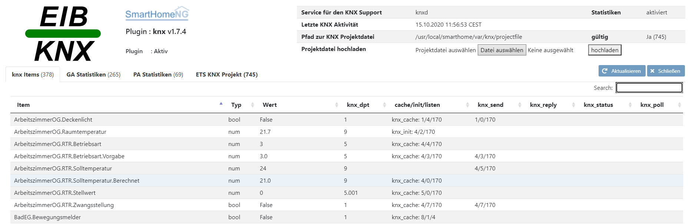
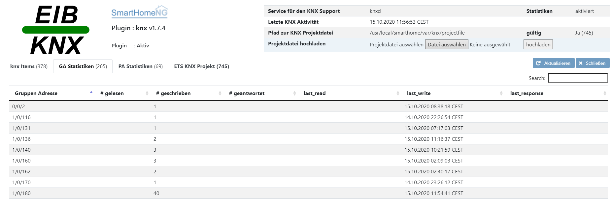
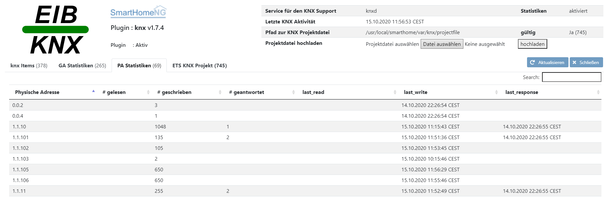
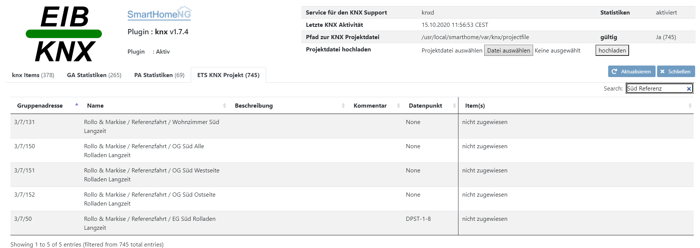

.. index:: Plugins; knx (KNX Bus Unterstützung)
.. index:: knx

===
knx
===

.. image:: webif/static/img/plugin_logo.svg
   :alt: plugin logo
   :width: 300px
   :height: 300px
   :scale: 50 %
   :align: left

Konfiguration
=============

Die Informationen zur Konfiguration des Plugins sind unter :doc:`/plugins_doc/config/knx` beschrieben.

plugin.yaml
-----------

Bitte die Dokumentation lesen, die aus den Metadaten der ``plugin.yaml`` erzeugt wurde.

Nachfolgend eine Beispielkonfiguration für das Logging der eingehenden KNX Telegramme auf einen separaten
Logger. Die einzelnen Abschnitte müssen in die ``logging.yaml`` integriert werden:

.. code-block:: yaml
   :emphasize-lines: 2-4,7-12,15-17

   formatters:
      busmonitor:
         format: '%(asctime)s;%(message)s'
         datefmt: '%Y-%m-%d %H:%M:%S'

   handlers:
      busmonitor_file:
         class: logging.handlers.TimedRotatingFileHandler
         formatter: busmonitor
         when: midnight
         backupCount: 7
         filename: ./var/log/knx_busmonitor.log

   loggers:
      knx_busmonitor:
         level: INFO
         handlers: [busmonitor_file]

Mit dieser Konfiguration werde alle busmonitor Mitteilungen in
``./var/log/knx_busmonitor.log`` geschrieben.

items.yaml
~~~~~~~~~~

Bitte die Dokumentation lesen, die aus den Metadaten der ``plugin.yaml`` erzeugt wurde.

Nachfolgend eine Datei mit Beispielen für Item Definitionen unter Berücksichtigung des KNX Plugins

.. code-block:: yaml

   living_room:

       light:
           type: bool
           knx_dpt: 1
           knx_send: 1/1/3
           knx_listen:
           - 1/1/4
           - 1/1/5
           knx_init: 1/1/6

       temperature:
           type: num
           knx_dpt: 9
           knx_send: 1/1/6
           knx_reply: 1/1/6
           # see 1-Wire plugin
           ow_addr: '28.BBBBB20000'
           ow_sensor: T

       window:
           type: bool
           knx_dpt: 1
           knx_poll:
           - 1/1/9
           - 60

logic.yaml
~~~~~~~~~~

Bitte die Dokumentation lesen, die aus den Metadaten der ``plugin.yaml`` erzeugt wurde.

.. code-block:: yaml
   :caption: etc/logics.yaml

   logic1:
       knx_dpt: 9
       knx_listen: 1/1/7

   logic2:
       knx_dpt: 9
       knx_reply:
       - 1/1/8
       - 1/1/8

Im Kontext des KNX Plugins beinhaltet das Dictionary ``trigger`` folgende Elemente:

-  trigger['by'] Protokoll ('KNX')
-  trigger['source'] Physikalische Adresse der Paketquelle
-  trigger['value'] der Wert

Funktionen
~~~~~~~~~~

Bitte die Dokumentation lesen, die aus den Metadaten der ``plugin.yaml`` erzeugt wurde.

Beispiele zur Nutzung der Zeitfunktionen:

``sh.knx.send_time('1/1/1', '1/1/2')``
   Die Zeit senden an ``1/1/1`` und das Datum an ``1/1/2``

``sh.knx.send_time('1/1/1')``
   Nur die Zeit an ``1/1/1`` senden

``sh.knx.send_time(data_ga='1/1/2')``
   Nur das Datum an ``1/1/2`` senden

Alternativ zu diesen Funktionen kann auch das Plugin Attribut ``send_time`` genutzt werden.

Umwandlungen der Datentypen in Itemwerte
~~~~~~~~~~~~~~~~~~~~~~~~~~~~~~~~~~~~~~~~~~~

Die Umwandlungen der Werte vom KNX in einen Itemwert und von Itemwerte zum KNX entsprechen den Festlegungen
des Dokuments **03_07_02_Datapoint Types v02.01.02 AS** der **KNX System specifications**.

Es gibt Situationen wo der KNX Werte liefern kann die nicht als Itemwert zugelassen sind.
Ein Beispiel dafür ist der Datenpunkt Typ 14 der eine 4 Byte umfassende Fließkommazahl codiert.
Werte die ungültig sind und vom KNX geliefert werden entsprechen in Python einem Wert ``NaN``.
Da dieser Wert (Not a Number) in Items von SmartHomeNG nicht zugelassen ist wird die Zuweisung auf ein Item unterdrückt
und eine Warnung in das entsprechende Logfile geschrieben (wenn konfiguriert)

Beispiele
=========

**ToDo ...**

Statistiken
===========

Die Statistikfunktionen wurden eingebaut um zu sehen, was dauerhaft am KNX passiert.
Es wird aufgezeichnet welches Gerät (physikalische Adresse) Gruppenadresse als Leseanforderung abfragt oder als Schreibanforderung einen neuen Wert sendet.
Auf diese Weise werden folgende Fragestellungen beantwortet:

- Welches physikalische Gerät hat eine Anforderungen initiiert (Herkunft)
- Welche Art Anforderung wurde gestartet (lesen, schreiben, antworten)
- Welche Gruppenadresse wurde für welche Anforderung wie oft genutzt?
- Gibt es unbekannte physikalische Geräte

Web Interface
=============

Das Plugin Webinterface kann aus dem Admin Interface aufgerufen werden. Dazu auf der Seite Plugins in der entsprechenden
Zeile das Icon in der Spalte **Web Interface** anklicken.

Oben rechts werden allgemeine Parameter zum Plugin angezeigt.
Unter dem ersten Tab werden die Items die das Plugin nutzen übersichtlich dargestellt:

Der zweite Tab zeigt Statistiken zu den Gruppenadressen:

.. hint::

   Wenn es Items gibt, die mit dem Attribut ``knx_cache`` und einer Gruppenadresse konfiguriert wurden wird SmartHomeNG beim Start
   diese Gruppenadressen vom knxd abfragen.
   Wenn die Werte der Gruppenadressen zu diesem Zeitpunkt nicht im knxd vorliegen wird dieser eine Leseanforderung absetzten um die Werte zu bekommen.
   Schlägt der Versuch fehl oder sind aus anderem Grund keine Werte im Cache des knxd vorhanden dann sendet dieser ein fehlerhaftes Datenpaket
   in dem nur Absender und Empfängeradresse enthalten sind. Die weiteren 2 Bytes mit Kontroll- und Dateninformationen fehlen jedoch.
   Daraus lässt sich auch nicht feststellen, ob die Empfängeradresse eine physikalische Adresse oder eine Gruppenadresse ist.
   Das Plugin merkt sich diese Empfängeradresse, interpretiert sie als Gruppenadresse und speichert sie in einer internen Liste.
   Im Webinterface werden alle Items mit ``knx_cache`` und der zugeordneten Gruppenadresse mit dieser Liste verglichen.
   Taucht die Gruppenadresse dort auf, wird der Eintrag rot eingefärbt als Hinweis das die Konfiguration überprüft werden sollte.
   Oftmals haben knx Geräte für eine Gruppenadresse die mit knx_cache ausgelesen werden soll kein Leseflag in der ETS gesetzt bekommen.
   Es ist möglich den Loglevel mit dem diese fehlerhaften Rückmeldungen geloggt werden in der Plugin Konfiguration festzulegen.

Der dritte Tab zeigt Statistiken zu den physikalischen Adressen:

Über das Webinterface kann eine Projektdatei aus der ETS hochgeladen werden um zu prüfen ob es Items ohne Zuweisung zu Gruppenadressen gibt
oder auch Gruppenadressen die keine Items definiert haben.
Kompatibel sind Exportdateien aus der ETS5 (\*.knxproj) oder ETS4 (\*.esf = OPC).
Es ist möglich für geschützte Projektdateien ein Passwort mit anzugeben. Dieses Passwort wird dann intern für die Laufzeit in SmartHomeNG
gespeichert und steht dort solange zur Verfügung bis ein Neustart erfolgt oder bis ein anderes Passwort zugewiesen wird.
Ebenfalls ist es möglich im Abschnitt in der Plugin.yaml ein Passwort zu definieren. Ist ein solches definiert und erfolgt ein Upload unter
Angabe eines neuen Passwortes, so wird das vorbelegte intern überschrieben. Erst nach einem Neustart ist das in der Plugin.yaml definierte
Passwort dann wieder vorhanden.

Nur wenn eine gültige Datei hochgeladen wurde wird ein vierter Tab angezeigt.
Hier wird dann der Vergleich zwischen den definierten Gruppenadressen aus der ETS mit den in SmartHomeNG konfigurierten
Items und deren knx spezifischen Attributen dargestellt.
Gibt es eine Gruppenadresse, die in der ETS definiert wurde aber keine Entsprechung in SmartHomeNG hat,
so erscheint in der rechten Spalte *nicht zugewiesen*.

Alle Tabellen im Webinterface haben rechts oben eine Filter- bzw. Suchmöglichkeit vorgesehen.
Damit lassen sich die angezeigten Daten begrenzen. So kann z.B. gezielt nach bestimmten
Gruppenadressen, Attributen oder nicht zugewiesenen Gruppenadressen  gesucht werden.

.. important::

   Das Webinterface des Plugins kann mit SmartHomeNG v1.4.2 und davor **nicht** genutzt werden.
   Es wird dann nicht geladen. Diese Einschränkung gilt nur für das Webinterface. Ansonsten gilt
   für das Plugin die in den Metadaten angegebene minimale SmartHomeNG Version.
