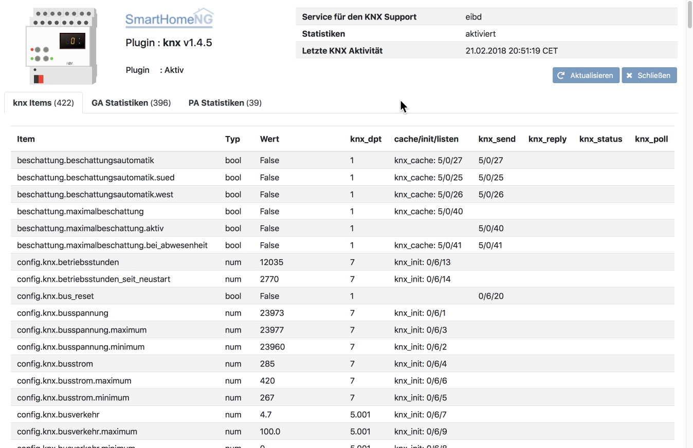
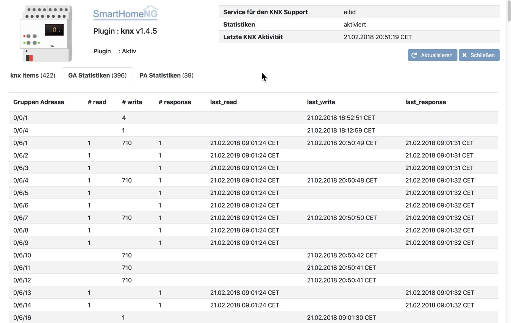
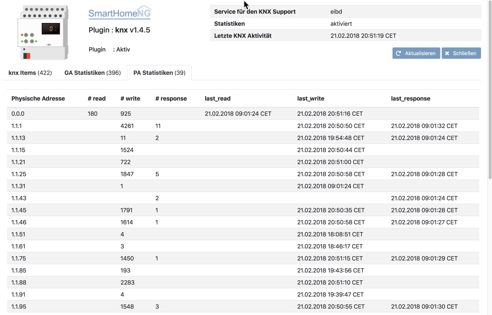

knx
###

Das knx Plugin verfügt über ein Webinterface, mit dessen Hilfe die Items die das Plugin nutzen
übersichtlich dargestellt werden. Außerdem können Statistiken über die KNX Aktivität angezeigt
werden.

.. important:: 

   Das Webinterface des Plugins kann mit SmartHomeNG v1.4.2 und davor **nicht** genutzt werden.
   Es wird dann nicht geladen. Diese Einschränkung gilt nur für das Webinterface. Ansonsten gilt 
   für das Plugin die in den Metadaten angegebene minimale SmartHomeNG Version.

Aufruf des Webinterfaces
------------------------

Das Plugin kann aus dem backend aufgerufen werden. Dazu auf der Seite Plugins in der entsprechenden
Zeile das Icon in der Spalte **Web Interface** anklicken.

Außerdem kann das Webinterface direkt über ``http://smarthome.local:8383/knx`` bzw. 
``http://smarthome.local:8383/knx_<Instanz>`` aufgerufen werden.

Beispiele
---------

Folgende Informationen können im Webinterface angezeigt werden:

Oben rechts werden allgemeine Parameter zum Plugin angezeigt. 

Im ersten Tab werden die Items angezeigt, die das knx Plugin nutzen:

Im zweiten Tab werden Statistiken zu den KNX Gruppenadessen angezeigt:

Im dritten Tab werden Statistiken zu den physischen KNX Adressen angezeigt.

