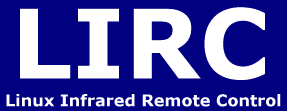
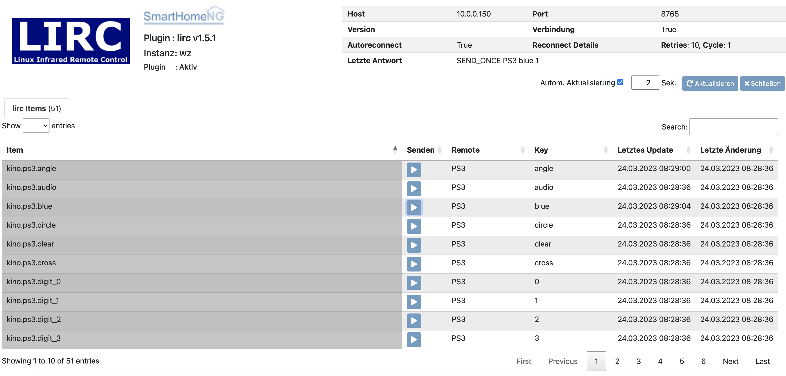

.. index:: Plugins; lirc
.. index:: lirc

====
lirc
====

LIRC ist die Abkürzung für Linux Infrared Remote Control. Es handelt sich dabei um ein Programm für Linux, mit dessen
Hilfe man Befehle von IR-Fernbedienungen in Programmbefehle umsetzen kann. Nötig ist dafür lediglich ein
Infrarot-Empfänger.

Konfiguration
=============

.. important::

      Detaillierte Informationen zur Konfiguration des Plugins sind unter :doc:`/plugins_doc/config/lirc` zu finden.

.. code-block:: yaml

    # etc/plugin.yaml
    lirc:
        plugin_name: lirc
        #instance: hifisystem
        #lirc_host: 192.168.1.10
        #lirc_port: 6610

Items
=====

Sobald ein entsprechend konfiguriertes Item gesetzt oder aktualisiert wird, sendet das Plugin den entsprechenden Befehl x Mal.
x wird dabei vom Wert bestimmt, auf den das Item gesetzt wird. Nach dem Senden wird der Wert des Items automatisch auf 0 gesetzt.
Beispiel:

.. code-block:: yaml

    # items/item.yaml
    REMOTE_DVDLIVINGROOM:
        DVDLIVINGROOM_POWER:
            type: num
            lirc_remote@instancename: "PHILIPSDVD"
            lirc_key@instancename: "POWER"

Wird DVDLIVINGROOM_POWER auf 5 gesetzt, wird der "POWER" Befehl 5 Mal gesendet.
Bekommt das Item den Wert 0 oder 1, wird der Befehl ein Mal gesendet.

Web Interface
=============

Das Webinterface bietet folgende Informationen:

-  **Allgemeines**: Oben rechts wird die Pluginkonfiguration angezeigt
-  **Letzte Antwort**: Oben rechts wird die letzte Rückmeldung des Plugins angezeigt
-  **Senden**: Es wird der hinterlegte Befehl für das Item gesendet
-  **Remote**: Name der Fernbedienung
-  **Key**: Name des Keys
-  **Letztes Update**: Zeitpunkt, wann das Item zuletzt aktualisiert wurde
-  **Letzte Änderung**: Zeitpunkt, wann das Item zuletzt geändert wurde
