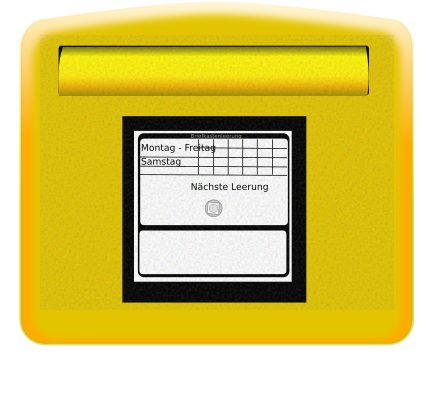

.. index:: Plugins; sample
.. index:: sample

======
sample
======

Hier sollte eine allgemeine Beschreibung stehen, wozu das Plugin gut ist (was es tut).

Anforderungen
=============

Anforderungen des Plugins auflisten. Werden spezielle Soft- oder Hardwarekomponenten benötigt?

Notwendige Software
-------------------

* die
* benötigte
* Software
* auflisten

Dies beinhaltet Python- und SmartHomeNG-Module

Unterstützte Geräte
-------------------

* die
* unterstütze
* Hardware
* auflisten

|

Konfiguration
=============

Die Plugin Parameter und die Informationen zur Item-spezifischen Konfiguration des Plugins sind
unter :doc:`/plugins_doc/config/sample` beschrieben.

plugin.yaml
-----------

Bitte die Dokumentation lesen, die aus den Metadaten der plugin.yaml erzeugt wurde.

items.yaml
----------

Bitte die Dokumentation lesen, die aus den Metadaten der plugin.yaml erzeugt wurde.

logic.yaml
----------

Bitte die Dokumentation lesen, die aus den Metadaten der plugin.yaml erzeugt wurde.

Funktionen
----------

Bitte die Dokumentation lesen, die aus den Metadaten der plugin.yaml erzeugt wurde.

|

Beispiele
=========

Hier können ausführlichere Beispiele und Anwendungsfälle beschrieben werden. (Sonst ist der Abschnitt zu löschen)

|

Web Interface
=============

Die Datei ``dev/sample_plugin/webif/templates/index.html`` sollte als Grundlage für Webinterfaces genutzt werden. Um Tabelleninhalte nach Spalten filtern und sortieren zu können, muss der entsprechende Code Block mit Referenz auf die relevante Table ID eingefügt werden (siehe Doku).

SmartHomeNG liefert eine Reihe Komponenten von Drittherstellern mit, die für die Gestaltung des Webinterfaces genutzt werden können. Erweiterungen dieser Komponenten usw. finden sich im Ordner ``/modules/http/webif/gstatic``.

Wenn das Plugin darüber hinaus noch Komponenten benötigt, werden diese im Ordner ``webif/static`` des Plugins abgelegt.

|

Version History
===============

In diesem Abschnitt kann die Versionshistorie dokumentiert werden, falls der Plugin Autor dieses möchte. Diese Abschnitt
ist optional.

