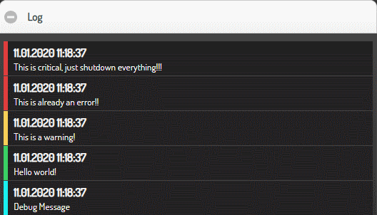

# memlog

This plugins can be used to create in-memory logs which can be used by items or other
plugins.

## Requirements

No special requirements.

## Configuration

### plugin.yaml

Use the plugin configuration to configure the in-memory logs.

```
memlog:
    plugin_name: memlog
    name: alert
    mappings: 
      - time
      - thread
      - level
      - message
#    maxlen: 50
#    items
#      - first.item.now
#      - second.item.thread.info
#      - third.item.level
#      - fourth.item.msg
```

This will register a in-memory log with the name "alert". This can be used to attach
to items.

#### name attribute

This will give the in-memory log a name which can be used when accessing them.

#### mappings attribute

This configures the list of values which are logged for each log message. The following
internal mappings can be used and will be automatically set - if not given explicitely
when logging data:

* ``time`` - the timestamp of log
* ``thread`` - the thread logging data
* ``level`` - the log level (defaults to INFO)

#### maxlen attribute

Defines the maximum amount of log entries in the in-memory log.

#### items attribute

Each time an item is updated using the `memlog` configuration setting, a log entry will
be written using the list of items configured in this attribute as log values.

If items are defined, then four items should be named, 
each with the following purpose:

    * Item A - the value of this item is entered as the timestamp
    * Item B - the value of this item is entered as the thread info
    * Item C - the value of this item is entered as the level of log message
    * Item D - the value of this item is entered as the message

Using Items this way it is possible to set the values of those items first
and then trigger the item which has the ``memlog`` attribute.

When the items attribute is not configured, the default mapping values will be used and the value of the item will be logged which has the ``memlog`` attribute.

### items.yaml

The following attributes can be used.

#### memlog

Defines the name of in-memory log which should be used to log the item's content to
the log. Everything is logged with 'INFO' level.

#### Example

Simple item logging:

```yaml
some:
    item:
        type: str
        memlog: alert
```

An update to item ``some.item`` will cause a log entry to be generated with the value of item ``some.item``.

### logic.yaml

#### memlog

Configures that a message should be logged whenever the logic was triggered. It logs a
default message which can be overwritten by the `memlog_message` attribute.

#### memlog_message

Defines the message to be logged. It configures a string which may contain placeholders
which got replaced by using the `format()` function.

The following placeholders or object can be used in the message string:
* `logic` - the logic object. A format of ``{logic.name}`` will include the logics name
* `plugin` - the memlog plugin instance object
* `by` - the string containing the origin of logic trigger
* `source` - the source
* `dest` - the destination

The `logic` and `plugin` placeholders are always available, the rest depends on the
logic invocation/trigger.

Example:

```yaml
memlog_message: The logic {logic.name} was triggered!
```

## Methods

The plugin name defined it ``etc/plugin.yaml`` can be used as callable.

### memlog(entry)
This log the given list of elements of `entry` parameter. The list should have the same amount
of items you used in the mapping parameter (see also the default for this value).

`sh.memlog((self._sh.now(), threading.current_thread().name, 'INFO', 'Some information'))`

### memlog(msg)

This log the given message in `msg` parameter with the default log level.

### memlog(lvl, msg)

This logs the message in ``msg`` parameter with the given log level specified in ``lvl``
parameter.

### Examples

Given the following base snippet of ``etc/plugin.yaml``:

```yaml
my_memlog:
    plugin_name: memlog
    name: my_personal_memlog
```

The following expressions (e.g. in a logic)

```python
sh.my_memlog("DEBUG","Debug Message")
sh.my_memlog("Hello world!")  # info
sh.my_memlog("WARNING","This is a warning!")
sh.my_memlog("ERROR","This is already an error!!")
sh.my_memlog("CRITICAL","This is critical, just shutdown everything!!!")
```

together with this definition in SmartVISU pages:

```html
{{ status.log('log_id', 'my_personal_memlog', 10) }}
```

will show a screen like this:


