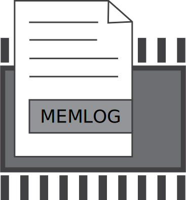
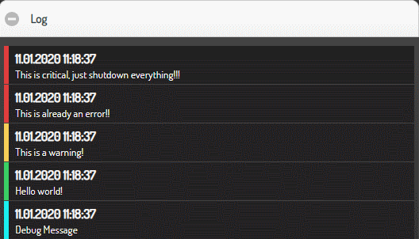

.. index:: Plugins; memlog
.. index:: memlog

======
memlog
======

Dieses Plugin stellt für Items und Plugins eine Loggingvariante
zur Verfügung, bei der die Logeinträge im Arbeitsspeicher abgelegt werden.

.. important::

    Das Plugin ist als "deprecated" abgekündigt. Ersatz der Funktionalität ist im nächsten Absatz beschrieben.

Ersatz durch Bordmittel
=======================

Details zum Memory Loghandler sind unter :doc:`Logging Handler </referenz/logging/logging_handler>`
zu finden. Informationen zum Loggen bei Itemänderungen findet man unter
:doc:`log_change </referenz/items/standard_attribute/log_change>`.

Beispiel Logik
--------------

In diesem Beispiel werden sämtliche Aufrufe des Loggers in der Logik ex_logging
in das Memorylog namens memory_info geschrieben. Während beim memlog Plugin durch
einen Eintrag in der ``etc/logic.yaml`` Datei beim Triggern einer Logik
automatisch ein Logeintrag erstellt wird, sind hier in der Logik selbst die
entsprechenden logger Methoden einzubinden. Somit können wie gewohnt auch
verschiedene Loglevel genutzt werden.

Das Memorylog wird in der Datei ``etc/logging.yaml`` wie folgt konfiguriert:

.. code-block:: yaml

    # etc/logging.yaml
    handlers:
        memory_info:
            (): lib.log.ShngMemLogHandler
            logname: memory_info
            maxlen: 60
            level: INFO
            cache: True

    loggers:
        logics.ex_logging:
            handlers: [memory_info]
            level: INFO

Die Logeinträge werden aus der Logik ``logics/<logikname>.py`` wie folgt erstellt:

.. code-block:: python

    # logics/ex_logging.py
    sourceitem = items.return_item(trigger['source'])
    logger.info(f"Logik '{logic.name}' wurde durch {trigger} getriggert. Source = {sourceitem}")
    logger.debug(f"Logik '{logic.name}' (filename '{logic.filename}') wurde getriggert (DEBUG)")

Beispiel Item
-------------

Das Memorylog wird in der Datei ``etc/logging.yaml`` wie folgt konfiguriert:

.. code-block:: yaml

    # etc/logging.yaml
    handlers:
        memory_info:
            (): lib.log.ShngMemLogHandler
            logname: memory_info
            maxlen: 60
            level: INFO
            cache: True

    loggers:
        items.memory-items:
            handlers: [memory_info]
            level: INFO

Nun können mehrere Items über die entsprechenden Attribute in das Memory Log
schreiben. Möchte man dabei die Möglichkeit des memlog Plugins, Mitteilungen
über ein Item zu deklarieren, nutzen, kommt das Attribut
``log_rules: "{'itemvalue': '<item>'}"`` zum Einsatz.

.. code-block:: yaml

    item:
        type: num
        log_change: memory-items
        log_level: INFO
        log_text: 'Wert={mvalue}, Alter={age}, Zeit={now}'

Das Einbinden in eine SmartVISU Seite erfolgt mittels:

.. code-block:: html

  {{ status.log('', 'memory_info', 10) }}

Konfiguration
=============

.. important::

      Detaillierte Informationen zur Konfiguration des Plugins sind
      unter :doc:`/plugins_doc/config/memlog` zu finden.

plugin.yaml
-----------

.. code-block:: yaml

    # etc/plugin.yaml
    memlog:
      plugin_name: memlog
      name: alert
      mappings:
        - time
        - thread
        - level
        - message
      #maxlen: 50
      #items:
      # - first.item.now
      # - second.item.thread.info
      # - third.item.level
      # - fourth.item.msg

Das angegebene Beispiel registriert ein Memory Log namens "alert".
Das `mappings` Attribut konfiguriert die Liste der Werte, die für jede Protokollmeldung
genutzt werden sollen. Die Werte werden dabei aus den angegebenen Items ausgelesen.

items.yaml
----------

Das ``memlog`` Attribut legt den Namen des speicherinternen Logs fest,
das verwendet werden soll, um den Inhalt des Elements ins Log zu schreiben.

.. code-block:: yaml

  some:
      item:
          type: str
          memlog: alert

Eine Aktualisierung des Eintrags "some.item" führt zur Erstellung eines Protokolleintrags
mit dem Wert des Eintrags ``some.item``.

logic.yaml
----------

.. code-block:: yaml

    # etc/logic.yaml
    ex_logging:
        filename: example_logging.py
        memlog: testing
        memlog_message: The logic {logic.name} was triggered!

Bei jeder Auslösung der Logik, im Beispiel example_logging.py, wird der Eintrag
im optionalen Attribut ``memlog_message`` in das entsprechende Speicherprotokoll geschrieben.

Einsatz in Logiken
==================

Funktionsaufruf
---------------

Der unter ``etc/plugin.yaml`` angegebene Pluginname kann durch <name>(<Eintrag>) aufgerufen werden.
Dies protokolliert die angegebene Liste der Elemente des Parameters ``Eintrag``. Die Liste
sollte die gleiche Anzahl an Elementen haben, die in dem Mapping-Parameter angegeben wurde.

.. code-block:: python

  sh.memlog((self._sh.now(), threading.current_thread().name, 'INFO', 'Some information'))

Wird im Eintrag nur eine Mitteilung als String angegeben, werden die anderen Werte
entsprechend den Vorgaben in etc/plugin.yaml genutzt. Außerdem ist es möglich,
nur das Loglevel und die Mitteilung anzugeben, also z.B.
``sh.memlog('INFO', 'Some information')``.

Beispiel
--------

In ``etc/plugin.yaml`` wird das Plugin wie folgt eingebunden:

.. code-block:: yaml

  my_memlog:
      plugin_name: memlog
      name: my_personal_memlog

Die folgenden Aufrufe können in einer Logik eingebunden werden:

.. code-block:: python

  sh.my_memlog("DEBUG", "Debug Message")
  sh.my_memlog("Hello world!")  # info
  sh.my_memlog("WARNING", "This is a warning!")
  sh.my_memlog("ERROR", "This is already an error!!")
  sh.my_memlog("CRITICAL", "This is critical, just shutdown everything!!!")

Das Einbinden in eine SmartVISU Seite erfolgt mittels:

.. code-block:: html

  {{ status.log('log_id', 'my_personal_memlog', 10) }}

Das resultiert in einer Liste von Logeinträgen wie beispielsweise:

Web Interface
=============

Das Plugin verfügt über kein Web Interface, es kann aber in der SmartVISU genutzt werden.
