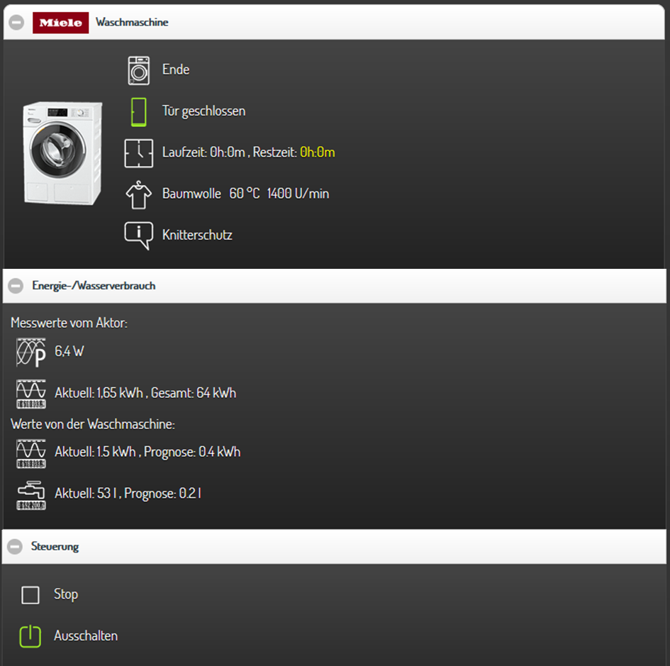
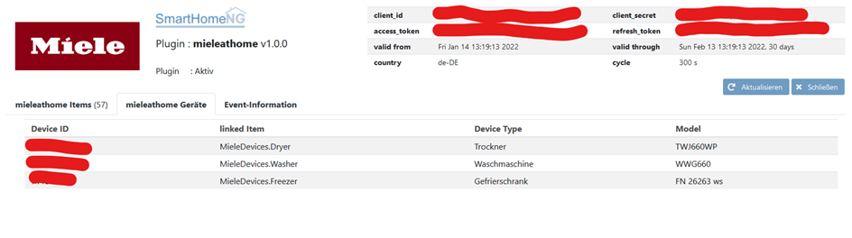
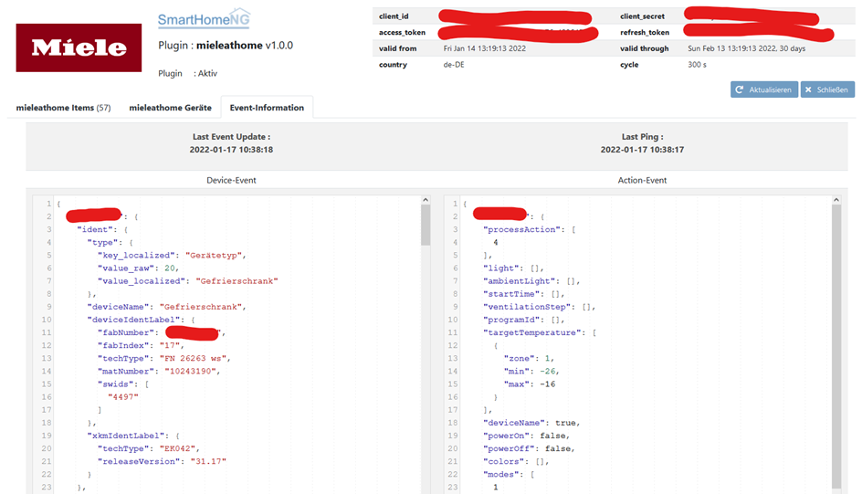

.. index:: Plugins; mieleathome
.. index:: mieleathome

===========
mieleathome
===========

Das Plugin ermöglicht den Zugriff auf die `Miele@Home API`. Es werden Stati abgefragt und
im Rahmen der Möglichkeiten der API können Geräte gesteuert werden.
Es wird das Pollen von Informationen sowie das Event-gestütze Empfangen von Daten unterstützt.
Für das Event-Listening wird ein Stream-request zum Miele-Server aufgebaut. Falls durch den Trennung der
Internet-Verbindung der Stream abreisst wird dies durch das Plugin erkannt und eine neuer Stream
aufgebaut.

Folgende Funktionen zur Überwachung und Steuerung von Trocknern und Gefrierschränken sind implementiert:

- Status
- programPhase
- programType
- remainingTime
- targetTemperature
- temperature
- signalInfo
- signalFailure
- signalDoor
- dryingStep
- elapsedTime
- ecoFeedback
- batteryLevel
- processAction ( start / stop / pause / start_superfreezing / stop_superfreezing / start_supercooling / stop_supercooling / PowerOn / PowerOff)

Bei einem Trockner muss der SmartGrid-Modus aktiv sein und das Gerät auf "SmartStart" eingestellt werden.
Der Trockner kann dann via API/Plugin gestartet werden bzw. es kann eine Startzeit via API/Plugin gesetzt werden.

Konfiguration
=============

.. important::

      Detaillierte Informationen zur Konfiguration des Plugins sind unter :doc:`/plugins_doc/config/mieleathome` zu finden.

plugin.yaml
-----------

Um Zugang zu einem Mielegerät zu erhalten, ist es notwendig, zuerst eine App (smarthomeNG) unter
`Miele <https://www.miele.com/f/com/en/register_api.aspx>`_ zu registrieren. Nach Erhalt der Freischalt-Mail
die Seite aufrufen und das Client-Secret und die Client-ID kopieren/merken/speichern.

Dann einmalig über das `Swagger-UI der API <https://www.miele.com/developer/swagger-ui/swagger.html>`_ mittels
Client-ID und Client-Secret über den Button "Authorize" (in grün, auf der rechten Seite) Zugriff erteilen.
Wenn man Client-Id und Client-Secret eingetragen hat, wird man einmalig aufgefordert mittels Mail-Adresse, Passwort und Land der App-Zugriff zu erteilen.

Die erhaltenen Daten für Client-ID und Client-Secret in der ./etc/plugin.yaml wie unten beschrieben eintragen.

.. code-block:: yaml

    # etc/plugin.yaml
    mieleathome:
        plugin_name: mieleathome
        miele_cycle: 120
        miele_client_id: ''
        miele_client_secret: ''
        miele_client_country: 'de-DE'
        miele_user: ''      # email-address
        miele_pwd: ''       # Miele-PWD

Items
-----

Es wird eine vorgefertigtes "Struct" für alle Geräte mitgeliefert. Es muss lediglich die Miele-"DeviceID" beim jeweiligen Gerät
definiert werden. Um die Miele-"DeviceID" zu ermitteln kann das Plugin ohne Items eingebunden und gestartet werden. Es werden im Web-IF
des Plugins alle registrierten Geräte mit der jeweiligen DeviceID angezeigt. Führende Nullen der DeviceID sind zu übernehmen.

.. code-block:: yaml

    # items/item.yaml
    MieleDevices:
        Freezer:
            type: str
            miele_deviceid: 'XXXXXXXXXXX'
            struct: mieleathome.child
        Dryer:
            type: str
            miele_deviceid: 'YYYYYYYYYYY'
            struct: mieleathome.child

smartVISU
---------

Es gibt eine vorgefertigte miele.html im Plugin-Ordner. Hier kann man die jeweiligen Optionen herauslesen und nach
den eigenen Anforderungen anpassen und in den eigenen Seiten verwenden.

Web Interface
=============

Das Web Interface listet sämtliche mit dem Plugin verbundene Items, deren Typ und Wert.

.. image:: assets/webif_items.png
   :height: 550px
   :width: 942px
   :scale: 100%
   :alt: Webif1
   :align: center

Im zweiten Tab sind die Device ID, das verknüpfte Item, Gerätetyp und -modell zu sehen.
Dieser Tab kann auch dazu genutzt werden, die DeviceID auszulesen, die in weiterer Folge
in der items.yaml Datei eingetragen werden muss - siehe Konfiguration.

Der dritte Tab gibt Einblick in Device und Action Events, hier können z.B. Aktionen zur Temperatureinstellung eines Kühlschranks
angelegt oder geändert werden.

