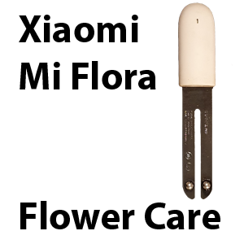

.. index:: Plugins; miflora
.. index:: miflora

=======
miflora
=======

Das Plugin liest Messwerte von Xiaomi Mi Flora Pflanzensensoren über Bluetooth aus und stellt sie als
Items zur Verfügung.

Voraussetzungen
================

Benötigt wird ein Xiaomi Mi Flora Pflanzensensor sowie eine funktionsfähige Bluetooth-Schnittstelle
auf dem SmartHomeNG-System. Unterstützt werden Sensor-Firmwareversionen bis 2.6.6.

Konfiguration
=============

Die Informationen zur Konfiguration des Plugins sind unter :doc:`/plugins_doc/config/miflora` beschrieben.

Da eine Instanz jeweils genau einen Sensor bedient, wird das Plugin bei mehreren Sensoren mit je
eigenem **instance**-Namen mehrfach instanziiert.

Web Interface
=============

Das miflora Plugin verfügt über ein Webinterface, das die vom Plugin genutzten Items mit Pfad, Typ,
aktuellem Wert sowie Zeitpunkt des letzten Updates und der letzten Änderung anzeigt.

Aufruf des Webinterfaces
-------------------------

Das Plugin kann aus dem Backend aufgerufen werden. Dazu auf der Seite Plugins in der entsprechenden
Zeile das Icon in der Spalte **Web Interface** anklicken.

Außerdem kann das Webinterface direkt über ``http://smarthome.local:8383/miflora`` bzw.
``http://smarthome.local:8383/miflora_<Instanz>`` aufgerufen werden.
