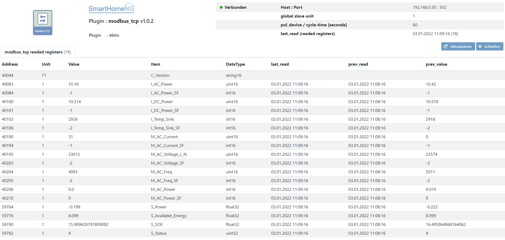

.. index:: modbus_tcp plugin
.. index:: Plugins; modbus_tcp

==========
modbus_tcp
==========

SmarthomeNG plugin, zum Lesen von Register über ModBusTCP

Anforderungen
=============

* Python > 3.6
* pymodbus >= 2.5.3
* SmarthomeNG >= 1.8.0

pymodbus
--------

das Paket sollte automatisch von SH installiert werden.

pymodbus - manuelle Installation:
---------------------------------

.. code:: shell-session

    python3 -m pip install pymodbus --user --upgrade

Konfiguration
=============

plugin.yaml
-----------

.. code-block:: yaml

    solaredge:
        plugin_name: modbus_tcp
        instance: solaredge
        host: 192.168.0.50
        port: 502
        cycle: 60
        plugin_enabled: true

    logoMB:
        plugin_name: modbus_tcp
        instance: logomb
        host: 192.168.0.80
        port: 502
        cycle: 20
        plugin_enabled: true

* 'instance' = Name der Instanz, sollen mehrer Geräte angesprochen werden (Multiinstanz)

Bitte die Dokumentation lesen, die aus den Metadaten der plugin.yaml erzeugt wurde.

items.yaml
----------

Bitte die Dokumentation lesen, die aus den Metadaten der plugin.yaml erzeugt wurde.

logic.yaml
----------

Bitte die Dokumentation lesen, die aus den Metadaten der plugin.yaml erzeugt wurde.

Beispiel: In der Datei example.yaml sind ein paar Items für einen Solaredge-Wechselrichter SE6000 angelegt.

Funktionen
~~~~~~~~~~

Bitte die Dokumentation lesen, die aus den Metadaten der plugin.yaml erzeugt wurde.

Beispiele
---------
Beispiel für SH-Item's

siehe auch example.yaml

.. code-block:: yaml

    mydevice:
        AI1:
            type: num
            name: AI1
            modBusObjectType: InputRegister     #(optional) default: HoldingRegister
            modBusAddress: 0
            modBusDataType: int16               #(optional) default: uint16
            #modBusByteOrder: 'Endian.Little'    #(optional) default: 'Endian.Big'
            #modBusWordOrder: 'Endian.Little'    #(optional) default: 'Endian.Big'
            modBusDirection: 'read_write'       #(optional) default: 'read'
            modBusUnit: '71'                    #(optional) default: slaveUnit aus der Plugin-Konfig
            #modBusFactor: 0.1                  #(optional) default: 1
            #modBusDirection: read_write        #(optional) default: 'read'
        AM1:
            type: num
            name: AM1
            modBusObjectType: HoldingRegister
            modBusAddress: 528
            modBusDirection: read_write
            #modBusFactor: 1
            #modBusDataType: int16
        M1:
            type: bool
            name: M1
            modBusObjectType: Coil
            modBusAddress: 8256
            modBusDataType: bit
            modBusDirection: read_write
        I1:
            type: bool
            name: I1
            modBusObjectType: DiscreteInput
            modBusAddress: 0
            modBusDataType: bit
        VM0:
            type: num
            name: VM0
            modBusObjectType: HoldingRegister
            modBusAddress: 0
            modBusDirection: read_write
            modBusFactor: 0.01

        geraetename:
            type: str
            #modBusObjectType: HoldingRegister  #(optional) default: HoldingRegister
            modBusAddress: 40030
            modBusDataType: 'string16'          #(optional) default: uint16
            #modBusFactor: '1000'               #(optional) default: 1
            modBusByteOrder: 'Endian.Little'    #(optional) default: 'Endian.Big'
            modBusWordOrder: 'Endian.Little'    #(optional) default: 'Endian.Big'
            modBusDirection: 'read_write'       #(optional) default: 'read'
            modBusUnit: '71'                    #(optional) default: slaveUnit aus der Plugin-Konfig
        temperatur:
            type: num
            modBusAddress: 40052
            modBusDataType: 'float32            #(optional) default: uint16
            #modBusFactor: '1'                  #(optional) default: 1
            modBusByteOrder: 'Endian.Little'    #(optional) default: 'Endian.Big'
            modBusWordOrder: 'Endian.Little'    #(optional) default: 'Endian.Big'
            modBusUnit: '71'                    #(optional) default: slaveUnit aus der Plugin-Konfig
        
        # Multiinstanz:
        # Jedes Attribut mit der @<instance> ergänzen. Der Name der Instance muss in der Plugin Konfiguration festgelegt werden.
        M1:
            type: bool
            name: M1
            modBusObjectType@logomb: Coil
            modBusAddress@logomb: 8256
            modBusDataType@logomb: bit
            modBusDirection@logomb: read_write
        

Changelog
---------
V1.0.10	Mindestversion für pymodbus ist nun 3.5.2

V1.0.9  

V1.0.8  Neuere Pymodbus Versionen können nun verwendet werden.
        Di minimale Version für Pymodbus ist jetzt 2.5.3

V1.0.7  Verbindung offen halten und lock nutzen um Thread Sicherheit zu erreichen (CaeruleusAqua and bmxp)
        Fehler behoben: nicht deklarierte Variable "TypeStr" und "bitstr"

V1.0.6  schreiben von Register (HoldingRegister, Coil)

V1.0.5  kleine Fehler behoben

V1.0.4  ObjectType hinzugefügt (HoldingRegister, InputRegister, DiscreteInput, Coil)
        Multiinstanz hinzugefügt
        Verbindung schliessen nach Abruf aller Register

V1.0.3  slaveUnit - Fehler behoben (_regToRead-key (adress.unit))
        Bug Web Interface (Anzeige der Adresse)
        example.yaml verbessert

V1.0.2  slaveUnit zu Items hinzugefügt

V1.0.1  slaveUnit zu plugin-Paramter hinzugefügt

V1.0.0  Initial plugin version

Web Interface
=============

Das Plugin kann aus dem Admin Interface aufgerufen werden. Dazu auf der Seite Plugins in der entsprechenden
Zeile das Icon in der Spalte **Web Interface** anklicken.

