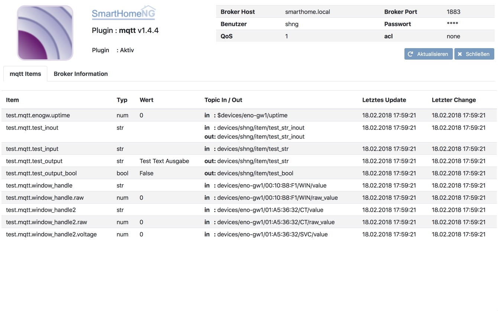
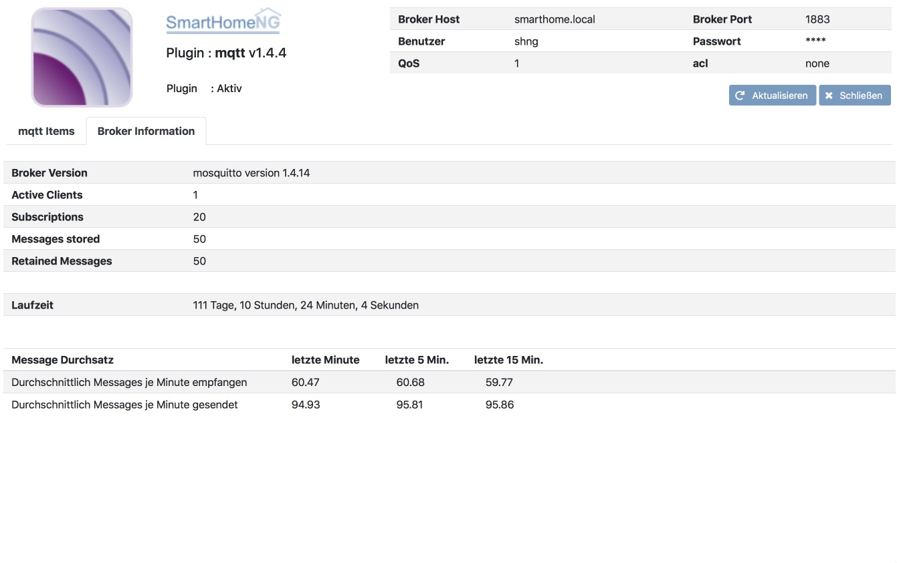

.. index:: Plugins; mqtt (MQTT Protokoll Implementierung)
.. index:: mqtt; mqtt Plugin

====
mqtt
====

Konfiguration
=============

Die Informationen zur Konfiguration des Plugins sind unter :doc:`/plugins_doc/config/mqtt` beschrieben.

Web Interface
=============

Das mqtt Plugin verfügt über ein Webinterface, mit dessen Hilfe die Items die das Plugin nutzen
übersichtlich dargestellt werden. Außerdem können Informationen zum genutzten Broker angezeigt werden.

.. important::

   Das Webinterface des Plugins kann mit SmartHomeNG v1.4.2 und davor **nicht** genutzt werden.
   Es wird dann nicht geladen. Diese Einschränkung gilt nur für das Webinterface. Ansonsten gilt
   für das Plugin die in den Metadaten angegebene minimale SmartHomeNG Version.

Aufruf des Webinterfaces
------------------------

Das Plugin kann aus dem backend aufgerufen werden. Dazu auf der Seite Plugins in der entsprechenden
Zeile das Icon in der Spalte **Web Interface** anklicken.

Außerdem kann das Webinterface direkt über ``http://smarthome.local:8383/mqtt`` bzw.
``http://smarthome.local:8383/mqtt_<Instanz>`` aufgerufen werden.

Beispiele
---------

Folgende Informationen können im Webinterface angezeigt werden:

Oben rechts werden allgemeine Parameter zum Plugin angezeigt.

Im ersten Tab werden die Items angezeigt, die das mqtt Plugin nutzen.

Im zweiten Tab werden Informationen zum Broker angezeigt. Laufzeit und Durchsatz werden nur angezeigt,
wenn der Parameter **broker_monitoring** in etc/plugin.yaml auf **True** gesetzt ist.

